# 🎯 Agent Selection Guide - Clear Decision Framework

## 🏗️ Platform-Specific Requirements

### 🔴 Admin Portal (apps/admin/)
- **Framework**: Next.js 15 with App Router
- **UI Library**: Material-UI (MUI)
- **Styling**: Material-UI theme system (NO Tailwind)
- **API**: Next.js API routes with Clerk auth
- **Components**: React Server Components + Client Components

### 🟢 Documentation Sites (standards/*/, portal/)
- **Framework**: Docusaurus
- **UI Library**: Infima CSS framework
- **Styling**: SASS/SCSS modules (NO Material-UI)
- **Components**: MDX + React (static only)
- **NO API Routes**: Static site generation only

## 🔌 MCP-Powered vs Native Tool Agents

### MCP-Powered Agents (9 agents) - Use for advanced capabilities:
- **Search Agent**: JetBrains + Sequential Thinking
- **Test Writer**: Context7 + Sequential + Playwright + JetBrains
- **API Builder**: Context7 + JetBrains
- **UI Developer**: Context7 + Magic UI + JetBrains
- **Database Agent**: Supabase + Sequential + JetBrains
- **Build Agent**: NX + JetBrains + Sequential + Filesystem
- **Research Agent**: Perplexity + Context7 + Sequential + WebSearch
- **Advanced UI**: Magic UI + Context7 + Playwright
- **File Operations**: Filesystem + JetBrains + Sequential

### Native Tool Agents (5 agents) - Use for focused workflows:
- **Context Fetcher**: Optimized documentation retrieval
- **Date Checker**: System-level date determination
- **File Creator**: Template-based file creation
- **Git Workflow**: Git operations and PR management
- **Test Runner**: Test execution and failure analysis

## 📊 Primary Decision Tree

```mermaid
graph TD
    Start[Task Request] --> Q1{Is it about<br/>finding/discovering?}
    
    Q1 -->|Yes| Q2{Know exact<br/>file path?}
    Q2 -->|No| SearchAgent[🔍 Search Agent]
    Q2 -->|Yes| ContextFetcher[📄 Context Fetcher]
    
    Q1 -->|No| Q3{Is it about<br/>files/directories?}
    
    Q3 -->|Yes| Q4{Multiple files<br/>operation?}
    Q4 -->|Yes| FileOps[📁 File Operations Agent]
    Q4 -->|No| Q5{Creating from<br/>template?}
    Q5 -->|Yes| FileCreator[📝 File Creator Agent]
    Q5 -->|No| FileOps
    
    Q3 -->|No| Q6{Is it about<br/>UI/Frontend?}
    
    Q6 -->|Yes| Q7{Complex animations<br/>or effects?}
    Q7 -->|Yes| AdvancedUI[✨ Advanced UI Agent]
    Q7 -->|No| UIDevAgent[🎨 UI Developer Agent]
    
    Q6 -->|No| Q8{Is it about<br/>testing?}
    
    Q8 -->|Yes| Q9{Writing or<br/>running tests?}
    Q9 -->|Writing| TestWriter[✍️ Test Writer Agent]
    Q9 -->|Running| TestRunner[🧪 Test Runner Agent]
    
    Q8 -->|No| Q10{Is it about<br/>data/backend?}
    
    Q10 -->|Yes| Q11{API routes or<br/>database?}
    Q11 -->|API| APIBuilder[🔧 API Builder Agent]
    Q11 -->|Database| DatabaseAgent[🗄️ Database Agent]
    
    Q10 -->|No| Q12{Is it about<br/>project/build?}
    
    Q12 -->|Yes| Q13{Git or<br/>build system?}
    Q13 -->|Git| GitWorkflow[🌿 Git Workflow Agent]
    Q13 -->|Build| BuildAgent[🏗️ Build Agent]
    
    Q12 -->|No| Q14{Is it<br/>research?}
    Q14 -->|Yes| ResearchAgent[📚 Research Agent]
    Q14 -->|No| Q15{Date/time<br/>related?}
    Q15 -->|Yes| DateChecker[📅 Date Checker Agent]
    Q15 -->|No| MainContext[Stay in Main Context]
```



## 🚦 Priority Rules for Overlapping Scenarios

### MCP Capability Priority:
**Always prefer MCP-powered agents when available** - They provide:
- Intelligent search (JetBrains > basic grep)
- Current documentation (Context7 > outdated knowledge)
- Complex analysis (Sequential Thinking > linear steps)
- Safe database operations (Supabase MCP > raw SQL)

### When Multiple Agents Could Apply:

1. **File Operations Hierarchy**
   ```
   Priority Order:
   1. Search Agent (JetBrains MCP) - For intelligent code search and analysis
   2. File Operations (Filesystem MCP) - For batch modifications
   3. Context Fetcher (Native) - For known file content retrieval
   ```

2. **Testing Workflow**
   ```
   Priority Order:
   1. Test Runner (Native) - Execute tests and analyze failures
   2. Test Writer (MCP-powered) - Create tests with Context7 patterns + Playwright E2E
   ```

3. **UI Development**
   ```
   Admin Portal (apps/admin):
   1. UI Developer (Context7) - Material-UI components
   2. Advanced UI (Magic UI) - Enhanced MUI animations
   
   Documentation Sites (standards/*):
   1. UI Developer (Context7) - Docusaurus/Infima components
   2. Advanced UI - Rarely needed (static sites)
   ```

4. **Data Operations**
   ```
   Priority Order:
   1. Database Agent (Supabase MCP) - Direct database operations with safety checks
   2. API Builder (Context7) - Route logic with Next.js patterns
   3. Both - Use sequentially for full-stack features
   ```

5. **Documentation/Research**
   ```
   Priority Order:
   1. Research Agent (Perplexity + Context7) - Current web info + official docs
   2. Context Fetcher (Native) - Local documentation files
   3. Search Agent (JetBrains) - Finding code examples
   ```

## 🎯 Clear Agent Boundaries

### File-Related Agents

| Agent | MCP Powers | PRIMARY Use | NOT For |
|-------|------------|-------------|---------|
| **Search Agent** | JetBrains + Sequential | Intelligent code search, pattern analysis | Loading full content, modifying files |
| **File Operations** | Filesystem + JetBrains | Batch modifications, directory operations | Single file edits, simple searches |
| **Context Fetcher** | Native tools | Loading known files/sections | Complex searches, modifications |
| **File Creator** | Native tools | Template-based creation | Complex logic, MCP-needed tasks |

### Development Agents

| Agent | MCP Powers | PRIMARY Use | NOT For |
|-------|------------|-------------|---------|
| **UI Developer** | Context7 + Magic UI + JetBrains | MUI (admin) or Infima (docs) components | Platform-specific UI |
| **Advanced UI** | Magic UI + Playwright | Animations, particles, effects | Simple forms, standard UI |
| **API Builder** | Context7 + JetBrains | Next.js routes (admin only) | Docusaurus sites, SQL |
| **Database Agent** | Supabase + Sequential | Safe migrations, queries | API routing logic |

### Workflow Agents

| Agent | MCP Powers | PRIMARY Use | NOT For |
|-------|------------|-------------|---------|
| **Test Writer** | Context7 + Playwright + JetBrains | Tests with library patterns, E2E | Test execution |
| **Test Runner** | Native tools | Execute and analyze tests | Writing tests |
| **Build Agent** | NX + Filesystem | Monorepo optimization | Code logic |
| **Git Workflow** | Native tools | Git operations, PRs | Code changes |
| **Research Agent** | Perplexity + Context7 | Current info + docs | Local file ops |

## 🔍 Common Scenarios & Agent Selection

### Scenario 1: "Find all components using useState"
```
✅ Search Agent (JetBrains MCP) - Intelligent code search
❌ Context Fetcher - Don't know which files yet
Why MCP: JetBrains provides semantic understanding vs basic text search
```

### Scenario 2: "Update the header in all documentation files"
```
✅ File Operations Agent (Filesystem MCP) - Batch modifications
❌ Search Agent - Not just finding, but changing
Why MCP: Filesystem MCP handles batch operations efficiently
```

### Scenario 3: "Create a new dashboard with charts in admin"
```
Step 1: ✅ UI Developer (Context7) - Material-UI Grid layout
Step 2: ✅ Advanced UI (Magic UI) - Animated MUI charts
Step 3: ✅ Test Writer (Context7 + Playwright) - Component + E2E tests
Why MCP: Material-UI patterns for admin, NOT Docusaurus
```

### Scenario 3b: "Add interactive component to docs site"
```
Step 1: ✅ UI Developer (Context7) - Docusaurus/Infima component
Step 2: ❌ Advanced UI - Rarely needed for static docs
Step 3: ✅ Test Writer (Context7) - MDX component tests
Why: Documentation sites use Infima CSS, NOT Material-UI
```

### Scenario 4: "Fix failing tests"
```
Step 1: ✅ Test Runner (Native) - Execute and parse failures
Step 2: ✅ Search Agent (JetBrains MCP) - Find test implementations
Step 3: ✅ Test Writer (Context7) - Fix with testing best practices
Why MCP: JetBrains finds code patterns, Context7 provides test patterns
```

### Scenario 5: "Add user authentication to API"
```
Step 1: ✅ API Builder (Context7) - Next.js 15 auth (admin only!)
Step 2: ✅ Database Agent (Supabase MCP) - User tables with RLS
Step 3: ✅ Test Writer (Playwright) - E2E auth flow tests
Why MCP: Only apps/admin has API routes, docs sites are static
```

## ⚡ Quick Decision Shortcuts

### By Keywords

| Keywords | Agent |
|----------|-------|
| "find", "where", "locate", "search" | Search Agent |
| "get from", "extract", "retrieve section" | Context Fetcher |
| "batch", "multiple files", "rename all" | File Operations |
| "component", "MUI", "form", "button" | UI Developer |
| "animation", "particles", "3D", "effects" | Advanced UI |
| "test", "spec", "describe", "it" | Test Writer/Runner |
| "API", "endpoint", "route", "withAuth" | API Builder |
| "query", "migration", "Supabase", "SQL" | Database Agent |
| "nx", "build", "dependencies", "monorepo" | Build Agent |
| "commit", "PR", "branch", "push" | Git Workflow |
| "research", "best practices", "compare" | Research Agent |

### By File Types

| File Pattern | Platform | Agent |
|--------------|----------|-------|
| `*.test.ts`, `*.spec.ts` | Both | Test Writer/Runner |
| `api/*/route.ts` | Admin only | API Builder |
| `*.sql`, `migrations/*` | Both | Database Agent |
| `components/*.tsx` | Admin | UI Developer (MUI) |
| `src/components/*.tsx` | Docs | UI Developer (Infima) |
| `*.mdx` | Docs only | UI Developer |
| `docusaurus.config.js` | Docs only | Build Agent |
| `nx.json`, `package.json` | Both | Build Agent |
| Multiple files | Both | File Operations |

## 🚨 Edge Cases & Special Rules

### Edge Case 1: "Simple" Tasks
```
Task: "Fix a typo in the README"
❌ WRONG: Edit directly in main context
✅ RIGHT: Use Search Agent → Context Fetcher → Edit
Reason: Preserves context for complex work
```

### Edge Case 2: Reading Before Writing
```
Task: "Add error handling to the API"
✅ ALWAYS: Search Agent first to understand current implementation
✅ THEN: API Builder to implement changes
```

### Edge Case 3: Unknown Scope
```
Task: "Improve performance"
✅ START: Research Agent for best practices
✅ THEN: Search Agent to find bottlenecks
✅ FINALLY: Appropriate specialized agent for fixes
```

### Edge Case 4: Cross-Domain Tasks
```
Task: "Add a new feature with UI and API"
✅ SEQUENCE:
1. Database Agent - Schema if needed
2. API Builder - Backend logic
3. UI Developer - Frontend components
4. Test Writer - Tests for all layers
```

## 🎯 Golden Rules

1. **MCP-powered agents first** - Advanced capabilities > Basic tools
2. **When in doubt, use an agent** - Context preservation > Speed
3. **Search with JetBrains** - Intelligent search > Basic grep
4. **Docs from Context7** - Current patterns > Outdated knowledge
5. **Database via Supabase MCP** - Safe operations > Raw SQL
6. **Test with Playwright** - Real browser testing > Mock tests
7. **Announce your delegation** - Always state which agent + MCP you're using

## 📝 Agent Announcement Template

```
🔍 "Using Search Agent with JetBrains MCP to intelligently find..."
📄 "Context Fetcher will load the specific section..."
🎨 "UI Developer Agent with Context7 will create MUI components for admin..."
🎨 "UI Developer Agent with Context7 will create Infima components for docs..."
🗄️ "Database Agent with Supabase MCP will safely migrate..."
🧪 "Test Writer with Playwright MCP will create E2E tests..."
📚 "Research Agent with Perplexity MCP will find current best practices..."
✅ "Task completed. Running final verification..."
```

## 🔄 Multi-Agent Workflows

### Full Feature Implementation (Admin Portal)
```
1. 📚 Research Agent (Perplexity + Context7) → Current best practices
2. 🔍 Search Agent (JetBrains) → Analyze codebase patterns
3. 🗄️ Database Agent (Supabase MCP) → Safe schema migrations
4. 🔧 API Builder (Context7) → Next.js 15 API routes
5. 🎨 UI Developer (Context7) → Material-UI components
6. ✍️ Test Writer (Context7 + Playwright) → Unit + E2E tests
7. 🧪 Test Runner (Native) → Execute all tests
8. 🌿 Git Workflow (Native) → Commit with conventions
```

### Documentation Site Feature
```
1. 🔍 Search Agent (JetBrains) → Find similar docs components
2. 🎨 UI Developer (Context7) → Docusaurus/Infima components
3. ✍️ Test Writer (Context7) → MDX component tests
4. 🧪 Test Runner (Native) → Verify static generation
5. 🌿 Git Workflow (Native) → Commit docs changes
Note: NO API Builder - docs sites are static only!
```

### Bug Fix Workflow
```
1. 🧪 Test Runner (Native) → Reproduce and parse failure
2. 🔍 Search Agent (JetBrains) → Semantic code search
3. 📄 Context Fetcher (Native) → Load exact problem files
4. [MCP Agent if applicable] → Fix with best practices
5. ✍️ Test Writer (Context7) → Regression test with patterns
6. 🧪 Test Runner (Native) → Verify fix works
```

### Performance Optimization
```
1. 📚 Research Agent (Perplexity) → Latest optimization techniques
2. 🏗️ Build Agent (NX MCP) → Analyze build performance
3. 🔍 Search Agent (JetBrains) → Find performance bottlenecks
4. ✨ Advanced UI (Magic UI) → Optimize animations
5. 🧪 Test Runner (Native) → Performance benchmarks
```

## 🔌 MCP Server Decision Matrix

| Task Type | Best MCP Server | Agent to Use | Platform |
|-----------|----------------|--------------|----------|
| Find code patterns | JetBrains | Search Agent | Both |
| Get library docs | Context7 | Research/UI/API | Both |
| Complex analysis | Sequential Thinking | Any agent | Both |
| Database ops | Supabase | Database Agent | Both |
| Browser testing | Playwright | Test Writer | Both |
| Current info | Perplexity | Research Agent | Both |
| Batch files | Filesystem | File Operations | Both |
| Build analysis | NX | Build Agent | Both |
| MUI components | Context7 | UI Developer | Admin only |
| Infima/Docusaurus | Context7 | UI Developer | Docs only |
| API routes | Context7 | API Builder | Admin only |
| Animations | Magic UI | Advanced UI | Admin mainly |

---

*This guide ensures optimal agent selection for maximum context preservation and task efficiency.*