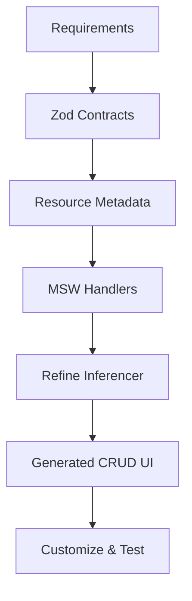
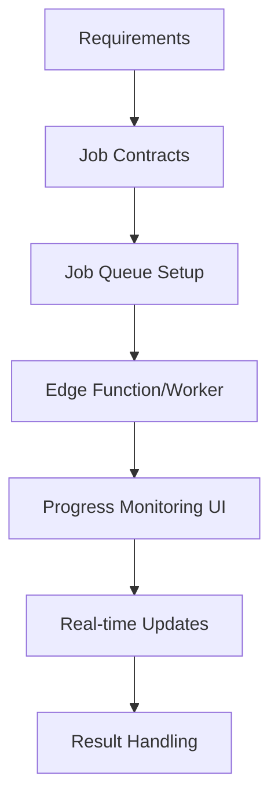
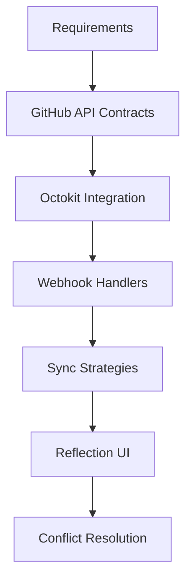
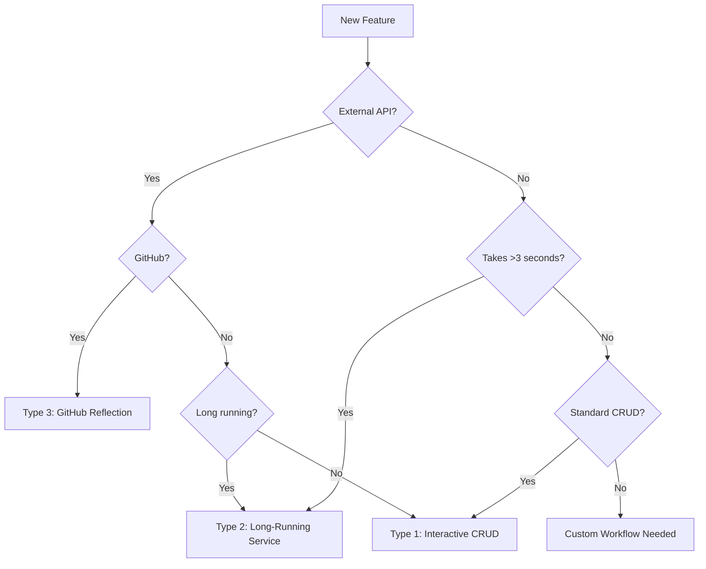

# Feature Workflows by Type

## Overview

We have three distinct feature types, each requiring specialized workflows that extend the base Feature Factory pattern.

## Base Workflow (Common to All)

All features start with:
1. Code discovery & analysis
2. Requirements gathering
3. Contract definition
4. Testing strategy
5. Documentation

## Type 1: Interactive CRUD Features

### When to Use
- Direct database operations
- Standard list/create/edit/delete operations
- Immediate response patterns
- Form-based data entry

### Specialized Workflow



### Key Components

#### 1. Contract Definition
```typescript
export const EntityContract = z.object({
  id: z.string().uuid(),
  // Standard fields
});

export const EntityCreateInput = EntityContract.omit({
  id: true,
  createdAt: true,
  updatedAt: true,
});
```

#### 2. Resource Metadata
```typescript
export const entityResource = {
  name: 'entities',
  meta: {
    contract: EntityContract,
    fields: generateFieldsFromContract(EntityContract),
    permissions: {
      list: ['viewer', 'editor', 'admin'],
      create: ['editor', 'admin'],
      edit: ['editor', 'admin'],
      delete: ['admin']
    }
  }
};
```

#### 3. Use Inferencer
```typescript
// Inferencer generates from MSW + metadata
<AntdInferencer 
  resource="entities"
  action="list"
  meta={entityResource.meta}
/>
```

### Testing Focus
- Contract validation
- CRUD operations
- Permission checks
- Form validation
- Optimistic updates

### Deliverables
- [ ] Zod contracts
- [ ] Database migrations
- [ ] Resource configuration
- [ ] Generated UI components
- [ ] CRUD tests
- [ ] RBAC implementation

---

## Type 2: Long-Running Services

### When to Use
- Operations taking >3 seconds
- Batch processing
- External API calls
- File processing
- Report generation

### Specialized Workflow



### Key Components

#### 1. Job Contract
```typescript
export const ProcessingJobContract = z.object({
  id: z.string().uuid(),
  type: z.literal('processing'),
  status: z.enum(['pending', 'running', 'completed', 'failed']),
  progress: z.number().min(0).max(100),
  input: z.object({
    // Job-specific input
  }),
  result: z.any().optional(),
  error: z.string().optional(),
  startedAt: z.string().datetime().optional(),
  completedAt: z.string().datetime().optional(),
});
```

#### 2. Job Queue Configuration
```typescript
// Supabase Edge Function
export async function processJob(jobId: string) {
  // Update status to running
  await updateJobStatus(jobId, 'running', 0);
  
  try {
    // Process with progress updates
    for (let i = 0; i <= 100; i += 10) {
      await doWork();
      await updateJobProgress(jobId, i);
      
      // Broadcast via Realtime
      await broadcastProgress(jobId, i);
    }
    
    await updateJobStatus(jobId, 'completed', 100, result);
  } catch (error) {
    await updateJobStatus(jobId, 'failed', null, null, error);
  }
}
```

#### 3. Trigger UI Component
```typescript
export const JobTriggerForm: FC = () => {
  const { mutate: startJob } = useCreate();
  const [jobId, setJobId] = useState<string | null>(null);
  
  const handleSubmit = async (values) => {
    const { data } = await startJob({
      resource: 'jobs',
      values: {
        type: 'processing',
        input: values
      }
    });
    setJobId(data.id);
  };
  
  return (
    <>
      {!jobId ? (
        <Form onFinish={handleSubmit}>
          {/* Input fields */}
          <Button type="primary" htmlType="submit">
            Start Processing
          </Button>
        </Form>
      ) : (
        <JobProgressMonitor jobId={jobId} />
      )}
    </>
  );
};
```

#### 4. Progress Monitor Component
```typescript
export const JobProgressMonitor: FC<{ jobId: string }> = ({ jobId }) => {
  const [job, setJob] = useState<Job | null>(null);
  
  useEffect(() => {
    // Subscribe to real-time updates
    const channel = supabase
      .channel(`job:${jobId}`)
      .on('broadcast', { event: 'progress' }, ({ payload }) => {
        setJob(payload);
      })
      .subscribe();
    
    // Poll for initial state
    fetchJob(jobId).then(setJob);
    
    return () => {
      channel.unsubscribe();
    };
  }, [jobId]);
  
  if (!job) return <Spin />;
  
  return (
    <Card>
      <Progress 
        percent={job.progress} 
        status={job.status === 'failed' ? 'exception' : 'active'}
      />
      <p>Status: {job.status}</p>
      {job.error && <Alert type="error" message={job.error} />}
      {job.result && <ResultDisplay result={job.result} />}
    </Card>
  );
};
```

### Testing Focus
- Job queue mechanics
- Progress updates
- Error handling & retry logic
- Timeout scenarios
- Result validation
- Real-time subscription

### Deliverables
- [ ] Job contracts
- [ ] Queue infrastructure (Supabase, BullMQ, etc.)
- [ ] Edge Functions/Workers
- [ ] Trigger UI components
- [ ] Progress monitoring UI
- [ ] Real-time subscription setup
- [ ] Error recovery mechanisms

---

## Type 3: GitHub Reflection Services

### When to Use
- GitHub API integration
- Repository management
- Team synchronization
- Branch operations
- PR/Issue management
- Webhook handling

### Specialized Workflow



### Key Components

#### 1. GitHub Entity Contracts
```typescript
export const GitHubRepoContract = z.object({
  id: z.number(),
  name: z.string(),
  full_name: z.string(),
  owner: z.object({
    login: z.string(),
    type: z.enum(['User', 'Organization']),
  }),
  private: z.boolean(),
  default_branch: z.string(),
  // Cached locally
  last_synced: z.string().datetime(),
  local_metadata: z.record(z.any()).optional(),
});

export const GitHubTeamContract = z.object({
  id: z.number(),
  name: z.string(),
  slug: z.string(),
  permission: z.enum(['pull', 'push', 'admin', 'maintain', 'triage']),
  members: z.array(z.object({
    login: z.string(),
    role: z.enum(['member', 'maintainer']),
  })),
});
```

#### 2. GitHub Service Adapter
```typescript
export class GitHubServiceAdapter {
  private octokit: Octokit;
  private cache: CacheManager;
  
  constructor() {
    this.octokit = new Octokit({
      auth: process.env.GITHUB_TOKEN,
      throttle: {
        onRateLimit: (retryAfter, options) => {
          console.warn(`Rate limit hit, retrying after ${retryAfter}s`);
          return true;
        },
        onSecondaryRateLimit: (retryAfter, options) => {
          console.warn(`Secondary rate limit hit`);
          return false;
        },
      },
    });
  }
  
  async syncTeams(org: string): Promise<GitHubTeam[]> {
    // Check cache first
    const cached = await this.cache.get(`teams:${org}`);
    if (cached && !this.isStale(cached)) {
      return cached.data;
    }
    
    // Fetch from GitHub
    const { data: teams } = await this.octokit.teams.list({ org });
    
    // Enhance with members
    const teamsWithMembers = await Promise.all(
      teams.map(async (team) => {
        const { data: members } = await this.octokit.teams.listMembersInOrg({
          org,
          team_slug: team.slug,
        });
        return { ...team, members };
      })
    );
    
    // Cache and return
    await this.cache.set(`teams:${org}`, teamsWithMembers, { ttl: 300 });
    return teamsWithMembers;
  }
  
  async createBranchWithScaffold(
    repo: string,
    branch: string,
    template: string
  ): Promise<void> {
    // This could be a long-running job
    const jobId = await this.queueJob({
      type: 'scaffold_branch',
      input: { repo, branch, template }
    });
    
    return jobId;
  }
}
```

#### 3. Webhook Handler
```typescript
// apps/admin/src/app/api/webhooks/github/route.ts
export async function POST(request: Request) {
  const signature = request.headers.get('x-hub-signature-256');
  const body = await request.text();
  
  // Verify webhook signature
  if (!verifyWebhookSignature(body, signature)) {
    return new Response('Unauthorized', { status: 401 });
  }
  
  const payload = JSON.parse(body);
  const event = request.headers.get('x-github-event');
  
  switch (event) {
    case 'push':
      await handlePushEvent(payload);
      break;
    case 'pull_request':
      await handlePullRequestEvent(payload);
      break;
    case 'team':
      await handleTeamEvent(payload);
      break;
    default:
      console.log(`Unhandled event: ${event}`);
  }
  
  return new Response('OK', { status: 200 });
}

async function handleTeamEvent(payload: any) {
  // Sync team changes to local database
  await syncTeamToDatabase(payload.team);
  
  // Update RBAC if needed
  await updateRBACFromGitHubTeam(payload.team);
  
  // Notify affected users
  await notifyTeamMembers(payload.team, payload.action);
}
```

#### 4. Reflection UI Component
```typescript
export const GitHubSyncDashboard: FC = () => {
  const [syncStatus, setSyncStatus] = useState<Record<string, SyncStatus>>({});
  const [conflicts, setConflicts] = useState<Conflict[]>([]);
  
  const handleSync = async (entityType: string) => {
    setSyncStatus(prev => ({
      ...prev,
      [entityType]: { status: 'syncing', progress: 0 }
    }));
    
    try {
      const result = await syncWithGitHub(entityType);
      
      if (result.conflicts.length > 0) {
        setConflicts(result.conflicts);
      }
      
      setSyncStatus(prev => ({
        ...prev,
        [entityType]: { 
          status: 'completed', 
          lastSynced: new Date().toISOString() 
        }
      }));
    } catch (error) {
      setSyncStatus(prev => ({
        ...prev,
        [entityType]: { status: 'failed', error: error.message }
      }));
    }
  };
  
  return (
    <Card title="GitHub Synchronization">
      <Space direction="vertical" style={{ width: '100%' }}>
        {['teams', 'repositories', 'branches'].map(entity => (
          <Card key={entity} size="small">
            <Row justify="space-between" align="middle">
              <Col>
                <Text strong>{entity.toUpperCase()}</Text>
                {syncStatus[entity]?.lastSynced && (
                  <Text type="secondary">
                    Last synced: {formatDate(syncStatus[entity].lastSynced)}
                  </Text>
                )}
              </Col>
              <Col>
                <Button 
                  onClick={() => handleSync(entity)}
                  loading={syncStatus[entity]?.status === 'syncing'}
                >
                  Sync Now
                </Button>
              </Col>
            </Row>
            {syncStatus[entity]?.status === 'syncing' && (
              <Progress percent={syncStatus[entity].progress} />
            )}
          </Card>
        ))}
      </Space>
      
      {conflicts.length > 0 && (
        <ConflictResolutionModal 
          conflicts={conflicts}
          onResolve={handleConflictResolution}
        />
      )}
    </Card>
  );
};
```

### Testing Focus
- API mocking with MSW
- Rate limit handling
- Webhook signature verification
- Sync conflict scenarios
- Cache invalidation
- Partial failure handling

### Deliverables
- [ ] GitHub API contracts
- [ ] Octokit service adapter
- [ ] Webhook handlers
- [ ] Sync strategies
- [ ] Conflict resolution UI
- [ ] Caching layer
- [ ] Rate limit handling
- [ ] Webhook security

---

## Decision Matrix

| Aspect | CRUD | Long-Running | GitHub Reflection |
|--------|------|--------------|-------------------|
| **UI Generation** | Refine Inferencer ✅ | Custom Progress UI | Custom Sync UI |
| **State Management** | React Query | Job Queue + SSE | Cache + Polling |
| **Testing** | Standard CRUD | Job Lifecycle | API Mocking |
| **Error Handling** | Form Validation | Retry + Timeout | Rate Limits |
| **Real-time** | Optional | Required (progress) | Webhooks |
| **Permissions** | RBAC | RBAC + Job Owner | RBAC + GitHub Perms |
| **Caching** | Query Cache | Result Storage | API Response Cache |
| **Database** | Direct | Job Queue Tables | Reflection Tables |

## Choosing the Right Workflow



## Migration Between Types

Sometimes a feature starts as one type and evolves:

### CRUD → Long-Running
When a CRUD operation becomes slow:
1. Keep the CRUD UI
2. Add job queue for heavy operations
3. Show progress for long operations
4. Cache results

### Long-Running → CRUD
When processing becomes fast enough:
1. Remove job queue
2. Convert to direct operations
3. Keep progress UI for UX
4. Simplify error handling

### GitHub → Long-Running
When GitHub operations are complex:
1. Queue GitHub API calls
2. Add progress monitoring
3. Handle rate limits gracefully
4. Cache aggressively

## Common Patterns Across All Types

### Error Handling
```typescript
// Consistent error contract
export const ErrorContract = z.object({
  code: z.string(),
  message: z.string(),
  details: z.any().optional(),
  timestamp: z.string().datetime(),
  requestId: z.string().uuid(),
});
```

### Audit Logging
```typescript
// All types should audit
export const AuditLogContract = z.object({
  id: z.string().uuid(),
  featureType: z.enum(['crud', 'job', 'github']),
  action: z.string(),
  userId: z.string().uuid(),
  metadata: z.record(z.any()),
  timestamp: z.string().datetime(),
});
```

### Monitoring
```typescript
// Track all operations
export function trackFeatureMetric(
  type: 'crud' | 'job' | 'github',
  action: string,
  duration: number,
  success: boolean
) {
  analytics.track('feature_operation', {
    type,
    action,
    duration,
    success,
    timestamp: new Date().toISOString(),
  });
}
```

## Summary

While the base Feature Factory workflow provides a solid foundation, each feature type benefits from specialized workflows that address their unique characteristics:

1. **CRUD Features**: Use the standard workflow with Refine.dev
2. **Long-Running Services**: Extend with job queues and progress monitoring
3. **GitHub Reflection**: Add external API patterns and sync strategies

The key is to identify the feature type early and apply the appropriate specialized workflow while maintaining common patterns for consistency.