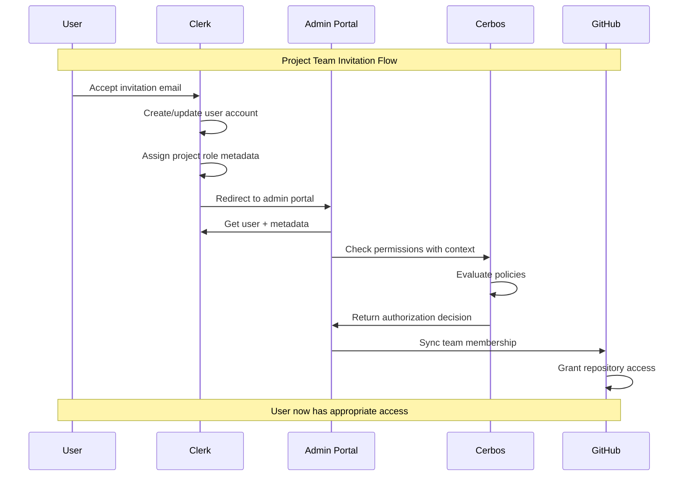

# Authentication & Authorization Architecture

## Overview

This document defines the integrated authentication and authorization architecture for the IFLA Standards Development Platform, leveraging Clerk for identity management, Cerbos for policy-based authorization, and GitHub Projects for project management.

## Architecture Components

### 1. Authentication & Identity (Clerk)

**Purpose**: Handle all user authentication, onboarding, and team formation

**Key Features**:
- **User Onboarding**: Streamlined signup flow for both IFLA members and external contributors
- **Email Invitations**: Project-specific invitations with role pre-assignment
- **Social Login**: GitHub OAuth for seamless integration
- **User Metadata**: Store roles, project memberships, and Review Group associations
- **Team Formation**: Built-in team management with role assignment

**Implementation**:
```typescript
// Clerk user metadata structure
interface ClerkUserMetadata {
  iflaRole?: 'member' | 'staff' | 'admin';
  reviewGroupAdmin?: string[]; // Review Group IDs
  projectMemberships: {
    projectId: string;
    role: 'editor' | 'reviewer' | 'translator';
    joinedAt: Date;
  }[];
  externalContributor: boolean;
}
```

### 2. Authorization & Access Control (Cerbos)

**Purpose**: Enforce fine-grained permissions based on user roles and project/namespace context

**Key Features**:
- **Policy-as-Code**: Version-controlled authorization policies
- **Context-Aware**: Decisions based on user role + project + namespace
- **Real-time Evaluation**: Sub-millisecond authorization decisions
- **Audit Trail**: Complete log of all authorization decisions

**Policy Structure**:
```yaml
# Example Cerbos policy for namespace access
apiVersion: api.cerbos.dev/v1
resourcePolicy:
  version: "default"
  resource: "namespace"
  rules:
    - actions: ["edit"]
      effect: EFFECT_ALLOW
      roles: ["editor"]
      condition:
        match:
          expr: P.attr.projectId in request.principal.attr.projectIds
    
    - actions: ["review"]
      effect: EFFECT_ALLOW
      roles: ["reviewer"]
      condition:
        match:
          expr: P.attr.projectId in request.principal.attr.projectIds
```

### 3. Project Management (GitHub Projects)

**Purpose**: Track work, manage tasks, and coordinate team activities

**Key Features**:
- **Project Boards**: Kanban/table views for task management
- **Issue Integration**: Link issues and PRs to projects
- **Milestone Tracking**: Deliverables and timeline management
- **Team Sync**: Integrate with Clerk teams for access control

## Integration Architecture

### User Flow



### Data Flow

1. **Clerk → Cerbos**: Pass user metadata for authorization
2. **Cerbos → Application**: Return permission decisions
3. **Application → GitHub**: Sync team memberships based on permissions
4. **GitHub → Clerk**: Webhook updates for team changes

## Implementation Details

### Clerk Configuration

```typescript
// Clerk webhook handler for team updates
export async function handleClerkWebhook(event: WebhookEvent) {
  switch (event.type) {
    case 'user.created':
      // Set up default permissions
      await createUserInCerbos(event.data);
      break;
      
    case 'user.updated':
      // Sync role changes to Cerbos
      await updateUserPermissions(event.data);
      break;
      
    case 'organizationMembership.created':
      // Add to GitHub team
      await syncGitHubTeam(event.data);
      break;
  }
}
```

### Cerbos Integration

```typescript
// Cerbos client setup
import { GRPC } from "@cerbos/grpc";

const cerbos = new GRPC({
  hostname: process.env.CERBOS_HOST,
  tls: true,
});

// Authorization check
export async function canUserEditNamespace(
  user: ClerkUser,
  projectId: string,
  namespaceId: string
) {
  const result = await cerbos.checkResource({
    principal: {
      id: user.id,
      roles: [user.role],
      attributes: {
        projectIds: user.projectMemberships.map(p => p.projectId),
        reviewGroups: user.reviewGroupAdmin || [],
      },
    },
    resource: {
      kind: "namespace",
      id: namespaceId,
      attributes: {
        projectId,
        reviewGroup: getNamespaceReviewGroup(namespaceId),
      },
    },
    actions: ["edit"],
  });
  
  return result.isAllowed("edit");
}
```

### GitHub Integration

```typescript
// Sync Clerk teams to GitHub
export async function syncProjectTeamToGitHub(
  projectId: string,
  teamMembers: ClerkUser[]
) {
  const octokit = new Octokit({ auth: process.env.GITHUB_TOKEN });
  
  // Get or create GitHub team
  const team = await octokit.teams.getByName({
    org: "iflastandards",
    team_slug: `project-${projectId}`,
  });
  
  // Sync members
  for (const member of teamMembers) {
    if (member.githubUsername) {
      await octokit.teams.addOrUpdateMembershipForUserInOrg({
        org: "iflastandards",
        team_slug: team.slug,
        username: member.githubUsername,
        role: member.role === 'editor' ? 'maintainer' : 'member',
      });
    }
  }
}
```

## Security Considerations

### Authentication Security
- **MFA Required**: For Review Group admins and editors
- **Session Management**: 24-hour sessions with refresh tokens
- **Email Verification**: Required for all accounts
- **Rate Limiting**: Prevent brute force attacks

### Authorization Security
- **Principle of Least Privilege**: Users only get necessary permissions
- **Context-Aware**: Permissions evaluated with full context
- **Audit Logging**: All authorization decisions logged
- **Policy Version Control**: All policy changes tracked in Git

### Integration Security
- **Webhook Validation**: Verify all webhook signatures
- **API Authentication**: Secure API keys with rotation
- **TLS Everywhere**: All communications encrypted
- **Secret Management**: Use environment variables and key vaults

## Benefits

1. **Streamlined Onboarding**: Clerk handles complex invitation flows
2. **Fine-Grained Control**: Cerbos enables sophisticated permission rules
3. **Familiar Tools**: GitHub Projects for project management
4. **External Participation**: Easy to invite non-IFLA contributors
5. **Audit Compliance**: Complete trail of access decisions
6. **Scalability**: Each component scales independently

## Migration Path

### Phase 1: Clerk Integration
1. Set up Clerk organization
2. Configure authentication flows
3. Migrate existing users
4. Enable invitations

### Phase 2: Cerbos Deployment
1. Deploy Cerbos PDP
2. Define initial policies
3. Integrate with Clerk metadata
4. Test authorization flows

### Phase 3: GitHub Sync
1. Create GitHub teams structure
2. Implement sync webhooks
3. Map Clerk roles to GitHub permissions
4. Enable automated team management

### Phase 4: Full Integration
1. Enable all integration points
2. Monitor and optimize
3. Train administrators
4. Document workflows