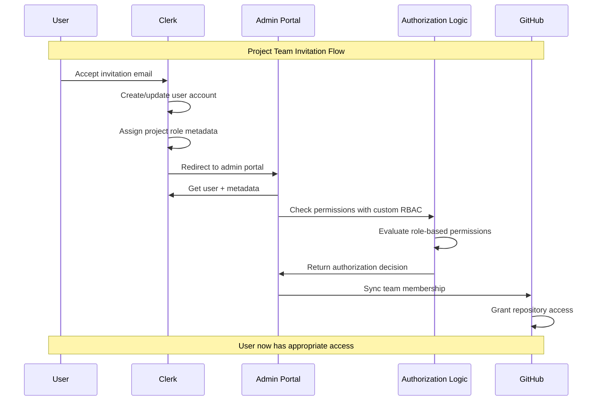

# Authentication & Authorization Architecture

## Overview

This document defines the authentication and authorization architecture for the IFLA Standards Development Platform, using Clerk for both identity management and role-based authorization, integrated with GitHub Projects for project management.

**Implementation Note**: This document has been updated to reflect the actual implementation. The platform uses a custom RBAC system with Clerk authentication storing roles in `publicMetadata`. Neither Cerbos nor Clerk Organizations were implemented. See `system-design-docs/14-rbac-implementation.md` for complete details.

## Architecture Components

### 1. Authentication & Identity (Clerk)

**Purpose**: Handle all user authentication, onboarding, and role-based authorization

**Key Features**:
- **User Onboarding**: Streamlined signup flow for both IFLA members and external contributors
- **Organizations**: Review Groups as Clerk organizations with proper role hierarchy
- **User Metadata**: Comprehensive role structure stored in Clerk user metadata
- **Role-Based Authorization**: Built-in authorization logic using user metadata

**Implementation**:
```typescript
// Clerk user metadata structure
interface UserMetadata {
  systemRole?: 'superadmin';
  reviewGroups: Array<{
    reviewGroupId: string;
    role: 'admin';
  }>;
  teams: Array<{
    teamId: string;
    role: 'editor' | 'author';
    reviewGroup: string;
    namespaces: string[];
  }>;
  translations: Array<{
    language: string;
    namespaces: string[];
  }>;
}
```

### 2. Authorization Logic (Custom RBAC)

**Purpose**: Enforce permissions based on user roles stored in Clerk publicMetadata

**Key Features**:
- **Simple Role Hierarchy**: 6 roles (superadmin, admin, editor, translator, reviewer, viewer)
- **Namespace Permissions**: Optional namespace-specific permissions
- **TypeScript Implementation**: Simple, maintainable authorization logic
- **No External Dependencies**: All logic in the application code

**Implementation**:
```typescript
// From apps/admin/src/lib/authorization.ts
export const ROLES = {
  SUPERADMIN: 'superadmin',
  ADMIN: 'admin',
  EDITOR: 'editor',
  TRANSLATOR: 'translator',
  REVIEWER: 'reviewer',
  VIEWER: 'viewer'
} as const;

// Permission check function
export function checkUserPermission(
  userRole: string | undefined,
  resource: string,
  action: string,
  namespace?: string
): boolean {
  // Implementation details in authorization.ts
}
```

### 3. Project Management (GitHub Projects)

**Purpose**: Track work, manage tasks, and coordinate team activities

**Key Features**:
- **Project Boards**: Kanban/table views for task management
- **Issue Integration**: Link issues and PRs to projects
- **Milestone Tracking**: Deliverables and timeline management
- **Team Sync**: Integrate with Clerk teams for access control

## Integration Architecture

### User Flow



### Data Flow

1. **Clerk → Application**: Provide user identity and publicMetadata
2. **Application → Authorization**: Check permissions using custom RBAC logic
3. **Application → GitHub**: Sync team memberships based on permissions
4. **GitHub → Clerk**: Webhook updates for team changes

## Implementation Details

### Clerk Configuration

```typescript
// Clerk webhook handler for team updates
export async function handleClerkWebhook(event: WebhookEvent) {
  switch (event.type) {
    case 'user.created':
      // Set up default permissions in publicMetadata
      await setDefaultUserRole(event.data);
      break;
      
    case 'user.updated':
      // Handle role changes in publicMetadata
      await updateUserPermissions(event.data);
      break;
      
    case 'organizationMembership.created':
      // Add to GitHub team
      await syncGitHubTeam(event.data);
      break;
  }
}
```

### Custom RBAC Implementation

```typescript
// Authorization using custom RBAC
import { auth } from "@clerk/nextjs/server";
import { checkUserPermission } from "@/lib/authorization";

// Authorization check
export async function canUserEditNamespace(
  namespaceId: string
) {
  const { userId, sessionClaims } = auth();
  
  if (!userId) return false;
  
  const userRole = sessionClaims?.publicMetadata?.role;
  const namespacePerms = sessionClaims?.publicMetadata?.namespacePermissions;
  
  return checkUserPermission(
    userRole,
    'namespace',
    'edit',
    namespaceId,
    namespacePerms
  );
}
```

### GitHub Integration

```typescript
// Sync Clerk teams to GitHub
export async function syncProjectTeamToGitHub(
  projectId: string,
  teamMembers: ClerkUser[]
) {
  const octokit = new Octokit({ auth: process.env.GITHUB_TOKEN });
  
  // Get or create GitHub team
  const team = await octokit.teams.getByName({
    org: "iflastandards",
    team_slug: `project-${projectId}`,
  });
  
  // Sync members
  for (const member of teamMembers) {
    if (member.githubUsername) {
      await octokit.teams.addOrUpdateMembershipForUserInOrg({
        org: "iflastandards",
        team_slug: team.slug,
        username: member.githubUsername,
        role: member.role === 'editor' ? 'maintainer' : 'member',
      });
    }
  }
}
```

## Security Considerations

### Authentication Security
- **MFA Required**: For Review Group admins and editors
- **Session Management**: 24-hour sessions with refresh tokens
- **Email Verification**: Required for all accounts
- **Rate Limiting**: Prevent brute force attacks

### Authorization Security
- **Principle of Least Privilege**: Users only get necessary permissions
- **Context-Aware**: Permissions evaluated with full context
- **Audit Logging**: All authorization decisions logged
- **Policy Version Control**: All policy changes tracked in Git

### Integration Security
- **Webhook Validation**: Verify all webhook signatures
- **API Authentication**: Secure API keys with rotation
- **TLS Everywhere**: All communications encrypted
- **Secret Management**: Use environment variables and key vaults

## Benefits

1. **Streamlined Onboarding**: Clerk handles complex invitation flows
2. **Fine-Grained Control**: Cerbos enables sophisticated permission rules
3. **Familiar Tools**: GitHub Projects for project management
4. **External Participation**: Easy to invite non-IFLA contributors
5. **Audit Compliance**: Complete trail of access decisions
6. **Scalability**: Each component scales independently

## Migration Path

### Phase 1: Clerk Integration
1. Set up Clerk organization
2. Configure authentication flows
3. Migrate existing users
4. Enable invitations

### Phase 2: Cerbos Deployment
1. Deploy Cerbos PDP
2. Define initial policies
3. Integrate with Clerk metadata
4. Test authorization flows

### Phase 3: GitHub Sync
1. Create GitHub teams structure
2. Implement sync webhooks
3. Map Clerk roles to GitHub permissions
4. Enable automated team management

### Phase 4: Full Integration
1. Enable all integration points
2. Monitor and optimize
3. Train administrators
4. Document workflows