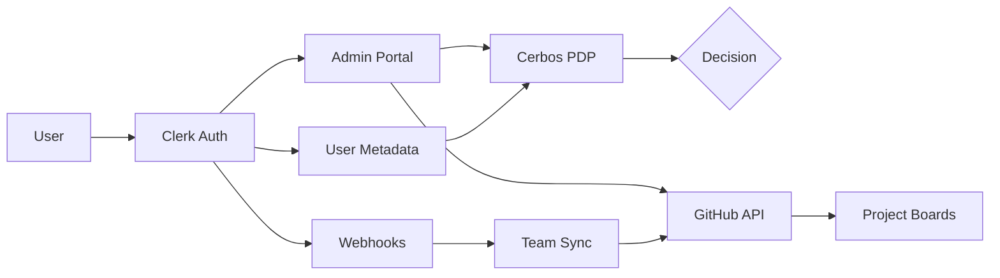

# Clerk + Cerbos Integration Plan

## Executive Summary

This plan outlines the integration of Clerk (authentication & identity) with Cerbos (authorization) for the IFLA Standards Development Platform. The integration enables sophisticated role-based access control while maintaining a smooth user experience for both IFLA members and external contributors.

## Integration Architecture

### System Components



## Phase 1: Clerk Setup (Week 1)

### 1.1 Organization Configuration
```typescript
// Clerk organization settings
{
  name: "IFLA Standards",
  logo: "/ifla-logo.png",
  color: "#0F766E", // OMR25 primary
  
  features: {
    organizations: true,
    invitations: true,
    socialLogin: ["github"],
    mfa: {
      required: ["admin", "editor"],
      optional: ["reviewer", "translator"]
    }
  }
}
```

### 1.2 User Metadata Schema
```typescript
interface ClerkUserPublicMetadata {
  iflaRole?: 'member' | 'staff' | 'admin';
  reviewGroupAdmin?: string[]; // ["isbd", "bcm"]
  externalContributor: boolean;
}

interface ClerkUserPrivateMetadata {
  projectMemberships: {
    projectId: string;
    projectName: string;
    role: 'editor' | 'reviewer' | 'translator';
    reviewGroup: string;
    joinedAt: string;
    invitedBy: string;
  }[];
  githubTeams?: string[]; // Synced GitHub team IDs
}
```

### 1.3 Invitation Flow
```typescript
// Custom invitation with role pre-assignment
export async function inviteToProject(
  projectId: string,
  email: string,
  role: TeamRole,
  invitedBy: string
) {
  const project = await getProject(projectId);
  
  const invitation = await clerk.invitations.create({
    emailAddress: email,
    publicMetadata: {
      externalContributor: !email.endsWith('@ifla.org'),
    },
    privateMetadata: {
      pendingProject: {
        projectId,
        projectName: project.name,
        role,
        reviewGroup: project.reviewGroup,
        invitedBy,
      }
    },
    redirectUrl: `/projects/${projectId}/welcome`,
    customMessage: `You've been invited to join "${project.name}" as a ${role}.`,
  });
  
  return invitation;
}
```

## Phase 2: Cerbos Configuration (Week 1-2)

### 2.1 Policy Structure
```yaml
# policies/resource_namespace_v1.yaml
apiVersion: api.cerbos.dev/v1
resourcePolicy:
  version: "v1"
  resource: "namespace"
  rules:
    # Editors can edit namespaces in their projects
    - actions: ["create", "update", "delete"]
      effect: EFFECT_ALLOW
      roles: ["editor"]
      condition:
        match:
          all:
            of:
              - expr: P.attr.projectIds.contains(R.attr.assignedProjectIds)
              - expr: R.attr.status == "active"
    
    # Reviewers can review but not edit
    - actions: ["review", "comment", "approve"]
      effect: EFFECT_ALLOW
      roles: ["reviewer"]
      condition:
        match:
          expr: P.attr.projectIds.contains(R.attr.assignedProjectIds)
    
    # Translators can only edit translations
    - actions: ["translate", "update_translation"]
      effect: EFFECT_ALLOW
      roles: ["translator"]
      condition:
        match:
          expr: P.attr.projectIds.contains(R.attr.assignedProjectIds)
    
    # Review Group admins have full access
    - actions: ["*"]
      effect: EFFECT_ALLOW
      roles: ["rg-admin"]
      condition:
        match:
          expr: R.attr.reviewGroup in P.attr.reviewGroupAdmin
```

### 2.2 Integration Middleware
```typescript
// middleware/authorization.ts
import { clerkClient } from "@clerk/nextjs";
import { GRPC } from "@cerbos/grpc";

const cerbos = new GRPC({
  hostname: process.env.CERBOS_HOST!,
  tls: process.env.NODE_ENV === "production",
});

export async function checkPermission(
  userId: string,
  resource: string,
  resourceId: string,
  action: string
) {
  // Get user from Clerk with metadata
  const user = await clerkClient.users.getUser(userId);
  
  // Extract roles and attributes
  const roles = extractUserRoles(user);
  const attributes = {
    projectIds: user.privateMetadata.projectMemberships?.map(p => p.projectId) || [],
    reviewGroupAdmin: user.publicMetadata.reviewGroupAdmin || [],
    externalContributor: user.publicMetadata.externalContributor || false,
  };
  
  // Get resource attributes
  const resourceAttrs = await getResourceAttributes(resource, resourceId);
  
  // Check with Cerbos
  const decision = await cerbos.checkResource({
    principal: {
      id: userId,
      roles,
      attributes,
    },
    resource: {
      kind: resource,
      id: resourceId,
      attributes: resourceAttrs,
    },
    actions: [action],
  });
  
  return decision.isAllowed(action);
}
```

## Phase 3: GitHub Team Sync (Week 2)

### 3.1 Webhook Handler
```typescript
// api/webhooks/clerk.ts
export async function handleClerkWebhook(evt: WebhookEvent) {
  switch (evt.type) {
    case 'user.updated':
      // Sync project memberships to GitHub teams
      await syncUserGitHubTeams(evt.data);
      break;
      
    case 'organizationMembership.created':
      // Add to Review Group GitHub team
      await addToReviewGroupTeam(evt.data);
      break;
      
    case 'organizationInvitation.accepted':
      // Process pending project assignment
      await processPendingProjectAssignment(evt.data);
      break;
  }
}

async function syncUserGitHubTeams(user: ClerkUser) {
  const octokit = getOctokit();
  
  for (const membership of user.privateMetadata.projectMemberships || []) {
    const teamSlug = `project-${membership.projectId}`;
    
    try {
      await octokit.teams.addOrUpdateMembershipForUserInOrg({
        org: 'iflastandards',
        team_slug: teamSlug,
        username: user.externalMetadata.githubUsername,
        role: membership.role === 'editor' ? 'maintainer' : 'member',
      });
    } catch (error) {
      console.error(`Failed to sync user ${user.id} to team ${teamSlug}`, error);
    }
  }
}
```

### 3.2 Team Creation
```typescript
// When creating a new project
export async function createProjectWithTeam(
  reviewGroupId: string,
  projectData: CreateProjectInput
) {
  // Create project in database
  const project = await db.project.create(projectData);
  
  // Create GitHub team
  const team = await octokit.teams.create({
    org: 'iflastandards',
    name: `${project.name} Team`,
    description: project.description,
    privacy: 'closed',
    parent_team_id: getReviewGroupTeamId(reviewGroupId),
  });
  
  // Create GitHub Project board
  const board = await octokit.projects.createForOrg({
    org: 'iflastandards',
    name: project.name,
    body: project.charter,
  });
  
  // Link everything
  await db.project.update({
    where: { id: project.id },
    data: {
      githubTeamId: team.id,
      githubProjectId: board.id,
    },
  });
  
  return project;
}
```

## Phase 4: UI Integration (Week 2-3)

### 4.1 Protected Routes
```typescript
// app/projects/[id]/namespace/[nsId]/edit/page.tsx
import { auth } from "@clerk/nextjs";
import { checkPermission } from "@/lib/authorization";

export default async function EditNamespacePage({
  params,
}: {
  params: { id: string; nsId: string };
}) {
  const { userId } = auth();
  if (!userId) redirect("/sign-in");
  
  const canEdit = await checkPermission(
    userId,
    "namespace",
    params.nsId,
    "edit"
  );
  
  if (!canEdit) {
    return <AccessDenied />;
  }
  
  return <NamespaceEditor namespaceId={params.nsId} />;
}
```

### 4.2 Role-Based UI
```typescript
// components/ProjectDashboard.tsx
export function ProjectDashboard({ project }: { project: Project }) {
  const { user } = useUser();
  const userRole = getUserProjectRole(user, project.id);
  
  return (
    <div>
      <h1>{project.name}</h1>
      
      {userRole === 'editor' && (
        <Button href={`/projects/${project.id}/charter/edit`}>
          Edit Charter
        </Button>
      )}
      
      {['editor', 'reviewer'].includes(userRole) && (
        <ReviewQueue projectId={project.id} />
      )}
      
      {userRole === 'translator' && (
        <TranslationTasks projectId={project.id} />
      )}
    </div>
  );
}
```

## Phase 5: Testing & Deployment (Week 3)

### 5.1 Test Scenarios
1. **External Contributor Flow**
   - Invite external expert via email
   - User signs up with GitHub
   - Automatically assigned to project team
   - Can only access assigned namespaces

2. **Role Change**
   - Admin changes user from reviewer to editor
   - Clerk webhook updates metadata
   - Cerbos immediately allows edit actions
   - GitHub team role updated

3. **Project Completion**
   - Project marked as completed
   - Team members retain read access
   - No more edits allowed
   - GitHub team archived

### 5.2 Monitoring
```typescript
// Cerbos audit log integration
cerbos.withAuditLog({
  backend: 'webhook',
  webhook: {
    url: process.env.AUDIT_WEBHOOK_URL,
    headers: {
      'Authorization': `Bearer ${process.env.AUDIT_TOKEN}`,
    },
  },
});

// Clerk activity monitoring
clerk.on('user.signIn', async (user) => {
  await logActivity({
    type: 'auth',
    userId: user.id,
    action: 'sign_in',
    metadata: {
      method: user.primaryEmailAddress,
      ip: user.lastSignInAt,
    },
  });
});
```

## Migration Checklist

- [ ] Set up Clerk organization
- [ ] Configure Clerk environment variables
- [ ] Deploy Cerbos PDP
- [ ] Load initial Cerbos policies
- [ ] Implement Clerk webhook endpoint
- [ ] Create GitHub OAuth app in Clerk
- [ ] Migrate existing users to Clerk
- [ ] Set up user metadata for existing users
- [ ] Create GitHub teams for existing projects
- [ ] Implement authorization middleware
- [ ] Update all protected routes
- [ ] Add role-based UI components
- [ ] Test all permission scenarios
- [ ] Deploy monitoring and alerting
- [ ] Document for administrators

## Security Considerations

1. **Webhook Security**: Validate all Clerk webhook signatures
2. **Metadata Validation**: Sanitize user metadata before storage
3. **Rate Limiting**: Implement rate limits on invitation endpoints
4. **Audit Trail**: Log all permission checks and changes
5. **Failover**: Graceful degradation if Cerbos is unavailable
6. **Token Rotation**: Regular rotation of API keys and secrets

## Success Metrics

- **Invitation Acceptance Rate**: >80% of invitations accepted
- **Permission Check Latency**: <50ms p95
- **GitHub Sync Success**: >99% successful syncs
- **User Satisfaction**: Reduced permission-related support tickets
- **Security Incidents**: Zero authorization bypasses