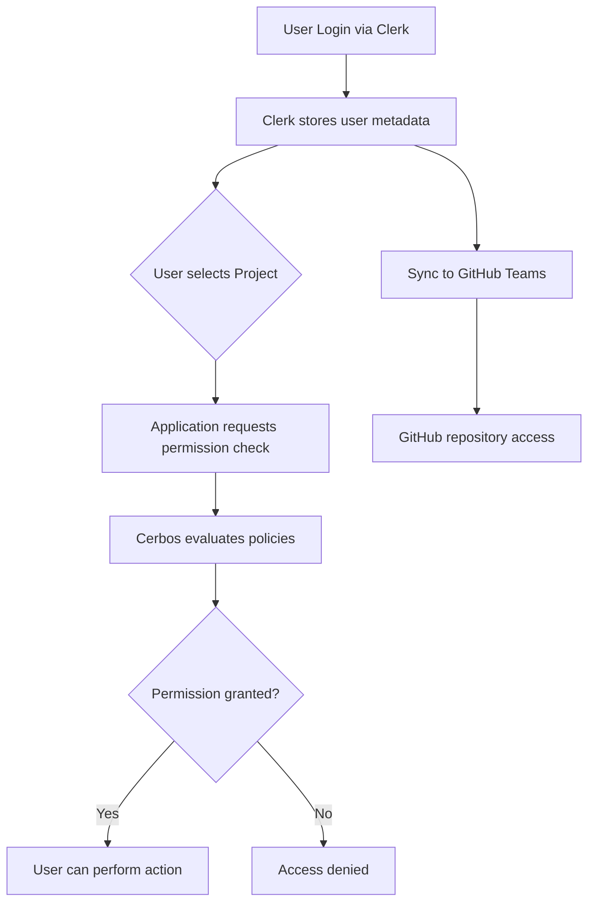

# Projects, Teams, and Review Groups Structure

## Overview

This document defines the organizational structure for IFLA Standards Development Platform, using GitHub Projects as the central organizing unit for work, similar to W3C working groups. This provides focused, goal-oriented collaboration while maintaining clear governance through Review Groups.

## Key Concepts

### Review Groups
Review Groups are **perpetual organizational entities** that oversee related standards and namespaces. They charter Projects to accomplish specific work.

**Examples:**
- ISBD Review Group (International Standard Bibliographic Description)
- BCM Review Group (Bibliographic Conceptual Models)
- ICP Review Group (International Cataloguing Principles)
- PUC Review Group (Permanent UNIMARC Committee)

### Projects (GitHub Projects)
Projects are **chartered initiatives** similar to W3C working groups. They have specific goals and deliverables but can run for extended periods (months to years).

**Examples:**
- "ISBD Maintenance WG 2024-2026" - Ongoing maintenance and enhancement
- "MulDiCat French Translation Initiative" - Add French translations
- "LRM 2.0 Development" - Major revision project
- "BCM Harmonization Project" - Align FRBR/LRM/FRAD vocabularies

**Key Characteristics:**
- Created by Review Group administrators
- Have defined scope and deliverables
- Can be long-running (like W3C working groups)
- Tracked through GitHub Projects boards
- Have assigned teams and namespaces

### Teams
Teams are **collaborative units** created for specific Projects. They bring together people with different skills to accomplish the Project's goals.

**Key Characteristics:**
- Created by Review Group admins for a specific Project
- Members can be external (don't need to be IFLA members)
- Members have specific roles (editor, reviewer/author, translator)
- Work within the context of their Project
- Access namespaces through Project assignment

### Namespaces
Technical vocabulary collections that are assigned to Projects for work to be performed.

**Examples:**
- `isbd`, `isbdm` (managed by ISBD Review Group)
- `lrm`, `frbr`, `frad` (managed by BCM Review Group)
- `muldicat` (managed by ICP Review Group)
- `unimarc` (managed by PUC Review Group)

## Data Model

```typescript
// Core Entities
interface ReviewGroup {
  id: string;
  slug: string;              // e.g., "isbd", "bcm"
  name: string;              // e.g., "ISBD Review Group"
  description: string;
  managedNamespaces: Namespace[];  // All namespaces under this RG
  projects: Project[];       // Active projects chartered by this RG
  admins: User[];           // RG administrators
  createdAt: Date;
  updatedAt: Date;
}

interface Project {
  id: string;
  githubProjectId: string;   // GitHub Projects ID
  name: string;              // e.g., "ISBD Maintenance WG 2024-2026"
  description: string;       // Charter/scope of the project
  reviewGroup: ReviewGroup;  // Chartering Review Group
  status: ProjectStatus;     // active, completed, planning
  teams: Team[];            // Teams working on this project
  assignedNamespaces: Namespace[]; // Namespaces this project works on
  startDate: Date;
  targetEndDate?: Date;      // Optional, can be extended
  deliverables: Deliverable[];
  createdAt: Date;
  updatedAt: Date;
}

type ProjectStatus = 'planning' | 'active' | 'completed' | 'on-hold';

interface Team {
  id: string;
  name: string;              // e.g., "ISBD Editorial Team"
  description: string;
  project: Project;          // Parent Project
  members: TeamMember[];     // Team members with roles
  createdAt: Date;
  updatedAt: Date;
}

interface TeamMember {
  id: string;
  user: User;
  team: Team;
  role: TeamRole;
  joinedAt: Date;
  leftAt?: Date;             // For historical tracking
}

type TeamRole = 'editor' | 'reviewer' | 'translator';
// Note: 'reviewer' is also referred to as 'author' in some contexts

interface User {
  id: string;
  email: string;
  name: string;
  githubUsername?: string;
  iflaRole?: IFLARole;       // Optional - external contributors may not have one
  teamMemberships: TeamMember[]; // All team memberships
  reviewGroupAdminOf: ReviewGroup[]; // RGs where user is admin
  createdAt: Date;
  updatedAt: Date;
}

type IFLARole = 'member' | 'staff' | 'admin';

interface Namespace {
  id: string;
  slug: string;              // e.g., "isbd", "lrm"
  name: string;              // e.g., "International Standard Bibliographic Description"
  description: string;
  reviewGroup: ReviewGroup;  // Managing Review Group
  assignedToProjects: Project[]; // Projects working on this namespace
  vocabularies: Vocabulary[];
  elementSets: ElementSet[];
  dctapProfiles: DCTAPProfile[]; // Exactly 2 profiles
  createdAt: Date;
  updatedAt: Date;
}

interface Deliverable {
  id: string;
  project: Project;
  title: string;
  description: string;
  dueDate?: Date;
  status: DeliverableStatus;
  type: DeliverableType;
}

type DeliverableStatus = 'planned' | 'in-progress' | 'review' | 'completed';
type DeliverableType = 'vocabulary-release' | 'translation' | 'documentation' | 'schema-revision';
```

## Business Rules

### Review Group Rules
1. Each Review Group manages one or more namespaces
2. Review Groups charter Projects to accomplish specific work
3. Review Groups have designated administrators
4. Review Groups are perpetual (no end date)

### Project Rules
1. Projects are created by Review Group administrators
2. Projects have defined scope and deliverables (like W3C working groups)
3. Projects can run for extended periods (months to years)
4. Projects are assigned one or more namespaces to work on
5. Projects have one or more teams
6. Project work is tracked through GitHub Projects boards

### Team Rules
1. Teams are created for specific Projects
2. Team members can be external contributors (don't require IFLA membership)
3. Team members have specific roles (editor, reviewer, translator)
4. Teams work within the scope of their Project
5. Team membership can evolve over the Project lifetime

### User Rules
1. Users can be members of multiple teams across different Projects
2. Users can have different roles in different teams
3. External contributors can participate without IFLA membership
4. Users who are Review Group admins can create Projects and Teams

### Namespace Rules
1. Each namespace belongs to exactly ONE Review Group
2. Namespaces can be assigned to multiple Projects
3. Teams access namespaces through their Project assignment
4. Namespaces contain vocabularies, element sets, and DCTAP profiles

## Permission Model

### Hierarchical Permissions

```typescript
interface Permissions {
  // System Level
  'system-admin': boolean;         // Full system access
  'ifla-admin': boolean;          // IFLA-wide administration
  
  // Review Group Level
  '{rg}-admin': boolean;          // Admin of specific Review Group
  
  // Project Level (derived through team membership)
  'project:{project}:view': boolean;     // View project details
  'project:{project}:contribute': boolean; // Contribute to project
  
  // Namespace Level (derived through project assignment)
  'namespace:{ns}:edit': boolean;    // Editor permissions
  'namespace:{ns}:review': boolean;  // Reviewer permissions
  'namespace:{ns}:translate': boolean; // Translator permissions
}
```

### Permission Inheritance

1. **System Admins** can do everything
2. **IFLA Admins** can manage all Review Groups
3. **Review Group Admins** can:
   - Create Projects within their Review Group
   - Create Teams for Projects
   - Assign namespaces to Projects
   - Manage Review Group settings
4. **Team Members** inherit permissions based on:
   - Their role in the team (editor/reviewer/translator)
   - Which namespaces their Project is assigned to
   - Active status of their Project

### Permission Flow with Clerk + Cerbos



**Key Points**:
- Clerk handles identity and stores project/role associations
- Cerbos evaluates permissions in real-time based on context
- GitHub teams provide repository-level access control
- All three systems work together for comprehensive security

## Workflow Example

### Creating a Translation Project

1. **ICP Review Group Admin** identifies need for French translation of MulDiCat
2. **Admin creates Project**: "MulDiCat French Translation Initiative"
   - Sets scope: Translate all MulDiCat terms to French
   - Sets timeline: 6 months
   - Assigns namespace: `muldicat`
3. **Admin creates Team**: "French Translation Team"
   - Invites French-speaking librarians (some external)
   - Assigns roles: 2 translators, 1 reviewer, 1 editor
4. **Team begins work**:
   - Tasks tracked in GitHub Projects board
   - Pull requests for translations
   - Reviews conducted by team reviewer
   - External feedback via issues
5. **Project completion**:
   - Final review by Review Group
   - Version release of French MulDiCat
   - Project marked complete (but can be reopened)

## Use Cases

### Scenario 1: Long-term Maintenance Project
The ISBD Review Group creates "ISBD Maintenance WG 2024-2026" as a multi-year project:
- Ongoing work to maintain and enhance ISBD standards
- Team includes editors and reviewers
- Assigned namespaces: `isbd`, `isbdm`, and future expansions
- Regular releases tracked as deliverables
- Team membership evolves as people join/leave

### Scenario 2: Cross-namespace Harmonization
The BCM Review Group creates "BCM Harmonization Project":
- Goal: Align terminology across FRBR, LRM, and FRAD
- Team includes subject matter experts from each standard
- Assigned all BCM namespaces
- Deliverables include mapping documents and updated vocabularies
- 18-month timeline with quarterly milestones

### Scenario 3: External Expert Contribution
A domain expert wants to contribute:
- Review Group admin invites them to relevant Project team
- No IFLA membership required
- Assigned specific role (e.g., reviewer)
- Can participate in Project discussions and submit PRs
- Access limited to Project's namespaces

## Implementation Considerations

### Authentication & Authorization Integration

**Identity Management (Clerk)**:
- Handles user registration and authentication
- Manages project team invitations
- Stores user metadata including roles and project memberships
- Enables external contributor onboarding without IFLA membership
- Provides social login via GitHub OAuth

**Authorization (Cerbos)**:
- Evaluates permissions based on user role + project + namespace context
- Policy-as-code approach for version-controlled authorization rules
- Real-time permission evaluation for all actions
- Complete audit trail of authorization decisions
- Integration with Clerk metadata for user attributes

**Example Authorization Flow**:
```typescript
// Check if user can edit namespace through project membership
const canEdit = await cerbos.checkResource({
  principal: {
    id: user.id,
    roles: [user.projectRole],
    attributes: {
      projectId: user.currentProject,
      reviewGroup: user.reviewGroupMemberships,
    },
  },
  resource: {
    kind: "namespace",
    id: namespaceId,
    attributes: {
      assignedProjects: namespace.projects,
      owningReviewGroup: namespace.reviewGroup,
    },
  },
  actions: ["edit"],
});
```

### GitHub Projects Integration
- Each Project maps to a GitHub Project board
- Clerk teams sync to GitHub teams automatically
- Issues and PRs linked to Project
- Milestones track major deliverables
- Team discussions in Project context
- Progress visible to all stakeholders

### User Interface
- Review Group dashboard shows all Projects
- Project view shows teams, namespaces, progress
- Team view shows members and their roles (from Clerk)
- Clear indication of Project status and timeline
- Role-based UI elements based on Cerbos decisions

### Migration Strategy
1. Set up Clerk organization and authentication
2. Define Cerbos policies for existing permissions
3. Map existing work to Projects
4. Create Teams in Clerk based on current contributors
5. Assign namespaces to appropriate Projects
6. Sync teams to GitHub
7. Train administrators on integrated system

## Benefits

1. **Clear Structure**: Projects provide focused context for work
2. **Flexible Participation**: External experts can contribute easily
3. **Progress Tracking**: GitHub Projects provides visibility
4. **Natural Workflow**: Aligns with how standards work actually happens
5. **Scalability**: New Projects can be created as needs arise
6. **Historical Record**: Completed Projects preserve work history