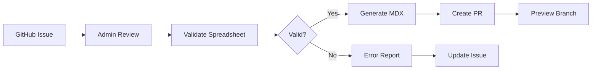

# Vocabulary Management Implementation Plan 2025

**Version:** 1.0  
**Date:** January 2025  
**Status:** Current Implementation Guide

## Overview

This document provides the current implementation plan for the IFLA vocabulary management system within the admin portal. It reflects the actual architecture using Render.com for deployment, Next.js 15.4.4 with App Router, and Clerk authentication with custom RBAC.

## Current Technology Stack

### Core Technologies
- **Framework**: Next.js 15.4.4 with App Router
- **Runtime**: Node.js 20+
- **UI Library**: Material-UI (MUI) with custom IFLA theme
- **Styling**: Tailwind CSS + shadcn/ui components
- **Type System**: TypeScript 5.8.3
- **Package Manager**: pnpm 10.12.4

### Services & Deployment
- **Hosting**: Render.com (NOT Vercel)
  - Preview: https://admin-iflastandards-preview.onrender.com
  - Production: https://admin.iflastandards.info
- **API**: Render API endpoints (standard Next.js API routes)
- **Authentication**: Clerk with session management
- **Authorization**: Custom RBAC using Clerk publicMetadata (NOT Clerk Organizations)
- **Database**: Supabase (PostgreSQL) for operational data
- **Version Control**: Git/GitHub as source of truth

### Development Tools
- **Monorepo**: Nx 21.2.2
- **Build Optimization**: Nx Cloud
- **Testing**: Vitest + Playwright
- **CI/CD**: GitHub Actions

## Architecture Overview

### Data Storage Strategy

```yaml
Git (Primary Source of Truth):
  - Vocabulary content (MDX files)
  - DCTAP profiles
  - Configuration
  - Policies

GitHub:
  - Issues and PRs
  - Project boards
  - Releases and tags
  - Team management

Clerk:
  - User authentication
  - User profiles
  - Custom RBAC via publicMetadata

Supabase (Operational):
  - Import job tracking
  - Validation results
  - Activity logs
  - Temporary processing data

Google Sheets (Temporary):
  - Bulk editing workspace
  - Translation workflows
```

## Core Vocabulary Workflows

### 1. Four-Phase Vocabulary Lifecycle

#### Phase 1: Bootstrap (Cycle Kick-off)
- Admin initiates new editorial cycle
- Exports current vocabulary from Git to Google Sheets
- Team performs bulk updates in spreadsheet
- Import validates and creates MDX files with embedded RDF

#### Phase 2: Daily Editing
- Direct MDX editing via Git
- TinaCMS integration (planned) for prose editing
- Form-based RDF metadata editing
- Real-time DCTAP validation

#### Phase 3: Nightly Assembly
- Automated builds via GitHub Actions
- Validation against DCTAP profiles
- Semantic versioning suggestions
- Impact report generation

#### Phase 4: Publication
- Review impact reports
- Confirm version numbers
- Merge to main branch
- Automatic deployment to production

### 2. Import Workflow



## Implementation Structure

### Current File Organization

```
apps/admin/src/
├── app/
│   ├── api/                      # Next.js API routes
│   │   ├── auth/                 # Clerk webhooks
│   │   ├── vocabularies/         # Vocabulary operations
│   │   ├── import/               # Import endpoints
│   │   └── health/               # Health checks
│   │
│   ├── dashboard/
│   │   ├── page.tsx              # Main dashboard
│   │   ├── layout.tsx            # Dashboard layout
│   │   ├── vocabularies/         # Vocabulary management
│   │   ├── import/               # Import UI
│   │   └── settings/             # User settings
│   │
│   └── layout.tsx                # Root layout with Clerk
│
├── components/
│   ├── ui/                       # shadcn/ui components
│   ├── vocabulary/               # Vocabulary-specific
│   ├── import/                   # Import workflow
│   └── common/                   # Shared components
│
├── lib/
│   ├── auth/                     # Clerk configuration
│   ├── rbac/                     # Custom RBAC logic
│   ├── github/                   # GitHub API client
│   ├── supabase/                 # Supabase client
│   └── validation/               # DCTAP validation
│
└── types/
    ├── vocabulary.ts             # Vocabulary types
    ├── user.ts                   # User/role types
    └── import.ts                 # Import workflow types
```

## Authentication & Authorization

### Clerk Configuration

```typescript
// Custom RBAC using Clerk publicMetadata
interface UserPublicMetadata {
  iflaRole?: 'superadmin' | 'admin' | 'editor' | 'reviewer' | 'translator';
  reviewGroups?: string[];
  namespacePermissions?: {
    [namespace: string]: ('read' | 'write' | 'admin')[];
  };
}
```

### Role Hierarchy

1. **Superadmin**: Full system access
2. **Review Group Admin**: Manage specific review groups
3. **Namespace Admin**: Manage specific namespaces
4. **Editor**: Edit vocabulary content
5. **Reviewer**: Review and approve changes
6. **Translator**: Translate content

## API Endpoints (Render)

### Standard Next.js App Router API Routes

```typescript
// apps/admin/src/app/api/vocabularies/route.ts
export async function GET(request: Request) {
  // List vocabularies
}

export async function POST(request: Request) {
  // Create vocabulary
}

// apps/admin/src/app/api/import/route.ts
export async function POST(request: Request) {
  // Handle import from spreadsheet
}
```

## Key Components

### 1. Vocabulary Dashboard

```typescript
interface VocabularyDashboardProps {
  namespace: string;
  userRole: UserRole;
}

// Features:
// - Current version display
// - Editorial cycle status
// - Recent activity feed
// - Quick actions based on role
```

### 2. Import Wizard

```typescript
const importSteps = [
  'Source Selection',     // GitHub issue or direct upload
  'Data Preview',        // Show spreadsheet data
  'Validation',          // DCTAP validation results
  'Review Changes',      // Diff view of changes
  'Confirm Import'       // Final confirmation
];
```

### 3. DCTAP Validation

```typescript
interface ValidationResult {
  level: 'error' | 'warning' | 'info';
  row: number;
  column: string;
  message: string;
  constraint: string;
}
```

## Implementation Priorities

### Phase 1: Core Infrastructure ✅ (Completed)
- [x] Next.js admin app setup
- [x] Clerk authentication integration
- [x] Basic routing structure
- [x] MUI theme configuration

### Phase 2: Basic Operations (Current)
- [ ] User management UI
- [ ] Role assignment interface
- [ ] Namespace listing
- [ ] Basic vocabulary CRUD

### Phase 3: Import Workflow
- [ ] GitHub issue integration
- [ ] Spreadsheet upload
- [ ] DCTAP validation UI
- [ ] Import preview
- [ ] Error handling

### Phase 4: Advanced Features
- [ ] Batch operations
- [ ] Translation management
- [ ] Version comparison
- [ ] Activity tracking

## Testing Strategy

### Unit Tests (Vitest)
- Component testing
- API route testing
- Validation logic
- RBAC rules

### Integration Tests
- Import workflow
- GitHub API integration
- Clerk webhooks
- Supabase operations

### E2E Tests (Playwright)
- Complete import flow
- Role-based access
- Vocabulary editing
- Publication workflow

## Performance Considerations

### Optimization Strategies
- Server-side rendering for initial load
- Client-side caching with SWR
- Incremental static regeneration
- API route caching with Render

### Monitoring
- Render analytics
- Custom performance metrics
- Error tracking with Sentry
- User activity logging

## Security Requirements

### Data Protection
- All API routes require authentication
- Role-based access control on all operations
- Audit logging for sensitive operations
- Input validation and sanitization

### Compliance
- GDPR compliance for user data
- Secure token handling
- HTTPS everywhere
- Regular security audits

## Development Workflow

### Local Development
```bash
# Start development server
pnpm nx dev admin --turbopack

# Run tests
pnpm nx test admin

# Type checking
pnpm nx typecheck admin
```

### Deployment
```bash
# Preview deployment (automatic on push to preview branch)
git push origin preview

# Production deployment (via PR to main)
git checkout -b feature/my-feature
git push origin feature/my-feature
# Create PR to main
```

## Environment Variables

```env
# Authentication
CLERK_SECRET_KEY=
NEXT_PUBLIC_CLERK_PUBLISHABLE_KEY=

# Database
SUPABASE_URL=
SUPABASE_ANON_KEY=

# GitHub
GITHUB_TOKEN=
GITHUB_ORG=

# Google Sheets
GOOGLE_SHEETS_API_KEY=

# Deployment
RENDER_EXTERNAL_URL=
NODE_ENV=
DOCS_ENV=
```

## Migration from Legacy System

### Data Migration Strategy
1. Export existing vocabularies to standardized format
2. Validate against DCTAP profiles
3. Generate MDX files with frontmatter
4. Import to Git repository
5. Verify in preview environment
6. Deploy to production

### User Migration
1. Create Clerk accounts for existing users
2. Map legacy roles to new RBAC system
3. Assign namespace permissions
4. Send invitation emails
5. Provide training materials

## Future Enhancements

### Planned Features
- TinaCMS integration for WYSIWYG editing
- AI-powered content suggestions
- Real-time collaboration
- Advanced versioning UI
- GraphQL API layer

### Infrastructure Evolution
- Consider microservices for heavy processing
- Evaluate edge computing for global performance
- Implement event-driven architecture
- Add WebSocket support for real-time updates

## References

### Documentation
- [System Architecture](../system-design-docs/01-system-architecture-overview.md)
- [RBAC Model](../system-design-docs/12-rbac-authorization-model.md)
- [Data Architecture](../system-design-docs/02-data-architecture.md)
- [CLAUDE.md](../CLAUDE.md) - Development guidelines

### External Resources
- [Next.js 15 Documentation](https://nextjs.org/docs)
- [Clerk Documentation](https://clerk.com/docs)
- [Render Documentation](https://render.com/docs)
- [MUI Documentation](https://mui.com/)

---

This document reflects the current state of the vocabulary management system and should be updated as implementation progresses.