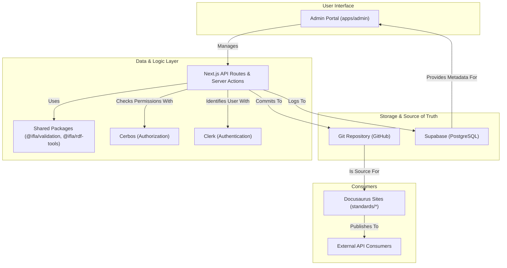

# **Project Specification: OMR25 Vocabulary Management Integration**

**Version:** 1.0
**Date:** 2025-07-17
**Status:** Final

## **1. Executive Summary**

This document outlines the specification for integrating the feature-rich OMR25 vocabulary management system into the existing IFLA Standards Platform. The core strategy is to enhance the `apps/admin` Next.js application to serve as the central hub for all vocabulary lifecycle tasks, from import and validation to versioning and publication.

This approach leverages the modern, scalable Nx monorepo architecture while incorporating the robust, user-centric workflows defined in the OMR25 specification. The Docusaurus sites will continue to be the public-facing documentation layer, consuming the versioned, validated data managed through the new admin portal interfaces.

---

## **2. Requirements**

### **2.1 Core Vocabulary Management**

*   **User Story:** As an Editor, I want to import a vocabulary from a spreadsheet, so that I can efficiently perform bulk updates to structured data.
    *   **Acceptance Criteria (EARS):**
        *   WHEN an editor uploads a valid spreadsheet and confirms the import, THEN the system SHALL parse the data, create or update the corresponding vocabulary files in the Git repository, and display a success message with a link to the changes.
        *   WHEN an editor uploads a spreadsheet with validation errors, THEN the system SHALL reject the import, display a detailed error report linking errors to specific rows and columns, and NOT modify any vocabulary files.

*   **User Story:** As an Editor, I want to edit vocabulary terms and their properties through a user-friendly interface, so that I can make precise changes without editing raw RDF.
    *   **Acceptance Criteria (EARS):**
        *   WHEN an editor modifies a term in the vocabulary form and clicks "Save", THEN the system SHALL validate the changes against the DCTAP profile, update the corresponding MDX front matter in Git, and provide immediate visual confirmation.

*   **User Story:** As an Administrator, I want to manage DCTAP validation profiles for each project, so that we can enforce data quality standards.
    *   **Acceptance Criteria (EARS):**
        *   WHEN an administrator uploads a new DCTAP profile for a project, THEN the system SHALL store it and make it available for all subsequent vocabulary validation within that project.

### **2.2 Versioning and Publication Workflows**

*   **User Story:** As an Editor, I want to create a new version of a vocabulary, so that I can publish a stable, citable release of our standard.
    *   **Acceptance Criteria (EARS):**
        *   WHEN an editor initiates the "Publish Version" workflow, THEN the system SHALL display a summary of changes, suggest a semantic version number, and await confirmation.
        *   WHEN an editor confirms the publication, THEN the system SHALL generate the final RDF artifacts, create a corresponding GitHub Release and tag, and update the vocabulary's status to "Published".

*   **User Story:** As a Vocabulary Consumer, I want to view the change history between two versions, so that I can understand the evolution of a standard.
    *   **Acceptance Criteria (EARS):**
        *   WHEN a user selects two versions to compare, THEN the system SHALL display a diff view highlighting added, modified, and removed terms and properties.

### **2.3 Translation Management**

*   **User Story:** As a Translator, I want a dedicated workspace to translate vocabulary terms and definitions, so that I can work efficiently without needing to understand the underlying data structure.
    *   **Acceptance Criteria (EARS):**
        *   WHEN a translator navigates to the translation workspace for a specific language, THEN the system SHALL display a table of source terms and their corresponding empty or existing translations.
        *   WHEN a translator saves their changes, THEN the system SHALL store the translations in a structured format associated with the vocabulary, ready for the next publication cycle.

### **2.4 Batch Operations**

*   **User Story:** As an Administrator, I want to export multiple vocabularies from a namespace into a single workbook, so that I can perform offline reviews or backups.
    *   **Acceptance Criteria (EARS):**
        *   WHEN an administrator selects several vocabularies and triggers a batch export, THEN the system SHALL generate a multi-sheet Excel file and provide it as a download.

### **2.5 Integration with Docusaurus Sites**

*   **User Story:** As a Documentation Author, I want the public-facing Docusaurus sites to automatically reflect the latest published vocabulary data, so that the documentation is always synchronized with the standard.
    *   **Acceptance Criteria (EARS):**
        *   WHEN a new vocabulary version is published, THEN the Docusaurus site's build process SHALL automatically use the new data to generate its pages.

---

## **3. Design**

### **3.1 System Architecture**

The OMR25 features will be implemented primarily within the `apps/admin` Next.js application. This application will serve as the command-and-control center for the entire vocabulary lifecycle.



### **3.2 Database Schema Extensions (Supabase)**

The following tables will be added to the Supabase PostgreSQL database to support vocabulary management workflows.

```sql
-- Stores the state and history of vocabulary import jobs
CREATE TABLE "VocabularyImportJobs" (
    "id" UUID PRIMARY KEY DEFAULT gen_random_uuid(),
    "namespaceId" TEXT NOT NULL,
    "status" TEXT NOT NULL CHECK (status IN ('pending', 'processing', 'completed', 'failed')),
    "sourceType" TEXT NOT NULL CHECK (sourceType IN ('google_sheet', 'file_upload')),
    "sourceUrl" TEXT,
    "triggeredBy" UUID REFERENCES auth.users(id),
    "validationReportId" UUID,
    "createdAt" TIMESTAMP WITH TIME ZONE DEFAULT timezone('utc'::text, now()),
    "completedAt" TIMESTAMP WITH TIME ZONE
);

-- Stores detailed results from DCTAP validation checks
CREATE TABLE "ValidationReports" (
    "id" UUID PRIMARY KEY DEFAULT gen_random_uuid(),
    "importJobId" UUID REFERENCES "VocabularyImportJobs"(id),
    "summary" JSONB NOT NULL, -- { errors: 5, warnings: 10 }
    "results" JSONB NOT NULL, -- Array of detailed error/warning objects
    "createdAt" TIMESTAMP WITH TIME ZONE DEFAULT timezone('utc'::text, now())
);

-- Tracks the lifecycle of a vocabulary version from start to publication
CREATE TABLE "EditorialCycles" (
    "id" UUID PRIMARY KEY DEFAULT gen_random_uuid(),
    "namespaceId" TEXT NOT NULL,
    "targetVersion" TEXT NOT NULL, -- e.g., "1.3.0"
    "status" TEXT NOT NULL CHECK (status IN ('draft', 'review', 'published')),
    "startedBy" UUID REFERENCES auth.users(id),
    "startedAt" TIMESTAMP WITH TIME ZONE DEFAULT timezone('utc'::text, now()),
    "publishedAt" TIMESTAMP WITH TIME ZONE
);
```

### **3.3 API Endpoints**

All endpoints are prefixed with `/admin/api/v1` and require authentication. Authorization is checked via Cerbos.

| Method | Endpoint                               | Description                                       | Required Role      |
| :----- | :------------------------------------- | :------------------------------------------------ | :----------------- |
| `POST` | `/import/spreadsheet`                  | Kicks off a new vocabulary import job.            | `editor`           |
| `GET`  | `/import/jobs/:jobId`                  | Retrieves the status and results of an import job.| `editor`           |
| `GET`  | `/vocabularies/:vocabId`               | Gets detailed information for a vocabulary.       | `viewer`           |
| `PUT`  | `/vocabularies/:vocabId`               | Updates a vocabulary's terms or properties.       | `editor`           |
| `POST` | `/vocabularies/:vocabId/publish`       | Initiates the publication workflow for a version. | `admin`            |
| `GET`  | `/vocabularies/:vocabId/versions`      | Lists all published versions of a vocabulary.     | `viewer`           |
| `GET`  | `/vocabularies/:vocabId/compare`       | Compares two versions of a vocabulary.            | `viewer`           |
| `POST` | `/batch/export`                        | Exports multiple vocabularies to a single file.   | `editor`           |

### **3.4 UI Components**

The following new MUI-based components will be created within `apps/admin/src/components/`:

*   **`vocabulary/SpreadsheetImportWizard.tsx`**: A multi-step component (MUI Stepper) guiding users through the import process.
*   **`vocabulary/ValidationReportViewer.tsx`**: A component to display validation errors and warnings in a structured, user-friendly format.
*   **`vocabulary/RdfEditorForm.tsx`**: A dynamic form for editing vocabulary term properties based on the DCTAP profile.
*   **`vocabulary/VersionTimeline.tsx`**: A visual timeline of a vocabulary's publication history.
*   **`vocabulary/PublicationModal.tsx`**: A dialog to confirm and manage the publication of a new version.
*   **`translation/TranslationWorkspace.tsx`**: A side-by-side editor for translating vocabulary terms.

### **3.5 Data Flow**

1.  **Import**: An Editor uploads a spreadsheet to the **Admin Portal**. The file is sent to a Next.js API Route.
2.  **Processing**: The API route creates an `VocabularyImportJobs` record in Supabase and triggers a background job (e.g., GitHub Action).
3.  **Validation**: The job fetches the data, validates it using `@ifla/validation`, and stores the results in the `ValidationReports` table.
4.  **Storage**: If valid, the job converts the data into MDX files with RDF front matter and commits them to the **Git Repository**.
5.  **Publication**: An Admin triggers the publish API. The system generates final RDF artifacts from the Git source and creates a **GitHub Release**.
6.  **Consumption**: The **Docusaurus sites'** build process reads the versioned data directly from the Git repository to generate static HTML pages.

### **3.6 Integration Points**

*   **Clerk (Authentication)**: User identity and roles from `user.publicMetadata` will be used to construct the principal object for Cerbos checks.
*   **Cerbos (Authorization)**: New policy files (`vocabulary.cerbos`, `import.cerbos`) will be created. All API endpoints will be protected by a middleware that calls the Cerbos client.
*   **GitHub (Storage & CI/CD)**: The primary storage for vocabulary source files. The application will use an authenticated Octokit client to commit changes. GitHub Actions will run background jobs for import and publication.
*   **Supabase (Database)**: Used for storing job statuses, validation reports, and audit trails related to the vocabulary lifecycle.

---

## **4. Implementation Plan**

### **Phase 1: Core Vocabulary Management Infrastructure**

*Goal: Establish the foundational components for managing vocabularies.*

1.  **Task 1.1 (DB Schema):** Implement the Supabase schema extensions (`VocabularyImportJobs`, `ValidationReports`, `EditorialCycles`).
2.  **Task 1.2 (API Scaffolding):** Create the basic CRUD API endpoints for vocabularies (`/api/v1/vocabularies`). Protect them with Cerbos policies allowing admin access.
3.  **Task 1.3 (Shared Packages):** Create new shared packages: `@ifla/validation` for DCTAP logic and `@ifla/rdf-tools` for RDF parsing/serialization.
4.  **Task 1.4 (UI Placeholders):** Build the main vocabulary management page in the admin portal with a placeholder table to list vocabularies.
5.  **Testing:** Unit tests for new shared packages. API integration tests for the vocabulary endpoints.

### **Phase 2: Spreadsheet Import and Validation**

*Goal: Implement the complete spreadsheet import and validation workflow.*

1.  **Task 2.1 (Import API):** Develop the `/api/v1/import/spreadsheet` endpoint and the background job logic.
    *   *Dependency: Task 1.1, 1.3*
2.  **Task 2.2 (UI Wizard):** Build the `SpreadsheetImportWizard.tsx` component.
    *   *Dependency: Task 2.1*
3.  **Task 2.3 (Validation UI):** Build the `ValidationReportViewer.tsx` component to display results from the API.
    *   *Dependency: Task 2.1*
4.  **Task 2.4 (Git Integration):** Implement the logic to commit validated data as MDX files to the GitHub repository.
5.  **Testing:** E2E test for the entire import flow, from spreadsheet upload to Git commit. Unit tests for the validation and data conversion logic.

### **Phase 3: Publication and Versioning Workflows**

*Goal: Enable users to version and publish vocabularies.*

1.  **Task 3.1 (Publish API):** Implement the `/api/v1/vocabularies/:vocabId/publish` endpoint and its associated background job.
2.  **Task 3.2 (GitHub Release):** Integrate with the GitHub API to create releases and tags upon publication.
    *   *Dependency: Task 3.1*
3.  **Task 3.3 (UI Components):** Build the `PublicationModal.tsx` and `VersionTimeline.tsx` components.
4.  **Task 3.4 (Docusaurus Integration):** Ensure the Docusaurus build process can read the versioned data from the repository.
5.  **Testing:** E2E test for the publication workflow. Integration tests for GitHub Release creation.

### **Phase 4: Translation and Batch Operations**

*Goal: Add advanced features for multilingual support and efficiency.*

1.  **Task 4.1 (Translation Data Model):** Extend the data model to store translations associated with vocabulary terms.
2.  **Task 4.2 (Translation UI):** Build the `TranslationWorkspace.tsx` component.
3.  **Task 4.3 (Batch Export API):** Implement the `/api/v1/batch/export` endpoint.
4.  **Task 4.4 (Batch UI):** Add UI elements to the admin portal to trigger and monitor batch operations.
5.  **Testing:** Component tests for the translation workspace. API tests for batch operations.

---

## **5. Technical Constraints & OMR25 Feature Implementation**

*   **Nx Monorepo:** All new code, including shared packages (`@ifla/validation`, `@ifla/rdf-tools`), will be structured as libraries within the existing Nx workspace to ensure consistent tooling and dependency management.
*   **Clerk & Cerbos:** The existing authentication and authorization patterns will be strictly followed. New Cerbos policies will be added to govern access to vocabulary management features.
*   **Docusaurus Compatibility:** The data format for vocabularies (MDX with RDF front matter) will be designed for seamless consumption by the existing Docusaurus build process. No changes to the Docusaurus sites themselves should be required initially.
*   **Data Storage:** The implementation will adhere to the established strategy: Git for source-of-truth content, Supabase for transactional/log data, and Clerk for user/team metadata.

### **OMR25 Feature Implementation Details:**

*   **Vocabulary Import/Export:** Implemented via the `SpreadsheetImportWizard` and the `/api/v1/import/spreadsheet` endpoint. Export will be handled by a similar workflow.
*   **Multi-format Support:** The `@ifla/rdf-tools` package will contain libraries for converting the internal JSON representation to various RDF serializations (Turtle, JSON-LD, etc.) during the publication phase.
*   **Validation and Error Handling:** The `@ifla/validation` package will house the core DCTAP validation logic. The `ValidationReportViewer` component will provide user-friendly error feedback.
*   **Version Control:** Git remains the core of version control. The system will orchestrate commits and tags, with GitHub Releases serving as the official record of a published version.
*   **Publication Pipelines:** Implemented as GitHub Actions triggered by the `/api/v1/.../publish` endpoint, ensuring a decoupled and robust release process.
*   **Translation Management:** Handled via the dedicated `TranslationWorkspace` UI, which will read and write translation data to a structured format within the Git repository.
*   **Batch Processing:** Implemented as asynchronous jobs, allowing administrators to trigger long-running operations without blocking the UI.

---

## **6. Definition of Done**

The project will be considered complete when all of the following criteria are met:

*   **Functionality:** All user stories and acceptance criteria outlined in the Requirements section (2) for all four implementation phases are successfully implemented and deployed.
*   **Integration:**
    *   The new vocabulary management UI is fully integrated and accessible within the `/admin` portal.
    *   Authentication and authorization are correctly enforced for all new UI components and API endpoints using the existing Clerk and Cerbos infrastructure.
    *   Published vocabularies are successfully consumed by the Docusaurus sites, with pages rendering the correct versioned data after a new build is triggered.
*   **Testing:**
    *   Unit test coverage for the new shared packages (`@ifla/validation`, `@ifla/rdf-tools`) exceeds 80%.
    *   API integration tests exist for every new endpoint.
    *   End-to-end Playwright tests for the critical user workflows (spreadsheet import, term editing, and vocabulary publication) are passing reliably in the CI pipeline.
*   **Documentation:**
    *   Administrator documentation is created, explaining how to use the new vocabulary management features.
    *   Technical documentation for the new APIs and shared packages is completed.

---

## **7. Success Metrics**

The success of this project will be measured by the following key performance indicators (KPIs), evaluated 3 months post-launch:

*   **Efficiency Gain:** A 50% reduction in the median time required to perform a bulk vocabulary update and publish a new version, as measured against the previous manual workflow.
*   **Adoption Rate:** At least two (2) IFLA Review Groups are actively using the new system for their vocabulary management.
*   **Data Quality Improvement:** A 95% first-pass success rate for spreadsheet validations submitted by trained editors, indicating the clarity and effectiveness of the validation feedback loop.
*   **User Satisfaction:** A Net Promoter Score (NPS) of +20 or higher from a feedback survey sent to all active editors and administrators of the new system.

---

## **8. Risks and Mitigation**

*   **Risk 1: Performance Degradation**
    *   **Description:** The complexity of real-time validation and RDF generation could slow down the admin portal or significantly increase build times.
    *   **Mitigation:** All computationally intensive tasks (spreadsheet parsing, validation, RDF generation) will be offloaded to asynchronous background jobs (GitHub Actions). The UI will poll for status updates, ensuring the user experience remains responsive. We will leverage Nx's caching capabilities to avoid re-processing unchanged data.

*   **Risk 2: Data Model Complexity**
    *   **Description:** The hybrid data storage model (Git for source-of-truth content, Supabase for logs/jobs) could lead to synchronization issues or data integrity problems.
    *   **Mitigation:** The system will be designed with Git as the ultimate single source of truth for all vocabulary content. Supabase will only store transient state (like job status) and metadata. All background jobs will be designed to be idempotent and transactional to prevent partial updates.

*   **Risk 3: Scope Creep**
    *   **Description:** The feature set is extensive, and there is a risk of stakeholders requesting additional features before the core functionality is stable.
    *   **Mitigation:** The phased implementation plan will be strictly followed. Any feature requests outside the scope of this specification will be added to a backlog for consideration as a separate, future project, ensuring the core deliverables are met on schedule.

---

## **9. Out of Scope**

The following items are explicitly considered out of scope for this project to ensure a focused and timely delivery:

*   **In-App Spreadsheet Editor:** A full-featured, real-time collaborative spreadsheet editor (e.g., EtherCalc) will not be built into the admin portal. Users will continue to use Google Sheets or desktop Excel for bulk editing.
*   **Direct RDF Editing:** The system will not provide an interface for directly editing the final RDF artifacts. All changes must originate from the structured data source (MDX front matter) to ensure consistency and validation.
*   **Historical Data Migration:** This project does not include the migration of vocabulary data from any pre-existing legacy systems. A separate project will be defined for this purpose if required.
*   **Public-Facing API for Third Parties:** While the system uses internal APIs, a publicly documented and supported API for third-party consumption is not part of this initial implementation.
