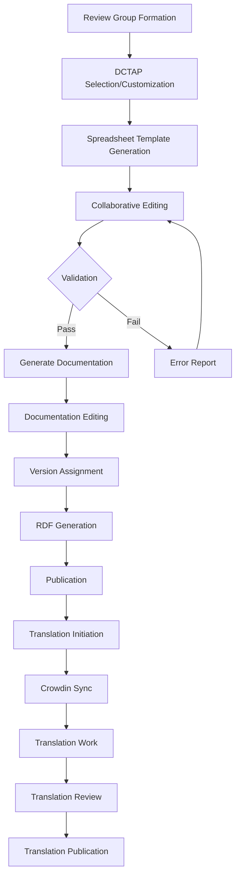
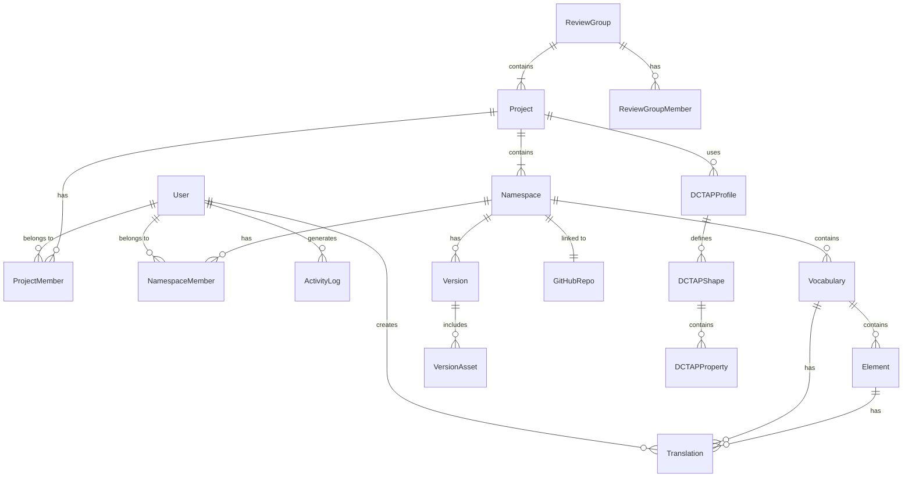

# Product Requirements Document: IFLA Standards Platform

**Version:** 1.0  
**Date:** January 2025  
**Status:** Draft  
**Authors:** IFLA Standards Development Team

## Table of Contents

1. [Executive Summary](#executive-summary)
2. [Product Overview](#product-overview)
3. [Goals and Objectives](#goals-and-objectives)
4. [User Personas](#user-personas)
5. [Core Features](#core-features)
6. [User Stories and Requirements](#user-stories-and-requirements)
7. [Technical Architecture](#technical-architecture)
8. [Workflow Specifications](#workflow-specifications)
9. [Data Model](#data-model)
10. [Security and Authorization](#security-and-authorization)
11. [Integration Requirements](#integration-requirements)
12. [User Interface Requirements](#user-interface-requirements)
13. [Performance Requirements](#performance-requirements)
14. [Success Metrics](#success-metrics)
15. [Implementation Phases](#implementation-phases)
16. [Risks and Mitigation](#risks-and-mitigation)
17. [Appendices](#appendices)

---

## 1. Executive Summary

The IFLA Standards Platform is a comprehensive digital infrastructure designed to modernize the creation, management, and publication of IFLA (International Federation of Library Associations) standards and their associated vocabularies. The platform will provide review groups with tools for collaborative documentation, vocabulary development, version control, and multilingual translation management.

### Key Deliverables
- **Admin Portal**: Web-based management interface for standards development
- **Documentation Sites**: Docusaurus-powered sites for each standard
- **Vocabulary Management**: RDF-based vocabulary creation and publication
- **Translation Workflow**: Integrated multilingual support via Crowdin
- **API Services**: RESTful APIs for vocabulary access and management

### Target Users
- IFLA Review Group administrators and members
- Standards editors and authors
- Translators
- Vocabulary consumers (via API)

---

## 2. Product Overview

### 2.1 Problem Statement

IFLA standards development currently faces several challenges:
- Fragmented tools and workflows across review groups
- Manual processes for vocabulary creation and RDF generation
- Limited collaboration capabilities for distributed teams
- Inconsistent documentation formats across standards
- Complex translation management
- No centralized version control for vocabularies

### 2.2 Solution Overview

The IFLA Standards Platform provides:
- **Centralized Management**: Single admin portal for all standards activities
- **Automated Workflows**: From spreadsheet to published RDF vocabularies
- **Collaborative Tools**: GitHub-based version control and review processes
- **Standardized Documentation**: Consistent Docusaurus sites for all standards
- **Integrated Translation**: Streamlined multilingual content management
- **API-First Design**: Machine-readable vocabularies with content negotiation

### 2.3 Key Innovations

1. **DCTAP-Driven Development**: Using Dublin Core Tabular Application Profiles for vocabulary validation
2. **Documentation as Source of Truth**: RDF embedded in documentation front matter
3. **Hybrid Versioning**: Independent versioning for documentation and vocabularies
4. **Service Account Architecture**: Privacy-focused Google Sheets integration
5. **Content Negotiation**: Same URIs serve both human and machine consumers

---

## 3. Goals and Objectives

### 3.1 Primary Goals

1. **Streamline Standards Development**
   - Reduce time from concept to publication by 50%
   - Eliminate manual RDF generation errors
   - Improve collaboration efficiency

2. **Ensure Quality and Consistency**
   - Validate all vocabularies against DCTAP profiles
   - Maintain consistent documentation structure
   - Provide comprehensive audit trails

3. **Enable Global Accessibility**
   - Support 10+ languages through integrated translation
   - Provide machine-readable vocabularies
   - Ensure mobile-responsive interfaces

### 3.2 Success Criteria

- 100% of new IFLA standards use the platform within 2 years
- 90% user satisfaction rating from review groups
- < 5 minute average time to generate vocabularies from spreadsheets
- 99.9% uptime for published vocabularies

---

## 4. User Personas

### 4.1 Sarah - Review Group Administrator
- **Role**: Manages ISBD Review Group
- **Goals**: Coordinate team efforts, ensure quality, publish on schedule
- **Pain Points**: Managing multiple tools, tracking versions, coordinating translations
- **Needs**: Centralized dashboard, clear workflows, team management tools

### 4.2 Michael - Standards Editor
- **Role**: Creates and edits vocabulary content
- **Goals**: Efficiently create accurate vocabularies, validate against profiles
- **Pain Points**: Manual RDF generation, spreadsheet validation, version control
- **Needs**: Import/export tools, validation feedback, preview capabilities

### 4.3 Elena - Translator
- **Role**: Translates standards into Spanish
- **Goals**: Accurate translations, maintain context, track progress
- **Pain Points**: Understanding technical terms, version synchronization
- **Needs**: Context-aware translation interface, glossaries, version locking

### 4.4 David - Vocabulary Consumer
- **Role**: Developer implementing library systems
- **Goals**: Access current vocabularies, integrate via API
- **Pain Points**: Finding authoritative sources, format inconsistencies
- **Needs**: Stable URIs, content negotiation, comprehensive documentation

### 4.5 Admin - System Administrator
- **Role**: Platform maintenance and user management
- **Goals**: Ensure system stability, manage permissions, monitor usage
- **Pain Points**: Complex permission structures, system monitoring
- **Needs**: Admin tools, audit logs, performance dashboards

---

## 5. Core Features

### 5.1 Authentication & Authorization
- **GitHub OAuth Integration**: Single sign-on via GitHub
- **Role-Based Access Control**: Hierarchical permissions model
- **Team Management**: Project and namespace-level teams
- **Audit Logging**: Comprehensive activity tracking

### 5.2 Project & Namespace Management
- **Project Creation**: GitHub organization integration
- **Namespace Configuration**: Repository linking and DCTAP selection
- **Team Assignment**: Role-based team membership
- **Visibility Controls**: Public/private namespace options

### 5.3 Vocabulary Development
- **Spreadsheet Import**: Google Sheets integration with validation
- **DCTAP Validation**: Real-time error checking and suggestions
- **Page Generation**: Automated Docusaurus page creation
- **RDF Management**: Front matter-based RDF storage

### 5.4 Documentation Management
- **Template System**: Customizable page templates
- **Version Control**: Git-based tracking
- **Preview System**: Branch-based previews
- **Search Integration**: Full-text search capabilities

### 5.5 Translation Workflow
- **Crowdin Integration**: Professional translation platform
- **Version Locking**: Translations tied to specific versions
- **Progress Tracking**: Real-time translation status
- **Quality Assurance**: Review and approval workflows

### 5.6 Publishing & Distribution
- **Version Creation**: Semantic versioning for vocabularies
- **RDF Generation**: Multi-format export (Turtle, RDF/XML, JSON-LD)
- **Content Negotiation**: Format selection via HTTP headers
- **Release Management**: GitHub releases integration

### 5.7 Collaboration Tools
- **GitHub Issues**: Integrated issue tracking
- **Pull Requests**: Review workflows for changes
- **Notifications**: Email and in-app alerts
- **Activity Feeds**: Real-time updates

### 5.8 Administrative Tools
- **User Management**: Add, remove, and modify user roles
- **System Monitoring**: Performance and usage metrics
- **Backup & Recovery**: Automated backup procedures
- **Configuration Management**: System-wide settings

---

## 6. User Stories and Requirements

### 6.1 Authentication & Onboarding

**US-001**: As a new user, I want to sign in with my GitHub account so that I don't need to manage another password.
- **Acceptance Criteria**:
  - GitHub OAuth login available on landing page
  - First-time users see onboarding flow
  - Existing users directed to appropriate dashboard

**US-002**: As a first-time user without projects, I want to understand how to get started so that I can begin using the platform.
- **Acceptance Criteria**:
  - Welcome page explains platform purpose
  - Clear instructions for joining or creating projects
  - Contact information for assistance

### 6.2 Project Management

**US-010**: As a Review Group Admin, I want to create a new project so that my team can begin developing a standard.
- **Acceptance Criteria**:
  - Create project with GitHub org validation
  - Set project visibility (public/private)
  - Create initial namespace automatically
  - Invite initial team members

**US-011**: As a Review Group Admin, I want to manage team members so that I can control access to project resources.
- **Acceptance Criteria**:
  - Add/remove team members
  - Assign roles (admin, editor, author, translator)
  - View team member activity
  - Bulk import members

### 6.3 Vocabulary Development

**US-020**: As an Editor, I want to import vocabularies from a spreadsheet so that I can quickly scaffold documentation.
- **Acceptance Criteria**:
  - Upload or link Google Sheets
  - Validate against selected DCTAP
  - Preview generated pages
  - Choose dry-run or direct import
  - Receive error reports for validation failures

**US-021**: As an Editor, I want to edit vocabulary elements so that I can refine definitions and add examples.
- **Acceptance Criteria**:
  - Edit element properties
  - Add usage examples
  - Include references
  - Preview RDF output
  - Track change history

**US-022**: As an Author, I want to edit documentation pages so that I can provide comprehensive guidance.
- **Acceptance Criteria**:
  - WYSIWYG or markdown editing
  - Insert code examples
  - Add images and diagrams
  - Cross-reference other elements
  - Save drafts

### 6.4 Version Management

**US-030**: As an Editor, I want to create a new version so that I can publish a stable release.
- **Acceptance Criteria**:
  - Assign semantic version number
  - Add release notes
  - Generate RDF files
  - Create GitHub release
  - Notify subscribers

**US-031**: As a user, I want to compare versions so that I can understand what changed.
- **Acceptance Criteria**:
  - Side-by-side comparison view
  - Highlight additions/deletions
  - Filter by change type
  - Export change summary

### 6.5 Translation Management

**US-040**: As a Translator, I want to see untranslated content so that I know what needs work.
- **Acceptance Criteria**:
  - Filter by language and status
  - See source text with context
  - Access terminology glossary
  - Track personal progress

**US-041**: As a Review Group Admin, I want to manage translation workflows so that quality is maintained.
- **Acceptance Criteria**:
  - Assign translators to languages
  - Set up review processes
  - Track overall progress
  - Approve final translations

### 6.6 Publishing and API Access

**US-050**: As a Vocabulary Consumer, I want to access vocabularies via API so that I can integrate them into my applications.
- **Acceptance Criteria**:
  - RESTful API endpoints
  - Content negotiation support
  - CORS headers configured
  - Rate limiting implemented
  - API documentation available

---

## 7. Technical Architecture

### 7.1 System Architecture

```
┌─────────────────────────────────────────────────────────────┐
│                        Users                                 │
├─────────────────────────────────────────────────────────────┤
│                                                             │
│  ┌─────────────┐  ┌──────────────┐  ┌─────────────────┐  │
│  │   Browser   │  │ Mobile App   │  │  API Clients    │  │
│  └──────┬──────┘  └──────┬───────┘  └────────┬────────┘  │
│         │                 │                    │           │
├─────────┴─────────────────┴────────────────────┴───────────┤
│                     Load Balancer                           │
├─────────────────────────────────────────────────────────────┤
│                                                             │
│  ┌─────────────────────┐  ┌─────────────────────────────┐ │
│  │   Admin Portal      │  │   Docusaurus Sites          │ │
│  │   (Next.js)         │  │   (Static Sites)            │ │
│  └──────────┬──────────┘  └──────────┬──────────────────┘ │
│             │                         │                     │
│  ┌──────────┴──────────────────────────┴─────────────────┐ │
│  │              API Layer (Vercel Edge)                   │ │
│  ├────────────────────────────────────────────────────────┤ │
│  │  Auth │ Projects │ Vocab │ RDF │ Sheets │ Translation │ │
│  └────────┬───────────────────────────────┬───────────────┘ │
│           │                               │                 │
├───────────┴───────────────────────────────┴─────────────────┤
│                     Service Layer                            │
│  ┌─────────────┐  ┌─────────────┐  ┌──────────────────┐   │
│  │   GitHub    │  │   Cerbos    │  │  Google Sheets   │   │
│  │   Service   │  │   Service   │  │    Service       │   │
│  └─────────────┘  └─────────────┘  └──────────────────┘   │
│  ┌─────────────┐  ┌─────────────┐  ┌──────────────────┐   │
│  │   Crowdin   │  │     RDF     │  │   Notification   │   │
│  │   Service   │  │   Service   │  │    Service       │   │
│  └─────────────┘  └─────────────┘  └──────────────────┘   │
├──────────────────────────────────────────────────────────────┤
│                     Data Layer                               │
│  ┌─────────────────┐  ┌─────────────┐  ┌────────────────┐  │
│  │   PostgreSQL    │  │   GitHub    │  │     Redis      │  │
│  │   (Supabase)    │  │   Repos     │  │    Cache       │  │
│  └─────────────────┘  └─────────────┘  └────────────────┘  │
└──────────────────────────────────────────────────────────────┘
```

### 7.2 Technology Stack

#### Frontend
- **Admin Portal**: Next.js 14+ with App Router
- **UI Framework**: Shadcn/ui with Tailwind CSS
- **State Management**: Zustand for client state
- **Forms**: React Hook Form with Zod validation
- **Data Fetching**: TanStack Query

#### Documentation Sites
- **Framework**: Docusaurus 3.x
- **Theme**: Custom theme extending classic
- **Plugins**: Search, i18n, blog, versioning
- **Components**: MDX with custom React components

#### Backend
- **API**: Next.js API routes + Vercel Edge Functions
- **Authentication**: Clerk with GitHub OAuth
- **Authorization**: Cerbos for RBAC policies
- **Database ORM**: Prisma
- **Background Jobs**: GitHub Actions for long-running tasks

#### Infrastructure
- **Hosting**: Vercel for applications
- **Database**: Supabase (PostgreSQL)
- **File Storage**: GitHub repositories
- **CDN**: Vercel Edge Network
- **Monitoring**: Vercel Analytics + Sentry

#### External Services
- **Version Control**: GitHub API
- **Translation**: Crowdin API
- **Spreadsheets**: Google Sheets API
- **Email**: SendGrid for notifications

### 7.3 API Design

#### RESTful Endpoints

```
# Authentication
POST   /api/auth/login
POST   /api/auth/logout
GET    /api/auth/me

# Projects
GET    /api/projects
POST   /api/projects
GET    /api/projects/:id
PUT    /api/projects/:id
DELETE /api/projects/:id

# Namespaces
GET    /api/namespaces
POST   /api/namespaces
GET    /api/namespaces/:id
PUT    /api/namespaces/:id
DELETE /api/namespaces/:id

# Vocabularies
GET    /api/vocabularies
POST   /api/vocabularies
GET    /api/vocabularies/:id
PUT    /api/vocabularies/:id
DELETE /api/vocabularies/:id

# Import/Export
POST   /api/import/spreadsheet
POST   /api/export/rdf
GET    /api/export/rdf/:id

# Versions
GET    /api/versions
POST   /api/versions
GET    /api/versions/:id

# Translations
GET    /api/translations
PUT    /api/translations/:id
POST   /api/translations/sync

# Admin
GET    /api/admin/users
PUT    /api/admin/users/:id
GET    /api/admin/audit-logs
GET    /api/admin/metrics
```

#### Content Negotiation API

```
# Vocabulary Resolution
GET /vocab/:namespace/:term
Accept: text/html          → Human-readable page
Accept: text/turtle        → RDF Turtle format
Accept: application/rdf+xml → RDF/XML format
Accept: application/ld+json → JSON-LD format
```

---

## 8. Workflow Specifications

### 8.1 Standards Development Workflow



### 8.2 Spreadsheet Import Workflow

1. **Initiation**
   - User navigates to namespace dashboard
   - Selects "Import from Spreadsheet" action
   - System displays pending imports from GitHub issues

2. **Validation**
   - System fetches spreadsheet via Google Sheets API
   - Converts to CSV format
   - Validates against namespace DCTAP profile
   - Generates validation report

3. **Preview**
   - If validation passes, generate preview
   - Show elements to be created/updated
   - Display RDF that will be generated
   - Offer dry-run option

4. **Execution**
   - For dry-run: Create branch and pull request
   - For direct: Apply changes to main branch
   - Generate Docusaurus pages with RDF front matter
   - Commit to GitHub repository

5. **Completion**
   - Send notification to user
   - Update activity log
   - Trigger any webhooks

### 8.3 Version Publication Workflow

1. **Pre-publication**
   - Editor assigns semantic version number
   - System validates all vocabularies
   - Generate comprehensive changelog
   - Preview RDF outputs

2. **Publication**
   - Harvest RDF from all documentation pages
   - Combine with vocabulary metadata
   - Generate files in all supported formats
   - Create GitHub release with assets

3. **Distribution**
   - Push to vocabulary server
   - Update content negotiation mappings
   - Clear CDN caches
   - Send notifications

4. **Post-publication**
   - Create blog post announcement
   - Trigger translation workflows
   - Update version indices
   - Archive previous versions

---

## 9. Data Model

### 9.1 Entity Relationship Diagram



### 9.2 Core Entities

#### User
```typescript
interface User {
  id: string;                    // Clerk user ID
  githubId: string;             // GitHub user ID
  email: string;
  name: string;
  avatarUrl?: string;
  githubUsername: string;
  githubAccessToken?: string;    // Encrypted
  createdAt: Date;
  updatedAt: Date;
}
```

#### Project
```typescript
interface Project {
  id: string;
  reviewGroupId: string;
  name: string;
  description?: string;
  visibility: 'public' | 'private';
  githubOrg?: string;
  settings: ProjectSettings;
  createdAt: Date;
  updatedAt: Date;
  createdBy: string;
}
```

#### Namespace
```typescript
interface Namespace {
  id: string;
  projectId: string;
  name: string;
  description?: string;
  githubRepo: GitHubRepoLink;
  spreadsheetId?: string;
  dctapProfileId?: string;
  status: 'active' | 'archived';
  visibility: 'public' | 'private';
  syncStatus: SyncStatus;
  createdAt: Date;
  updatedAt: Date;
}
```

#### Vocabulary
```typescript
interface Vocabulary {
  id: string;
  namespaceId: string;
  type: 'element-set' | 'value-vocabulary';
  name: string;
  description?: string;
  prefix: string;
  baseUri: string;
  validatedAgainst?: string;   // DCTAP Profile ID
  metadata: VocabularyMetadata;
  createdAt: Date;
  updatedAt: Date;
}
```

#### Element
```typescript
interface Element {
  id: string;
  vocabularyId: string;
  term: string;
  label: string;
  definition?: string;
  type?: string;
  rdfData: Record<string, any>;  // JSON-LD representation
  pageSlug: string;              // Docusaurus page reference
  order: number;
  status: 'draft' | 'published' | 'deprecated';
  createdAt: Date;
  updatedAt: Date;
}
```

#### Version
```typescript
interface Version {
  id: string;
  namespaceId: string;
  semver: string;               // 1.0.0
  name: string;
  description?: string;
  docVersion?: string;          // 2024-01-01
  githubReleaseId: string;
  githubTagName: string;
  publishedAt: Date;
  publishedBy: string;
  isLatest: boolean;
  isPrerelease: boolean;
}
```

---

## 10. Security and Authorization

### 10.1 Authentication

- **Primary Method**: GitHub OAuth via Clerk
- **Required Scopes**: 
  - `user:email` - Access user email
  - `read:org` - Verify organization membership
  - `repo` - Manage repositories
- **Token Management**: 
  - Encrypted storage of GitHub tokens
  - Automatic token refresh
  - Secure token transmission

### 10.2 Authorization Model

#### Role Hierarchy

```
Superadmin
    ↓
Review Group Admin
    ↓
Project Admin
    ↓
Editor
    ↓
Author
    ↓
Translator
    ↓
Viewer
```

#### Permission Matrix

| Action | Superadmin | RG Admin | Project Admin | Editor | Author | Translator | Viewer |
|--------|------------|----------|---------------|--------|--------|------------|--------|
| Create Review Group | ✓ | - | - | - | - | - | - |
| Create Project | ✓ | ✓ | - | - | - | - | - |
| Create Namespace | ✓ | ✓ | ✓ | - | - | - | - |
| Import Spreadsheet | ✓ | ✓ | ✓ | ✓ | - | - | - |
| Edit Vocabulary | ✓ | ✓ | ✓ | ✓ | - | - | - |
| Edit Documentation | ✓ | ✓ | ✓ | ✓ | ✓ | - | - |
| Create Version | ✓ | ✓ | ✓ | ✓ | - | - | - |
| Manage Translations | ✓ | ✓ | ✓ | ✓ | - | - | - |
| Edit Translations | ✓ | ✓ | ✓ | ✓ | - | ✓ | - |
| View Content | ✓ | ✓ | ✓ | ✓ | ✓ | ✓ | ✓ |

### 10.3 Security Measures

1. **API Security**
   - JWT tokens for API authentication
   - Rate limiting per user/IP
   - CORS configuration for approved domains
   - Request signing for webhooks

2. **Data Protection**
   - Encryption at rest for sensitive data
   - TLS for all data in transit
   - PII data minimization
   - GDPR compliance measures

3. **Audit Trail**
   - All write operations logged
   - User actions tracked with context
   - Retention policy: 2 years
   - Exportable audit reports

---

## 11. Integration Requirements

### 11.1 GitHub Integration

#### Features
- OAuth authentication
- Repository management
- Issue creation and tracking
- Pull request workflows
- Webhook event handling
- Release management

#### Implementation
```typescript
interface GitHubService {
  // Authentication
  authenticateUser(code: string): Promise<GitHubAuthResult>;
  refreshToken(userId: string): Promise<string>;
  
  // Repository operations
  createRepo(options: CreateRepoOptions): Promise<GitHubRepo>;
  linkRepo(namespaceId: string, repo: GitHubRepoLink): Promise<void>;
  
  // Version management
  getTags(repo: GitHubRepoLink): Promise<GitHubTag[]>;
  createRelease(options: CreateReleaseOptions): Promise<GitHubRelease>;
  
  // Webhook handling
  validateWebhook(signature: string, payload: any): boolean;
  handleWebhookEvent(event: GitHubWebhookEvent): Promise<void>;
}
```

### 11.2 Google Sheets Integration

#### Features
- Service account authentication
- Sheet creation from templates
- Data import/export
- Real-time validation
- Error annotation

#### Privacy Design
- No OAuth required from users
- Users share sheets with service account
- Service account has minimal permissions
- No access to user's other files

### 11.3 Crowdin Integration

#### Features
- Automated content synchronization
- Translation memory management
- Progress tracking
- Quality assurance tools
- Version branching

#### Workflow
1. English content pushed on version creation
2. Translators notified of new content
3. Translation work in Crowdin interface
4. Completed translations synced back
5. Published to localized documentation

### 11.4 Content Delivery

#### Vocabulary Server
- Dedicated server for URI resolution
- Content negotiation implementation
- Caching layer for performance
- CORS headers for web access
- Analytics for usage tracking

---

## 12. User Interface Requirements

### 12.1 Design Principles

1. **Clarity**: Clear visual hierarchy and intuitive navigation
2. **Efficiency**: Minimal clicks to complete tasks
3. **Feedback**: Immediate response to user actions
4. **Consistency**: Uniform patterns across all interfaces
5. **Accessibility**: WCAG 2.1 AA compliance

### 12.2 Key Interfaces

#### Admin Dashboard
- **Overview Cards**: Projects, namespaces, pending tasks
- **Activity Feed**: Recent actions across system
- **Quick Actions**: Common tasks one click away
- **Notifications**: Important updates and alerts

#### Namespace Management
- **Vocabulary List**: Sortable, filterable grid view
- **Version Timeline**: Visual version history
- **Import Wizard**: Step-by-step import process
- **Validation Results**: Clear error reporting

#### Vocabulary Editor
- **Split View**: Documentation and RDF preview
- **Syntax Highlighting**: For code examples
- **Auto-save**: Prevent data loss
- **Diff View**: Track changes

#### Translation Interface
- **Side-by-side**: Source and target language
- **Context Panel**: Related terms and definitions
- **Progress Indicators**: Personal and overall progress
- **Comment System**: Discuss translations

### 12.3 Responsive Design

- **Desktop**: Full feature set with multi-column layouts
- **Tablet**: Adapted layouts with touch-friendly controls
- **Mobile**: Core features with simplified navigation

---

## 13. Performance Requirements

### 13.1 Response Time

| Operation | Target | Maximum |
|-----------|--------|---------|
| Page Load | < 1s | 3s |
| API Response | < 200ms | 1s |
| Spreadsheet Import | < 30s | 2m |
| RDF Generation | < 10s | 30s |
| Search Results | < 500ms | 2s |

### 13.2 Scalability

- Support 100+ concurrent users
- Handle 10,000+ vocabularies
- Process spreadsheets up to 10,000 rows
- Store 1M+ activity log entries

### 13.3 Availability

- **Uptime Target**: 99.9% (8.77 hours downtime/year)
- **Maintenance Windows**: Scheduled with 48-hour notice
- **Disaster Recovery**: 24-hour RTO, 1-hour RPO
- **Backup Schedule**: Daily automated backups

---

## 14. Success Metrics

### 14.1 Adoption Metrics

- Number of active review groups
- Total projects created
- Monthly active users
- Vocabularies published

### 14.2 Efficiency Metrics

- Average time to publish (concept to release)
- Error rates in vocabulary validation
- Translation completion time
- Support ticket volume

### 14.3 Quality Metrics

- Validation pass rate
- User satisfaction scores
- System uptime percentage
- API response times

### 14.4 Business Metrics

- Cost per vocabulary published
- Platform maintenance hours
- User retention rate
- API usage growth

---

## 15. Implementation Phases

### Phase 1: Foundation (Months 1-3)
- Core infrastructure setup
- Authentication and authorization
- Basic project/namespace management
- GitHub integration

### Phase 2: Vocabulary Management (Months 4-6)
- Spreadsheet import workflow
- DCTAP validation
- Documentation generation
- Basic RDF export

### Phase 3: Collaboration (Months 7-9)
- Version management
- Pull request workflows
- Activity logging
- Notification system

### Phase 4: Publishing (Months 10-12)
- Multi-format RDF generation
- Content negotiation server
- API documentation
- Performance optimization

### Phase 5: Translation (Months 13-15)
- Crowdin integration
- Translation workflows
- Multi-language support
- Quality assurance tools

### Phase 6: Polish (Months 16-18)
- UI/UX refinements
- Advanced features
- Performance tuning
- Documentation completion

---

## 16. Risks and Mitigation

### 16.1 Technical Risks

| Risk | Probability | Impact | Mitigation |
|------|-------------|---------|------------|
| GitHub API limits | Medium | High | Implement caching, request batching |
| Spreadsheet complexity | High | Medium | Validation rules, clear documentation |
| RDF generation errors | Medium | High | Comprehensive testing, validation |
| Performance issues | Medium | Medium | Monitoring, optimization plan |

### 16.2 Operational Risks

| Risk | Probability | Impact | Mitigation |
|------|-------------|---------|------------|
| User adoption | Medium | High | Training, documentation, support |
| Data migration | High | Medium | Phased approach, validation tools |
| Translation delays | Medium | Low | Clear timelines, backup translators |

### 16.3 Security Risks

| Risk | Probability | Impact | Mitigation |
|------|-------------|---------|------------|
| Unauthorized access | Low | High | RBAC, audit logging, monitoring |
| Data breach | Low | High | Encryption, access controls |
| Token compromise | Low | Medium | Token rotation, secure storage |

---

## 17. Appendices

### Appendix A: Glossary

- **DCTAP**: Dublin Core Tabular Application Profiles
- **RDF**: Resource Description Framework
- **IFLA**: International Federation of Library Associations
- **Review Group**: Team responsible for a standard
- **Namespace**: Container for related vocabularies
- **Element Set**: Collection of metadata elements
- **Value Vocabulary**: Controlled list of terms

### Appendix B: Technical Specifications

- Detailed API documentation
- Database schema definitions
- Integration specifications
- Performance benchmarks

### Appendix C: Mockups and Wireframes

- Links to Figma designs
- User flow diagrams
- Component library
- Style guide

### Appendix D: Compliance Requirements

- GDPR compliance checklist
- Accessibility standards
- Security audit requirements
- Data retention policies

---

**Document Control**

| Version | Date | Author | Changes |
|---------|------|--------|---------|
| 1.0 | 2025-01-13 | IFLA Team | Initial draft |

**Approval**

| Role | Name | Signature | Date |
|------|------|-----------|------|
| Product Owner | | | |
| Technical Lead | | | |
| UX Lead | | | |
| Security Officer | | | |