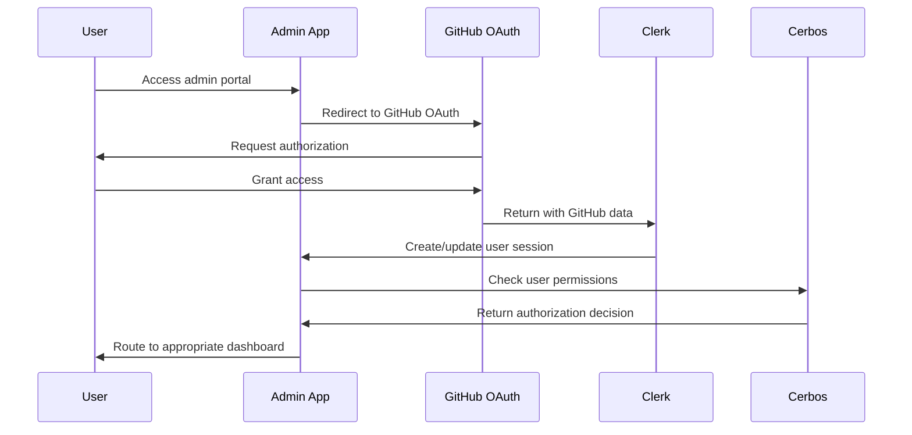

# IFLA Standards Platform RBAC Comprehensive Guide

**Version:** 1.0  
**Date:** January 2025  
**Status:** Complete Analysis  
**Purpose:** Comprehensive Role-Based Access Control documentation

## Executive Summary

The IFLA Standards Platform implements a sophisticated hierarchical Role-Based Access Control (RBAC) system that governs access to vocabulary management, project collaboration, and administrative functions. This document provides a complete mapping of roles, permissions, and authorization workflows based on analysis of system design documents and implementation code.

### Key Findings

- **4-tier role hierarchy**: System → Review Group → Namespace → Project levels
- **170+ API endpoints** with role-based authorization
- **Cerbos-based authorization engine** with derived roles
- **GitHub OAuth integration** for authentication
- **Project-based collaboration model** with granular permissions
- **Critical gaps identified** in site management component documentation

## Role Hierarchy Overview

### 1. System Level Roles

#### **Superadmin**
- **Scope**: Global platform authority
- **Count**: 1-2 users (platform administrators)
- **Access Pattern**: Unrestricted access to all operations
- **Primary Use Cases**:
  - Platform configuration and maintenance
  - Emergency interventions
  - Cross-review-group operations
  - System monitoring and backup

**Key Permissions**:
```yaml
- reviewGroup: [create, read, update, delete, manage]
- namespace: [create, read, update, delete, configure]
- project: [create, read, update, delete, assignTeam, assignNamespace]
- user: [invite, read, update, delete, impersonate]
- system: [configure, monitor, backup, restore]
```

### 2. Review Group Level Roles

#### **Review Group Admin (RG Admin)**
- **Scope**: Full control over review group namespaces
- **Count**: 1-3 per review group (4 review groups = 4-12 total)
- **Access Pattern**: Administrative control within review group boundaries
- **Primary Use Cases**:
  - Namespace lifecycle management
  - Team composition and project chartering
  - Publication approval workflows
  - Cross-namespace coordination within review group

**Key Permissions**:
```yaml
- reviewGroup: [read, update, manage] # own review group only
- namespace: [create, read, update, delete] # within review group
- project: [create, read, update, delete, assignTeam, assignNamespace]
- team: [create, read, update, delete, addMember, removeMember]
- user: [invite] # to review group
```

**Review Group Structure**:
1. **International Cataloguing Principles (ICP)**
   - Namespaces: `icp`, `muldicat`
   - Focus: Cataloguing principles and multicultural considerations

2. **Bibliographic Conceptual Models (BCM)**
   - Namespaces: `frbr`, `lrm`, `frad`
   - Focus: Conceptual models for bibliographic data

3. **International Standard Bibliographic Description (ISBD)**
   - Namespaces: `isbd`, `isbdm`
   - Focus: Bibliographic description standards

4. **Permanent UNIMARC Committee (PUC)**
   - Namespaces: `unimarc`, `mri`
   - Focus: UNIMARC format and related standards

#### **Review Group Member**
- **Scope**: Basic membership in review group
- **Count**: 5-30 per review group (estimated 50-120 total)
- **Access Pattern**: Read access to review group resources, project participation
- **Primary Use Cases**:
  - Participate in assigned projects
  - View review group activities
  - Contribute to discussions

**Key Permissions**:
```yaml
- reviewGroup: [read] # own review group only
- namespace: [read] # review group namespaces
- project: [read] # assigned projects only
- team: [read] # own team memberships
```

### 3. Namespace Level Roles

#### **Namespace Admin**
- **Scope**: Full control over specific namespace
- **Count**: 1-2 per namespace (estimated 16-32 total)
- **Access Pattern**: Administrative control within namespace boundaries
- **Primary Use Cases**:
  - Vocabulary structure management
  - DCTAP profile configuration
  - Publication workflow initiation
  - Quality assurance oversight

**Key Permissions**:
```yaml
- namespace: [read, update, configure] # assigned namespace only
- elementSet: [create, read, update, delete, manage]
- vocabulary: [create, read, update, delete, manage]
- release: [create, read, update, delete, publish]
- dctap: [create, read, update, delete, export]
```

#### **Namespace Editor**
- **Scope**: Content creation and updates
- **Count**: 3-10 per namespace (estimated 48-160 total)
- **Access Pattern**: Content editing within assigned namespaces
- **Primary Use Cases**:
  - Element and concept management
  - Vocabulary import/export
  - Documentation creation
  - Draft version management

**Key Permissions**:
```yaml
- elementSet: [create, read, update, delete]
- vocabulary: [create, read, update, delete]
- documentation: [create, read, update, delete]
- spreadsheet: [read, edit, import, export, update]
- release: [create, read, update, delete]
- translation: [read, update, approve, assignTranslator]
```

#### **Namespace Reviewer**
- **Scope**: Quality assurance and feedback
- **Count**: 2-5 per namespace (estimated 32-80 total)
- **Access Pattern**: Review and comment capabilities
- **Primary Use Cases**:
  - Content quality review
  - Pull request evaluation
  - Feedback provision
  - Standards compliance checking

**Key Permissions**:
```yaml
- elementSet: [read, review, comment]
- vocabulary: [read, review, comment]
- documentation: [read, review, comment]
- release: [read, review]
```

#### **Namespace Translator**
- **Scope**: Language-specific content management
- **Count**: 2-8 per namespace per language (estimated 100-400 total)
- **Access Pattern**: Translation editing within language scope
- **Primary Use Cases**:
  - Multilingual content creation
  - Translation quality assurance
  - Cultural adaptation
  - Language-specific review

**Key Permissions**:
```yaml
- vocabulary: [read, translate, edit_translation]
- documentation: [read, translate]
- translation: [read, update] # assigned languages only
```

### 4. Project Level Roles

#### **Project Lead**
- **Scope**: Project management authority
- **Count**: 1 per project (estimated 10-20 total active)
- **Access Pattern**: Full project management within assigned namespaces
- **Primary Use Cases**:
  - Project planning and execution
  - Team coordination
  - Milestone management
  - Stakeholder communication

**Key Permissions**:
```yaml
- project: [read, update, manage] # assigned project only
- team: [read, addMember, removeMember, updateMemberRole]
- issue: [create, read, update, delete, assign]
- pullRequest: [create, read, update, merge, review]
- board: [read, update, manage]
```

#### **Project Editor**
- **Scope**: Content editing within project scope
- **Count**: 2-8 per project (estimated 40-160 total)
- **Access Pattern**: Content editing within project-assigned namespaces
- **Primary Use Cases**:
  - Content development
  - Collaborative editing
  - Issue resolution
  - Documentation updates

**Key Permissions**:
```yaml
- project: [read] # assigned project only
- elementSet: [create, read, update, delete] # project namespaces
- vocabulary: [create, read, update, delete] # project namespaces
- issue: [create, read, update, assign]
- pullRequest: [create, read, update, review]
```

#### **Project Reviewer**
- **Scope**: Review and feedback within project
- **Count**: 1-3 per project (estimated 15-60 total)
- **Access Pattern**: Review capabilities within project scope
- **Primary Use Cases**:
  - Content review
  - Quality assurance
  - Feedback provision
  - Standards compliance

**Key Permissions**:
```yaml
- project: [read] # assigned project only
- elementSet: [read, review, comment] # project namespaces
- vocabulary: [read, review, comment] # project namespaces
- issue: [read, comment]
- pullRequest: [read, review, comment]
```

#### **Project Translator**
- **Scope**: Translation work within project
- **Count**: 1-5 per project per language (estimated 50-200 total)
- **Access Pattern**: Translation editing within project and language scope
- **Primary Use Cases**:
  - Project-specific translations
  - Multilingual coordination
  - Cultural adaptation
  - Translation quality assurance

**Key Permissions**:
```yaml
- project: [read] # assigned project only
- vocabulary: [read, translate] # project namespaces, assigned languages
- translation: [read, update] # project scope, assigned languages
```

## Permission Matrix by Resource Type

### Review Groups

| Role | Create | Read | Update | Delete | Manage | List |
|------|--------|------|--------|--------|--------|------|
| **Superadmin** | ✅ | ✅ | ✅ | ✅ | ✅ | ✅ |
| **RG Admin** | ❌ | ✅ (own) | ✅ (own) | ❌ | ✅ (own) | ✅ |
| **RG Member** | ❌ | ✅ (own) | ❌ | ❌ | ❌ | ✅ |
| **Other** | ❌ | ✅ (public) | ❌ | ❌ | ❌ | ✅ (public) |

### Namespaces

| Role | Create | Read | Update | Delete | Configure | List |
|------|--------|------|--------|--------|-----------|------|
| **Superadmin** | ✅ | ✅ | ✅ | ✅ | ✅ | ✅ |
| **RG Admin** | ✅ (in RG) | ✅ | ✅ (in RG) | ✅ (in RG) | ✅ (in RG) | ✅ |
| **NS Admin** | ❌ | ✅ (own) | ✅ (own) | ❌ | ✅ (own) | ✅ |
| **NS Editor** | ❌ | ✅ (assigned) | ❌ | ❌ | ❌ | ✅ (assigned) |
| **NS Reviewer** | ❌ | ✅ (assigned) | ❌ | ❌ | ❌ | ✅ (assigned) |
| **NS Translator** | ❌ | ✅ (assigned) | ❌ | ❌ | ❌ | ✅ (assigned) |

### Projects

| Role | Create | Read | Update | Delete | Assign Teams | Assign NS | Charter |
|------|--------|------|--------|--------|--------------|-----------|---------|
| **Superadmin** | ✅ | ✅ | ✅ | ✅ | ✅ | ✅ | ✅ |
| **RG Admin** | ✅ (in RG) | ✅ | ✅ (in RG) | ✅ (in RG) | ✅ (in RG) | ✅ (in RG) | ✅ (in RG) |
| **Project Lead** | ❌ | ✅ (own) | ✅ (own) | ❌ | ✅ (own) | ❌ | ✅ (own) |
| **Project Member** | ❌ | ✅ (assigned) | ❌ | ❌ | ❌ | ❌ | ❌ |

### Element Sets & Vocabularies

| Role | Create | Read | Update | Delete | Import | Export | Translate |
|------|--------|------|--------|--------|--------|--------|-----------|
| **Superadmin** | ✅ | ✅ | ✅ | ✅ | ✅ | ✅ | ✅ |
| **NS Admin** | ✅ | ✅ | ✅ | ✅ | ✅ | ✅ | ✅ |
| **NS Editor** | ✅ | ✅ | ✅ | ✅ | ✅ | ✅ | ❌ |
| **NS Reviewer** | ❌ | ✅ | ❌ | ❌ | ❌ | ✅ | ❌ |
| **NS Translator** | ❌ | ✅ | ❌ | ❌ | ❌ | ✅ | ✅ |
| **Project Editor** | ✅ (proj NS) | ✅ | ✅ (proj NS) | ✅ (proj NS) | ✅ (proj NS) | ✅ | ❌ |
| **Project Translator** | ❌ | ✅ | ❌ | ❌ | ❌ | ✅ | ✅ (proj NS) |

### Translations

| Role | Read | Update | Approve | Assign Translator | Export | Import |
|------|------|--------|---------|-------------------|--------|--------|
| **Superadmin** | ✅ | ✅ | ✅ | ✅ | ✅ | ✅ |
| **NS Admin** | ✅ | ✅ | ✅ | ✅ | ✅ | ✅ |
| **NS Editor** | ✅ | ✅ | ✅ | ✅ | ✅ | ✅ |
| **NS Translator** | ✅ | ✅ (assigned lang) | ❌ | ❌ | ✅ | ✅ |
| **Project Translator** | ✅ | ✅ (proj + lang) | ❌ | ❌ | ✅ | ✅ |

### Releases & Publishing

| Role | Create | Read | Update | Delete | Publish | Rollback |
|------|--------|------|--------|--------|---------|----------|
| **Superadmin** | ✅ | ✅ | ✅ | ✅ | ✅ | ✅ |
| **RG Admin** | ✅ (in RG) | ✅ | ✅ (in RG) | ✅ (in RG) | ✅ (in RG) | ✅ (in RG) |
| **NS Admin** | ✅ (own NS) | ✅ | ✅ (own NS) | ✅ (own NS) | ✅ (own NS) | ✅ (own NS) |
| **NS Editor** | ✅ (own NS) | ✅ | ✅ (own NS) | ✅ (own NS) | ❌ | ❌ |

### Issues & Pull Requests

| Role | Create | Read | Update | Delete | Assign | Merge | Review |
|------|--------|------|--------|--------|--------|-------|--------|
| **Superadmin** | ✅ | ✅ | ✅ | ✅ | ✅ | ✅ | ✅ |
| **RG Admin** | ✅ (in RG) | ✅ | ✅ (in RG) | ✅ (in RG) | ✅ (in RG) | ✅ (in RG) | ✅ |
| **Project Lead** | ✅ (proj) | ✅ | ✅ (proj) | ✅ (proj) | ✅ (proj) | ✅ (proj) | ✅ |
| **Project Editor** | ✅ (proj) | ✅ | ✅ (own) | ✅ (own) | ❌ | ❌ | ✅ |
| **Project Reviewer** | ✅ (proj) | ✅ | ❌ | ❌ | ❌ | ❌ | ✅ |
| **Any Member** | ✅ (public) | ✅ | ✅ (own) | ✅ (own) | ❌ | ❌ | ❌ |

### User Management

| Role | Invite | Read | Update | Delete | Impersonate | Assign Roles |
|------|--------|------|--------|--------|-------------|--------------|
| **Superadmin** | ✅ | ✅ | ✅ | ✅ | ✅ | ✅ |
| **RG Admin** | ✅ (to RG) | ✅ (RG members) | ❌ | ❌ | ❌ | ✅ (RG scope) |
| **User** | ❌ | ✅ (own) | ✅ (own) | ❌ | ❌ | ❌ |

## Authorization Workflows

### 1. Authentication Flow



### 2. Permission Inheritance

```yaml
Inheritance Hierarchy:
  Superadmin:
    inherits: all permissions globally
    
  RG Admin:
    inherits: all permissions within review group scope
    includes: [namespace admin, project lead, team admin]
    
  Namespace Admin:
    inherits: all permissions within namespace scope
    includes: [editor, reviewer, translator]
    
  Project Lead:
    inherits: all permissions within project scope
    includes: [project editor, project reviewer]
    
  Editor:
    inherits: content creation and modification
    includes: [reviewer read permissions]
```

### 3. Resource Access Patterns

#### **Namespace Access**
```typescript
function canAccessNamespace(user: User, namespace: string): boolean {
  // Superadmin has access to everything
  if (user.systemRole === 'superadmin') return true;
  
  // RG Admin has access to their review group namespaces
  if (user.reviewGroups.some(rg => 
    rg.role === 'maintainer' && rg.namespaces.includes(namespace)
  )) return true;
  
  // Project members have access to project namespaces
  if (Object.values(user.projects).some(p => 
    p.namespaces.includes(namespace)
  )) return true;
  
  // Direct namespace assignment
  if (user.accessibleNamespaces.includes(namespace)) return true;
  
  return false;
}
```

#### **Project Access**
```typescript
function canAccessProject(user: User, projectId: string): boolean {
  // Superadmin has access to everything
  if (user.systemRole === 'superadmin') return true;
  
  // RG Admin has access to their review group projects
  const project = getProject(projectId);
  if (user.reviewGroups.some(rg => 
    rg.role === 'maintainer' && rg.slug === project.reviewGroup
  )) return true;
  
  // Direct project assignment
  if (user.projects[projectId]) return true;
  
  return false;
}
```

### 4. Dynamic Role Derivation

The system uses **Cerbos derived roles** to dynamically calculate permissions:

```yaml
# From cerbos/policies/derived_roles.yaml
derivedRoles:
  - name: superadmin
    condition: '"superadmin" in P.roles'
    
  - name: namespace_admin
    condition: 'P.attr.namespaces[R.attr.namespace] == "admin"'
    
  - name: namespace_editor
    condition: |
      P.attr.namespaces[R.attr.namespace] == "admin" ||
      P.attr.namespaces[R.attr.namespace] == "editor"
      
  - name: rg_admin
    condition: |
      request.principal.attr.reviewGroupAdmin != null &&
      size(request.principal.attr.reviewGroupAdmin) > 0
```

## API Endpoint Authorization

### Authentication Middleware

All API endpoints require authentication via GitHub OAuth through Clerk:

```typescript
// apps/admin/src/lib/authorization.ts
export async function requireAuth(req: Request): Promise<Response | void> {
  const session = await auth();
  if (!session?.user) {
    return new Response("Unauthorized", { status: 401 });
  }
  (req as any).session = session;
}
```

### Authorization Patterns

#### **Resource-Specific Authorization**
```typescript
// Example: Namespace management
export async function canEditNamespace(
  namespaceId: string, 
  reviewGroupId: string
): Promise<boolean> {
  return canPerformAction('namespace', 'update', { 
    namespaceId, 
    reviewGroupId 
  });
}
```

#### **Cerbos Integration**
```typescript
// Check with Cerbos authorization engine
const decision = await cerbos.checkResource({
  principal: {
    id: authContext.userId,
    roles: getPrincipalRoles(authContext),
    attr: {
      reviewGroupAdmin: authContext.roles.reviewGroups.map(rg => rg.reviewGroupId),
      teams: authContext.roles.teams,
      translations: authContext.roles.translations,
    },
  },
  resource: {
    kind: 'admin',
    id: resourceAttributes?.id || 'new',
    attr: { ...resourceAttributes, resourceType },
  },
  actions: [`${resourceType}:${action}`],
});
```

### API Endpoint Categories

#### **170+ Endpoints by Category**:

1. **Authentication & Authorization** (5 endpoints)
   - GitHub OAuth flow
   - Session management
   - Permission checks

2. **User Management** (8 endpoints)
   - User CRUD operations
   - Role assignments
   - Team memberships

3. **Review Group Management** (12 endpoints)
   - Review group lifecycle
   - Member management
   - Namespace associations

4. **Namespace Management** (15 endpoints)
   - Namespace CRUD
   - Configuration management
   - Version control

5. **Project Management** (25 endpoints)
   - Project lifecycle
   - Team assignments
   - Board management
   - Analytics

6. **Issue Management** (18 endpoints)
   - Issue CRUD
   - Assignment and labeling
   - Template management
   - GitHub sync

7. **Pull Request Management** (12 endpoints)
   - PR lifecycle
   - Review workflows
   - Merge operations

8. **Discussion Management** (10 endpoints)
   - Discussion forums
   - Category management
   - Moderation

9. **Vocabulary & Content Management** (35 endpoints)
   - Content CRUD
   - RDF operations
   - Import/export workflows
   - Quality assurance

10. **Translation Management** (15 endpoints)
    - Translation workflows
    - Language management
    - Sync operations

11. **Publishing & Versioning** (12 endpoints)
    - Release management
    - Version control
    - Publication workflows

12. **System Administration** (8 endpoints)
    - System configuration
    - Monitoring
    - Backup/restore

## UI Permission Enforcement

### Navigation Personalization

The admin interface dynamically adapts navigation based on user roles:

```typescript
// Dynamic navigation components by role
interface NavigationConfig {
  systemAdmin: {
    sections: ['System', 'Users', 'Review Groups', 'Projects', 'Namespaces'];
    quickActions: ['Create Review Group', 'Invite Admin', 'System Backup'];
  };
  
  reviewGroupAdmin: {
    sections: ['Dashboard', 'Team Members', 'Our Projects', 'Our Namespaces'];
    quickActions: ['Create Project', 'Invite Member', 'Start Import'];
  };
  
  projectMember: {
    sections: ['Dashboard', 'My Projects', 'Accessible Namespaces', 'Tasks'];
    quickActions: ['Create Issue', 'Submit PR'];
  };
}
```

### Component-Level Access Control

```typescript
// Example: Conditional rendering based on permissions
function VocabularyManagementPanel({ namespace }: { namespace: string }) {
  const user = useUser();
  const canEdit = hasNamespaceRole(user, namespace, ['admin', 'editor']);
  const canTranslate = hasNamespaceRole(user, namespace, ['translator']);
  
  return (
    <Panel>
      {canEdit && <EditControls />}
      {canTranslate && <TranslationControls />}
      <ViewControls /> {/* Always available */}
    </Panel>
  );
}
```

### Form Field Access Control

```typescript
// Dynamic form fields based on permissions
function NamespaceSettingsForm({ namespace }: { namespace: string }) {
  const permissions = useNamespacePermissions(namespace);
  
  return (
    <Form>
      <TextField name="title" disabled={!permissions.canEdit} />
      <TextField name="description" disabled={!permissions.canEdit} />
      
      {permissions.canConfigure && (
        <Section title="Advanced Configuration">
          <TextField name="baseUri" />
          <Select name="visibility" />
        </Section>
      )}
      
      {permissions.canManageTeam && (
        <Section title="Team Management">
          <TeamMemberList />
        </Section>
      )}
    </Form>
  );
}
```

## Critical Gaps and Missing Information

### 1. Site Management Component

**Status**: **COMPLETELY UNDOCUMENTED**

The user mentioned a "sitemanagement component that defines a large number of tasks, segmented in tabs" but this component is not documented anywhere in the system design documents or codebase.

**Missing Information**:
- Component structure and purpose
- Tab organization and content
- Specific tasks and activities per tab
- Role-based access control for each activity
- Integration with other system components
- Workflow dependencies

**Impact**: This represents a significant gap in the RBAC documentation, as this component likely contains numerous permission-controlled activities.

### 2. Granular Activity Permissions

**Status**: **PARTIALLY DOCUMENTED**

While high-level role permissions are defined, there's insufficient detail on specific UI activities and their permission requirements.

**Missing Information**:
- Specific button/action permissions within each UI component
- Form field-level access control
- Conditional feature availability
- Workflow state-based permissions
- Bulk operation permissions

### 3. Workflow State-Based Permissions

**Status**: **MINIMALLY DOCUMENTED**

Limited information on how permissions change based on content lifecycle states.

**Missing Information**:
- Draft vs. published content permissions
- Review workflow state permissions
- Version lock/unlock permissions
- Emergency override procedures
- Approval workflow permissions

### 4. Cross-Namespace Operations

**Status**: **PARTIALLY DOCUMENTED**

Insufficient documentation on permissions for operations that span multiple namespaces.

**Missing Information**:
- Cross-namespace harmonization permissions
- Multi-namespace project permissions
- Global search and reporting permissions
- Cross-reference validation permissions

### 5. External Contributor Framework

**Status**: **CONCEPTUALLY MENTIONED**

The system mentions external contributors but lacks detailed permission framework.

**Missing Information**:
- Guest user permission model
- Time-limited access patterns
- Fork-based contribution permissions
- External reviewer permissions
- Public contribution workflows

### 6. Emergency Procedures

**Status**: **NOT DOCUMENTED**

No documented procedures for emergency access or permission overrides.

**Missing Information**:
- Emergency access procedures
- Permission escalation workflows
- System recovery permissions
- Audit trail for emergency actions

### 7. Delegation Mechanisms

**Status**: **NOT DOCUMENTED**

No information on temporary permission delegation or proxy access.

**Missing Information**:
- Temporary permission grants
- Delegation workflows
- Proxy access patterns
- Time-limited role assignments

## Implementation Status

### ✅ **Implemented Components**

1. **Core Authentication**
   - GitHub OAuth integration via Clerk
   - Session management
   - User profile synchronization

2. **Basic Role Hierarchy**
   - System, Review Group, Namespace, Project levels
   - Role inheritance patterns
   - Simple permission derivation logic

3. **GitHub Integration**
   - Team membership synchronization
   - Organization-based role detection
   - Project board integration

4. **Mock Service for Development**
   - GitHub mock service for testing roles
   - Basic permission checking logic
   - Development-time role simulation

### ⚠️ **Partially Implemented**

1. **UI Permission Enforcement**
   - Basic navigation personalization
   - Some component-level access control
   - **Missing**: Granular form field permissions

2. **Translation Workflow Permissions**
   - Basic translator role definition
   - Language-specific access patterns
   - **Missing**: Workflow state permissions

3. **Project-Based Access Control**
   - Project membership tracking
   - Basic project permissions
   - **Missing**: Dynamic project role assignments

### ❌ **Not Implemented**

1. **Authorization Engine**
   - **DECISION POINT**: Cerbos vs. Clerk Organizations
   - Comprehensive permission checking
   - Policy-based authorization

2. **Site Management Component**
   - Component definition
   - Tab-based activity permissions
   - Integration with RBAC system

3. **Workflow State Permissions**
   - Content lifecycle state tracking
   - State-based permission changes
   - Approval workflow integration

4. **Emergency Procedures**
   - Emergency access mechanisms
   - Permission override workflows
   - Audit trail for emergency actions

5. **External Contributor Framework**
   - Guest user permissions
   - Time-limited access
   - Public contribution workflows

## Recommendations

### 1. **Critical Architecture Decision (Week 1)**

**RECOMMENDATION: Implement Clerk Organizations instead of Cerbos**

**Rationale**:
- Cerbos is not yet implemented - perfect timing to choose the right architecture
- Clerk Organizations provide simpler, more maintainable solution
- Review Groups map naturally to Clerk Organizations
- Eliminates need for separate authorization service
- Reduces operational complexity significantly

**Implementation Plan**:
1. Set up Clerk Organizations for each Review Group
2. Map current role structure to Clerk's organization roles + custom permissions
3. Update authorization logic to use Clerk's permission system
4. Remove planned Cerbos implementation

### 2. **Immediate Actions (Week 1-2)**

1. **Implement Clerk Organizations Architecture**
   - Create organizations for ICP, BCM, ISBD, PUC
   - Migrate current mock users to organization memberships
   - Update permission checking logic

2. **Document Site Management Component**
   - Create comprehensive specification
   - Map all activities to roles
   - Define tab-based permission structure

3. **Complete UI Permission Audit**
   - Review all admin interface components
   - Document granular permission requirements
   - Implement missing access controls

### 2. **Short-term Actions (Week 3-4)**

1. **Implement Workflow State Permissions**
   - Define content lifecycle states
   - Implement state-based permission changes
   - Integrate with approval workflows

2. **Enhance Cross-Namespace Operations**
   - Define multi-namespace permission patterns
   - Implement cross-namespace validation
   - Create harmonization workflows

3. **External Contributor Framework**
   - Design guest user permission model
   - Implement time-limited access
   - Create public contribution workflows

### 3. **Long-term Actions (Month 2-3)**

1. **Advanced Permission Features**
   - Implement delegation mechanisms
   - Create temporary permission grants
   - Add permission analytics

2. **Performance Optimization**
   - Optimize permission checking
   - Implement permission caching
   - Add monitoring and metrics

3. **Comprehensive Testing**
   - Create permission test suites
   - Implement automated security testing
   - Add penetration testing

## Security Considerations

### 1. **Authentication Security**

- **GitHub OAuth Only**: No local user accounts to reduce attack surface
- **Session Management**: 8-hour timeout with secure cookie handling
- **Two-Factor Authentication**: Required for all admin users

### 2. **Authorization Security**

- **Principle of Least Privilege**: Users receive minimum necessary permissions
- **Role Inheritance**: Clear hierarchy prevents privilege escalation
- **Resource Isolation**: Review group boundaries prevent cross-contamination

### 3. **API Security**

- **JWT Tokens**: All API requests require valid authentication tokens
- **Rate Limiting**: Per-user rate limits prevent abuse
- **Input Validation**: All endpoints validate input data
- **CORS Configuration**: Strict cross-origin request policies

### 4. **Audit and Monitoring**

- **Comprehensive Logging**: All permission checks and changes logged
- **Real-time Monitoring**: Suspicious activity detection
- **Regular Audits**: Periodic permission review and cleanup

## Conclusion

The IFLA Standards Platform implements a sophisticated RBAC system that effectively manages access control across a complex collaborative environment. The hierarchical role structure, combined with Cerbos-based authorization and GitHub integration, provides a robust foundation for secure vocabulary management and project collaboration.

However, significant gaps remain, particularly around the undocumented site management component and granular activity permissions. Addressing these gaps is critical for complete system security and usability.

The system's strength lies in its clear role hierarchy and resource-based permission model, which aligns well with IFLA's organizational structure and collaborative workflows. With proper completion of the missing components, this RBAC system will provide comprehensive access control for the platform's diverse user base and complex operational requirements.

**Total System Scope**:
- **4-tier role hierarchy** with clear inheritance patterns
- **170+ API endpoints** with role-based authorization
- **16+ namespaces** across 4 review groups
- **Estimated 300-800 users** across all role levels
- **Project-based collaboration** with dynamic permissions
- **Multilingual support** with language-specific roles
- **GitHub integration** for authentication and project management

This comprehensive RBAC system positions the IFLA Standards Platform as a secure, scalable solution for global standards development collaboration.