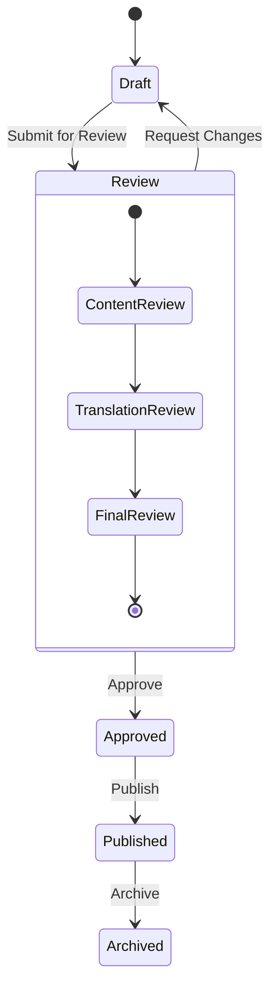

# Site Management Component Specification

**Version:** 1.0  
**Date:** January 2025  
**Status:** Gap Analysis and Proposed Specification  
**Purpose:** Define the missing site management component and its RBAC requirements

## Executive Summary

This document addresses a critical gap identified in the IFLA Standards Platform RBAC analysis: the **site management component** mentioned by the user but not documented in any system design documents. Based on the platform's architecture and common administrative needs, this specification proposes a comprehensive site management component with detailed role-based access control.

## Component Overview

### Purpose

The Site Management Component serves as the central administrative interface for managing individual namespace sites within the IFLA Standards Platform. It provides comprehensive tools for site configuration, content management, deployment, and monitoring.

### Scope

- **Per-Namespace Management**: Each namespace has its own site management interface
- **Multi-Tab Organization**: Activities organized into logical functional groups
- **Role-Based Access**: Different tabs and activities available based on user permissions
- **Workflow Integration**: Connects with project management and content workflows

### Access Pattern

```
/admin/namespaces/{namespace}/site-management
```

## Tab Structure and Activities

### Tab 1: Site Configuration

**Purpose**: Core site settings and metadata management

#### **Activities**:

1. **Basic Site Information**
   - Site title and description
   - Contact information
   - Copyright and licensing
   - Site logo and branding

2. **Technical Configuration**
   - Base URI settings
   - URL structure patterns
   - Redirect rules
   - Custom domain configuration

3. **Navigation Structure**
   - Menu organization
   - Page hierarchy
   - Breadcrumb configuration
   - Footer links

4. **Theme and Appearance**
   - Color scheme selection
   - Typography settings
   - Layout preferences
   - Custom CSS injection

#### **Permission Requirements**:

| Activity | Superadmin | RG Admin | NS Admin | NS Editor | NS Reviewer | NS Translator |
|----------|------------|----------|----------|-----------|-------------|---------------|
| **Basic Site Info** | ✅ | ✅ (own RG) | ✅ (own NS) | ❌ | ❌ | ❌ |
| **Technical Config** | ✅ | ✅ (own RG) | ✅ (own NS) | ❌ | ❌ | ❌ |
| **Navigation** | ✅ | ✅ (own RG) | ✅ (own NS) | ✅ (own NS) | ❌ | ❌ |
| **Theme** | ✅ | ✅ (own RG) | ✅ (own NS) | ✅ (own NS) | ❌ | ❌ |

### Tab 2: Content Management

**Purpose**: Content lifecycle and organization management

#### **Activities**:

1. **Page Management**
   - Create/edit/delete pages
   - Page templates
   - Content organization
   - Draft management

2. **Media Library**
   - Image uploads and management
   - Document attachments
   - Media organization
   - Usage tracking

3. **Content Templates**
   - Page templates
   - Component templates
   - Reusable content blocks
   - Template versioning

4. **Content Validation**
   - Link checking
   - Content quality checks
   - Accessibility validation
   - SEO optimization

#### **Permission Requirements**:

| Activity | Superadmin | RG Admin | NS Admin | NS Editor | NS Reviewer | NS Translator |
|----------|------------|----------|----------|-----------|-------------|---------------|
| **Page Management** | ✅ | ✅ (own RG) | ✅ (own NS) | ✅ (own NS) | ❌ | ✅ (translations) |
| **Media Library** | ✅ | ✅ (own RG) | ✅ (own NS) | ✅ (own NS) | ❌ | ✅ (own uploads) |
| **Templates** | ✅ | ✅ (own RG) | ✅ (own NS) | ✅ (own NS) | ❌ | ❌ |
| **Validation** | ✅ | ✅ (own RG) | ✅ (own NS) | ✅ (own NS) | ✅ (own NS) | ❌ |

### Tab 3: Vocabulary Management

**Purpose**: RDF vocabulary and element management

#### **Activities**:

1. **Element Sets**
   - Create/edit/delete element sets
   - Element properties management
   - Domain/range definitions
   - Cardinality rules

2. **Concept Schemes**
   - Vocabulary creation and editing
   - Hierarchical organization
   - Concept relationships
   - SKOS compliance

3. **DCTAP Profiles**
   - Profile creation and editing
   - Constraint definitions
   - Validation rules
   - Profile versioning

4. **RDF Generation**
   - Format selection (Turtle, RDF/XML, JSON-LD)
   - Namespace configuration
   - Output validation
   - Bulk generation

#### **Permission Requirements**:

| Activity | Superadmin | RG Admin | NS Admin | NS Editor | NS Reviewer | NS Translator |
|----------|------------|----------|----------|-----------|-------------|---------------|
| **Element Sets** | ✅ | ✅ (own RG) | ✅ (own NS) | ✅ (own NS) | ❌ | ❌ |
| **Concept Schemes** | ✅ | ✅ (own RG) | ✅ (own NS) | ✅ (own NS) | ❌ | ✅ (translations) |
| **DCTAP Profiles** | ✅ | ✅ (own RG) | ✅ (own NS) | ✅ (own NS) | ❌ | ❌ |
| **RDF Generation** | ✅ | ✅ (own RG) | ✅ (own NS) | ✅ (own NS) | ✅ (own NS) | ✅ (own NS) |

### Tab 4: Import/Export

**Purpose**: Data import, export, and synchronization

#### **Activities**:

1. **Spreadsheet Integration**
   - Google Sheets connection
   - Excel file upload
   - CSV import/export
   - Data mapping configuration

2. **Bulk Operations**
   - Batch import/export
   - Data transformation
   - Validation and preview
   - Error handling

3. **External System Integration**
   - API connections
   - Data synchronization
   - Format conversion
   - Scheduled imports

4. **Backup and Restore**
   - Full site backup
   - Selective data export
   - Restore operations
   - Version management

#### **Permission Requirements**:

| Activity | Superadmin | RG Admin | NS Admin | NS Editor | NS Reviewer | NS Translator |
|----------|------------|----------|----------|-----------|-------------|---------------|
| **Spreadsheet Integration** | ✅ | ✅ (own RG) | ✅ (own NS) | ✅ (own NS) | ❌ | ✅ (translations) |
| **Bulk Operations** | ✅ | ✅ (own RG) | ✅ (own NS) | ✅ (own NS) | ❌ | ❌ |
| **External Integration** | ✅ | ✅ (own RG) | ✅ (own NS) | ❌ | ❌ | ❌ |
| **Backup/Restore** | ✅ | ✅ (own RG) | ✅ (own NS) | ❌ | ❌ | ❌ |

### Tab 5: Translation Management

**Purpose**: Multilingual content management and workflows

#### **Activities**:

1. **Language Configuration**
   - Supported languages
   - Default language settings
   - Language-specific URLs
   - Fallback behavior

2. **Translation Workflows**
   - Translation assignment
   - Progress tracking
   - Quality assurance
   - Approval processes

3. **Translation Tools**
   - Translation memory
   - Terminology management
   - Consistency checking
   - Automated suggestions

4. **Multilingual Publishing**
   - Language-specific releases
   - Synchronized publishing
   - Translation status tracking
   - Incomplete content handling

#### **Permission Requirements**:

| Activity | Superadmin | RG Admin | NS Admin | NS Editor | NS Reviewer | NS Translator |
|----------|------------|----------|----------|-----------|-------------|---------------|
| **Language Config** | ✅ | ✅ (own RG) | ✅ (own NS) | ❌ | ❌ | ❌ |
| **Translation Workflows** | ✅ | ✅ (own RG) | ✅ (own NS) | ✅ (own NS) | ❌ | ✅ (assigned lang) |
| **Translation Tools** | ✅ | ✅ (own RG) | ✅ (own NS) | ✅ (own NS) | ❌ | ✅ (assigned lang) |
| **Multilingual Publishing** | ✅ | ✅ (own RG) | ✅ (own NS) | ✅ (own NS) | ❌ | ❌ |

### Tab 6: Publishing & Deployment

**Purpose**: Site deployment and release management

#### **Activities**:

1. **Release Management**
   - Version creation
   - Release notes
   - Changelog generation
   - Release approval

2. **Deployment Configuration**
   - Environment settings
   - Build configuration
   - Deployment targets
   - Rollback procedures

3. **Preview and Testing**
   - Preview environments
   - A/B testing
   - Performance testing
   - Accessibility testing

4. **Go-Live Operations**
   - Production deployment
   - DNS management
   - SSL certificate management
   - CDN configuration

#### **Permission Requirements**:

| Activity | Superadmin | RG Admin | NS Admin | NS Editor | NS Reviewer | NS Translator |
|----------|------------|----------|----------|-----------|-------------|---------------|
| **Release Management** | ✅ | ✅ (own RG) | ✅ (own NS) | ✅ (own NS) | ❌ | ❌ |
| **Deployment Config** | ✅ | ✅ (own RG) | ✅ (own NS) | ❌ | ❌ | ❌ |
| **Preview/Testing** | ✅ | ✅ (own RG) | ✅ (own NS) | ✅ (own NS) | ✅ (own NS) | ✅ (own NS) |
| **Go-Live Operations** | ✅ | ✅ (own RG) | ✅ (own NS) | ❌ | ❌ | ❌ |

### Tab 7: Analytics & Monitoring

**Purpose**: Site performance and usage analytics

#### **Activities**:

1. **Usage Analytics**
   - Page views and traffic
   - User behavior tracking
   - Search analytics
   - Download statistics

2. **Performance Monitoring**
   - Site speed metrics
   - Uptime monitoring
   - Error tracking
   - Resource usage

3. **Content Analytics**
   - Content popularity
   - Search queries
   - User engagement
   - Conversion tracking

4. **SEO and Accessibility**
   - Search engine optimization
   - Accessibility compliance
   - Mobile responsiveness
   - Core web vitals

#### **Permission Requirements**:

| Activity | Superadmin | RG Admin | NS Admin | NS Editor | NS Reviewer | NS Translator |
|----------|------------|----------|----------|-----------|-------------|---------------|
| **Usage Analytics** | ✅ | ✅ (own RG) | ✅ (own NS) | ✅ (own NS) | ✅ (own NS) | ✅ (own NS) |
| **Performance Monitoring** | ✅ | ✅ (own RG) | ✅ (own NS) | ✅ (own NS) | ✅ (own NS) | ❌ |
| **Content Analytics** | ✅ | ✅ (own RG) | ✅ (own NS) | ✅ (own NS) | ✅ (own NS) | ✅ (own NS) |
| **SEO/Accessibility** | ✅ | ✅ (own RG) | ✅ (own NS) | ✅ (own NS) | ✅ (own NS) | ❌ |

### Tab 8: Team & Collaboration

**Purpose**: Team management and collaborative workflows

#### **Activities**:

1. **Team Management**
   - Team member roles
   - Permission assignments
   - Access control
   - User invitations

2. **Collaboration Tools**
   - Discussion forums
   - Comment systems
   - Review workflows
   - Notification settings

3. **Project Integration**
   - Project assignments
   - Task management
   - Milestone tracking
   - Progress reporting

4. **External Collaboration**
   - Guest access
   - External reviewer permissions
   - Public contribution workflows
   - Community management

#### **Permission Requirements**:

| Activity | Superadmin | RG Admin | NS Admin | NS Editor | NS Reviewer | NS Translator |
|----------|------------|----------|----------|-----------|-------------|---------------|
| **Team Management** | ✅ | ✅ (own RG) | ✅ (own NS) | ❌ | ❌ | ❌ |
| **Collaboration Tools** | ✅ | ✅ (own RG) | ✅ (own NS) | ✅ (own NS) | ✅ (own NS) | ✅ (own NS) |
| **Project Integration** | ✅ | ✅ (own RG) | ✅ (own NS) | ✅ (own NS) | ✅ (own NS) | ✅ (own NS) |
| **External Collaboration** | ✅ | ✅ (own RG) | ✅ (own NS) | ❌ | ❌ | ❌ |

## Role-Based Tab Visibility

### Superadmin
**Visible Tabs**: All 8 tabs
**Access Level**: Full access to all activities across all namespaces

### Review Group Admin
**Visible Tabs**: All 8 tabs (for namespaces in their review group)
**Access Level**: Full access within review group scope

### Namespace Admin
**Visible Tabs**: All 8 tabs (for their assigned namespace)
**Access Level**: Full access within namespace scope

### Namespace Editor
**Visible Tabs**: 
- Site Configuration (limited)
- Content Management
- Vocabulary Management
- Import/Export
- Translation Management (coordination)
- Publishing & Deployment (limited)
- Analytics & Monitoring
- Team & Collaboration (limited)

### Namespace Reviewer
**Visible Tabs**:
- Content Management (read-only)
- Vocabulary Management (read-only)
- Analytics & Monitoring
- Team & Collaboration (participation)

### Namespace Translator
**Visible Tabs**:
- Content Management (translation focus)
- Vocabulary Management (translation focus)
- Import/Export (translation data)
- Translation Management
- Analytics & Monitoring
- Team & Collaboration (participation)

## Workflow Integration

### Content Lifecycle Integration



**Permission Changes by State**:
- **Draft**: Full edit permissions for editors
- **Review**: Read-only for editors, full access for reviewers
- **Approved**: Limited edit permissions, full access for admins
- **Published**: Read-only for most users, admin override available
- **Archived**: Read-only for all users

### Project Workflow Integration

The site management component integrates with project workflows:

1. **Project Assignment**: Activities can be assigned to specific projects
2. **Milestone Tracking**: Site management tasks linked to project milestones
3. **Progress Reporting**: Site management progress feeds into project dashboards
4. **Resource Allocation**: Team assignments coordinate between projects and site management

## API Endpoints

### Site Management API Structure

```typescript
// Site Configuration
GET    /api/admin/namespaces/:nsId/site/config
PUT    /api/admin/namespaces/:nsId/site/config
GET    /api/admin/namespaces/:nsId/site/navigation
PUT    /api/admin/namespaces/:nsId/site/navigation
GET    /api/admin/namespaces/:nsId/site/theme
PUT    /api/admin/namespaces/:nsId/site/theme

// Content Management
GET    /api/admin/namespaces/:nsId/site/pages
POST   /api/admin/namespaces/:nsId/site/pages
PUT    /api/admin/namespaces/:nsId/site/pages/:pageId
DELETE /api/admin/namespaces/:nsId/site/pages/:pageId
GET    /api/admin/namespaces/:nsId/site/media
POST   /api/admin/namespaces/:nsId/site/media
DELETE /api/admin/namespaces/:nsId/site/media/:mediaId

// Vocabulary Management
GET    /api/admin/namespaces/:nsId/site/elements
POST   /api/admin/namespaces/:nsId/site/elements
PUT    /api/admin/namespaces/:nsId/site/elements/:elementId
DELETE /api/admin/namespaces/:nsId/site/elements/:elementId
GET    /api/admin/namespaces/:nsId/site/concepts
POST   /api/admin/namespaces/:nsId/site/concepts
PUT    /api/admin/namespaces/:nsId/site/concepts/:conceptId

// Import/Export
POST   /api/admin/namespaces/:nsId/site/import/spreadsheet
POST   /api/admin/namespaces/:nsId/site/export/spreadsheet
GET    /api/admin/namespaces/:nsId/site/import/status/:jobId
POST   /api/admin/namespaces/:nsId/site/backup
POST   /api/admin/namespaces/:nsId/site/restore

// Translation Management
GET    /api/admin/namespaces/:nsId/site/translations
PUT    /api/admin/namespaces/:nsId/site/translations/:lang
GET    /api/admin/namespaces/:nsId/site/translation-status
POST   /api/admin/namespaces/:nsId/site/translation-workflow

// Publishing & Deployment
POST   /api/admin/namespaces/:nsId/site/releases
GET    /api/admin/namespaces/:nsId/site/releases/:releaseId
POST   /api/admin/namespaces/:nsId/site/deploy
GET    /api/admin/namespaces/:nsId/site/deploy/status
POST   /api/admin/namespaces/:nsId/site/preview

// Analytics & Monitoring
GET    /api/admin/namespaces/:nsId/site/analytics/usage
GET    /api/admin/namespaces/:nsId/site/analytics/performance
GET    /api/admin/namespaces/:nsId/site/analytics/content
GET    /api/admin/namespaces/:nsId/site/analytics/seo

// Team & Collaboration
GET    /api/admin/namespaces/:nsId/site/team
POST   /api/admin/namespaces/:nsId/site/team/invite
PUT    /api/admin/namespaces/:nsId/site/team/:userId/role
DELETE /api/admin/namespaces/:nsId/site/team/:userId
GET    /api/admin/namespaces/:nsId/site/discussions
POST   /api/admin/namespaces/:nsId/site/discussions
```

## UI Component Structure

### Tab Navigation Component

```typescript
interface SiteManagementTab {
  id: string;
  label: string;
  icon: React.ComponentType;
  requiredPermissions: string[];
  component: React.ComponentType<{ namespace: string }>;
}

const siteManagementTabs: SiteManagementTab[] = [
  {
    id: 'configuration',
    label: 'Site Configuration',
    icon: SettingsIcon,
    requiredPermissions: ['namespace:configure'],
    component: SiteConfigurationTab,
  },
  {
    id: 'content',
    label: 'Content Management',
    icon: ContentIcon,
    requiredPermissions: ['content:read'],
    component: ContentManagementTab,
  },
  // ... other tabs
];
```

### Permission-Based Rendering

```typescript
function SiteManagementComponent({ namespace }: { namespace: string }) {
  const user = useUser();
  const permissions = useNamespacePermissions(namespace);
  
  const visibleTabs = siteManagementTabs.filter(tab =>
    tab.requiredPermissions.every(permission =>
      permissions.has(permission)
    )
  );
  
  return (
    <TabContainer>
      <TabList>
        {visibleTabs.map(tab => (
          <Tab key={tab.id} icon={<tab.icon />}>
            {tab.label}
          </Tab>
        ))}
      </TabList>
      
      {visibleTabs.map(tab => (
        <TabPanel key={tab.id}>
          <tab.component namespace={namespace} />
        </TabPanel>
      ))}
    </TabContainer>
  );
}
```

## Security Considerations

### 1. **Tab-Level Security**
- Each tab checks permissions before rendering
- API endpoints validate permissions for each operation
- Sensitive configuration hidden from unauthorized users

### 2. **Activity-Level Security**
- Individual activities within tabs have specific permission requirements
- Form fields disabled/hidden based on user permissions
- Bulk operations require elevated permissions

### 3. **Data Isolation**
- Namespace-scoped data access
- Review group boundaries enforced
- Cross-namespace operations require explicit permissions

### 4. **Audit Trail**
- All site management activities logged
- Change tracking for configuration modifications
- User attribution for all operations

## Implementation Roadmap

### Phase 1: Core Infrastructure (Week 1-2)
1. **Tab Framework**
   - Create tabbed interface component
   - Implement permission-based tab visibility
   - Add navigation and routing

2. **Basic Configuration Tab**
   - Site information management
   - Basic navigation configuration
   - Theme selection

### Phase 2: Content Management (Week 3-4)
1. **Content Management Tab**
   - Page CRUD operations
   - Media library integration
   - Content validation

2. **Vocabulary Management Tab**
   - Element set management
   - Concept scheme editing
   - DCTAP profile configuration

### Phase 3: Advanced Features (Week 5-6)
1. **Import/Export Tab**
   - Spreadsheet integration
   - Bulk operations
   - Backup/restore functionality

2. **Translation Management Tab**
   - Language configuration
   - Translation workflows
   - Progress tracking

### Phase 4: Publishing & Analytics (Week 7-8)
1. **Publishing & Deployment Tab**
   - Release management
   - Deployment configuration
   - Preview environments

2. **Analytics & Monitoring Tab**
   - Usage analytics
   - Performance monitoring
   - SEO tracking

### Phase 5: Collaboration (Week 9-10)
1. **Team & Collaboration Tab**
   - Team management
   - Collaboration tools
   - External contributor management

2. **Integration & Polish**
   - Project workflow integration
   - Performance optimization
   - Comprehensive testing

## Testing Strategy

### 1. **Permission Testing**
- Test each role's access to tabs and activities
- Verify permission inheritance
- Test edge cases and boundary conditions

### 2. **Functional Testing**
- Test all activities within each tab
- Verify data persistence and validation
- Test workflow integrations

### 3. **Security Testing**
- Penetration testing for unauthorized access
- Input validation testing
- Cross-site scripting prevention

### 4. **Performance Testing**
- Load testing for concurrent users
- Performance testing for large datasets
- Caching and optimization validation

## Conclusion

The Site Management Component represents a critical piece of the IFLA Standards Platform's administrative interface. This specification provides a comprehensive framework for implementing the component with proper role-based access control, ensuring that users have appropriate access to the tools they need while maintaining security and data integrity.

The 8-tab structure covers all aspects of namespace management, from basic configuration to advanced analytics and collaboration. The detailed permission matrix ensures that each role has access to appropriate functionality while preventing unauthorized access to sensitive operations.

Implementation of this component will complete the platform's administrative interface and provide users with a comprehensive toolkit for managing their namespace sites effectively and securely.