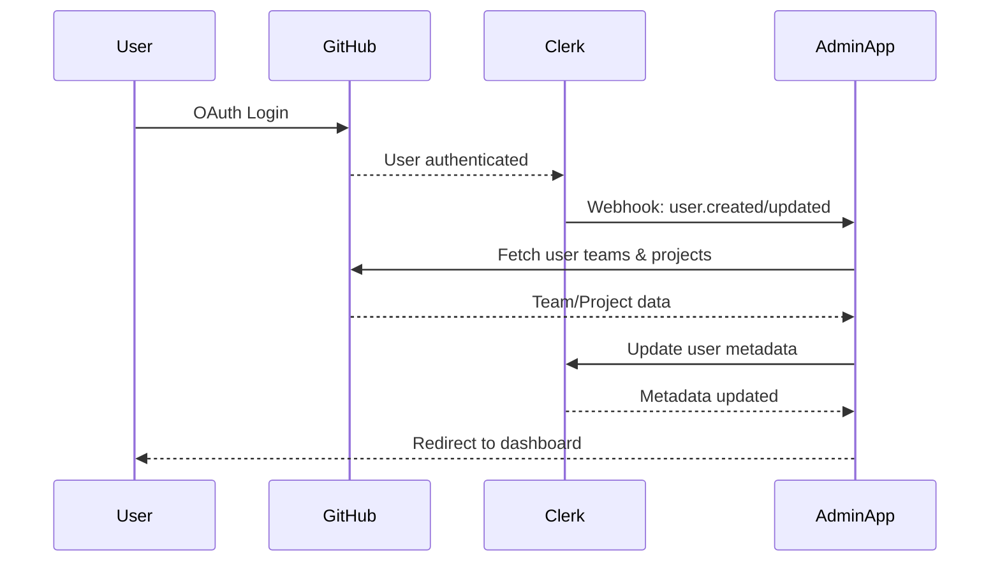
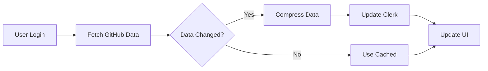

# GitHub Teams Integration Architecture

## Overview

This document describes the architecture for integrating GitHub Teams and Projects with the IFLA Standards Admin Portal, establishing GitHub as the source of truth for organizational structure and permissions.

## Core Concepts

### Organizational Mapping

```
GitHub Organization (iflastandards)
├── Teams (Permanent Review Groups)
│   ├── isbd-review-group
│   ├── bcm-review-group  
│   ├── cat-review-group
│   ├── unimarc-review-group
│   └── subject-analysis-review-group
│
└── Projects (Temporary Working Groups)
    ├── ISBD Consolidation 2025
    ├── MulDiCat French Translation
    └── LRM Update 2024
```

**Key Principles:**
- GitHub Teams = IFLA Review Groups (1:1 mapping, permanent)
- GitHub Projects = Ad-hoc working groups (temporary, cross-team)
- Users can belong to multiple teams with different roles
- Projects draw members from any team based on expertise

## Architecture Components

### 1. Authentication Layer



**Key Points:**
- Production uses GitHub OAuth exclusively (no email/password)
- Clerk handles authentication and session management
- Post-login sync fetches GitHub team memberships
- Metadata cached in Clerk (8KB limit per user)

### 2. Data Model

#### Clerk Metadata Structure

```typescript
interface ClerkUserMetadata {
  publicMetadata: {
    // GitHub identity
    githubId: string;
    githubUsername: string;
    
    // System role (if applicable)
    systemRole?: 'admin';
    
    // Review Group memberships (GitHub Teams)
    reviewGroups: Array<{
      slug: string;              // 'isbd-review-group'
      name: string;              // 'ISBD Review Group'
      role: 'maintainer' | 'member';
      namespaces: string[];      // ['isbd', 'isbdm']
    }>;
    
    // Quick access flags for UI
    isReviewGroupAdmin: boolean;
    totalActiveProjects: number;
  };
  
  privateMetadata: {
    // GitHub Projects participation
    projects: {
      [projectId: string]: {
        number: number;          // GitHub project number
        title: string;           // Truncated to save space
        role: 'lead' | 'editor' | 'reviewer' | 'translator';
        namespaces: string[];    // Accessible namespaces
        sourceTeam: string;      // Which RG owns this project
      };
    };
    
    // Aggregated access
    accessibleNamespaces: string[];
    lastGitHubSync: string;      // ISO timestamp
  };
}
```

**Size Optimization:**
- Use short property names in storage
- Truncate titles to 50 characters
- Store only essential fields
- Compress arrays when possible

### 3. Navigation Architecture

#### User-Centric Navbar
The navbar reflects the user's complete access map, not their current context:

```typescript
interface NavigationStructure {
  personal: {
    dashboard: '/dashboard';
    profile: '/profile';
    settings: '/settings';
  };
  
  adminSections: ReviewGroupAdmin[];  // For RG maintainers
  namespaces: NamespaceAccess[];      // All accessible
  projects: ProjectAccess[];          // All active
}
```

#### Contextual Dashboards
Dashboards adapt based on the current route context:

| Route | Context | UI Adaptation |
|-------|---------|---------------|
| `/dashboard` | Personal | Aggregated view of all roles |
| `/dashboard/rg/[slug]` | Review Group | Team management tools |
| `/dashboard/namespace/[namespace]` | Namespace | Content editing tools |
| `/dashboard/project/[projectId]` | Project | Project collaboration |

### 4. Permission Model

#### Role Hierarchy

```
System Admin (GitHub Org Owner)
├── Review Group Admin (Team Maintainer)
│   ├── Project Lead
│   ├── Editor (Team Member)
│   ├── Reviewer
│   └── Author
└── Translator (Project-specific)
```

#### Permission Inheritance

```typescript
// Base permissions from team membership
const teamPermissions = {
  maintainer: {
    canManageTeam: true,
    canCreateProjects: true,
    canAssignMembers: true,
    canEditAllNamespaces: true,  // Within team's namespaces
  },
  member: {
    canManageTeam: false,
    canCreateProjects: false,
    canAssignMembers: false,
    canEditAssignedNamespaces: true,
  }
};

// Project permissions can override/extend team permissions
const projectPermissions = {
  lead: { ...teamPermissions.member, canManageProject: true },
  editor: { ...teamPermissions.member, canEdit: true },
  reviewer: { ...teamPermissions.member, canApprove: true },
  translator: { canTranslate: true, canSuggestEdits: true }
};
```

### 5. GitHub Integration Layer

#### Service Architecture

```typescript
// Abstract interface for GitHub operations
interface IGitHubService {
  // Team operations
  getTeams(): Promise<GitHubTeam[]>;
  getTeamMembers(teamSlug: string): Promise<TeamMember[]>;
  addTeamMember(teamSlug: string, username: string, role: 'member' | 'maintainer'): Promise<void>;
  removeTeamMember(teamSlug: string, username: string): Promise<void>;
  
  // Project operations  
  getProjects(): Promise<GitHubProject[]>;
  getProjectCollaborators(projectId: string): Promise<Collaborator[]>;
  addProjectCollaborator(projectId: string, username: string): Promise<void>;
}

// Concrete implementation with Octokit
export class GitHubTeamManager implements IGitHubService {
  constructor(private octokit: Octokit) {}
  
  async createTeam(teamName: string): Promise<GitHubTeam> {
    const { data } = await this.octokit.rest.teams.create({
      org: 'iflastandards',
      name: teamName,
      privacy: 'closed',
      description: `IFLA Review Group: ${teamName}`
    });
    return this.mapTeamResponse(data);
  }
  
  async addTeamMember(teamSlug: string, username: string, role: 'member' | 'maintainer'): Promise<void> {
    await this.octokit.rest.teams.addOrUpdateMembershipForUserInOrg({
      org: 'iflastandards',
      team_slug: teamSlug,
      username: username,
      role: role
    });
  }
  
  async listTeamMembers(teamSlug: string): Promise<TeamMember[]> {
    const { data } = await this.octokit.rest.teams.listMembersInOrg({
      org: 'iflastandards',
      team_slug: teamSlug,
      per_page: 100
    });
    return data.map(member => ({
      username: member.login,
      id: member.id,
      avatarUrl: member.avatar_url
    }));
  }
  
  private mapTeamResponse(data: any): GitHubTeam {
    return {
      id: data.id,
      slug: data.slug,
      name: data.name,
      description: data.description
    };
  }
}

// Environment-based service factory
export function createGitHubService(config: { mockMode?: boolean }): IGitHubService {
  if (config.mockMode || process.env.MOCK_GITHUB_API === 'true') {
    return new GitHubService(new MockGitHubAdapter());
  }
  const octokit = new Octokit({ 
    auth: process.env.GITHUB_TOKEN,
    retry: { enabled: true },
    throttle: {
      onRateLimit: (retryAfter, options) => {
        console.warn(`Rate limit hit, retrying after ${retryAfter} seconds`);
        return true;
      },
      onSecondaryRateLimit: (retryAfter, options) => {
        console.warn(`Secondary rate limit hit, retrying after ${retryAfter} seconds`);
        return true;
      }
    }
  });
  return new GitHubTeamManager(octokit);
}
```

#### Mock Adapter for Development

```typescript
class MockGitHubAdapter implements IGitHubAdapter {
  private mockData = {
    teams: [
      {
        id: 1,
        slug: 'isbd-review-group',
        name: 'ISBD Review Group',
        members: [
          { username: 'elena-rodriguez', role: 'maintainer' },
          { username: 'maria-editor', role: 'member' }
        ]
      }
    ],
    projects: [
      {
        id: 'PVT_123',
        number: 1,
        title: 'ISBD Consolidation 2025',
        collaborators: [
          { username: 'elena-rodriguez', role: 'lead' },
          { username: 'john-reviewer', role: 'reviewer' }
        ]
      }
    ]
  };
  
  async getTeams() {
    return this.mockData.teams;
  }
}
```

#### Testing with Mock Service Worker (MSW)

For more realistic API testing, use MSW to intercept and mock GitHub API calls:

```typescript
// github-api-handlers.ts
import { rest } from 'msw';

export const githubHandlers = [
  // Mock team listing
  rest.get('https://api.github.com/orgs/:org/teams', (req, res, ctx) => {
    return res(
      ctx.json([
        { id: 1, slug: 'isbd-review-group', name: 'ISBD Review Group' },
        { id: 2, slug: 'bcm-review-group', name: 'BCM Review Group' },
        { id: 3, slug: 'cat-review-group', name: 'CAT Review Group' }
      ])
    );
  }),
  
  // Mock team members
  rest.get('https://api.github.com/orgs/:org/teams/:team_slug/members', (req, res, ctx) => {
    const { team_slug } = req.params;
    
    // Generate varied responses based on team
    const members = generateTeamMembers(team_slug as string);
    return res(ctx.json(members));
  }),
  
  // Mock adding team member
  rest.put('https://api.github.com/orgs/:org/teams/:team_slug/memberships/:username', 
    async (req, res, ctx) => {
      const { username } = req.params;
      const body = await req.json();
      
      return res(
        ctx.status(200),
        ctx.json({
          url: `https://api.github.com/teams/1/memberships/${username}`,
          role: body.role || 'member',
          state: 'active'
        })
      );
    }
  ),
  
  // Simulate rate limiting
  rest.get('https://api.github.com/*', (req, res, ctx) => {
    // Randomly trigger rate limit for testing
    if (Math.random() < 0.1) {
      return res(
        ctx.status(403),
        ctx.set({
          'X-RateLimit-Remaining': '0',
          'X-RateLimit-Reset': String(Date.now() + 3600000)
        }),
        ctx.json({
          message: 'API rate limit exceeded',
          documentation_url: 'https://docs.github.com/rest/overview/resources-in-the-rest-api#rate-limiting'
        })
      );
    }
    return req.passthrough();
  })
];

// Test data generation with Faker.js
import { faker } from '@faker-js/faker';

function generateTeamMembers(teamSlug: string, count = 5): GitHubUser[] {
  return Array.from({ length: count }, () => ({
    login: faker.internet.userName().toLowerCase(),
    id: faker.number.int({ min: 1000, max: 9999 }),
    avatar_url: faker.image.avatar(),
    type: 'User',
    site_admin: false
  }));
}
```

#### Error Handling Patterns

```typescript
// Robust error handling with retry logic
export async function withGitHubRateLimit<T>(
  operation: () => Promise<T>,
  options: { retries?: number; backoffMs?: number } = {}
): Promise<T> {
  const { retries = 3, backoffMs = 1000 } = options;
  
  for (let attempt = 0; attempt < retries; attempt++) {
    try {
      return await operation();
    } catch (error: any) {
      // Handle rate limiting
      if (error.status === 403 && error.response?.headers['x-ratelimit-remaining'] === '0') {
        const resetTime = parseInt(error.response.headers['x-ratelimit-reset']) * 1000;
        const waitTime = Math.max(resetTime - Date.now(), backoffMs * Math.pow(2, attempt));
        
        console.warn(`Rate limit hit, waiting ${waitTime}ms before retry ${attempt + 1}/${retries}`);
        await new Promise(resolve => setTimeout(resolve, waitTime));
        continue;
      }
      
      // Handle other errors
      if (attempt === retries - 1) {
        throw new GitHubAPIError(error.message, error.status, error);
      }
      
      // Exponential backoff for other errors
      await new Promise(resolve => setTimeout(resolve, backoffMs * Math.pow(2, attempt)));
    }
  }
  
  throw new Error('Max retries exceeded');
}

// Custom error class for better error handling
export class GitHubAPIError extends Error {
  constructor(
    message: string,
    public statusCode: number,
    public originalError: any
  ) {
    super(message);
    this.name = 'GitHubAPIError';
  }
}
```

### 6. Data Synchronization

#### Sync Strategy



**Sync Triggers:**
1. **Post-login** - Always sync on authentication
2. **Manual sync** - Admin-triggered refresh
3. **Webhook** - GitHub team/project changes (future)
4. **Scheduled** - Daily sync for active users (future)

#### Data Compression

```typescript
function compressTeamData(teams: GitHubTeam[]): CompressedTeams {
  return teams.map(team => ({
    s: team.slug,           // 's' instead of 'slug'
    n: team.name.substring(0, 30),  // Truncate name
    r: team.role === 'maintainer' ? 'm' : 'u',  // Single char
    ns: team.namespaces     // Already short
  }));
}
```

## Implementation Strategy

### Phase 1: Foundation (Current)
- Documentation and architecture design
- Fix existing dashboard routing
- Verify Clerk test users

### Phase 2: Navigation Refactor
- Implement user-centric navbar
- Create contextual dashboard framework
- Add route-based context switching

### Phase 3: GitHub Integration
- Build mock adapter with test data
- Implement data synchronization
- Test with all user personas

### Phase 4: Team Management
- Create RG admin interfaces
- Implement team member management
- Add project creation workflow

### Phase 5: Production
- Switch to real GitHub adapter
- Enable webhooks
- Monitor and optimize

## Security Considerations

### 1. Authentication & Token Management

**GitHub OAuth Requirements:**
- Required scopes: `admin:org`, `write:org`, `read:org`
- Token rotation every 90 days recommended
- Encrypted storage using environment variables

```typescript
// Token validation and refresh
async function validateGitHubToken(token: string): Promise<boolean> {
  try {
    const octokit = new Octokit({ auth: token });
    await octokit.rest.users.getAuthenticated();
    return true;
  } catch (error) {
    return false;
  }
}
```

### 2. Authorization & Access Control

**Server-Side Validation:**
```typescript
// Always validate permissions server-side
export async function validateTeamAdmin(userId: string, teamSlug: string): Promise<boolean> {
  const user = await clerkClient.users.getUser(userId);
  const teams = user.publicMetadata.reviewGroups as ReviewGroup[];
  
  const team = teams.find(t => t.slug === teamSlug);
  return team?.role === 'maintainer';
}

// Middleware for admin routes
export function requireTeamAdmin(teamSlug: string) {
  return async (req: Request, res: Response, next: NextFunction) => {
    const isAdmin = await validateTeamAdmin(req.auth.userId, teamSlug);
    if (!isAdmin) {
      return res.status(403).json({ error: 'Insufficient permissions' });
    }
    next();
  };
}
```

### 3. Audit Logging

```typescript
// Log all administrative actions
interface AuditLog {
  userId: string;
  action: string;
  resource: string;
  details: Record<string, any>;
  timestamp: Date;
  ip: string;
}

export async function logAdminAction(log: AuditLog): Promise<void> {
  // Store in your logging service
  console.info('[AUDIT]', JSON.stringify(log));
  
  // For production, use a proper logging service
  // await loggingService.audit(log);
}
```

### 4. Data Protection Best Practices

- No sensitive data in Clerk public metadata
- Use private metadata for sensitive team data
- Implement field-level encryption for PII
- Regular security audits of metadata size
- HTTPS enforcement at all endpoints

### 5. Rate Limiting & DDoS Protection

```typescript
// Implement rate limiting for admin actions
import rateLimit from 'express-rate-limit';

export const adminRateLimiter = rateLimit({
  windowMs: 15 * 60 * 1000, // 15 minutes
  max: 100, // limit each IP to 100 requests per windowMs
  message: 'Too many requests from this IP'
});

export const githubSyncRateLimiter = rateLimit({
  windowMs: 60 * 60 * 1000, // 1 hour
  max: 10, // limit GitHub syncs to 10 per hour
  skipSuccessfulRequests: true
});
```

## Performance Optimization

1. **Caching Strategy**
   - Cache GitHub data for 24 hours
   - Invalidate on user action
   - Use Clerk as primary cache

2. **Load Time Targets**
   - Navbar render < 100ms
   - Dashboard load < 2 seconds
   - GitHub sync < 30 seconds

3. **Scalability**
   - Support 100+ concurrent users
   - Handle 20+ active projects
   - Manage 10+ namespaces per user

## Monitoring & Observability

1. **Key Metrics**
   - Authentication success rate
   - GitHub sync success/failure
   - Metadata size distribution
   - Page load times

2. **Logging**
   - All authentication events
   - Team/project changes
   - Permission denials
   - Sync operations

3. **Alerts**
   - Sync failures > 5%
   - Metadata > 7KB (warning)
   - Authentication errors spike

## Future Enhancements

1. **Real-time Updates**
   - GitHub webhooks for instant sync
   - WebSocket for live collaboration
   - Presence indicators

2. **Advanced Features**
   - Bulk user operations
   - Permission templates
   - Activity analytics

3. **Integrations**
   - Slack notifications
   - Email digests
   - Calendar integration