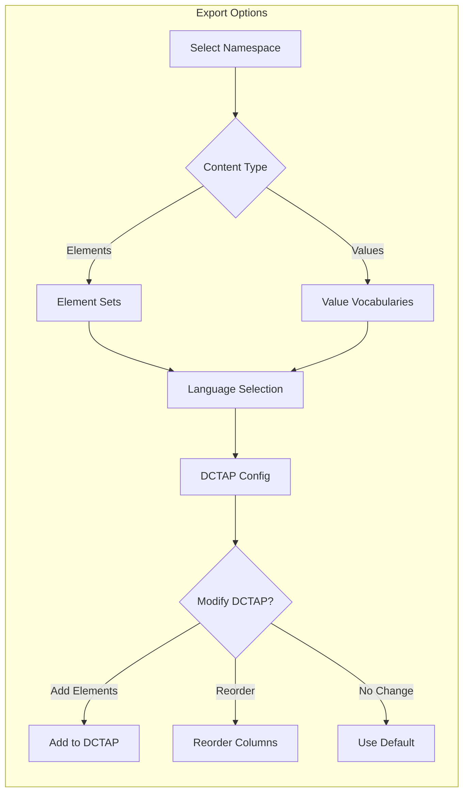
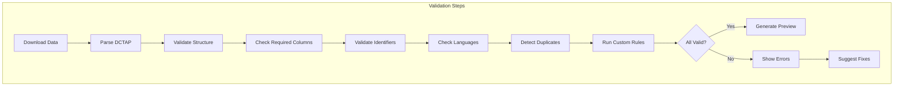
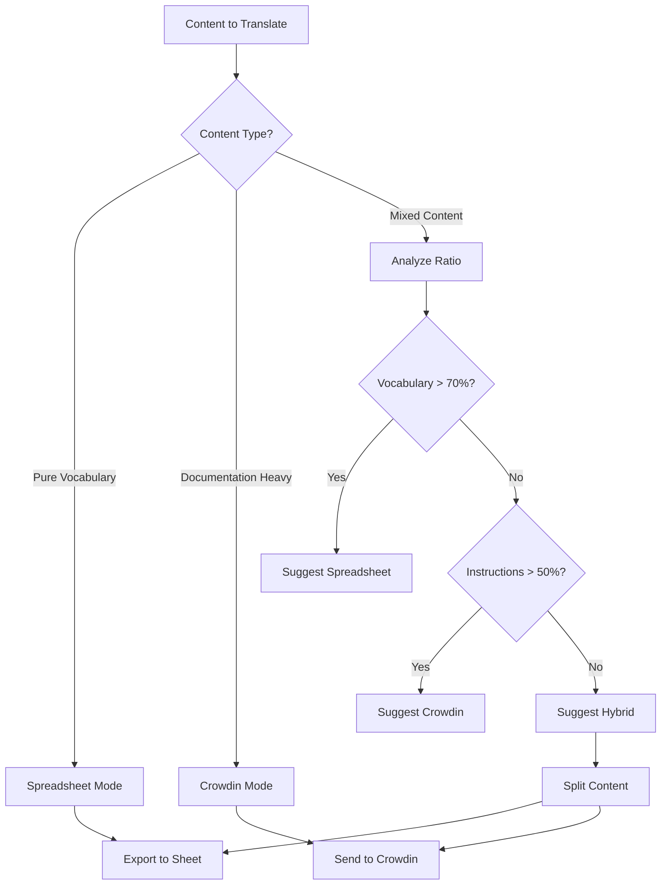
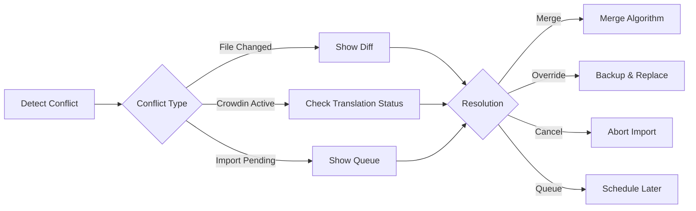
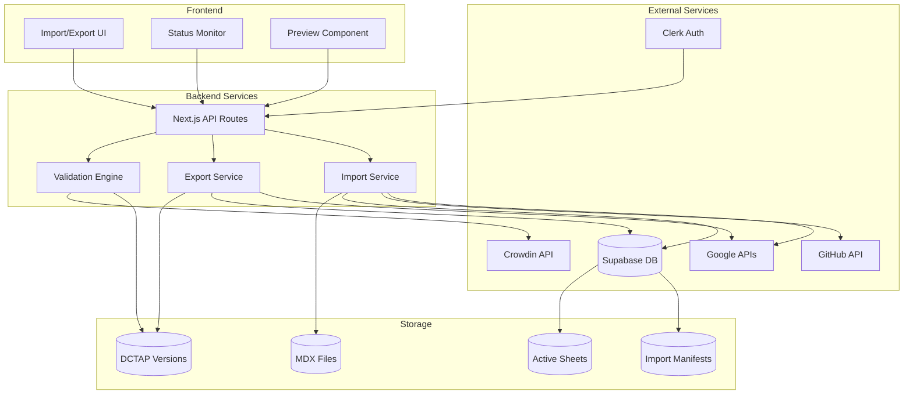

# Vocabulary Management Flow

## Complete Round-Trip Workflow

```mermaid
graph TD
    Start([Editor Starts Work]) --> Decision{New or Update?}
    
    %% Initial Migration Path
    Decision -->|Initial Migration| RDF[Existing RDF]
    RDF --> GenSheet[Generate Spreadsheet]
    GenSheet --> ImportMDX[Import to MDX]
    ImportMDX --> MDXSource[(MDX as Source of Truth)]
    
    %% Update Path
    Decision -->|Update Existing| MDXSource
    MDXSource --> Export[Export to Sheets]
    
    %% Export Flow
    Export --> SelectContent{Select Content}
    SelectContent --> ElementSets[Element Sets]
    SelectContent --> ValueVocabs[Value Vocabularies]
    
    ElementSets --> ConfigExport[Configure Export]
    ValueVocabs --> ConfigExport
    
    ConfigExport --> LanguageSelect[Select Languages]
    LanguageSelect --> NewLang{New Language?}
    NewLang -->|Yes| AITranslate[Optional AI Pre-translate]
    NewLang -->|No| CreateSheet
    AITranslate --> CreateSheet[Create Sheet in Drive]
    
    CreateSheet --> Permissions[Set Permissions]
    Permissions --> ActiveSheet[(Active Sheet)]
    ActiveSheet --> Notify[Notify Team]
    
    %% Collaboration Phase
    Notify --> Collaborate[Collaborative Editing]
    Collaborate --> ReadyImport{Ready to Import?}
    ReadyImport -->|No| Collaborate
    ReadyImport -->|Yes| StartImport
    
    %% Import Flow
    StartImport[Start Import] --> SelectSheet[Select Active Sheet]
    SelectSheet --> CreateJob[Create Import Job]
    CreateJob --> Download[Download Sheet + DCTAP]
    
    Download --> CompareDCTAP{DCTAP Changed?}
    CompareDCTAP -->|No| ValidateData
    CompareDCTAP -->|Yes| DCTAPChoice{Update Default?}
    
    DCTAPChoice -->|Update Default| VersionDCTAP[Version & Update]
    DCTAPChoice -->|Create Variant| NewDCTAP[Create Variant]
    VersionDCTAP --> ValidateData
    NewDCTAP --> ValidateData
    
    %% Validation
    ValidateData[Validate Against DCTAP] --> CheckRules[IFLA Rules Check]
    CheckRules --> ConflictCheck{Conflicts?}
    
    ConflictCheck -->|Crowdin| ResolveMode[Choose Resolution Mode]
    ConflictCheck -->|Git| ShowConflicts[Show Conflicts]
    ConflictCheck -->|None| Preview
    
    ResolveMode --> Preview
    ShowConflicts --> Preview
    
    %% Commit Flow
    Preview[Generate Preview] --> CommitChoice{Commit Strategy}
    CommitChoice -->|Dry Run| ShowDiff[Show Diff Only]
    CommitChoice -->|Branch| CreateBranch[Create Import Branch]
    CommitChoice -->|Direct| CreateCommit[Create Commit]
    
    ShowDiff --> ReviewChoice{Proceed?}
    CreateBranch --> ReviewChoice
    CreateCommit --> ReviewChoice
    
    ReviewChoice -->|Approve| ExecuteCommit[Execute Commit]
    ReviewChoice -->|Reject| CancelImport[Cancel Import]
    
    ExecuteCommit --> Manifest[Create Import Manifest]
    Manifest --> MDXSource
    
    %% Revert Path
    ExecuteCommit --> RevertWindow{Within 24hr?}
    RevertWindow -->|Yes| RevertOption[Can Revert]
    RevertWindow -->|No| Permanent[Changes Permanent]
```

## Export Configuration Details

## Import Validation Pipeline

## Translation Mode Decision Tree

## Conflict Resolution Flow

## System Architecture

## Key Design Decisions

1. **Source of Truth**: MDX files in Git after initial migration
2. **Collaboration Tool**: Google Sheets for multi-user editing
3. **Version Control**: Git for all changes, Supabase for metadata
4. **Conflict Resolution**: Multiple strategies based on context
5. **Rollback Window**: 24 hours for easy reversion
6. **Translation Flexibility**: Three modes to handle different content types
7. **DCTAP Versioning**: Preserves RDF integrity while allowing evolution