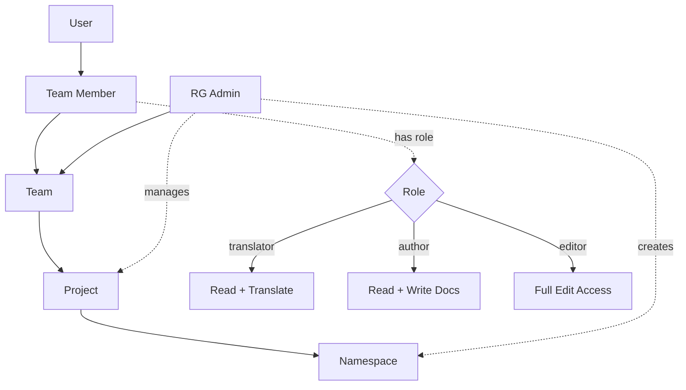

# IFLA Standards Platform - Authorization Architecture Reference

## Overview

This document serves as the authoritative reference for the authorization architecture of the IFLA Standards Platform. It describes the team-based permission model integrated with Clerk authentication and Cerbos authorization.

## Document Status

- **Version**: 1.0
- **Last Updated**: 2025-01-14
- **Status**: Active Architecture
- **Supersedes**: 
  - IFLA Authorizations.md (namespace-based model)
  - rbac-implementation-plan.md (direct role assignment model)

## Core Architecture

### Authentication & Authorization Stack

```
┌─────────────────────┐
│   Clerk (AuthN)     │ ← GitHub OAuth
├─────────────────────┤
│  Cerbos (AuthZ)     │ ← Policy-based permissions
├─────────────────────┤
│  Team Context       │ ← Project-based access
└─────────────────────┘
```

### Entity Hierarchy

```
Review Group
    ↓
  Project (chartered initiative)
    ↓
  Team (assigned to project)
    ↓
  Team Member (user with role)
    ↓
  Namespace Access (through project)
```

### Key Design Principles

1. **Project-Centric**: Projects are the central organizing unit (similar to W3C working groups)
2. **Team-Based Access**: Users access namespaces through team membership in projects
3. **Fixed Team Roles**: A user has one role within a team, but can have different roles in different teams
4. **One Team Per Project**: Each project has exactly one team assigned
5. **Cascading Abilities**: Higher roles include all abilities of lower roles

## Role Model

### Team Roles (Project Scope)

| Role | Abilities | Description |
|------|-----------|-------------|
| **Translator** | - View namespace content<br>- Edit translations<br>- Comment on content | Translates standards content |
| **Author** | - All translator abilities<br>- Edit documentation pages<br>- Create examples<br>- Edit instructional content | Creates and maintains documentation |
| **Editor** | - All author abilities<br>- Import spreadsheets<br>- Edit vocabularies<br>- Create versions<br>- Manage releases | Full content management |

### Administrative Roles

| Role | Abilities | Scope |
|------|-----------|-------|
| **Review Group Admin** | - Create/manage teams<br>- Create/manage projects<br>- Assign teams to projects<br>- All editor abilities within RG | Review Group |
| **Superadmin** | - All system permissions<br>- Create review groups<br>- System configuration | System-wide |

## Permission Flow



## Cerbos Integration

### Policy Structure

```yaml
# Principal (User) Attributes
principal:
  id: "user_123"
  roles: ["user"]
  attributes:
    teams:
      - id: "team_456"
        role: "editor"
        projectId: "proj_789"
      - id: "team_abc"
        role: "translator"
        projectId: "proj_def"
    reviewGroupAdmin: ["rg_isbd"]

# Resource (Namespace) Attributes  
resource:
  kind: "namespace"
  id: "ns_123"
  attributes:
    projectId: "proj_789"
    reviewGroupId: "rg_isbd"
    visibility: "public"

# Permission Check
action: "edit"
```

### Derived Roles

Cerbos dynamically derives roles based on team membership:

```yaml
derivedRoles:
  - name: "namespace_editor"
    condition: |
      P.attr.teams.exists(t, 
        t.projectId == R.attr.projectId && 
        t.role == "editor"
      )
```

## GitHub Integration

### Team Structure

```
GitHub Organization
    ↓
Parent Team: IFLA-{ReviewGroup}
    ↓
Sub-team: {ReviewGroup}-{ProjectName}-Team
    ↓
Repository Access Based on Role
```

### Permission Mapping

| Platform Role | GitHub Permission |
|---------------|-------------------|
| Translator | Read |
| Author | Read |
| Editor | Write |
| RG Admin | Admin |

## Database Schema

### Core Relationships

```sql
-- Projects (chartered initiatives)
projects
  - id
  - review_group_id
  - name
  - charter (mission/goals)
  - status (active/completed)
  - github_repo

-- Teams (one per project)
teams  
  - id
  - project_id (unique - one team per project)
  - name
  - github_team_id

-- Team Members
team_members
  - team_id
  - user_id  
  - role (editor/author/translator)
  - joined_at

-- Namespaces (managed by projects)
namespaces
  - id
  - project_id
  - name
  - visibility
```

## Common Authorization Scenarios

### 1. Can user edit a namespace?

```typescript
// User must be:
// 1. Editor in the team assigned to the namespace's project, OR
// 2. RG Admin for the namespace's review group, OR  
// 3. Superadmin

const canEdit = await cerbos.checkResource({
  principal: buildPrincipal(user),
  resource: {
    kind: "namespace",
    id: namespace.id,
    attributes: {
      projectId: namespace.projectId,
      reviewGroupId: namespace.reviewGroupId
    }
  },
  actions: ["edit"]
});
```

### 2. Can user create a project?

```typescript
// User must be:
// 1. RG Admin for the review group, OR
// 2. Superadmin

const canCreate = await cerbos.checkResource({
  principal: buildPrincipal(user),
  resource: {
    kind: "project",
    attributes: {
      reviewGroupId: reviewGroup.id
    }
  },
  actions: ["create"]
});
```

### 3. Get user's accessible namespaces

```typescript
// Through team memberships in projects
const namespaces = await db.namespace.findMany({
  where: {
    project: {
      team: {
        members: {
          some: {
            userId: user.id
          }
        }
      }
    }
  }
});
```

## API Endpoints

### Team Management (RG Admin only)

```
POST   /api/review-groups/:rgId/teams
GET    /api/teams/:teamId
PUT    /api/teams/:teamId
DELETE /api/teams/:teamId
```

### Team Membership

```
GET    /api/teams/:teamId/members
POST   /api/teams/:teamId/members
PUT    /api/teams/:teamId/members/:userId
DELETE /api/teams/:teamId/members/:userId
```

### Project Management

```
POST   /api/review-groups/:rgId/projects
GET    /api/projects/:projectId
PUT    /api/projects/:projectId
POST   /api/projects/:projectId/assign-team
```

## Security Considerations

1. **Token Security**: GitHub tokens encrypted using AES-256-GCM
2. **Audit Trail**: All authorization decisions logged
3. **Least Privilege**: Users only get minimum required access
4. **Team Isolation**: Teams cannot access other teams' resources
5. **Review Group Boundaries**: Strict isolation between review groups

## Migration from Previous Models

### From Namespace-Based Permissions

```sql
-- Old: Direct namespace access
user_namespace_permissions (user_id, namespace_id, role)

-- New: Access through project teams  
team_members (team_id, user_id, role)
teams (project_id)
projects (namespace_ids[])
```

### From Direct Role Assignment

```sql
-- Old: Direct roles
user_roles (user_id, role: 'isbd-editor')

-- New: Team-based roles
team_members (team_id, user_id, role: 'editor')
```

## Best Practices

1. **Project Creation**: Always create a team when creating a project
2. **Role Assignment**: Assign the minimum necessary role
3. **Team Size**: Keep teams focused (5-15 members)
4. **Regular Audits**: Review team memberships quarterly
5. **Clear Charters**: Define project scope clearly

## Troubleshooting

### Common Issues

1. **"Access Denied" despite being team member**
   - Check if project is assigned to namespace
   - Verify team membership is active
   - Ensure Cerbos policies are deployed

2. **GitHub sync failures**
   - Verify GitHub token has correct scopes
   - Check organization permissions
   - Ensure team naming follows convention

3. **Role changes not taking effect**
   - Clear Cerbos decision cache
   - Verify database transaction completed
   - Check for conflicting team memberships

## Future Enhancements

1. **Guest Access**: Temporary access for external reviewers
2. **Role Templates**: Predefined permission sets for common scenarios
3. **Delegation**: Team leads can manage their own teams
4. **Cross-Project Collaboration**: Shared access between related projects
5. **Time-Based Access**: Automatic expiration of memberships

---

*This document represents the current active authorization architecture for the IFLA Standards Platform. Previous authorization models have been deprecated.*