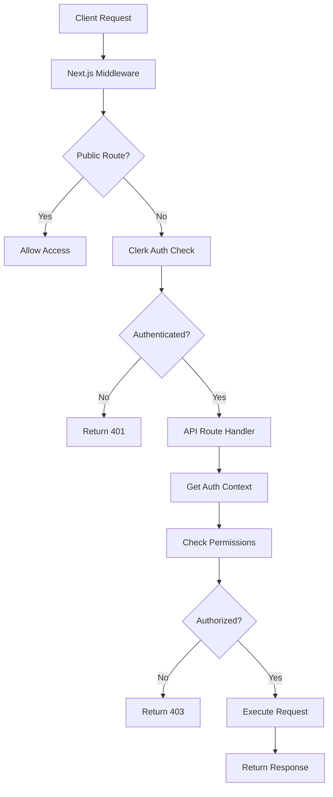
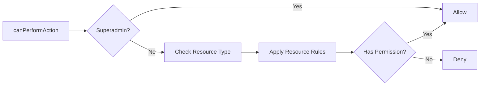
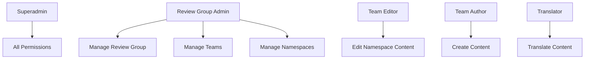

# Authorization Flow Documentation

## Overview

The IFLA Standards Platform uses a two-layer security model:
1. **Authentication**: Handled by Clerk middleware
2. **Authorization**: Custom RBAC using Clerk's publicMetadata

## Architecture Diagram



## Authentication Flow

### 1. Middleware Layer (`apps/admin/src/middleware.ts`)

```typescript
// Simplified flow
1. Request arrives at middleware
2. Check if route is public (isPublicRoute)
3. If public → allow access
4. If protected → auth.protect() enforces authentication
5. Unauthenticated users → redirected to sign-in
```

### 2. Public Routes
- `/` - Home page
- `/sign-in`, `/sign-up` - Auth pages
- `/api/health`, `/api/hello` - Public APIs
- `/api/request-invite` - Invitation requests

## Authorization Flow

### 1. Get Authorization Context

```typescript
// In API route handler
const authContext = await getAuthContext();

// Returns user with roles from Clerk metadata:
{
  userId: "user_123",
  email: "user@example.com",
  roles: {
    systemRole: "superadmin", // optional
    reviewGroups: [...],
    teams: [...],
    translations: [...]
  }
}
```

### 2. Permission Check Flow



### 3. Resource-Specific Authorization

Each resource type has specific permission logic:

#### Review Group Permissions
```typescript
// Review Group Admin can manage their group
if (action === 'manage' && userIsRGAdmin(reviewGroupId)) → ALLOW

// All users can read/list review groups
if (action === 'read' || action === 'list') → ALLOW

// Only superadmin can create new review groups
if (action === 'create') → REQUIRE superadmin
```

#### Namespace Permissions
```typescript
// Check via team membership
if (userHasTeamAccess(namespace)) {
  if (teamRole === 'editor') → ALLOW create/update/delete
  if (teamRole === 'author') → ALLOW create/update
}

// All authenticated users can read
if (action === 'read') → ALLOW
```

#### Translation Permissions
```typescript
// Check language assignment
if (userAssignedToLanguage(language) && 
    userHasNamespaceAccess(namespace)) → ALLOW

// Review Group Admins can assign translators
if (userIsRGAdmin(reviewGroup)) → ALLOW assign
```

## Role Hierarchy



## Role Definitions

### System Roles

| Role | Scope | Permissions |
|------|-------|-------------|
| `superadmin` | System-wide | All actions on all resources |

### Review Group Roles

| Role | Scope | Permissions |
|------|-------|-------------|
| `admin` | Review Group | Manage review group, teams, namespaces |

### Team Roles

| Role | Scope | Permissions |
|------|-------|-------------|
| `editor` | Namespace | Create, read, update, delete content |
| `author` | Namespace | Create, read, update content |

### Special Roles

| Role | Scope | Permissions |
|------|-------|-------------|
| `translator` | Language + Namespace | Translate content for assigned languages |

## Implementation Details

### 1. Storing Roles in Clerk

Roles are stored in Clerk's `publicMetadata`:

```javascript
// Example user metadata in Clerk Dashboard
{
  "systemRole": "superadmin",
  "reviewGroups": [
    {
      "reviewGroupId": "isbd",
      "role": "admin"
    }
  ],
  "teams": [
    {
      "teamId": "team_123",
      "role": "editor",
      "reviewGroup": "isbd",
      "namespaces": ["isbd-core", "isbd-extended"]
    }
  ],
  "translations": [
    {
      "language": "fr",
      "namespaces": ["isbd-core"]
    }
  ]
}
```

### 2. Authorization Functions

#### Main Authorization Function
```typescript
export async function canPerformAction<T extends ResourceType>(
  resourceType: T,
  action: Action<T>,
  resourceAttributes?: Record<string, any>
): Promise<boolean>
```

#### Helper Functions
- `checkReviewGroupPermission()` - Review group specific logic
- `checkNamespacePermission()` - Namespace access control
- `checkTeamPermission()` - Team management permissions
- `checkTranslationPermission()` - Translation assignments
- `checkContentPermission()` - Content CRUD operations

### 3. Using Authorization in API Routes

```typescript
// Example: Protected API route
export async function GET(request: Request) {
  // 1. Get auth context
  const authContext = await getAuthContext();
  if (!authContext) {
    return NextResponse.json({ error: 'Unauthorized' }, { status: 401 });
  }

  // 2. Check specific permission
  const canRead = await canPerformAction('user', 'read');
  if (!canRead) {
    return NextResponse.json({ error: 'Forbidden' }, { status: 403 });
  }

  // 3. Execute business logic
  const users = await getUsers();
  return NextResponse.json({ users });
}
```

## Security Considerations

### 1. Defense in Depth
- **Layer 1**: Clerk middleware blocks unauthenticated requests
- **Layer 2**: Authorization checks in each API route
- **Layer 3**: Database-level access control (future)

### 2. Principle of Least Privilege
- Users only get permissions they need
- Default deny for all non-explicit permissions
- Superadmin role used sparingly

### 3. Audit Trail
- All authorization decisions should be logged (Phase 8)
- Failed attempts tracked for security monitoring
- Role changes require audit entries

## Testing Authorization

### 1. Unit Tests
```typescript
describe('Authorization', () => {
  it('should allow superadmin all actions', async () => {
    const context = mockSuperadminContext();
    const result = await canPerformAction('user', 'delete');
    expect(result).toBe(true);
  });

  it('should deny regular user admin actions', async () => {
    const context = mockUserContext();
    const result = await canPerformAction('user', 'delete');
    expect(result).toBe(false);
  });
});
```

### 2. Integration Tests
- Test each API endpoint with different role scenarios
- Verify 401/403 responses for unauthorized access
- Test role inheritance and cascading permissions

### 3. E2E Tests
- Test complete user flows with different roles
- Verify UI elements show/hide based on permissions
- Test role switching scenarios

## Troubleshooting

### Common Issues

1. **User gets 403 despite having role**
   - Check publicMetadata is properly set in Clerk
   - Verify namespace/review group IDs match
   - Check for typos in role names

2. **Superadmin not bypassing checks**
   - Ensure `systemRole: 'superadmin'` is set
   - Check for case sensitivity issues

3. **Permission changes not reflecting**
   - Clerk metadata may be cached
   - User may need to sign out/in
   - Check for middleware caching issues

## Future Enhancements

1. **Phase 3**: Add caching layer for authorization checks
2. **Phase 7**: Implement request-level permission caching
3. **Phase 8**: Add comprehensive audit logging
4. **Future**: Consider policy engine for complex rules

---

*Last updated: 2025-08-08*
*Version: 1.0.0*