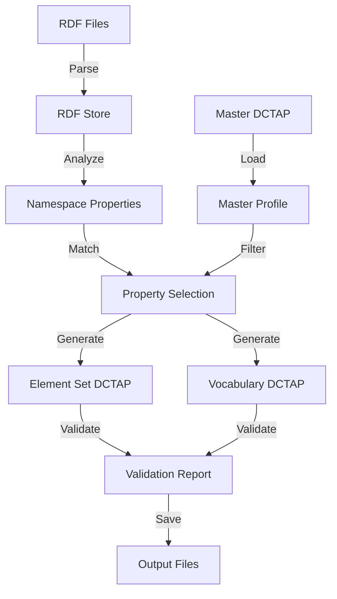

# RDF Namespace DCTAP Generator Specification

## 1. Executive Summary

### Purpose
Create a feature that reads existing RDF files for a given namespace, analyzes the properties and classes defined within it, and generates appropriate DCTAP (Dublin Core Tabular Application Profiles) CSV files by selecting relevant elements from a master DCTAP profile. The generated DCTAP files will be stored in namespace-specific CSV files for both element sets and vocabularies.

### Business Value
- **Automated Profile Generation**: Eliminates manual creation of DCTAP profiles for existing RDF namespaces
- **Consistency**: Ensures all namespace-specific profiles follow the same structure and conventions
- **Validation**: Guarantees generated profiles match the actual RDF schema
- **Reusability**: Leverages existing master DCTAP definitions

### Target Users
- Standards developers working with IFLA vocabularies
- Metadata specialists managing element sets
- System administrators maintaining namespace definitions

## 2. Functional Requirements

### 2.1 Core Functionality

#### F1: RDF Namespace Analysis
- **F1.1**: Parse RDF files in multiple formats (TTL, NT, RDF/XML, JSON-LD)
- **F1.2**: Extract all properties and classes defined in the namespace
- **F1.3**: Identify property types (DatatypeProperty, ObjectProperty)
- **F1.4**: Extract multilingual labels and definitions
- **F1.5**: Identify relationships (subPropertyOf, inverseOf, equivalentProperty)
- **F1.6**: Detect domain and range constraints

#### F2: Master DCTAP Selection
- **F2.1**: Load master DCTAP profiles for element sets and vocabularies
- **F2.2**: Match RDF properties to master DCTAP entries by URI
- **F2.3**: Filter master profile to include only matching properties
- **F2.4**: Preserve IFLA extensions (mandatory markers, language tags, array/CSV formats)
- **F2.5**: Maintain property groupings and hierarchies

#### F3: DCTAP Generation
- **F3.1**: Generate namespace-specific DCTAP CSV files
- **F3.2**: Create separate files for element sets and vocabularies
- **F3.3**: Include metadata rows (@name, @version, @mandatoryLanguages)
- **F3.4**: Apply IFLA DCTAP extensions (see DCTAP_EXTENSIONS_SPEC.md)
- **F3.5**: Maintain column ordering based on configuration

#### F4: Output Management
- **F4.1**: Store generated DCTAP files in namespace-specific directories
- **F4.2**: Use consistent naming convention: `{namespace}-elements.csv`, `{namespace}-vocabularies.csv`
- **F4.3**: Create backup of existing files before overwriting
- **F4.4**: Generate validation report showing matched/unmatched properties
- **F4.5**: Support incremental updates when RDF changes

### 2.2 Data Processing

#### D1: RDF Processing
- **D1.1**: Support for SKOS vocabularies (prefLabel, altLabel, definition)
- **D1.2**: Support for RDF Schema (label, comment, domain, range)
- **D1.3**: Support for Dublin Core elements
- **D1.4**: Handle multilingual content with language tags
- **D1.5**: Process hierarchical relationships (broader, narrower)

#### D2: DCTAP Mapping
- **D2.1**: Map RDF types to DCTAP valueNodeType
- **D2.2**: Convert RDF datatypes to DCTAP valueDataType
- **D2.3**: Transform constraints to valueConstraint format
- **D2.4**: Apply cardinality rules (mandatory, repeatable)
- **D2.5**: Generate appropriate validation rules

### 2.3 Configuration

#### C1: Namespace Configuration
```typescript
interface NamespaceConfig {
  uri: string;                    // Base URI for namespace
  prefix: string;                  // Namespace prefix
  rdfFiles: string[];             // RDF source files
  masterProfile: string;          // Path to master DCTAP
  outputDir: string;              // Output directory
  mandatoryLanguages: string[];  // Required languages
  columnOrder?: string[];        // Custom column ordering
}
```

#### C2: Generation Options
```typescript
interface GenerationOptions {
  includeDeprecated: boolean;     // Include deprecated properties
  generateUnconstrained: boolean; // Generate unconstrained variant
  validateAgainstRDF: boolean;    // Validate output against source
  preserveCustomColumns: boolean; // Keep custom columns from master
  mergeExistingProfile: boolean;  // Merge with existing namespace profile
}
```

## 3. Technical Architecture

### 3.1 Component Structure

```
rdf-namespace-dctap-generator/
├── src/
│   ├── core/
│   │   ├── RdfNamespaceAnalyzer.ts    # Analyzes RDF namespace
│   │   ├── DctapMasterSelector.ts     # Selects from master profile
│   │   ├── DctapGenerator.ts          # Generates DCTAP CSV
│   │   └── DctapValidator.ts          # Validates output
│   ├── parsers/
│   │   ├── RdfParser.ts               # Extended RDF parser
│   │   └── DctapProfileParser.ts      # Extended DCTAP parser
│   ├── generators/
│   │   ├── ElementSetGenerator.ts     # Element set DCTAP
│   │   └── VocabularyGenerator.ts     # Vocabulary DCTAP
│   ├── utils/
│   │   ├── NamespaceResolver.ts       # URI resolution
│   │   ├── LanguageProcessor.ts       # Multilingual handling
│   │   └── FileManager.ts             # File I/O operations
│   └── types/
│       ├── namespace.types.ts         # Namespace interfaces
│       └── generator.types.ts         # Generator interfaces
├── tests/
│   ├── fixtures/                      # Test RDF and DCTAP files
│   ├── unit/                          # Unit tests
│   └── integration/                   # Integration tests
└── scripts/
    └── generate-namespace-dctap.ts    # CLI script
```

### 3.2 Processing Pipeline



### 3.3 Class Design

#### RdfNamespaceAnalyzer
```typescript
class RdfNamespaceAnalyzer {
  constructor(private parser: RdfParser) {}
  
  async analyzeNamespace(
    rdfFiles: string[],
    namespaceUri: string
  ): Promise<NamespaceAnalysis> {
    // Extract all properties and classes
  }
  
  private extractProperties(store: N3.Store): Property[]
  private extractClasses(store: N3.Store): Class[]
  private extractRelationships(store: N3.Store): Relationship[]
}
```

#### DctapMasterSelector
```typescript
class DctapMasterSelector {
  constructor(private profileParser: DctapProfileParser) {}
  
  selectFromMaster(
    masterProfile: DctapProfile,
    namespaceAnalysis: NamespaceAnalysis
  ): DctapProfile {
    // Select matching properties from master
  }
  
  private matchProperties(
    masterProps: DctapProperty[],
    namespaceProps: Property[]
  ): DctapProperty[]
}
```

#### DctapGenerator
```typescript
class DctapGenerator {
  generateElementSetProfile(
    selectedProfile: DctapProfile,
    config: NamespaceConfig
  ): string {
    // Generate element set CSV
  }
  
  generateVocabularyProfile(
    selectedProfile: DctapProfile,
    config: NamespaceConfig
  ): string {
    // Generate vocabulary CSV
  }
  
  private applyIflaExtensions(profile: DctapProfile): DctapProfile
  private formatCsv(profile: DctapProfile): string
}
```

## 4. Data Models

### 4.1 Core Types

```typescript
interface Property {
  uri: string;
  prefix: string;
  localName: string;
  type: 'DatatypeProperty' | 'ObjectProperty';
  labels: Map<string, string>;      // language -> label
  definitions: Map<string, string>; // language -> definition
  domain?: string;
  range?: string;
  subPropertyOf?: string[];
  inverseOf?: string;
  deprecated?: boolean;
  cardinality?: {
    min?: number;
    max?: number;
  };
}

interface NamespaceAnalysis {
  uri: string;
  prefix: string;
  properties: Property[];
  classes: Class[];
  imports: string[];
  metadata: {
    title?: string;
    description?: string;
    version?: string;
    created?: Date;
    modified?: Date;
  };
}

interface DctapSelectionResult {
  matched: DctapProperty[];
  unmatched: Property[];
  added: DctapProperty[];    // New in namespace but not in master
  removed: DctapProperty[];   // In master but not in namespace
}
```

### 4.2 IFLA Extensions

```typescript
interface IflaExtensions {
  mandatory: boolean;           // * prefix
  language?: string;           // @lang suffix
  isArray?: boolean;           // [0], [1], etc.
  isCsv?: boolean;            // [csv] format
  arrayIndex?: number;
  maxPerLanguage?: number;
  urlLiteral?: boolean;
}
```

## 5. User Interface

### 5.1 CLI Interface

```bash
# Basic usage
pnpm rdf-to-dctap \
  --namespace http://iflastandards.info/ns/isbd/ \
  --prefix isbd \
  --rdf-files "standards/isbd/rdf/ttl/*.ttl" \
  --master-profile "data/master-dctap.csv" \
  --output-dir "standards/isbd/dctap/"

# Advanced options
pnpm rdf-to-dctap \
  --namespace http://iflastandards.info/ns/isbd/ \
  --config ./namespace-config.json \
  --include-deprecated \
  --generate-unconstrained \
  --validate \
  --merge-existing
```

### 5.2 Configuration File

```json
{
  "namespaces": {
    "isbd": {
      "uri": "http://iflastandards.info/ns/isbd/",
      "prefix": "isbd",
      "rdfFiles": [
        "standards/isbd/rdf/ttl/isbd.ttl",
        "standards/isbd/rdf/ttl/ns/isbd/elements.ttl"
      ],
      "masterProfile": "data/master-profiles/isbd-master.csv",
      "outputDir": "standards/isbd/dctap/",
      "mandatoryLanguages": ["en", "fr"],
      "columnOrder": [
        "uri",
        "*rdf:type",
        "*skos:prefLabel@en",
        "*skos:prefLabel@fr",
        "skos:definition@en",
        "skos:definition@fr"
      ]
    }
  },
  "generation": {
    "includeDeprecated": false,
    "generateUnconstrained": true,
    "validateAgainstRDF": true,
    "preserveCustomColumns": true,
    "mergeExistingProfile": false
  }
}
```

## 6. Implementation Tasks

### Phase 1: Core Infrastructure (Week 1-2)
- [ ] T1.1: Extend RdfParser for namespace analysis
- [ ] T1.2: Implement NamespaceAnalyzer class
- [ ] T1.3: Create Property and Class extraction logic
- [ ] T1.4: Add multilingual content support
- [ ] T1.5: Write unit tests for analyzers

### Phase 2: DCTAP Selection (Week 2-3)
- [ ] T2.1: Implement DctapMasterSelector
- [ ] T2.2: Create property matching algorithm
- [ ] T2.3: Add URI resolution and prefix handling
- [ ] T2.4: Implement filtering and selection logic
- [ ] T2.5: Write selection validation tests

### Phase 3: Generation Logic (Week 3-4)
- [ ] T3.1: Implement DctapGenerator base class
- [ ] T3.2: Create ElementSetGenerator
- [ ] T3.3: Create VocabularyGenerator
- [ ] T3.4: Apply IFLA extensions
- [ ] T3.5: Implement CSV formatting

### Phase 4: Validation & Output (Week 4-5)
- [ ] T4.1: Implement DctapValidator
- [ ] T4.2: Create validation report generator
- [ ] T4.3: Add file management (backup, save)
- [ ] T4.4: Implement incremental update logic
- [ ] T4.5: Create comprehensive test suite

### Phase 5: CLI & Integration (Week 5-6)
- [ ] T5.1: Create CLI script with commander
- [ ] T5.2: Add configuration file support
- [ ] T5.3: Integrate with existing pipeline
- [ ] T5.4: Add batch processing capability
- [ ] T5.5: Write documentation and examples

## 7. Testing Strategy

### 7.1 Unit Tests
- Test RDF parsing for different formats
- Test property extraction accuracy
- Test DCTAP selection logic
- Test CSV generation formatting
- Test IFLA extension application

### 7.2 Integration Tests
- Test end-to-end pipeline with sample RDF
- Test multiple namespace processing
- Test incremental updates
- Test validation accuracy
- Test error handling and recovery

### 7.3 Test Data
- ISBD namespace (elements and vocabularies)
- LRM namespace (complex relationships)
- UNIMARC namespace (large dataset)
- Custom test namespace (edge cases)

## 8. Success Metrics

### Functional Metrics
- 100% of namespace properties correctly identified
- 95%+ match rate with manual DCTAP creation
- All IFLA extensions properly applied
- Zero data loss during generation

### Performance Metrics
- Process 1000 properties in <5 seconds
- Generate DCTAP for namespace in <10 seconds
- Incremental updates in <2 seconds
- Memory usage <100MB for large namespaces

### Quality Metrics
- 100% test coverage for core logic
- Zero critical bugs in production
- Generated files pass DCTAP validation
- Output matches RDF source truth

## 9. Dependencies

### External Libraries
- `n3`: RDF parsing and storage
- `csv-parse`: CSV parsing
- `csv-stringify`: CSV generation
- `commander`: CLI interface
- `ajv`: JSON schema validation

### Internal Dependencies
- `@ifla/rdf-converters`: Existing RDF tools
- `@ifla/unified-spreadsheet`: DCTAP validation
- `@ifla/theme`: Shared types and utilities

## 10. Future Enhancements

### Phase 2 Features
- Web UI for configuration and generation
- Real-time preview of generated DCTAP
- Visual diff between versions
- Automatic git commit with changes
- Integration with admin panel

### Phase 3 Features
- Machine learning for property matching
- Automatic master profile updates
- Cross-namespace relationship detection
- SHACL shape generation
- OWL ontology support

## 11. Risk Mitigation

### Technical Risks
- **Risk**: Complex RDF structures not fully supported
  - **Mitigation**: Start with simple properties, add complexity incrementally
  
- **Risk**: Performance issues with large namespaces
  - **Mitigation**: Implement streaming parser, add caching layer

- **Risk**: Inconsistent master profiles
  - **Mitigation**: Validate master profiles, add correction logic

### Business Risks
- **Risk**: Generated profiles don't meet user needs
  - **Mitigation**: User testing, iterative refinement
  
- **Risk**: Breaking changes to existing workflows
  - **Mitigation**: Backward compatibility, migration tools

## 12. Documentation Requirements

### User Documentation
- CLI usage guide with examples
- Configuration file reference
- Namespace setup tutorial
- Troubleshooting guide

### Developer Documentation
- API reference for all classes
- Architecture decision records
- Contributing guidelines
- Test writing guide

### Operational Documentation
- Deployment procedures
- Monitoring setup
- Backup and recovery
- Performance tuning

## Appendix A: Example Outputs

### A.1 Generated Element Set DCTAP
```csv
@name,ISBD Elements Profile
@version,1.0.0
@mandatoryLanguages,en;fr
shapeID,shapeLabel,propertyID,propertyLabel,mandatory,repeatable,valueNodeType,valueDataType
Element,ISBD Element,*rdf:type,Type,TRUE,FALSE,IRI,
Element,ISBD Element,*rdfs:label@en,Label (English),TRUE,FALSE,literal,langString
Element,ISBD Element,*rdfs:label@fr,Label (French),TRUE,FALSE,literal,langString
Element,ISBD Element,rdfs:comment@en,Description (English),FALSE,TRUE,literal,langString
Element,ISBD Element,rdfs:domain,Domain,FALSE,FALSE,IRI,
Element,ISBD Element,rdfs:range,Range,FALSE,FALSE,IRI,
```

### A.2 Generated Vocabulary DCTAP
```csv
@name,ISBD Vocabulary Profile
@version,1.0.0
@mandatoryLanguages,en;fr
shapeID,shapeLabel,propertyID,propertyLabel,mandatory,repeatable,valueNodeType,valueDataType
Concept,SKOS Concept,*rdf:type,Type,TRUE,FALSE,IRI,
Concept,SKOS Concept,*skos:prefLabel@en,Preferred Label (English),TRUE,FALSE,literal,langString
Concept,SKOS Concept,*skos:prefLabel@fr,Preferred Label (French),TRUE,FALSE,literal,langString
Concept,SKOS Concept,skos:altLabel@en[csv],Alternative Labels (English),FALSE,TRUE,literal,langString
Concept,SKOS Concept,skos:definition@en,Definition (English),FALSE,FALSE,literal,langString
Concept,SKOS Concept,skos:broader[csv],Broader Concepts,FALSE,TRUE,IRI,
Concept,SKOS Concept,skos:narrower[csv],Narrower Concepts,FALSE,TRUE,IRI,
```

## Appendix B: Configuration Schema

```json
{
  "$schema": "http://json-schema.org/draft-07/schema#",
  "type": "object",
  "properties": {
    "namespaces": {
      "type": "object",
      "additionalProperties": {
        "$ref": "#/definitions/NamespaceConfig"
      }
    },
    "generation": {
      "$ref": "#/definitions/GenerationOptions"
    }
  },
  "definitions": {
    "NamespaceConfig": {
      "type": "object",
      "required": ["uri", "prefix", "rdfFiles", "masterProfile", "outputDir"],
      "properties": {
        "uri": { "type": "string", "format": "uri" },
        "prefix": { "type": "string" },
        "rdfFiles": { 
          "type": "array",
          "items": { "type": "string" }
        },
        "masterProfile": { "type": "string" },
        "outputDir": { "type": "string" },
        "mandatoryLanguages": {
          "type": "array",
          "items": { "type": "string" }
        },
        "columnOrder": {
          "type": "array",
          "items": { "type": "string" }
        }
      }
    },
    "GenerationOptions": {
      "type": "object",
      "properties": {
        "includeDeprecated": { "type": "boolean" },
        "generateUnconstrained": { "type": "boolean" },
        "validateAgainstRDF": { "type": "boolean" },
        "preserveCustomColumns": { "type": "boolean" },
        "mergeExistingProfile": { "type": "boolean" }
      }
    }
  }
}
```

---

*Version: 1.0.0*  
*Date: 2025-01-23*  
*Author: IFLA Standards Development Team*  
*Status: Draft Specification*