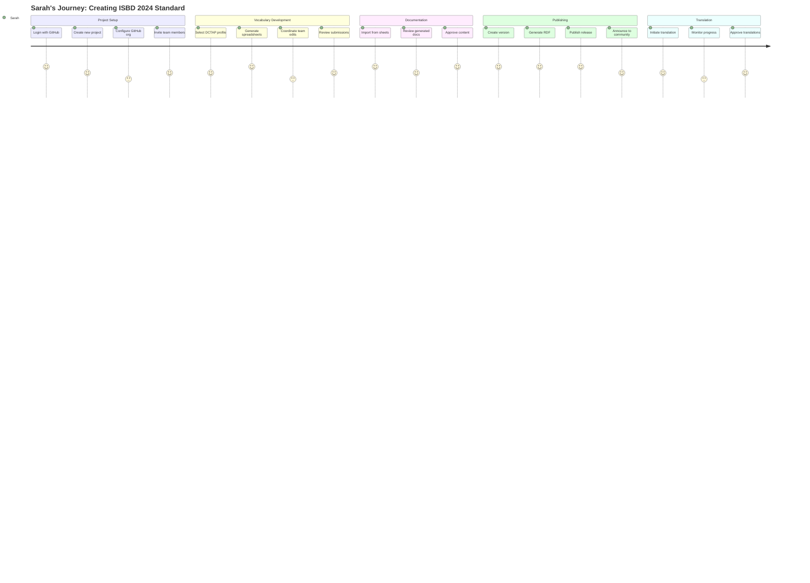
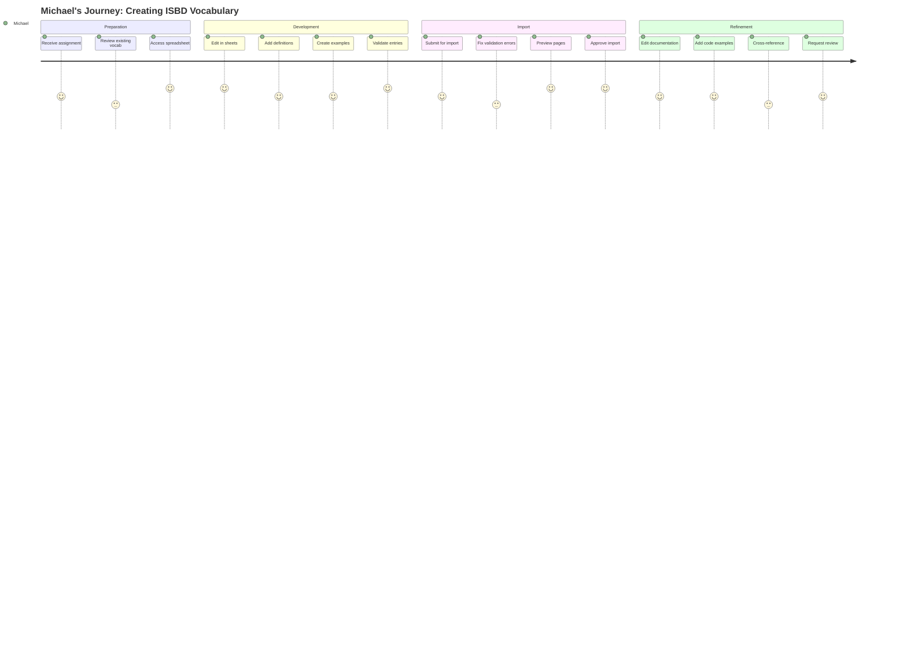
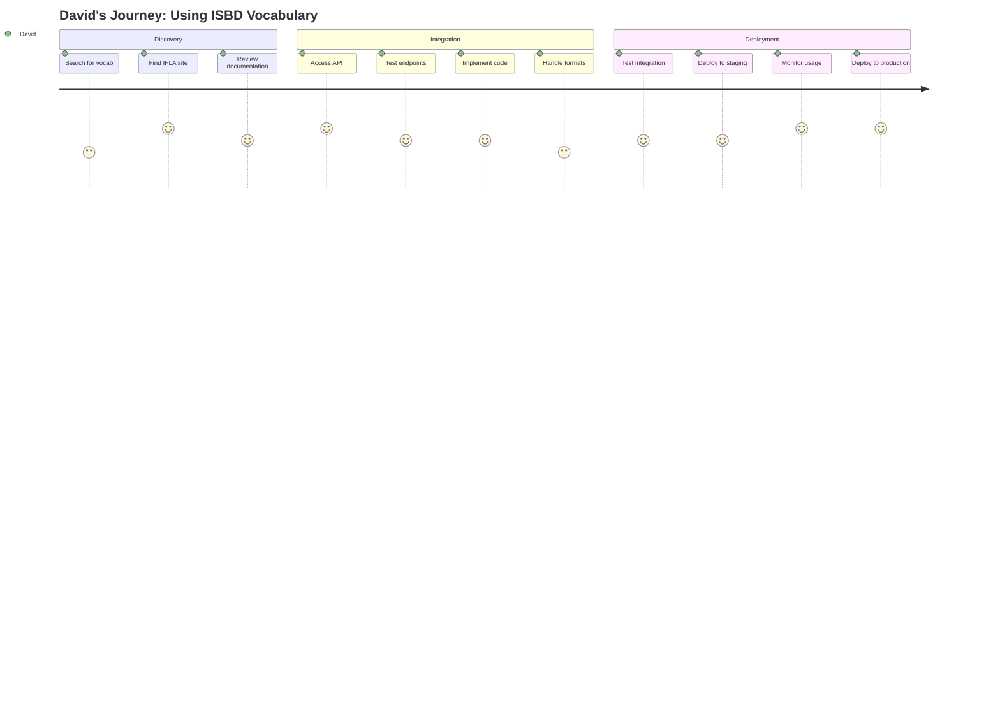
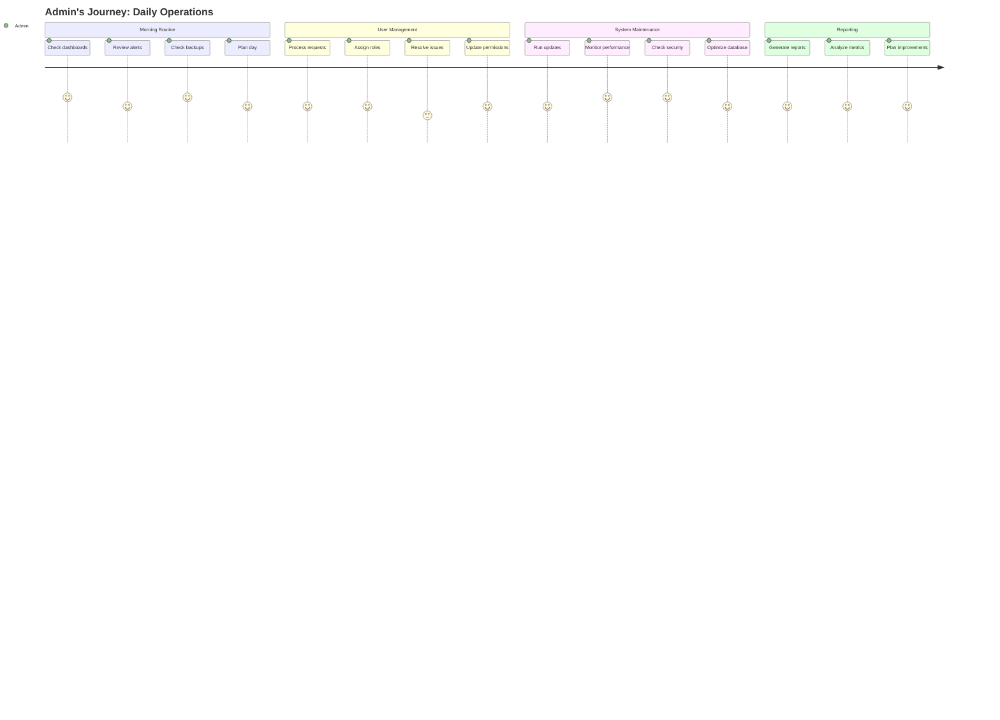

# User Journey Maps - IFLA Standards Platform

## Overview

This document maps the complete user journeys for each persona in the IFLA Standards Platform, identifying touchpoints, pain points, and opportunities for improvement.

---

## 1. Sarah - Review Group Administrator Journey

### Journey: Creating and Publishing a New Standard



### Detailed Journey Map

#### Phase 1: Initial Setup (Day 1-7)

| Stage | Actions | Thoughts | Emotions | Pain Points | Opportunities |
|-------|---------|----------|----------|-------------|---------------|
| **Discovery** | - Receives platform invitation<br>- Explores documentation<br>- Watches tutorial videos | "Is this going to be easier than our current process?" | Curious but skeptical | - Unclear migration path<br>- Learning curve | - Onboarding wizard<br>- Migration tools |
| **First Login** | - Signs in with GitHub<br>- Completes profile<br>- Views dashboard | "Good, I can use my existing GitHub account" | Relieved | - Empty dashboard<br>- No clear next steps | - Welcome tour<br>- Quick start guide |
| **Project Creation** | - Clicks "New Project"<br>- Selects review group<br>- Links GitHub org<br>- Names project | "The GitHub integration is seamless" | Confident | - Org permissions unclear<br>- Namespace concept new | - Permission checker<br>- Contextual help |
| **Team Setup** | - Invites core team<br>- Assigns roles<br>- Creates namespaces<br>- Sets up structure | "I hope everyone understands their roles" | Organized | - Bulk invite missing<br>- Role descriptions vague | - Bulk operations<br>- Role templates |

#### Phase 2: Development (Week 2-8)

| Stage | Actions | Thoughts | Emotions | Pain Points | Opportunities |
|-------|---------|----------|----------|-------------|---------------|
| **DCTAP Selection** | - Reviews available profiles<br>- Customizes for ISBD<br>- Tests validation rules | "These profiles save us so much time" | Impressed | - Customization complex<br>- Preview limited | - Visual editor<br>- Live preview |
| **Spreadsheet Generation** | - Generates templates<br>- Shares with team<br>- Sets up collaboration | "The team can work in familiar tools" | Satisfied | - Permission management<br>- Version control | - Real-time sync<br>- Change tracking |
| **Content Review** | - Monitors progress<br>- Reviews submissions<br>- Provides feedback<br>- Resolves conflicts | "I can see everything in one place" | In control | - Comment threading<br>- Notification overload | - Smart notifications<br>- AI assistance |
| **Import Process** | - Validates spreadsheets<br>- Reviews errors<br>- Approves imports<br>- Generates documentation | "The validation caught issues we'd miss" | Grateful | - Error messages technical<br>- Batch operations slow | - Plain language errors<br>- Performance optimization |

#### Phase 3: Publishing (Week 9-10)

| Stage | Actions | Thoughts | Emotions | Pain Points | Opportunities |
|-------|---------|----------|----------|-------------|---------------|
| **Version Creation** | - Assigns version number<br>- Writes release notes<br>- Reviews final content<br>- Sets publication date | "This is a big milestone" | Proud | - Version strategy unclear<br>- Rollback concerns | - Version advisor<br>- Rollback capability |
| **RDF Generation** | - Selects formats<br>- Generates files<br>- Validates output<br>- Tests URIs | "The RDF looks perfect" | Confident | - Format selection<br>- Validation time | - Format recommendations<br>- Parallel processing |
| **Release** | - Publishes version<br>- Creates announcement<br>- Notifies stakeholders<br>- Monitors feedback | "We did it!" | Accomplished | - Distribution unclear<br>- Metrics missing | - Distribution dashboard<br>- Analytics integration |

#### Phase 4: Maintenance (Ongoing)

| Stage | Actions | Thoughts | Emotions | Pain Points | Opportunities |
|-------|---------|----------|----------|-------------|---------------|
| **Translation Management** | - Initiates Crowdin sync<br>- Assigns translators<br>- Tracks progress<br>- Reviews translations | "Global reach is important" | Responsible | - Progress visibility<br>- Quality control | - Translation dashboard<br>- Quality metrics |
| **Updates** | - Monitors issues<br>- Plans revisions<br>- Manages versions<br>- Communicates changes | "Continuous improvement" | Engaged | - Change tracking<br>- Community feedback | - Feedback integration<br>- Automated testing |

### Key Insights

1. **First Impression Critical**: Onboarding experience shapes long-term engagement
2. **GitHub Integration**: Seamless integration builds confidence
3. **Team Coordination**: Central visibility reduces management overhead
4. **Validation Value**: Automated validation prevents downstream issues
5. **Achievement Moments**: Publishing milestones drive satisfaction

---

## 2. Michael - Standards Editor Journey

### Journey: Importing and Refining Vocabulary



### Detailed Journey Map

#### Day 1: Getting Started

| Time | Actions | Thoughts | Emotions | Pain Points | Opportunities |
|------|---------|----------|----------|-------------|---------------|
| 9:00 AM | - Receives email notification<br>- Clicks dashboard link<br>- Reviews assignment | "New vocabulary to work on" | Motivated | - Context missing<br>- Deadline unclear | - Rich notifications<br>- Project context |
| 9:30 AM | - Opens namespace dashboard<br>- Locates spreadsheet link<br>- Opens in Google Sheets | "Good, I can use Sheets" | Comfortable | - Multiple tools<br>- Navigation steps | - Quick access<br>- Integrated view |
| 10:00 AM | - Reviews DCTAP rules<br>- Checks existing terms<br>- Plans approach | "The validation rules are clear" | Prepared | - Rule complexity<br>- Reference scattered | - Inline help<br>- Cheat sheet |

#### Days 2-5: Content Development

| Stage | Actions | Thoughts | Emotions | Pain Points | Opportunities |
|-------|---------|----------|----------|-------------|---------------|
| **Vocabulary Creation** | - Adds new terms<br>- Writes definitions<br>- Establishes relationships<br>- Includes examples | "This structure makes sense" | Focused | - Repetitive tasks<br>- Consistency checks | - Auto-complete<br>- Templates |
| **Collaboration** | - Comments on unclear items<br>- Discusses with team<br>- Incorporates feedback<br>- Resolves conflicts | "Good team discussion" | Collaborative | - Comment threading<br>- Version conflicts | - Real-time collaboration<br>- Conflict resolution |
| **Validation** | - Runs local checks<br>- Fixes format issues<br>- Ensures completeness<br>- Prepares for import | "Catching errors early" | Diligent | - Manual validation<br>- Error unclear | - Live validation<br>- Clear guidance |

#### Day 6: Import Process

| Time | Actions | Thoughts | Emotions | Pain Points | Opportunities |
|------|---------|----------|----------|-------------|---------------|
| 2:00 PM | - Navigates to import<br>- Selects spreadsheet<br>- Initiates validation | "Here we go..." | Anxious | - Process unclear<br>- Wait time | - Progress indicator<br>- Time estimates |
| 2:15 PM | - Reviews validation results<br>- Identifies 3 errors<br>- Returns to spreadsheet<br>- Fixes issues | "At least it caught these" | Frustrated then relieved | - Context switching<br>- Error location | - Direct edit links<br>- Inline fixes |
| 2:45 PM | - Re-runs validation<br>- All checks pass<br>- Reviews preview<br>- Confirms import | "The preview looks great" | Satisfied | - Preview limited<br>- No undo | - Full preview<br>- Rollback option |
| 3:00 PM | - Import completes<br>- Views generated pages<br>- Checks RDF output<br>- Notes improvements | "It actually worked!" | Accomplished | - Post-import edits<br>- RDF understanding | - Edit capabilities<br>- RDF visualization |

#### Days 7-10: Refinement

| Stage | Actions | Thoughts | Emotions | Pain Points | Opportunities |
|-------|---------|----------|----------|-------------|---------------|
| **Documentation Enhancement** | - Edits page content<br>- Adds usage notes<br>- Includes examples<br>- Improves descriptions | "Making it user-friendly" | Creative | - Markdown learning<br>- Component usage | - WYSIWYG option<br>- Component library |
| **Cross-referencing** | - Links related terms<br>- Creates hierarchies<br>- Ensures consistency<br>- Validates links | "Building connections" | Systematic | - Manual linking<br>- Broken links | - Auto-linking<br>- Link checking |
| **Review Request** | - Marks as ready<br>- Assigns reviewers<br>- Adds comments<br>- Waits for feedback | "Hope they like it" | Hopeful | - Review process<br>- Notification delays | - Review workflow<br>- Real-time updates |

### Key Insights

1. **Tool Familiarity**: Leveraging known tools (Sheets) reduces friction
2. **Validation Value**: Early error detection saves time
3. **Preview Importance**: Visual confirmation builds confidence
4. **Iterative Process**: Multiple refinement cycles are normal
5. **Achievement Tracking**: Progress visibility motivates completion

---

## 3. Elena - Translator Journey

### Journey: Translating ISBD to Spanish


### Detailed Journey Map

#### Week 1: Onboarding

| Stage | Actions | Thoughts | Emotions | Pain Points | Opportunities |
|-------|---------|----------|----------|-------------|---------------|
| **Assignment** | - Receives invitation<br>- Reviews scope<br>- Checks timeline<br>- Accepts task | "Spanish translation for ISBD - interesting!" | Excited | - Scope unclear<br>- Time estimate missing | - Detailed brief<br>- Effort estimation |
| **Platform Access** | - Logs into Crowdin<br>- Navigates to project<br>- Reviews interface<br>- Sets preferences | "The interface is intuitive" | Comfortable | - Multiple platforms<br>- Preference setup | - Single sign-on<br>- Smart defaults |
| **Preparation** | - Downloads glossary<br>- Reviews style guide<br>- Checks previous translations<br>- Plans approach | "Good reference materials" | Prepared | - Information overload<br>- Inconsistent guides | - Consolidated resources<br>- Interactive guides |

#### Weeks 2-4: Active Translation

| Stage | Actions | Thoughts | Emotions | Pain Points | Opportunities |
|-------|---------|----------|----------|-------------|---------------|
| **Term Translation** | - Reads source term<br>- Researches context<br>- Chooses translation<br>- Adds to memory | "Need to maintain consistency" | Focused | - Context limited<br>- Technical terms | - Enhanced context<br>- Domain dictionary |
| **Quality Checks** | - Reviews consistency<br>- Checks grammar<br>- Validates terminology<br>- Compares versions | "Quality is crucial" | Meticulous | - Manual checking<br>- Time consuming | - Automated QA<br>- Consistency tools |
| **Collaboration** | - Comments on difficulties<br>- Asks for clarification<br>- Discusses with team<br>- Shares solutions | "Team input helps" | Collaborative | - Async communication<br>- Response delays | - Real-time chat<br>- Expert access |
| **Progress Tracking** | - Completes daily goals<br>- Updates progress<br>- Reviews statistics<br>- Plans next day | "Making good progress" | Satisfied | - Manual tracking<br>- Unclear targets | - Auto-tracking<br>- Visual progress |

#### Week 5: Review and Approval

| Stage | Actions | Thoughts | Emotions | Pain Points | Opportunities |
|-------|---------|----------|----------|-------------|---------------|
| **Submission** | - Completes section<br>- Runs final checks<br>- Submits for review<br>- Notifies reviewer | "Hope it meets standards" | Anxious | - Submission process<br>- Review criteria | - Guided submission<br>- Clear criteria |
| **Feedback** | - Receives comments<br>- Reviews suggestions<br>- Understands issues<br>- Plans revisions | "Constructive feedback" | Receptive | - Feedback format<br>- Scattered comments | - Structured feedback<br>- Inline suggestions |
| **Revision** | - Makes corrections<br>- Updates translations<br>- Re-submits<br>- Tracks changes | "Almost there" | Determined | - Revision tracking<br>- Version control | - Change tracking<br>- Version compare |
| **Approval** | - Gets approval<br>- Sees published<br>- Receives thanks<br>- Updates portfolio | "Great accomplishment!" | Proud | - Recognition limited<br>- Portfolio tracking | - Achievement badges<br>- Public credits |

### Translation Workflow Details

#### Daily Routine (Typical 4-hour session)

| Time | Activity | Tools Used | Output | Challenges |
|------|----------|------------|--------|------------|
| 9:00-9:30 | Review assignments<br>Check messages<br>Plan session | Crowdin<br>Email<br>Calendar | Session plan | Prioritization |
| 9:30-11:00 | Active translation<br>Research terms<br>Use TM | Crowdin<br>Dictionaries<br>Google | 50-70 terms | Complex terms |
| 11:00-11:15 | Break | - | - | - |
| 11:15-12:30 | Continue translation<br>Quality checks<br>Add notes | Crowdin<br>QA tools | 40-60 terms | Consistency |
| 12:30-13:00 | Review work<br>Submit batch<br>Update progress | Crowdin<br>Platform | Progress report | Submission process |

### Key Insights

1. **Context Crucial**: Understanding context improves translation quality
2. **Consistency Tools**: Translation memory saves time and ensures consistency
3. **Collaborative Process**: Team input resolves ambiguities
4. **Progress Visibility**: Tracking motivates continued effort
5. **Recognition Important**: Acknowledgment drives engagement

---

## 4. David - Vocabulary Consumer Journey

### Journey: Implementing ISBD in Library System



### Detailed Journey Map

#### Phase 1: Discovery (Day 1)

| Stage | Actions | Thoughts | Emotions | Pain Points | Opportunities |
|-------|---------|----------|----------|-------------|---------------|
| **Initial Search** | - Googles "ISBD RDF"<br>- Finds various sources<br>- Compares options<br>- Lands on IFLA site | "Which is authoritative?" | Confused | - Multiple sources<br>- SEO ranking | - Better SEO<br>- Clear authority |
| **Site Exploration** | - Browses homepage<br>- Finds vocabulary section<br>- Reviews documentation<br>- Checks examples | "This looks official" | Reassured | - Navigation complex<br>- Tech docs buried | - Developer portal<br>- Quick start |
| **Documentation Review** | - Reads API docs<br>- Checks formats<br>- Reviews schemas<br>- Notes endpoints | "Good technical docs" | Impressed | - Examples limited<br>- No SDK | - More examples<br>- Client libraries |

#### Phase 2: Implementation (Days 2-5)

| Stage | Actions | Thoughts | Emotions | Pain Points | Opportunities |
|-------|---------|----------|----------|-------------|---------------|
| **API Testing** | - Gets API key<br>- Tests with curl<br>- Tries different formats<br>- Validates responses | "Content negotiation works well" | Satisfied | - Auth process<br>- Rate limits unclear | - Instant keys<br>- Clear limits |
| **Code Integration** | - Writes client code<br>- Handles responses<br>- Maps to internal model<br>- Adds error handling | "Clean API design" | Confident | - Mapping complexity<br>- Version handling | - Mapping tools<br>- Version strategy |
| **Format Handling** | - Tests JSON-LD<br>- Tries Turtle<br>- Settles on JSON-LD<br>- Implements parser | "JSON-LD easier to work with" | Relieved | - Format differences<br>- Parser selection | - Format guide<br>- Parser recommendations |

#### Phase 3: Deployment (Week 2)

| Stage | Actions | Thoughts | Emotions | Pain Points | Opportunities |
|-------|---------|----------|----------|-------------|---------------|
| **Testing** | - Unit tests<br>- Integration tests<br>- Load testing<br>- Edge cases | "Solid performance" | Confident | - Test data<br>- Edge cases | - Test fixtures<br>- Edge case docs |
| **Staging Deployment** | - Deploy to staging<br>- Run acceptance tests<br>- Get team feedback<br>- Fix issues | "Almost ready" | Optimistic | - Config management<br>- Environment differences | - Config templates<br>- Environment guide |
| **Production** | - Deploy to prod<br>- Monitor metrics<br>- Check errors<br>- Confirm success | "It's live!" | Accomplished | - Monitoring setup<br>- Success metrics | - Monitoring guides<br>- Success criteria |
| **Maintenance** | - Monitor usage<br>- Handle updates<br>- Track versions<br>- Plan upgrades | "Need to stay current" | Responsible | - Update notifications<br>- Breaking changes | - Change alerts<br>- Migration guides |

### API Integration Code Journey

```javascript
// Day 2: First attempt
fetch('https://iflastandards.info/ns/isbd/title')
  .then(res => res.text())
  .then(console.log)
// "Why HTML?"

// Day 2: Discovery of content negotiation
fetch('https://iflastandards.info/ns/isbd/title', {
  headers: { 'Accept': 'application/ld+json' }
})
// "Ah, that's better!"

// Day 3: Building client
class ISBDClient {
  async getVocabulary(term, format = 'application/ld+json') {
    const response = await fetch(`${BASE_URL}/${term}`, {
      headers: { 'Accept': format }
    });
    return response.json();
  }
}

// Day 4: Adding caching
class ISBDClient {
  constructor() {
    this.cache = new Map();
  }
  
  async getVocabulary(term, format = 'application/ld+json') {
    const cacheKey = `${term}:${format}`;
    if (this.cache.has(cacheKey)) {
      return this.cache.get(cacheKey);
    }
    // ... fetch and cache
  }
}

// Day 5: Production ready
class ISBDClient {
  constructor(config) {
    this.config = config;
    this.cache = new Cache(config.cache);
    this.rateLimiter = new RateLimiter(config.rateLimit);
  }
  
  async getVocabulary(term, options = {}) {
    await this.rateLimiter.acquire();
    try {
      // ... implementation
    } catch (error) {
      this.handleError(error);
    }
  }
}
```

### Key Insights

1. **Discovery Friction**: Finding authoritative source takes effort
2. **Documentation Quality**: Good docs accelerate implementation
3. **API Design**: Clean APIs reduce integration complexity
4. **Format Flexibility**: Content negotiation appreciated
5. **Maintenance Concerns**: Ongoing updates need consideration

---

## 5. System Administrator Journey

### Journey: Platform Maintenance and User Support



### Detailed Daily Operations

#### Morning (8:00 AM - 12:00 PM)

| Time | Task | Actions | Tools | Challenges |
|------|------|---------|-------|------------|
| 8:00-8:30 | System Check | - Review overnight alerts<br>- Check system status<br>- Verify backups<br>- Review error logs | Monitoring dashboard<br>Logging system<br>Backup manager | Alert fatigue<br>False positives |
| 8:30-9:30 | User Support | - Check support queue<br>- Respond to tickets<br>- Reset passwords<br>- Guide users | Help desk system<br>Admin panel<br>Documentation | Repetitive issues<br>User education |
| 9:30-10:30 | Access Management | - Process role requests<br>- Audit permissions<br>- Update teams<br>- Document changes | User management<br>Audit logs<br>Cerbos policies | Complex permissions<br>Audit trails |
| 10:30-12:00 | Maintenance | - Apply updates<br>- Run diagnostics<br>- Optimize queries<br>- Clean up data | SSH/Terminal<br>Database tools<br>Monitoring | Downtime windows<br>Performance impact |

#### Afternoon (1:00 PM - 5:00 PM)

| Time | Task | Actions | Tools | Challenges |
|------|------|---------|-------|------------|
| 1:00-2:00 | Security Review | - Check vulnerabilities<br>- Review access logs<br>- Update policies<br>- Test backups | Security scanner<br>Log analysis<br>Policy editor | Threat landscape<br>Compliance |
| 2:00-3:00 | Performance | - Analyze metrics<br>- Identify bottlenecks<br>- Plan optimizations<br>- Test improvements | APM tools<br>Query analyzer<br>Load testing | Root cause analysis<br>Resource limits |
| 3:00-4:00 | Documentation | - Update runbooks<br>- Document changes<br>- Create guides<br>- Review procedures | Wiki<br>Documentation system<br>Diagram tools | Keeping current<br>Version control |
| 4:00-5:00 | Planning | - Review tickets<br>- Plan tomorrow<br>- Update stakeholders<br>- Set priorities | Project management<br>Calendar<br>Email | Competing priorities<br>Resource allocation |

### Critical Scenarios

#### Scenario 1: Production Incident

```
Timeline:
10:47 AM - Alert: API response time degraded
10:48 AM - Check monitoring dashboard
10:50 AM - Identify database query bottleneck
10:52 AM - Implement query optimization
10:55 AM - Deploy fix to production
10:58 AM - Verify performance restored
11:05 AM - Document incident and resolution
11:15 AM - Send incident report to stakeholders
```

#### Scenario 2: Security Audit

```
Process:
1. Receive audit request
2. Generate access reports
3. Review permission assignments
4. Identify over-privileged accounts
5. Create remediation plan
6. Implement changes
7. Document compliance
8. Schedule follow-up review
```

### Admin Dashboard Mockup

```
┌─────────────────────────────────────────────────────────────┐
│ IFLA Standards Platform - Admin Dashboard                    │
├─────────────────────────────────────────────────────────────┤
│                                                             │
│ ┌─────────────┐ ┌─────────────┐ ┌─────────────┐ ┌─────────┐│
│ │ System      │ │ Active      │ │ API         │ │ Storage ││
│ │ Uptime      │ │ Users       │ │ Calls       │ │ Usage   ││
│ │ 99.97%      │ │ 342         │ │ 1.2M        │ │ 45.2 GB ││
│ └─────────────┘ └─────────────┘ └─────────────┘ └─────────┘│
│                                                             │
│ Recent Alerts                    Performance Metrics        │
│ ┌─────────────────────────┐     ┌────────────────────────┐│
│ │ ⚠️  High API usage      │     │ Response Time   124ms  ││
│ │ ✓  Backup completed     │     │ Error Rate      0.02%  ││
│ │ ⚠️  SSL cert expiring   │     │ Throughput      450rps ││
│ └─────────────────────────┘     └────────────────────────┘│
│                                                             │
│ User Activity                    System Tasks               │
│ ┌─────────────────────────┐     ┌────────────────────────┐│
│ │ New registrations: 12   │     │ □ Database backup      ││
│ │ Role changes: 5         │     │ □ Security scan        ││
│ │ Failed logins: 3        │     │ □ Log rotation         ││
│ └─────────────────────────┘     └────────────────────────┘│
└─────────────────────────────────────────────────────────────┘
```

### Key Insights

1. **Proactive Monitoring**: Early detection prevents major incidents
2. **Automation Value**: Automated tasks free time for strategic work
3. **Documentation Importance**: Good docs reduce support burden
4. **Security Priority**: Constant vigilance required
5. **User Communication**: Clear communication prevents frustration

---

## Cross-Journey Insights

### Common Pain Points Across All Journeys

1. **Onboarding Complexity**
   - Multiple tools and platforms
   - Unclear starting points
   - Missing context

2. **Collaboration Friction**
   - Asynchronous communication delays
   - Tool switching overhead
   - Version conflicts

3. **Progress Visibility**
   - Manual tracking required
   - Unclear completion criteria
   - Limited milestone recognition

4. **Technical Barriers**
   - Complex error messages
   - Limited examples
   - Missing automation

### Opportunities for Improvement

1. **Unified Experience**
   - Single sign-on everywhere
   - Consistent UI patterns
   - Integrated workflows

2. **Intelligent Assistance**
   - Context-aware help
   - Proactive suggestions
   - Smart defaults

3. **Enhanced Collaboration**
   - Real-time features
   - Better notifications
   - Integrated communication

4. **Automation**
   - Repetitive task automation
   - Intelligent validation
   - Workflow optimization

### Success Metrics by Journey

| Persona | Key Success Metric | Current | Target |
|---------|-------------------|---------|---------|
| Sarah (RG Admin) | Time to publish standard | 10 weeks | 6 weeks |
| Michael (Editor) | Vocabulary import success rate | 75% | 95% |
| Elena (Translator) | Terms translated per day | 100 | 150 |
| David (Consumer) | Time to first API call | 2 days | 2 hours |
| Admin | Incident resolution time | 2 hours | 30 minutes |

---

## Implementation Priorities

Based on journey analysis, prioritize:

### High Impact, Quick Wins
1. Onboarding wizard for each persona
2. Real-time validation in spreadsheets
3. API quick start guide
4. Progress tracking dashboards

### Strategic Improvements
1. Unified platform experience
2. AI-powered assistance
3. Advanced collaboration tools
4. Comprehensive automation

### Long-term Vision
1. Predictive analytics
2. Intelligent workflows
3. Community features
4. Mobile applications