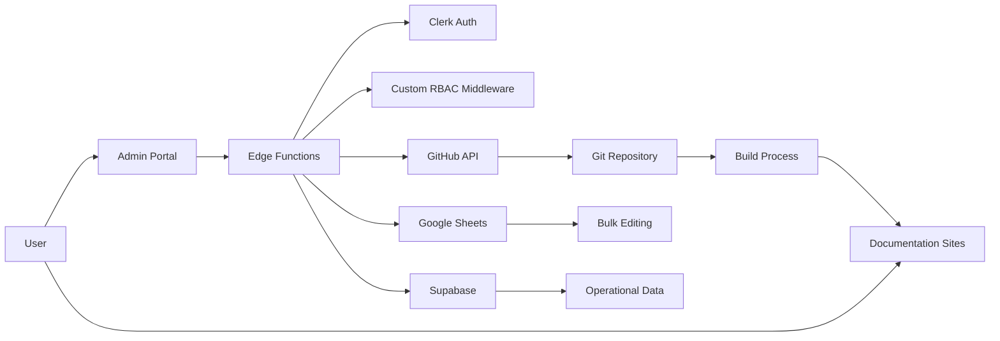

# System Architecture Overview

**Version:** 2.0  
**Date:** July 2025  
**Status:** Current Implementation

## Executive Summary

The IFLA Standards Platform is a modern, monorepo-based system designed to manage, publish, and maintain international library standards. Built on Nx workspace technology, it combines multiple Docusaurus documentation sites with a centralized Next.js admin portal, leveraging Git as the single source of truth for all vocabulary data.

## Core Architecture Principles

### 1. **Git-Centric Data Management**
- All vocabulary content, DCTAP profiles, and configurations are version-controlled
- Changes require PR review process ensuring quality and traceability
- Automatic deployment on merge provides continuous delivery
- No database dependencies during build time ensures reproducible builds

### 2. **Distributed System Architecture**
- **Documentation Sites**: Individual Docusaurus sites for each standard/namespace
- **Admin Portal**: Centralized Next.js application for management tasks
- **Edge Functions**: Serverless API endpoints via Render
- **External Services**: Integrated with GitHub, Google Sheets, Clerk, and Supabase

### 3. **Progressive Enhancement**
- Static generation for public documentation (performance)
- Dynamic features layered on top (interactivity)
- Graceful degradation when services unavailable
- Mobile-first responsive design

## Technology Stack

### Frontend Technologies

#### Admin Portal (Next.js)
```yaml
Framework: Next.js 15.2.5 (App Router)
UI Framework: React 19.1.0
Type System: TypeScript 5.7
Styling: Material-UI (MUI) Theme System
State Management: React Context + SWR
Authentication: Clerk components
Component Location: apps/admin/src/components/
Test Location: apps/admin/src/test/, apps/admin/src/tests/
```

#### Documentation Sites (Docusaurus)
```yaml
Framework: Docusaurus 3.8+
UI Framework: React 19.1.0
Type System: TypeScript 5.7
Styling: SASS/SCSS + Infima theme
Component Location: packages/theme/src/components/
Test Location: packages/theme/src/tests/
Static Generation: MDX pages + React components
```

#### Shared Libraries
```yaml
Component Library: @ifla/theme (shared utilities)
Validation: @ifla/validation (DCTAP schemas)
RDF Tools: @ifla/rdf-tools (RDF processing)
```

### Backend Technologies
```yaml
Runtime: Node.js 20+
API Layer: Next.js App Router API Routes (standard fetch)
Authentication: Clerk (with built-in session management)
Authorization: Custom RBAC via Clerk publicMetadata
Database: Supabase (PostgreSQL)
File Storage: Git/GitHub
Package Manager: pnpm 10.12.4
```

### Development Tools
```yaml
Monorepo: Nx 21.2.2
Build Optimization: Nx Cloud
Testing: Vitest + Playwright
Linting: ESLint + Prettier
CI/CD: GitHub Actions
Version Control: Git + GitHub
```

### Technology Evolution from OMR25

| Component | OMR25 (March 2025) | Current (July 2025) | Rationale for Change |
|-----------|-------------------|---------------------|---------------------|
| **Language** | PHP 8.4 | TypeScript/JavaScript | Modern ecosystem, better tooling |
| **Backend** | Laravel 11 | Next.js + Render API | Serverless, edge computing |
| **Database** | MariaDB | Git + Supabase (temp only) | Version control as primary storage |
| **Frontend** | Filament/Livewire | React 19 + Docusaurus | Component ecosystem, static generation |
| **Testing** | Pest | Vitest/Playwright | JavaScript ecosystem alignment |
| **Build** | Webpack/Mix | Nx monorepo | Better monorepo management |
| **CI/CD** | GitHub Actions | GitHub Actions + Nx Cloud | Distributed builds, caching |

The shift from the original OMR25 monolithic Laravel architecture to the current JAMstack approach represents a fundamental rethinking prioritizing static generation for performance, Git as source of truth, edge computing over traditional servers, and the modern React ecosystem over PHP.

## Organizational Structure

### IFLA Governance Alignment
The technical architecture mirrors IFLA's organizational structure:

```yaml
IFLA Advisory Committee on Standards (METATEC)
├── International Cataloguing Principles (ICP)
│   └── Namespaces: icp, muldicat
├── Bibliographic Conceptual Models (BCM)
│   └── Namespaces: frbr, lrm, frad
├── International Standard Bibliographic Description (ISBD)
│   └── Namespaces: isbd, isbdm
└── Permanent UNIMARC Committee (PUC)
    └── Namespaces: unimarc, mri
```

### GitHub Organization Structure
The platform leverages GitHub's team management to reflect governance:
- **Organization**: `iflastandards`
- **Teams**: Mirror Review Groups with appropriate permissions
- **Projects**: Time-bound initiatives with specific deliverables
- **Access Control**: Project-based permissions for external contributors

## System Components

### 1. Documentation Sites (Docusaurus)
Each namespace/standard has its own Docusaurus site:
- **Purpose**: Public-facing documentation and vocabulary browsing
- **Examples**: ISBD, UNIMARC, LRM, FRBR, MulDiCat
- **Architecture**:
  - Static site generation (SSG)
  - No API routes (purely static)
  - No authentication required
  - Build-time data fetching from Git
- **Styling**:
  - Infima theme framework
  - SASS/SCSS for custom styles
  - CSS modules for component styles
- **Features**: 
  - Multilingual support via i18n
  - Version-controlled MDX content
  - Static generation for performance
  - Integrated vocabulary tables
  - GitHub-integrated feedback

### 2. Admin Portal (Next.js)
Centralized management application at `/admin`:
- **Purpose**: Vocabulary lifecycle management
- **Architecture**: 
  - App Router with React Server Components
  - Dynamic API routes in app/api/
  - basePath configuration for environment flexibility
  - Server-side rendering (SSR) and client components
- **Styling**:
  - Material-UI (MUI) v7 components
  - MUI theme system (sx prop, styled components)
  - Custom theme configuration
  - NO Tailwind CSS
- **Authentication**:
  - Clerk middleware on all routes
  - Custom RBAC via publicMetadata
  - Protected API endpoints
- **Features**:
  - Import/export workflows
  - DCTAP validation
  - Version publishing
  - Translation management
  - User and role administration

### 3. Shared Packages
Reusable libraries across the monorepo:
- **@ifla/theme**: UI components and styling
- **@ifla/validation**: DCTAP and schema validation
- **@ifla/rdf-tools**: RDF generation and parsing
- **@ifla/shared-config**: Centralized configuration

### 4. API Layer (Render API Endpoints)
Serverless endpoints for dynamic operations:
- **Authentication**: OAuth flows and session management
- **RDF Operations**: Generation and validation
- **Spreadsheet Integration**: Google Sheets import/export
- **Admin Operations**: User and namespace management

## Data Flow Architecture



## Deployment Architecture

### Environment Strategy
```yaml
Local Development:
  - URL: http://localhost:3000
  - Purpose: Development and testing
  - Features: Hot reload, debug tools

Preview Environment:
  - URL: https://iflastandards.github.io/platform/
  - Admin URL: https://admin-iflastandards-preview.onrender.com
  - Purpose: Staging and review
  - Features: Stakeholder review, testing

Production Environment:
  - Portal URL: https://www.iflastandards.info/
  - Admin URL: https://admin.iflastandards.info/
  - Sites URL: https://www.iflastandards.info/{sitekey}
  - Purpose: Live platform
  - Features: Full optimization, monitoring
```

### Build and Deployment Pipeline
1. **Local Development**: Nx affected commands for incremental builds
2. **Pre-commit Hooks**: Type checking, linting, unit tests
3. **Pre-push Validation**: Integration tests, build verification
4. **CI/CD Pipeline**: Environment validation, deployment
5. **Post-deployment**: Monitoring, error tracking

## Security Architecture

### Authentication Layers
- **Primary**: Clerk for user identity and SSO
- **Session Management**: NextAuth.js 5.0
- **API Security**: JWT tokens with short expiry

### Authorization Model
- **Authorization System**: Custom RBAC using Clerk publicMetadata
- **Role Hierarchy**: Superadmin → Review Group Admin → Namespace Admin → Editor → Translator → Reviewer
- **Metadata-based**: Roles and permissions stored in Clerk user publicMetadata
- **Resource-based**: Namespace-level permission inheritance
- **Comprehensive Documentation**: See [RBAC Authorization Model](./12-rbac-authorization-model.md), [Permission Matrix](./13-permission-matrix-detailed.md), and [RBAC Implementation](./14-rbac-implementation.md)

### Data Security
- **At Rest**: Git encryption, Supabase RLS
- **In Transit**: HTTPS everywhere, API encryption
- **Secrets Management**: Environment variables, GitHub secrets
- **Audit Trail**: Comprehensive logging of all changes

## Performance Optimizations

### Build Performance
- **Nx Caching**: Computation memoization
- **Incremental Builds**: Only affected projects rebuild
- **Parallel Execution**: Multi-core utilization
- **Distributed Cache**: Nx Cloud for team sharing

### Runtime Performance
- **Static Generation**: Pre-built documentation pages
- **Edge Computing**: Render API endpoints
- **CDN Distribution**: Global content delivery
- **Image Optimization**: Next.js automatic optimization

### Developer Experience
- **Fast Feedback**: <5s for unit tests
- **Smart Testing**: Affected-only test runs
- **Hot Reload**: Instant development updates
- **Type Safety**: Full TypeScript coverage

## Scalability Considerations

### Horizontal Scaling
- **Documentation Sites**: Unlimited namespace sites
- **Edge Functions**: Auto-scaling serverless
- **CDN**: Global distribution
- **Database**: Supabase connection pooling

### Vertical Scaling
- **Build Optimization**: Nx Cloud agents
- **Caching Strategy**: Multi-level caching
- **Lazy Loading**: Code splitting
- **Progressive Enhancement**: Feature flags

## Integration Points

### External Services
1. **GitHub**: Organization, teams, version control
2. **Google Sheets**: Bulk vocabulary editing
3. **Clerk**: User authentication and profiles
4. **Supabase**: Operational data and logs
5. **Crowdin**: Translation management
6. **TinaCMS**: Content editing (planned)

### Internal Integration
- **Monorepo Structure**: Shared dependencies
- **Configuration Matrix**: Centralized settings
- **Component Library**: Consistent UI
- **Testing Framework**: Unified approach

## Future Architecture Considerations

### Planned Enhancements
1. **GraphQL API**: For complex queries
2. **Real-time Updates**: WebSocket integration
3. **Advanced Search**: Elasticsearch integration
4. **AI Integration**: Vocabulary suggestions
5. **Mobile Apps**: React Native clients

### Architecture Evolution
- Maintain backward compatibility
- Progressive migration strategies
- Feature flag deployments
- Continuous architecture review

## Key Architecture Decisions

### Decision Log
1. **Monorepo over Multirepo**: Simplified dependency management
2. **Git as Source of Truth**: Version control for all data
3. **Static First**: Performance and reliability
4. **TypeScript Everywhere**: Type safety across stack
5. **Edge Functions**: Scalability without servers
6. **Centralized Config**: Maintainability over flexibility

### Trade-offs Accepted
- Build complexity for developer experience
- Initial setup time for long-term maintainability
- Multiple services for specialized functionality
- Static generation limitations for real-time features

## Implementation Roadmap

### MVP Critical Path (12 Weeks)

#### Weeks 1-3: Vocabulary Server 🔴 CRITICAL
**Why First**: Without this, we cannot migrate any namespaces from legacy systems.

**Deliverables**:
- Nginx redirect configuration system
- Pathmap data structure and storage
- Content negotiation logic
- Lexical alias generation system
- Version-aware routing
- Load testing and monitoring setup

#### Weeks 4-7: Core Admin Portal 🟡 HIGH PRIORITY
**Why Second**: Needed for user management and basic operations.

**Deliverables**:
- Next.js admin app setup with Clerk auth
- User CRUD operations and role assignment
- Review Group management
- Namespace listing and activity logging
- Basic system status dashboard

#### Weeks 8-10: GitHub Integration 🟢 IMPORTANT
**Why Third**: Enables project-based collaboration model.

**Deliverables**:
- GitHub App setup and authentication
- Project/Issue/PR synchronization
- Team membership sync
- Project dashboards and notifications

#### Weeks 11-12: Import/Publishing Pipeline 🔵 NECESSARY
**Why Fourth**: Enables actual vocabulary management.

**Deliverables**:
- Google Sheets authentication and import UI
- Build triggers and validation pipeline
- Pathmap generation and deployment automation

### Post-MVP Phases

#### Phase 1 (Months 4-5)
- TinaCMS integration
- Advanced project management
- Translation workflow basics
- Performance optimization

#### Phase 2 (Months 6-7)
- Crowdin integration
- AI-powered features
- Advanced analytics
- Bulk operations

#### Phase 3 (Months 8-9)
- Full migration of all namespaces
- Legacy system decommission
- Advanced collaboration features
- Public API launch

## Success Metrics

### Technical Metrics
- Build time: <5 minutes with caching
- Page load: <3 seconds globally
- API response: <200ms average
- Uptime: 99.9% availability

### Quality Metrics
- Test coverage: >90% critical paths
- Type coverage: 100% for core modules
- Accessibility: WCAG 2.1 AA compliant
- Documentation: 100% API coverage

### Accessibility Excellence

As an international standards organization, IFLA demonstrates leadership in digital accessibility by voluntarily exceeding global best practices:

**Strategic Commitment:**
- **Standards Leadership**: IFLA models the accessibility excellence expected of modern information systems
- **Global Inclusion**: Ensuring equitable access across all regions, languages, and abilities
- **Best Practice Adoption**: Voluntarily following EU Web Accessibility Directive and UK Public Sector Bodies guidelines as benchmarks
- **Continuous Evolution**: Regular accessibility audits and community feedback integration

**Technical Implementation:**
- **Baseline Standard**: WCAG 2.1 Level AA across all platform components
- **Progressive Enhancement**: Working towards Level AAA for critical user journeys
- **Multi-Language Support**: Accessibility features maintained across all language versions
- **Assistive Technology**: Full compatibility with screen readers, keyboard navigation, and alternative input methods

**Quality Assurance:**
- **Automated Testing**: Continuous accessibility validation in CI/CD pipeline
- **Manual Audits**: Quarterly reviews with actual assistive technology users
- **User Feedback**: Dedicated accessibility feedback channel with committed response times
- **Performance Metrics**: Accessibility score maintained above 95% (Lighthouse/axe)

### MVP Success Criteria
- Week 3: Vocabulary server handling 100% of test traffic
- Week 7: Admin portal functional for core operations
- Week 10: GitHub Projects synchronized
- Week 12: One namespace fully migrated with end-to-end workflow tested

This architecture provides a robust, scalable foundation for managing international library standards while maintaining excellent developer experience and platform performance.
