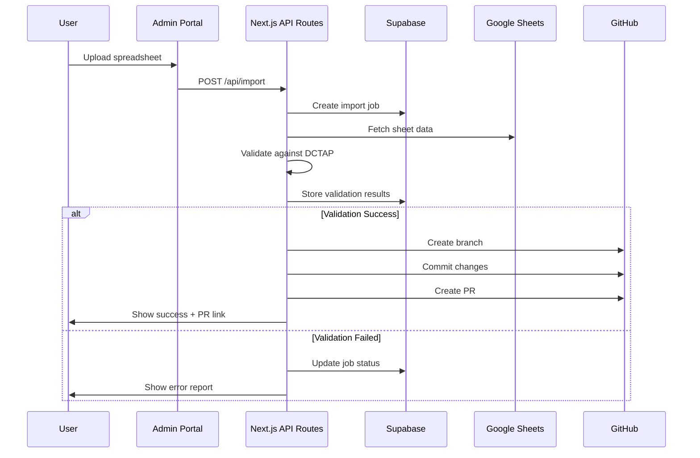
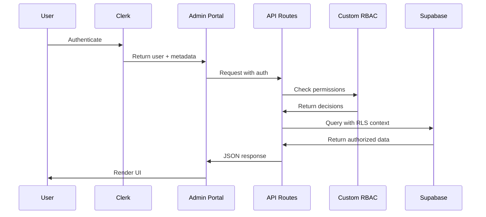
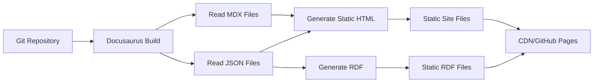
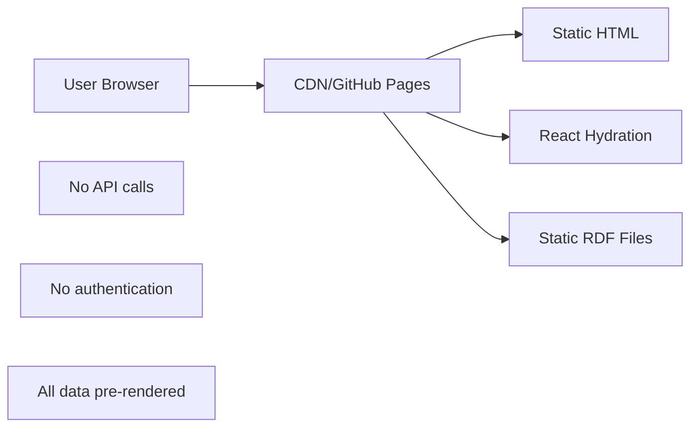

# Data Architecture

**Version:** 2.0  
**Date:** July 2025  
**Status:** Current Implementation

## Overview

The IFLA Standards Platform employs a distributed data architecture that leverages multiple specialized systems, each optimized for specific data types and access patterns. This document details the data storage strategy, models, flows, and governance principles.

## Core Data Principles

### 1. **Git as Single Source of Truth**
- All vocabulary definitions, standards content, and configurations are version-controlled
- Every change creates an auditable history with attribution
- Rollback capability for any historical state
- No critical data exists outside version control

### 2. **Distributed Storage Strategy**
Different data types are stored in systems optimized for their access patterns:
- **Static/Versioned Data** → Git/GitHub
- **User Identity** → Clerk
- **Operational Data** → Supabase
- **Temporary Workspaces** → Google Sheets
- **UI State** → Local Storage/Session Storage

### 3. **No Duplication Principle**
- Data exists in exactly one authoritative location
- Other systems may cache but never own data
- Clear ownership boundaries between systems
- Synchronization through events, not replication

## Data Storage Systems

### 1. Git/GitHub (Primary Storage)
**Purpose**: Version-controlled source of truth for all standards data

**Data Stored**:
```
standards/
  {namespace}/
    namespace.json          # Namespace metadata
    element-sets/           # Element set definitions
      *.json
    concept-schemes/        # Controlled vocabularies
      *.json
    dctap/                  # Validation profiles
      *.json
    docs/                   # Documentation content
      elements/*.mdx        # Element documentation
      concepts/*.mdx        # Concept documentation
    rdf/generated/          # Generated RDF outputs
      *.ttl, *.xml, *.jsonld
```

**Access Patterns**:
- Build-time: Static generation reads directly
- Runtime: API serves cached content
- Updates: Through PR workflow only

### 2. Clerk (User Identity)
**Purpose**: Authentication and minimal user metadata

**Data Model** (8KB limit per user):
```typescript
interface ClerkUserMetadata {
  exp: {
    fmt: string;      // Export format preferences (encoded)
    lang: string;     // Language preferences (comma-separated)
    ns: string;       // Last accessed namespace
    proj: string;     // Project IDs (comma-separated)
  };
  github?: {
    teams: string[];  // Cached team memberships
    lastSync: number; // Timestamp of last sync
  };
}
```

**Compression Strategy**:
- Boolean flags encoded as binary strings
- Lists stored as comma-separated values
- Abbreviated keys to save space
- References to full data stored elsewhere

### 3. Supabase (Operational Data)
**Purpose**: Processing workflows and transient operational data

**Core Tables**:
```sql
-- Review groups and projects (cached from GitHub)
review_groups (
  id uuid PRIMARY KEY,
  github_team_id text UNIQUE,
  name text,
  description text,
  cached_at timestamp
)

projects (
  id uuid PRIMARY KEY,
  github_project_id text UNIQUE,
  review_group_id uuid REFERENCES review_groups,
  name text,
  namespaces text[], -- Associated namespace keys
  cached_at timestamp
)

-- Import/Export workflow management
import_jobs (
  id uuid PRIMARY KEY,
  namespace text,
  sheet_id text,
  status text, -- pending, processing, completed, failed
  validation_results jsonb,
  created_by text,
  created_at timestamp
)

-- Validation and processing results
validation_results (
  id uuid PRIMARY KEY,
  job_id uuid REFERENCES import_jobs,
  row_number integer,
  column_name text,
  error_type text,
  error_message text,
  severity text -- error, warning, info
)

-- Audit logs (using Spatie pattern)
activity_logs (
  id uuid PRIMARY KEY,
  log_name text,
  description text,
  subject_type text,
  subject_id text,
  causer_type text,
  causer_id text,
  properties jsonb,
  created_at timestamp
)
```

**Row Level Security**:
- All tables implement RLS based on custom RBAC middleware decisions
- User can only see data for authorized namespaces
- Audit logs are immutable once created

### 4. Google Sheets (Temporary Workspaces)
**Purpose**: Collaborative bulk editing interface

**Data Structure**:
- Each sheet represents a vocabulary export
- DCTAP-compliant column structure
- Metadata in header rows
- Version tracking through sheet history

**Lifecycle**:
1. Export from Git → Google Sheet
2. Collaborative editing period
3. Import validation
4. Merge back to Git
5. Sheet archived or deleted

### 5. Local Storage (Client State)
**Purpose**: UI preferences and client-side caching

**Data Stored**:
```typescript
interface LocalStorageData {
  uiPreferences: {
    theme: 'light' | 'dark';
    sidebarCollapsed: boolean;
    tableViewOptions: object;
  };
  recentlyViewed: {
    namespaces: string[];
    vocabularies: string[];
    lastAccessed: Record<string, number>;
  };
  draftData: {
    forms: Record<string, object>;
    lastSaved: number;
  };
}
```

## Data Models

### Vocabulary Data Model
**Element Set Structure**:
```typescript
interface ElementSet {
  id: string;
  namespace: string;
  prefix: string;
  title: LocalizedString;
  description: LocalizedString;
  elements: Element[];
  metadata: {
    created: string;
    modified: string;
    version: string;
    status: 'draft' | 'review' | 'published';
  };
}

interface Element {
  id: string;
  uri: string;
  label: LocalizedString;
  definition: LocalizedString;
  type: 'class' | 'property';
  domain?: string[];
  range?: string[];
  cardinality?: Cardinality;
  examples?: LocalizedString[];
}

interface LocalizedString {
  [languageCode: string]: string;
}
```

### Multi-Element Set Architecture
**Namespace with Multiple Element Sets**:
```typescript
interface NamespaceConfiguration {
  id: string;
  title: string;
  description: string;
  elementSets: ElementSetInfo[];
  vocabularies: VocabularyInfo[];
  navigationStrategy: 'simple' | 'categorized' | 'hierarchical';
}

interface ElementSetInfo {
  id: string;
  title: string;
  description: string;
  elementCount: number;
  lastUpdated: string;
  path: string;
  categories: string[];
  prefix: string;
  baseIRI: string;
}

interface VocabularyInfo {
  id: string;
  title: string;
  description?: string;
  conceptCount: number;
  path: string;
  lastUpdated?: string;
  category?: string;
}
```

**Examples**:
- **ISBD**: 2 element sets (ISBD, ISBD Unconstrained) + 7 vocabularies
- **UNIMARC**: ~24 element sets organized by field groups + many vocabularies

**Directory Structure**:
```
/standards/{namespace}/
├── docs/
│   ├── index.mdx                    # Namespace overview
│   ├── elements/                    # Element Sets section
│   │   ├── index.mdx               # Element sets overview
│   │   ├── {element-set-1}/        # First element set
│   │   │   ├── index.mdx          
│   │   │   └── {categories}/      
│   │   └── {element-set-2}/        # Second element set
│   │       ├── index.mdx          
│   │       └── {categories}/      
│   └── vocabularies/               # Concept Schemes section
│       ├── index.mdx              # Vocabularies overview
│       └── {vocabulary-name}/     
```

### DCTAP Profile Model
```typescript
interface DCTAPProfile {
  id: string;
  namespace: string;
  version: string;
  shapes: Shape[];
}

interface Shape {
  shapeId: string;
  shapeLabel: string;
  properties: PropertyConstraint[];
}

interface PropertyConstraint {
  propertyId: string;
  propertyLabel: string;
  mandatory: boolean;
  repeatable: boolean;
  valueConstraint?: string;
  valueConstraintType?: string;
  note?: string;
}
```

## Data Flow Patterns

### Platform-Specific Data Flows

#### Admin Portal (Next.js) - Dynamic Data Flow

The admin portal handles dynamic data operations with real-time API calls:

##### 1. Vocabulary Import Flow (Admin Only)


##### 2. User Access Flow (Admin Only)


#### Documentation Sites (Docusaurus) - Static Data Flow

Docusaurus sites use build-time data fetching with no runtime API calls:

##### 3. Build-Time Data Flow (Docusaurus Only)


##### 4. Runtime Data Access (Docusaurus)


## Data Access Patterns

### Read Access Hierarchy
1. **Memory Cache** (Runtime)
   - In-process caching for hot data
   - TTL-based invalidation
   - LRU eviction policy

2. **Clerk Metadata** (User-specific)
   - User preferences and settings
   - Cached team memberships
   - Recent activity

3. **File System** (Build-time)
   - Direct file reads during build
   - Watched for hot reload in dev
   - Cached by Nx

4. **Supabase** (Operational)
   - Active workflows and jobs
   - Validation results
   - Audit trails

5. **GitHub API** (Organizational)
   - Team memberships (cached in Clerk)
   - Project metadata (cached in Supabase)
   - Rate-limited access

### Write Patterns
All writes follow strict patterns based on data type:

**Vocabulary Data**:
1. Changes proposed in PR
2. Validation checks run
3. Review and approval
4. Merge triggers deployment

**User Preferences**:
1. Direct write to Clerk metadata
2. Optimistic UI updates
3. Background sync

**Operational Data**:
1. Write to Supabase with RLS
2. Trigger any webhooks
3. Update audit log

## Data Validation

### Schema Validation
**JSON Schema** for all file-based data:
```json
{
  "$schema": "http://json-schema.org/draft-07/schema#",
  "type": "object",
  "required": ["id", "namespace", "elements"],
  "properties": {
    "id": { "type": "string", "pattern": "^[a-z0-9-]+$" },
    "namespace": { "type": "string" },
    "elements": {
      "type": "array",
      "items": { "$ref": "#/definitions/element" }
    }
  }
}
```

### Runtime Validation
**Zod schemas** for TypeScript validation:
```typescript
const ElementSchema = z.object({
  id: z.string().regex(/^[a-z0-9-]+$/),
  uri: z.string().url(),
  label: LocalizedStringSchema,
  definition: LocalizedStringSchema,
  type: z.enum(['class', 'property'])
});
```

### DCTAP Validation
- Shapes define structure constraints
- Properties define value constraints
- Cardinality rules enforced
- Custom validators for domain rules

## Data Migration Strategy

### Version Migration
1. **Backward Compatibility**: New versions read old formats
2. **Migration Scripts**: Automated updates on deploy
3. **Validation**: Post-migration verification
4. **Rollback Plan**: Git revert capability

### System Migration
When migrating between storage systems:
1. Dual-write period for safety
2. Verification of data integrity
3. Gradual cutover with feature flags
4. Complete audit trail

## Performance Optimization

### Caching Strategy
```yaml
Build Cache:
  - Nx computation caching
  - Docker layer caching
  - Node modules caching

Runtime Cache:
  - CDN edge caching (static assets)
  - API response caching (Vercel)
  - Database query caching (Supabase)
  - Client-side caching (SWR)

Cache Invalidation:
  - Git commit triggers rebuild
  - Webhook-based invalidation
  - TTL-based expiry
  - Manual cache purge
```

### Query Optimization
- Indexed fields in Supabase
- Denormalized views for complex queries
- Pagination for large result sets
- GraphQL for efficient data fetching (planned)

## Data Security

### Encryption
- **At Rest**: Git repository encryption, Supabase transparent encryption
- **In Transit**: TLS 1.3 for all connections
- **Application Level**: Sensitive data encrypted before storage

### Access Control
- Row Level Security in Supabase
- Git branch protection rules
- custom RBAC middleware policy enforcement
- API rate limiting

### Data Privacy
- PII minimization
- Right to deletion support
- Audit trail for compliance
- Geographic data residency

## Monitoring and Observability

### Data Quality Metrics
- Validation error rates
- Schema compliance scores
- Data freshness indicators
- Consistency checks

### Performance Metrics
- Query response times
- Cache hit rates
- Storage utilization
- API latency

### Audit Requirements
- All data changes logged
- User attribution maintained
- Timestamp precision
- Immutable audit trail

## Vocabulary Server Architecture

### Content Negotiation System
**Purpose**: Handle HTTP content negotiation for RDF resources and legacy URL compatibility

**Requirements**:
```yaml
Core Features:
  - Arbitrary redirect mapping (URI to documentation URL)
  - Lexical alias support (human-readable URIs)
  - Version-aware routing
  - Performance: <10ms redirect latency
  - Scale: Support 10K+ mappings per namespace
```

**Pathmap Data Structure**:
```json
{
  "namespace": "isbd",
  "version": "2.0",
  "base_url": "https://www.iflastandards.info/isbd",
  "mappings": [
    {
      "uri": "http://iflastandards.info/ns/isbd/terms/1001",
      "path": "/docs/vocabularies/contentTypes/Text",
      "aliases": {
        "en": "Text",
        "fr": "Texte",
        "es": "Texto"
      }
    }
  ],
  "slug_rules": {
    "case": "lowercase",
    "separator": "-",
    "normalize_unicode": true,
    "max_length": 50
  }
}
```

**Implementation Options**:
1. **Enhanced Nginx**: Native performance, limited flexibility
2. **Nginx + Lua**: Dynamic resolution, hot reload capability
3. **Edge Functions**: Full programmatic control, easy platform integration

## MDX Generation Safety Patterns

### Dry-Run System
**Purpose**: Preview MDX generation changes before application

**Architecture**:
```typescript
interface DryRunConfig {
  namespace: string;
  version: string;
  source: SpreadsheetSource;
  outputFormat: 'diff' | 'side-by-side' | 'summary';
  includeMetrics: boolean;
}

interface DryRunResult {
  summary: ChangeSummary;
  changes: FileChange[];
  warnings: ValidationWarning[];
  breakingChanges: BreakingChange[];
  preview: string;
}
```

### Rollback Mechanism
**Backup Strategy**:
```typescript
interface BackupStrategy {
  type: 'git' | 'filesystem' | 'hybrid';
  retention: {
    count: 10;
    duration: { days: 30 };
  };
  compression: boolean;
}

interface RestorePoint {
  id: string;
  namespace: string;
  timestamp: Date;
  files: FileInventory;
  metadata: GenerationMetadata;
}
```

**Atomic Operations**:
- Write to temporary directory
- Validate completeness
- Create backup of current state
- Atomic move to target
- Verify successful write
- Clean up on success or restore on failure

### Validation Gates
```typescript
const GENERATION_GATES: ValidationGate[] = [
  { name: 'Schema Validation', critical: true },
  { name: 'Breaking Change Detection', critical: true },
  { name: 'URI Consistency', critical: true },
  { name: 'Translation Completeness', critical: false }
];
```

## Disaster Recovery

### Backup Strategy
- Git: Distributed by nature + tagged MDX generations
- Supabase: Daily automated backups
- Google Sheets: Version history
- Clerk: Managed service backups
- MDX: Git tags + filesystem snapshots for rollback

### Recovery Procedures
1. **Data Loss**: Restore from Git history
2. **Service Outage**: Failover to cached data
3. **Corruption**: Validation and repair scripts
4. **Complete Failure**: Rebuild from Git
5. **Bad MDX Generation**: Rollback to tagged version

## Future Considerations

### Scalability Planning
- Partition strategies for large vocabularies
- Read replica configuration
- Sharding for geographic distribution
- Event streaming for real-time updates
- Multi-element set optimization for large namespaces

### Technology Evolution
- GraphQL API layer
- Event sourcing for audit trail
- CRDT for collaborative editing
- Blockchain for immutable provenance
- Enhanced vocabulary server with ML-based routing

This data architecture provides a robust, scalable foundation that maintains data integrity while enabling collaborative workflows and high-performance access patterns.
