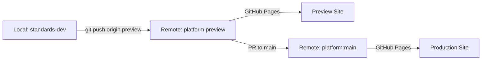

# Configuration Architecture

**Version:** 2.0  
**Date:** July 2025  
**Status:** Current Implementation (December 2024 Migration)

## Overview

The IFLA Standards Platform uses a centralized TypeScript configuration matrix that replaced 36+ environment files in December 2024. This architecture provides type-safe, maintainable configuration management across all sites and environments while eliminating common issues like cross-site contamination and environment variable conflicts.

## Evolution Summary

### Previous Architecture (Pre-December 2024)
- 36+ separate `.env` files across sites
- Complex environment detection logic
- Factory functions for site creation
- Frequent cross-contamination issues
- Difficult debugging and maintenance

### Current Architecture (Post-December 2024)
- Single TypeScript configuration matrix
- Compile-time type safety
- No environment variable dependencies
- Simple utility functions
- Clear debugging and maintenance

## Core Configuration Principles

### 1. **Single Source of Truth**
All site URLs, base paths, and environment-specific settings exist in one location:
```
libs/shared-config/src/lib/siteConfig.ts
```

### 2. **Type Safety First**
- All site keys and environments are TypeScript const types
- Compile-time validation prevents runtime errors
- No string literals for site references
- IDE autocomplete for all configuration

### 3. **Environment Isolation**
- Each environment has distinct, non-overlapping URLs
- Clear separation between local/preview/production
- No accidental cross-environment references
- Environment detection is explicit and simple

## Configuration Structure

### Site Configuration Matrix
```typescript
// Central configuration - single source of truth
export const SITE_CONFIG: Record<SiteKey, Record<Environment, SiteConfigEntry>> = {
  portal: {
    local: { 
      url: 'http://localhost:3000', 
      baseUrl: '/', 
      port: 3000 
    },
    preview: { 
      url: 'https://iflastandards.github.io', 
      baseUrl: '/platform/' 
    },
    production: { 
      url: 'https://www.iflastandards.info', 
      baseUrl: '/' 
    },
  },
  ISBDM: {
    local: { 
      url: 'http://localhost:3001', 
      baseUrl: '/', 
      port: 3001 
    },
    preview: { 
      url: 'https://iflastandards.github.io', 
      baseUrl: '/platform/ISBDM/' 
    },
    production: { 
      url: 'https://www.iflastandards.info', 
      baseUrl: '/ISBDM/' 
    },
  },
  // ... additional sites
};
```

### Type Definitions
```typescript
// Enforced site keys - no arbitrary strings
export type SiteKey = 
  | 'portal' 
  | 'ISBDM' 
  | 'LRM' 
  | 'FRBR' 
  | 'isbd' 
  | 'muldicat' 
  | 'unimarc';

// Limited environment options
export type Environment = 'local' | 'preview' | 'production';

// Consistent structure for all entries
export interface SiteConfigEntry {
  url: string;
  baseUrl: string;
  port?: number; // Only for local development
}
```

### Admin Portal Configuration
Special handling for the Next.js admin application:
```typescript
export const ADMIN_PORTAL_CONFIG: Record<Environment, AdminPortalConfig> = {
  local: {
    url: 'http://localhost:3007/admin',
    signinUrl: 'http://localhost:3007/admin/auth/signin',
    dashboardUrl: 'http://localhost:3007/admin/dashboard',
    signoutUrl: 'http://localhost:3007/admin/api/auth/signout',
    sessionApiUrl: 'http://localhost:3007/admin/api/auth/session',
    port: 3007,
  },
  preview: {
    url: 'https://admin-iflastandards-preview.onrender.com',
    signinUrl: 'https://admin-iflastandards-preview.onrender.com/auth/signin',
    dashboardUrl: 'https://admin-iflastandards-preview.onrender.com/dashboard',
    signoutUrl: 'https://admin-iflastandards-preview.onrender.com/api/auth/signout',
    sessionApiUrl: 'https://admin-iflastandards-preview.onrender.com/api/auth/session',
  },
  production: {
    url: 'https://www.iflastandards.info/admin',
    signinUrl: 'https://www.iflastandards.info/admin/auth/signin',
    dashboardUrl: 'https://www.iflastandards.info/admin/dashboard',
    signoutUrl: 'https://www.iflastandards.info/admin/api/auth/signout',
    sessionApiUrl: 'https://www.iflastandards.info/admin/api/auth/session',
  },
};
```

## Utility Functions

### Core Configuration Access
```typescript
// Get configuration for a specific site and environment
export function getSiteConfig(
  siteKey: SiteKey, 
  environment: Environment
): SiteConfigEntry {
  return SITE_CONFIG[siteKey][environment];
}

// Generate full URLs for cross-site navigation
export function getSiteUrl(
  siteKey: SiteKey, 
  path: string, 
  environment: Environment
): string {
  const config = getSiteConfig(siteKey, environment);
  const normalizedPath = path.startsWith('/') ? path.slice(1) : path;
  return `${config.url}${config.baseUrl}${normalizedPath}`;
}

// Map DOCS_ENV values to Environment enum
export function mapDocsEnvToEnvironment(docsEnv?: string): Environment {
  switch (docsEnv) {
    case 'production':
      return 'production';
    case 'preview':
      return 'preview';
    default:
      return 'local';
  }
}
```

### Admin Portal Utilities
```typescript
// Get admin portal configuration
export function getAdminPortalConfig(environment: Environment): AdminPortalConfig {
  return ADMIN_PORTAL_CONFIG[environment];
}

// basePath utility for Next.js admin app
export function addBasePath(path: string): string {
  // Server-side: use DOCS_ENV
  if (typeof window === 'undefined') {
    const env = mapDocsEnvToEnvironment(process.env.DOCS_ENV);
    const basePath = '/admin'; // Admin portal is served from root on Render
    return `${basePath}${path}`;
  }
  
  // Client-side: detect from hostname
  const hostname = window.location.hostname;
  const basePath = '/admin'; // Admin portal is served from root on Render
  return `${basePath}${path}`;
}
```

## Integration Patterns

### Docusaurus Configuration
Each site's `docusaurus.config.ts`:
```typescript
import { getSiteConfig, mapDocsEnvToEnvironment, type SiteKey } from '@ifla/shared-config';

const currentEnv = mapDocsEnvToEnvironment(process.env.DOCS_ENV);
const siteConfig = getSiteConfig('portal', currentEnv);

export default {
  title: 'IFLA Standards Portal',
  tagline: 'International Federation of Library Associations Standards',
  url: siteConfig.url,
  baseUrl: siteConfig.baseUrl,
  
  customFields: {
    environment: currentEnv,
    siteConfig: (toSiteKey: SiteKey) => getSiteConfig(toSiteKey, currentEnv),
  },
  
  // ... rest of configuration
};
```

### Cross-Site Navigation Component
```typescript
import { useDocusaurusContext } from '@docusaurus/core';
import type { SiteKey } from '@ifla/shared-config';

interface SiteLinkProps {
  siteKey: SiteKey;
  path: string;
  children: React.ReactNode;
  className?: string;
}

export default function SiteLink({ siteKey, path, children, className }: SiteLinkProps) {
  const { siteConfig } = useDocusaurusContext();
  const getSiteConfigForKey = siteConfig.customFields?.siteConfig as 
    ((key: SiteKey) => { url: string; baseUrl: string }) | undefined;
  
  if (!getSiteConfigForKey) {
    throw new Error('siteConfig function not found in customFields');
  }
  
  const targetConfig = getSiteConfigForKey(siteKey);
  const normalizedPath = path.startsWith('/') ? path.slice(1) : path;
  const fullUrl = `${targetConfig.url}${targetConfig.baseUrl}${normalizedPath}`;
  
  return (
    <a 
      href={fullUrl} 
      target="_blank" 
      rel="noopener noreferrer" 
      className={className}
    >
      {children}
    </a>
  );
}
```

### Next.js Admin Portal Patterns
```typescript
// In components/Navigation.tsx
import { addBasePath } from '@ifla/theme/utils';
import Link from 'next/link';

// Internal navigation - let Next.js handle basePath
<Link href="/dashboard">Dashboard</Link>
<Link href="/vocabularies">Vocabularies</Link>

// API calls - use addBasePath
const response = await fetch(addBasePath('/api/vocabularies'));
const data = await response.json();

// Static assets - use addBasePath

<link rel="icon" href={addBasePath('/favicon.ico')} />
```

## Environment Management

### Finalized 3-Environment Strategy

The platform uses a definitive 3-environment approach, simplified from earlier 4-environment proposals:

```
┌─────────────────────────────────────────────────────────────────┐
│                    3-ENVIRONMENT STRATEGY                        │
├─────────────────────────────────────────────────────────────────┤
│                                                                  │
│  1. LOCAL DEVELOPMENT                                           │
│     └─> Developer machines                                      │
│     └─> http://localhost:3000-3008                            │
│     └─> Full feature development                               │
│                                                                  │
│  2. PREVIEW (STAGING)                                           │
│     └─> iflastandards/platform:preview                         │
│     └─> https://iflastandards.github.io/platform/             │
│     └─> Client review & integration testing                    │
│                                                                  │
│  3. PRODUCTION                                                  │
│     └─> iflastandards/platform:main                           │
│     └─> https://www.iflastandards.info/                       │
│     └─> Live platform (PR-only updates)                        │
│                                                                  │
└─────────────────────────────────────────────────────────────────┘
```

### Environment Detection
```bash
# Local development (default)
pnpm dev

# Preview build
DOCS_ENV=preview pnpm build

# Production build
DOCS_ENV=production pnpm build
```

### Environment Characteristics
| Environment | URL Pattern | Purpose | Deployment | Branch |
|------------|-------------|---------|------------|--------|
| local | http://localhost:300X | Development | Local machine | any |
| preview | https://iflastandards.github.io/platform/ | Staging/Review | GitHub Pages | preview |
| production | https://www.iflastandards.info/ | Live platform | GitHub Pages | main |

### Build Scripts Integration
```json
{
  "scripts": {
    "build:portal": "nx build portal",
    "build:portal:preview": "DOCS_ENV=preview nx build portal",
    "build:portal:production": "DOCS_ENV=production nx build portal",
    "build:all": "nx run-many --target=build --all",
    "build:all:preview": "DOCS_ENV=preview nx run-many --target=build --all",
    "build:all:production": "DOCS_ENV=production nx run-many --target=build --all"
  }
}
```

## Adding New Sites

### Step 1: Update Configuration Matrix
```typescript
// In libs/shared-config/src/lib/siteConfig.ts

// Add to SiteKey type
export type SiteKey = 
  | 'portal' 
  | 'ISBDM' 
  | 'new-site'; // Add here

// Add to SITE_CONFIG
export const SITE_CONFIG = {
  // ... existing sites
  'new-site': {
    local: { 
      url: 'http://localhost:3008', 
      baseUrl: '/', 
      port: 3008 
    },
    preview: { 
      url: 'https://iflastandards.github.io', 
      baseUrl: '/platform/new-site/' 
    },
    production: { 
      url: 'https://www.iflastandards.info', 
      baseUrl: '/new-site/' 
    },
  },
};
```

### Step 2: Create Site Configuration
```typescript
// In standards/new-site/docusaurus.config.ts
import { getSiteConfig, mapDocsEnvToEnvironment } from '@ifla/shared-config';

const currentEnv = mapDocsEnvToEnvironment(process.env.DOCS_ENV);
const siteConfig = getSiteConfig('new-site', currentEnv);

export default {
  title: 'New Site Title',
  tagline: 'New Site Tagline',
  url: siteConfig.url,
  baseUrl: siteConfig.baseUrl,
  // ... rest of configuration
};
```

### Step 3: Update Build Configuration
```json
// In standards/new-site/project.json
{
  "targets": {
    "build": {
      "executor": "@nx/vite:build",
      "options": {
        "outputPath": "dist/standards/new-site"
      }
    }
  }
}
```

## Configuration Best Practices

### DO
- ✅ Use the centralized configuration matrix for all sites
- ✅ Leverage TypeScript types for compile-time safety
- ✅ Use utility functions for URL generation
- ✅ Test all environments during development
- ✅ Keep site-specific metadata in docusaurus.config.ts

### DON'T
- ❌ Hardcode URLs or base paths anywhere
- ❌ Create environment files for configuration
- ❌ Use string literals for site references
- ❌ Skip environment testing
- ❌ Modify configuration without updating types

## Testing Configuration

### Unit Tests
```typescript
describe('getSiteConfig', () => {
  it('should return correct config for portal local', () => {
    const config = getSiteConfig('portal', 'local');
    expect(config.url).toBe('http://localhost:3000');
    expect(config.baseUrl).toBe('/');
    expect(config.port).toBe(3000);
  });
  
  it('should return correct config for production', () => {
    const config = getSiteConfig('ISBDM', 'production');
    expect(config.url).toBe('https://www.iflastandards.info');
    expect(config.baseUrl).toBe('/ISBDM/');
  });
});

describe('getSiteUrl', () => {
  it('should generate correct full URLs', () => {
    const url = getSiteUrl('portal', '/docs/intro', 'preview');
    expect(url).toBe('https://iflastandards.github.io/platform/docs/intro');
  });
});
```

### Integration Tests
- Verify cross-site navigation works
- Test environment-specific builds
- Validate no hardcoded URLs exist
- Check basePath handling in admin portal

## Troubleshooting

### Common Issues

1. **TypeScript Errors**
   - Ensure new site key is added to `SiteKey` type
   - Run `pnpm typecheck` to catch issues early

2. **Wrong URLs in Production**
   - Check `DOCS_ENV` is set correctly
   - Verify build scripts include environment

3. **Cross-Site Navigation Broken**
   - Ensure target site exists in configuration
   - Check `customFields.siteConfig` is provided

4. **Admin Portal Routing Issues**
   - Verify using `addBasePath` for all resources
   - Check Next.js `<Link>` components used correctly

### Debug Helpers
```typescript
// Log current environment
console.log('Environment:', mapDocsEnvToEnvironment(process.env.DOCS_ENV));

// Log site configuration
console.log('Site Config:', getSiteConfig('portal', 'local'));

// Test URL generation
console.log('Generated URL:', getSiteUrl('ISBDM', '/docs', 'preview'));
```

## Repository Organization

### Current Structure
**Remote Repository**: `iflastandards/platform` (GitHub)  
**Local Directory**: `standards-dev` (developer machines)

**Important**: The local directory name differs from the remote repository name by design. This is intentional and provides backward compatibility with existing developer setups.

### Git Configuration
```bash
# Remote setup (already configured)
git remote -v
# origin  git@github.com:iflastandards/platform.git (fetch)
# origin  git@github.com:iflastandards/platform.git (push)

# Branch strategy
main → origin/main (protected, pull only)
preview → origin/preview (primary working branch)
feature/* → local development branches
```

### Deployment Workflow


## Migration Notes

### Configuration Migration (December 2024)
- **Removed**: 36+ `.env.site*` files
- **Removed**: Complex factory functions
- **Removed**: Environment variable dependencies
- **Added**: Centralized TypeScript configuration
- **Added**: Type-safe utility functions
- **Added**: Simplified debugging

### Environment Strategy Migration (July 2025)
- **Removed**: 4-environment strategy (local/development/preview/production)
- **Removed**: Development environment (redundant with preview)
- **Simplified**: 3-environment strategy (local/preview/production)
- **Deprecated**: Personal fork workflow
- **Standardized**: Direct feature branches on main repository

### Benefits Achieved
- 90% reduction in configuration files
- Eliminated cross-contamination issues
- Improved developer experience
- Better performance (no env loading)
- Easier maintenance and updates
- Simpler deployment pipeline

## Migration Guide Summary

### Key Updates Required
1. **Configuration Files**: Remove `development` environment from all matrices
2. **Type Definitions**: Update `Environment` type to exclude `development`
3. **CI/CD Workflows**: Remove development-specific deployment triggers
4. **Documentation**: Update all references to reflect 3-environment strategy
5. **Build Scripts**: Remove development-specific npm scripts

### Verification Checklist
- [ ] No "development" references in configuration files
- [ ] All CI/CD workflows updated for 3 environments
- [ ] Documentation reflects current strategy
- [ ] Preview deployments work correctly
- [ ] Production deployments require PR approval
- [ ] Team informed of changes

## Future Considerations

### Potential Enhancements
1. **Regional Deployments**: Consider geographic distribution based on user analysis
2. **Configuration Validation**: Runtime checks for configuration integrity
3. **Feature Flags**: Environment-specific feature toggles
4. **A/B Testing**: Multiple production configurations
5. **Enhanced Preview Features**: Additional staging capabilities

### Maintaining Simplicity
- Resist adding complexity without clear benefits
- Keep configuration centralized
- Maintain type safety
- Document all changes
- Regular configuration audits
- Preserve the 3-environment simplicity

This configuration architecture provides a robust, type-safe foundation for managing multi-site deployments across multiple environments while maintaining simplicity and developer experience.
