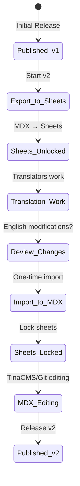

# Development Workflow

**Version:** 2.0  
**Date:** July 2025  
**Status:** Current Implementation

## Overview

The IFLA Standards Platform follows a comprehensive 8-phase development workflow that governs how standards are created, reviewed, published, and maintained. This document details the processes, roles, tools, and quality gates that ensure consistent, high-quality standards development.

## Core Workflow Principles

### 1. **Git-Based Collaboration**
- All changes tracked through version control
- Pull Request workflow for review and approval
- Atomic commits with clear attribution
- Branch protection for quality enforcement

### 2. **Role-Based Access Control**
- Clear hierarchy of permissions
- Namespace-scoped authorization
- Audit trail for all actions
- Principle of least privilege

### 3. **Progressive Quality Gates**
- Validation at each phase
- Automated checks where possible
- Human review for critical decisions
- Clear rollback procedures

## Role Hierarchy

> **Note**: For comprehensive role definitions, permissions, and access control details, see the authoritative [RBAC Authorization Model](./12-rbac-authorization-model.md) and [Permission Matrix](./13-permission-matrix-detailed.md).

### Superadmin
- **Scope**: Global platform authority
- **Permissions**: All operations across all namespaces
- **Responsibilities**:
  - Platform configuration
  - User management
  - Emergency interventions
  - System maintenance

### Review Group Admin
- **Scope**: Full control over review group namespaces
- **Permissions**:
  - Create/delete namespaces
  - Manage team members
  - Approve publications
  - Configure workflows
- **Examples**: ICP Admin, BCM Admin, ISBD Admin, PUC Admin

### Namespace Admin
- **Scope**: Full control over specific namespace
- **Permissions**:
  - Manage element sets and concept schemes
  - Configure DCTAP profiles
  - Initiate publication workflow
  - Manage namespace users

### Namespace Editor
- **Scope**: Content creation and updates
- **Permissions**:
  - Create/update/delete elements and concepts
  - Import/export vocabularies
  - Create draft versions
  - Submit for review

### Namespace Translator
- **Scope**: Language-specific content
- **Permissions**:
  - Edit translations only
  - Cannot modify structure
  - Submit translation PRs
  - Language-specific review

### Namespace Reviewer
- **Scope**: Quality assurance and feedback
- **Permissions**:
  - Comment on PRs
  - Approve/request changes
  - View all content
  - Cannot directly edit

## 8-Phase Standards Development Lifecycle

### Phase 1: Namespace Initialization

**Purpose**: Create new namespace with proper structure and configuration

**Activities**:
1. Review Group Admin creates namespace request
2. Technical team provisions:
   ```
   standards/{namespace}/
   ├── namespace.json
   ├── docusaurus.config.ts
   ├── project.json
   ├── element-sets/
   ├── concept-schemes/
   ├── dctap/
   └── docs/
   ```
3. Configure site in centralized config matrix
4. Set up initial team permissions
5. Create welcome documentation

**Quality Gates**:
- Valid namespace identifier
- Unique port assignment
- Proper team structure
- Build verification

**Tools**: Scaffolding scripts, Nx generators

### Phase 2: Element Set Development

**Purpose**: Define properties and classes for the standard

**Activities**:
1. Create element set structure
2. Define elements with:
   - URI patterns
   - Labels and definitions
   - Domain/range specifications
   - Cardinality rules
3. Validate against namespace conventions
4. Generate initial RDF representations

**Quality Gates**:
- URI uniqueness
- DCTAP compliance
- Naming conventions
- Cross-reference validation

**Tools**: Admin portal forms, validation scripts

### Phase 3: Concept Scheme Development

**Purpose**: Create controlled vocabularies and value lists

**Activities**:
1. Define concept schemes
2. Create hierarchical structures
3. Add multilingual labels
4. Define relationships
5. Link to element constraints

**Quality Gates**:
- Concept uniqueness
- Hierarchy consistency
- Language coverage
- SKOS compliance

**Tools**: Vocabulary editor, import/export workflows

### Phase 4: Internal Review and Quality Assurance

**Purpose**: Team validation before public exposure

**Activities**:
1. Technical validation:
   - RDF generation testing
   - Link checking
   - Performance testing
   - Accessibility audit
2. Content review:
   - Completeness check
   - Consistency validation
   - Editorial review
   - Cross-reference verification
3. Create review report
4. Address identified issues

**Quality Gates**:
- All tests passing
- No broken links
- WCAG compliance
- Performance benchmarks met

**Tools**: Automated test suites, review checklists

### Phase 5: Public Review and Feedback

**Purpose**: Community input and validation

**Activities**:
1. Publish draft to preview environment
2. Announce review period
3. Collect feedback via:
   - GitHub issues
   - Email submissions
   - Review forms
4. Triage and prioritize feedback
5. Create response matrix
6. Implement accepted changes

**Quality Gates**:
- Minimum review period (30 days)
- All feedback acknowledged
- Changes tracked
- Rationale documented

**Tools**: GitHub discussions, feedback forms

### Phase 6: Finalization and Release

**Purpose**: Official publication of the standard

**Activities**:
1. Final validation sweep
2. Version number assignment
3. Generate all RDF formats
4. Create GitHub release
5. Tag repository
6. Update status to "Published"
7. Deploy to production

**Quality Gates**:
- Approval from Review Group Admin
- All formats generated successfully
- Changelog complete
- Migration guide (if needed)

**Tools**: Release scripts, GitHub releases

### Phase 7: Translation Management

**Purpose**: Create multilingual versions with global collaboration

**Activities**:
1. **Preparation**:
   - Export translatable content
   - Create translation workspace
   - Assign translators (including external experts)
2. **Translation**:
   - Use dedicated UI or spreadsheets
   - Maintain terminology consistency
   - Review by native speakers
   - Track progress per language
3. **Integration**:
   - Import translations
   - Validate completeness
   - Test language switching
   - Deploy updates

**Global Collaboration Features**:
- **Integrated Workflow**: Translation built into core lifecycle, not afterthought
- **External Participation**: Non-IFLA members can contribute to specific languages
- **Progress Tracking**: Visual dashboards show completion by language
- **Consistency Tools**: Terminology databases ensure uniform translations
- **Cultural Adaptation**: Beyond literal translation to cultural appropriateness

**Quality Gates**:
- Translation completeness (>95%)
- Terminology consistency
- Native speaker review
- Technical validation
- Cultural sensitivity check

**Tools**: Translation UI, Crowdin integration, GitHub Projects

### Phase 8: Ongoing Maintenance

**Purpose**: Updates and continuous improvement

**Activities**:
1. Monitor for issues
2. Process change requests
3. Plan minor/major updates
4. Maintain compatibility
5. Update documentation
6. Communicate changes

**Quality Gates**:
- Backward compatibility
- Migration path provided
- Stakeholder notification
- Version tracking

**Tools**: Issue tracking, version management

## Development Tools and Environment

### Local Development Setup
```bash
# Clone repository
git clone https://github.com/iflastandards/platform.git
cd platform

# Install dependencies
pnpm install

# Start development servers
pnpm nx dev portal        # Portal site
pnpm nx dev ISBDM        # Specific standard
pnpm nx dev admin        # Admin portal

# Run tests
pnpm test                # Affected tests only
pnpm test:comprehensive  # Full test suite
```

### Branch Strategy
```
main (protected)
├── preview (default working branch)
└── feature/* (feature branches)
    ├── feature/add-isbd-elements
    ├── feature/update-unimarc-concepts
    └── feature/fix-validation-rules
```

### Commit Conventions
```
feat: Add new element to ISBD
fix: Correct URI generation for concepts
docs: Update namespace documentation
test: Add validation test cases
refactor: Simplify import workflow
chore: Update dependencies
```

## Import/Export Workflows

### Vocabulary Export Process
1. **Select Scope**:
   - Choose element sets or concept schemes
   - Select languages to include
   - Define export format

2. **Generate Export**:
   - Create Google Sheet with DCTAP structure
   - Include metadata headers
   - Add validation rules
   - Share with collaborators

3. **Collaborative Editing**:
   - Track changes in sheet history
   - Use comments for discussion
   - Validate incrementally

### Vocabulary Import Process
1. **Pre-Import Validation**:
   - Check DCTAP compliance
   - Validate data types
   - Verify references
   - Preview changes

2. **Import Execution**:
   - Create feature branch
   - Generate MDX files
   - Update JSON structures
   - Create PR

3. **Review and Merge**:
   - Automated checks run
   - Human review required
   - Approval triggers merge
   - Deployment automatic

## Global Collaboration Framework

### Enabling Worldwide Participation

The platform is designed to facilitate global collaboration across time zones, languages, and technical expertise levels:

#### Lowered Barriers to Entry
- **Familiar Interfaces**: Spreadsheet-based editing for non-technical users
- **WYSIWYG Editing**: TinaCMS provides Word-like editing experience
- **Native Language Support**: Contributors can work in their preferred language
- **No Git Required**: Web-based workflows hide technical complexity

#### Asynchronous Collaboration
- **GitHub Discussions**: Contextual conversations with full history
- **Pull Request Reviews**: Time-zone friendly review processes
- **Issue Templates**: Structured feedback in multiple languages
- **Project Boards**: Visual progress tracking across global teams

#### External Expert Integration
- **Project-Based Access**: Limited, focused permissions
- **Fork and PR Model**: Contribute without direct repository access
- **Clear Contribution Guidelines**: Step-by-step guides in multiple languages
- **Recognition System**: Proper attribution for all contributors

### Geographic Distribution Support

```yaml
Time Zone Coverage:
  - Americas: GitHub Projects for task coordination
  - Europe/Africa: Primary working hours overlap
  - Asia/Pacific: Asynchronous workflows emphasized
  
Language Support:
  - UI Languages: English, French, Spanish, German
  - Documentation: Multilingual with community translations
  - Communication: English primary, multilingual support
  
Infrastructure:
  - CDN Distribution: Fast access globally
  - Regional Caching: Optimized performance
  - Offline Capabilities: Work without constant connection
```

## Quality Assurance

### Automated Checks
```yaml
Pre-commit:
  - TypeScript checking
  - ESLint validation
  - Unit tests (affected)
  - File formatting

Pre-push:
  - Integration tests
  - Build verification
  - E2E tests (if needed)
  - Performance checks

Pull Request:
  - All above checks
  - Security scanning
  - Dependency audit
  - Coverage report
```

### Manual Review Checklist
- [ ] Content accuracy
- [ ] Terminology consistency
- [ ] Cross-references valid
- [ ] Examples appropriate
- [ ] Documentation complete
- [ ] Translations aligned
- [ ] Breaking changes documented
- [ ] Migration guide provided

## Development Best Practices

### Code Organization
```
Feature-specific changes:
├── Update schema definitions
├── Modify UI components
├── Add/update tests
├── Update documentation
└── Add migration scripts (if needed)
```

### Testing Requirements
- Unit tests for all utilities
- Integration tests for workflows
- E2E tests for critical paths
- Performance benchmarks
- Accessibility testing

### Documentation Standards
- API documentation (JSDoc/TSDoc)
- User guides for features
- Technical specifications
- Change logs maintained
- Migration guides when needed

## Workflow Automation

### GitHub Actions
```yaml
Workflows:
  - validate-pr.yml      # On pull request
  - deploy-preview.yml   # On push to preview
  - deploy-prod.yml      # On push to main
  - nightly-checks.yml   # Scheduled validation
```

### Nx Task Orchestration
```bash
# Smart task running
nx affected --target=test
nx affected --target=build
nx run-many --target=lint --parallel

# Custom targets
nx vocabulary:validate
nx vocabulary:generate-rdf
nx docs:check-links
```

## Performance Optimization

### Development Performance
- Nx computation caching
- Incremental builds
- Hot module replacement
- Parallel task execution

### Workflow Performance
- Automated repetitive tasks
- Batch operations
- Async processing
- Queue management

## Monitoring and Metrics

### Development Metrics
- Build times
- Test execution speed
- PR turnaround time
- Deployment frequency

### Quality Metrics
- Test coverage
- Code review velocity
- Issue resolution time
- User satisfaction

## Emergency Procedures

### Hotfix Process
1. Create hotfix branch from main
2. Apply minimal fix
3. Fast-track review
4. Deploy immediately
5. Backport to preview

### Rollback Procedures
1. Identify problematic commit
2. Create revert PR
3. Expedited review
4. Deploy revert
5. Root cause analysis

## Future Workflow Enhancements

### Planned Improvements
1. **AI-Assisted Review**: Automated content suggestions
2. **Real-time Collaboration**: Live editing features
3. **Advanced Analytics**: Usage and impact metrics
4. **Workflow Templates**: Reusable process definitions
5. **Integration Hub**: Third-party tool connections

### Continuous Improvement
- Regular retrospectives
- Process optimization
- Tool evaluation
- Training programs
- Documentation updates

## Edit Permissions and Workflow Governance

### Granular Permission System

The platform implements a sophisticated role-based access control system integrated with TinaCMS and GitHub:

#### Permission Matrix by User Type

| User Type | GitHub Org Member | Can Use TinaCMS | Can Direct Edit | Can Create PR | Can Fork |
|-----------|-------------------|-----------------|-----------------|---------------|----------|
| Anonymous | No | No | No | No | Yes |
| GitHub User | No | No | No | Yes | Yes |
| Org Member | Yes | Yes | Draft only | Yes | Yes |
| Namespace Editor | Yes | Yes | Draft only | Yes | Yes |
| Review Group Admin | Yes | Yes | Draft + Unlock | Yes | Yes |
| Superadmin | Yes | Yes | All | Yes | Yes |

#### TinaCMS Integration Workflow

**Authentication Flow**:
1. User clicks "Edit this page" on Docusaurus site
2. System checks GitHub organization membership
3. Org members → TinaCMS editor loads
4. Non-members → Redirect to fork workflow

**Version Locking System**:
- Released versions are locked by default
- Review Group Admins can temporarily unlock (24h)
- All edits to released content require PR review
- Draft versions allow direct TinaCMS editing

**Key Implementation Details**:
```typescript
// Permission check logic
export function checkEditPermissions(
  user: User | null,
  namespace: string,
  version: string,
  isReleased: boolean
): EditPermissions {
  // Released version logic
  if (isReleased) {
    if (user.role === 'superadmin' || isReviewGroupAdmin(user, namespace)) {
      return { canUseTina: true, editMode: 'unlock-required' };
    }
    return { canUseTina: false, editMode: 'pr-only' };
  }
  // Draft version - full TinaCMS access
  return { canUseTina: true, editMode: 'direct' };
}
```

### Branch Management Strategy

**Feature Branches**:
- Released content → Create feature branch
- Draft content → Use draft/{namespace} branch
- Automatic PR creation for released content changes

## Translation Management Procedures

### Version-Based Translation Architecture

The platform employs a sophisticated version-based approach to manage translations across multiple workflows:

#### Core Translation Principle: Clear Source of Truth Transitions

At any given time, there is ONE clear source of truth for each content type. The source of truth transitions at version boundaries:



#### Three Translation Workflows

1. **Vocabulary Translations (Spreadsheet-Native)**
   - Source: English terms in Google Sheets
   - Process: Human translators work directly in sheets
   - Storage: Single MDX file with all languages
   - Version control through sheets during development

2. **Documentation Translations (Docusaurus-Native)**
   - Source: English MDX files in /docs
   - Process: Export to Crowdin → Translation → Import
   - Storage: Separate files per language (i18n directories)
   - Continuous synchronization via Git

3. **RDF Documentation (Hybrid)**
   - Source: English in spreadsheet (with vocabulary)
   - Process: Initial translation in sheets → Enhancement in Crowdin
   - Storage: Mixed approach with potential for drift

#### English Modification Handling

When translators suggest English content changes during translation:

```typescript
interface EnglishModificationDialog {
  options: {
    importAll: "Import all changes and create PR";
    importSelective: "Review each change";
    skipAll: "Keep original English, import only translations";
    defer: "Create issues for later review";
  };
}
```

**Review Process**:
1. System detects English modifications in "locked" content
2. Presents changes to Review Group Admin
3. Admin decides per-change or batch action
4. Creates GitHub issues or PRs as appropriate
5. Maintains full audit trail

#### Key Implementation Details

**Version State Tracking**:
```typescript
class VersionBasedSyncEngine {
  // One-way export: MDX → Spreadsheets (at version start)
  async exportToSheetsForNewVersion(namespace: string, newVersion: string) {
    const currentMDX = await this.mdx.getAllContent(namespace);
    await this.sheets.createVersionedExport({
      namespace,
      version: newVersion,
      content: currentMDX,
      status: 'unlocked'
    });
  }
  
  // One-way import: Spreadsheets → MDX (once per version)
  async importFromSheets(namespace: string, version: string) {
    // Check for English modifications
    const englishChanges = this.detectEnglishModifications(sheetData);
    if (englishChanges.length > 0) {
      await this.handleEnglishModifications(englishChanges);
    }
    // Import and lock
    await this.mdx.importContent(sheetData, version);
    await this.sheets.lockVersion(namespace, version);
  }
}
```

## CSV to MDX Conversion Workflow Example

### ISBD Implementation Case Study

The ISBD CSV to MDX conversion demonstrates a complete vocabulary import workflow:

#### Phase 4.0 Implementation Overview

**Current Infrastructure**:
- `populate-from-csv.ts` script for MDX generation
- Templates in `/standards/isbd/templates/`
- CSV data in `/standards/isbd/csv/ns/isbd/`

**CSV Format Structure**:
```csv
uri,reg:identifier,reg:status,rdf:type,skos:definition@en,skos:definition@fr,skos:prefLabel@en,skos:prefLabel@fr,...
```

#### Step-by-Step Conversion Process

1. **Template Configuration Extension**
   ```json
   {
     "templates": {
       "vocabulary": {
         "path": "vocabulary.mdx",
         "csvSource": "../csv/ns/isbd/terms/{vocabularyId}.csv",
         "csvMapping": {
           "id": { "source": "uri", "transform": "extractId" },
           "title": { "source": "skos:prefLabel@en" },
           "definition": { "source": "skos:definition@en" }
         },
         "outputPath": "../docs/vocabularies/{vocabularyId}/{conceptId}.mdx"
       }
     }
   }
   ```

2. **Execution Commands**
   ```bash
   # Process elements
   pnpm tsx scripts/populate-from-csv.ts --standard=isbd --type=element
   
   # Process vocabularies
   pnpm tsx scripts/populate-from-csv.ts --standard=isbd --type=vocabulary --vocab=contentform
   pnpm tsx scripts/populate-from-csv.ts --standard=isbd --type=vocabulary --vocab=mediatype
   ```

3. **Vocabulary Index Creation**
   ```mdx
   ---
   sidebar_position: 1
   title: ISBD Vocabularies
   ---
   
   # ISBD Vocabularies
   
   <VocabularyTable 
     csv="/data/contentform.csv"
     namespace="isbd"
     languages={['en', 'fr', 'es', 'it', 'lv', 'ru', 'sr', 'zh']}
     defaultLanguage="en"
     showFilter={true}
     showURIs={true}
   />
   ```

4. **Google Sheets Integration**
   - Identify orphan sheets
   - Create namespace_sheets database record
   - Implement change detection via API polling
   - Design update workflow with validation

#### Technical Implementation Details

**Using Existing Infrastructure**:
- `populate-from-csv.ts` handles CSV parsing with language tags
- `VocabularyTable` component provides multilingual display
- Docusaurus search handles full-text indexing

**Required Extensions**:
```typescript
// Add vocabulary processing to populate-from-csv.ts
if (templateType === 'vocabulary') {
  // Handle multiple vocabulary files
  // Generate index pages
  // Create concept detail pages
}
```

**Success Criteria**:
- ISBD vocabularies viewable as MDX pages
- All languages preserved and accessible
- Search functionality operational
- Google Sheet changes detectable
- Simple UI for non-technical users

## Integration with Core Workflow

These specialized workflows integrate seamlessly with the 8-phase standards development lifecycle:

- **Phase 1-3**: Edit permissions control who can create and modify content
- **Phase 4-5**: Version locking ensures review integrity
- **Phase 7**: Translation management handles multilingual requirements
- **Phase 8**: Ongoing maintenance uses permission system for updates

The CSV to MDX conversion workflow provides a concrete example of how external data sources integrate into the platform's content management system.

This development workflow provides a structured, quality-focused approach to standards development while maintaining flexibility for different types of changes and team preferences. The integration of edit permissions, translation management, and practical conversion workflows ensures comprehensive support for all aspects of standards development.
