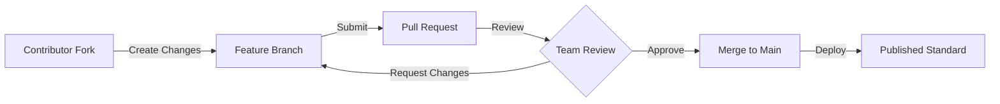
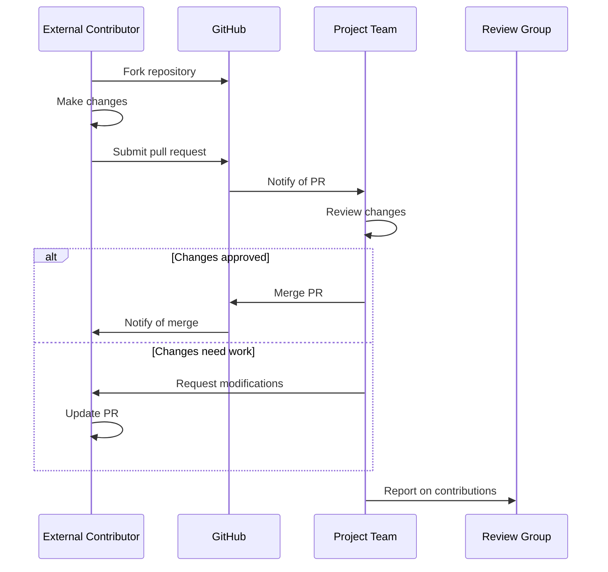

# Collaboration Architecture

**Version:** 1.0  
**Date:** January 2025  
**Status:** Proposed Implementation

## Overview

This document details the collaboration architecture that enables IFLA's globally distributed standards development work. Built on GitHub's platform capabilities, the system provides structured project management, transparent workflows, and inclusive participation models that align with IFLA's governance structure while enabling efficient global collaboration.

## GitHub Project-Based Collaboration Model

### Core Concept

The collaboration architecture centers on GitHub Projects as the primary organizing unit for all standards development work. This model, inspired by W3C working groups, provides focused, goal-oriented collaboration while maintaining clear governance boundaries and enabling external participation.

### Project Structure

```yaml
Review Group (Parent):
  └── Projects (Chartered Work):
      ├── Short-term (3-6 months):
      │   ├── Translation initiatives
      │   ├── Specific updates
      │   └── Cross-namespace harmonization
      └── Long-term (1-3 years):
          ├── Maintenance working groups
          ├── Major revisions
          └── New standard development
```

### Project Charter Components

Each Project includes:
- **Scope Definition**: Clear boundaries of work
- **Deliverables**: Specific outputs and milestones
- **Timeline**: Start date, milestones, expected completion
- **Team Composition**: Core members and allowed external contributors
- **Namespace Assignment**: Which namespaces the Project can modify
- **Success Criteria**: Measurable outcomes

## Organizational Alignment

### Review Group Structure

The four primary Review Groups manage distinct namespace domains:

```
1. International Cataloguing Principles (ICP)
   └── Namespaces: icp, muldicat

2. Bibliographic Conceptual Models (BCM)
   └── Namespaces: frbr, lrm, frad

3. International Standard Bibliographic Description (ISBD)
   └── Namespaces: isbd, isbdm

4. Permanent UNIMARC Committee (PUC)
   └── Namespaces: unimarc, mri
```

### Permission Model

```typescript
interface ProjectPermissions {
  reviewGroup: ReviewGroupId;           // Parent authority
  namespaces: NamespaceId[];           // Assigned work areas
  teamMembers: {
    core: GitHubUser[];                // Full access
    contributors: GitHubUser[];         // Limited access
    observers: GitHubUser[];           // Read-only access
  };
  expiresAt?: Date;                    // For time-limited projects
}
```

## GitHub Platform Integration

### 1. Projects and Boards

GitHub Projects provide kanban-style visual management:

```
┌─────────────────────────────────────────────────────────┐
│                  Project: LRM French Translation         │
├─────────────┬──────────────┬──────────────┬────────────┤
│   Backlog   │  In Progress │   Review     │    Done    │
├─────────────┼──────────────┼──────────────┼────────────┤
│ □ Terms A-C │ □ Terms M-O  │ □ Terms D-F  │ ✓ Overview │
│ □ Terms P-R │ □ Examples   │              │ ✓ Terms G-L│
│ □ Terms S-Z │              │              │            │
└─────────────┴──────────────┴──────────────┴────────────┘
```

**Features**:
- Automated card movement based on pull request status
- Milestone tracking for major deliverables
- Progress visualization and burndown charts
- Custom fields for vocabulary-specific metadata

### 2. Pull Request Workflows

Structured contribution process for all participants:



**Pull Request Template**:
```markdown
## Description
Brief description of changes

## Type of Change
- [ ] Bug fix (non-breaking change)
- [ ] New feature (non-breaking change)
- [ ] Breaking change (fix or feature that would cause existing functionality to not work as expected)
- [ ] Translation
- [ ] Documentation update

## Affected Namespaces
- [ ] frbr
- [ ] lrm
- [ ] isbd
- [ ] Other: ___

## Checklist
- [ ] I have performed a self-review
- [ ] I have added tests that prove my fix/feature works
- [ ] New and existing tests pass locally
- [ ] My changes generate no new warnings
- [ ] I have updated documentation accordingly
```

### 3. Issue Tracking System

Centralized feedback and task management:

**Issue Templates**:

1. **Bug Report**
   ```yaml
   name: Bug Report
   description: Report an error in a standard
   labels: ["bug", "needs-triage"]
   body:
     - type: dropdown
       id: namespace
       attributes:
         label: Affected Namespace
         options: [frbr, lrm, isbd, unimarc, other]
     - type: textarea
       id: description
       attributes:
         label: Bug Description
         description: Clear description of the error
     - type: input
       id: location
       attributes:
         label: Location
         description: Where in the standard (section, term ID, etc.)
   ```

2. **Enhancement Request**
   ```yaml
   name: Enhancement Request
   description: Suggest an improvement
   labels: ["enhancement", "needs-review"]
   body:
     - type: textarea
       id: proposal
       attributes:
         label: Enhancement Proposal
         description: What should be improved and why
     - type: textarea
       id: impact
       attributes:
         label: Expected Impact
         description: Who benefits and how
   ```

3. **Translation Error**
   ```yaml
   name: Translation Issue
   description: Report translation problems
   labels: ["translation", "needs-language-expert"]
   body:
     - type: dropdown
       id: language
       attributes:
         label: Language
         options: [French, Spanish, German, Italian, Other]
     - type: textarea
       id: issue
       attributes:
         label: Translation Issue
         description: Describe the problem
   ```

### 4. Discussion Forums

Contextual conversations for each Project:

```
Project Discussions
├── 📌 Announcements (locked to admins)
├── 💡 Ideas and Proposals
├── 🙏 Q&A
├── 🗣️ General Discussion
└── 📊 Meeting Notes and Decisions
```

## Collaboration Workflows

### 1. Translation Project Workflow

```yaml
Project: "LRM French Translation Initiative"
Duration: 6 months
Team: 
  - Lead: French-speaking Review Group member
  - Translators: 3-5 French librarians (may be external)
  - Reviewers: 2 domain experts

Workflow:
  1. Project Setup:
     - Create GitHub Project
     - Assign `lrm` namespace access
     - Create translation branch
  
  2. Work Organization:
     - Divide vocabulary into sections
     - Create issues for each section
     - Assign to translators
  
  3. Translation Process:
     - Translators work on assigned sections
     - Submit pull requests for review
     - Native speakers review for accuracy
     - Domain experts verify technical correctness
  
  4. Quality Assurance:
     - Automated consistency checking
     - Terminology alignment verification
     - Final review by Project lead
  
  5. Publication:
     - Merge to main branch
     - Tag release version
     - Deploy to production
```

### 2. Maintenance Working Group Workflow

```yaml
Project: "ISBD Maintenance WG 2024-2026"
Duration: 2 years (ongoing)
Team:
  - Standing committee of 5-7 members
  - Rotating external advisors

Workflow:
  1. Continuous Monitoring:
     - Track issues reported by community
     - Review implementation feedback
     - Monitor related standards for changes
  
  2. Quarterly Reviews:
     - Prioritize accumulated issues
     - Plan corrections and clarifications
     - Schedule minor updates
  
  3. Annual Assessment:
     - Evaluate need for major revision
     - Coordinate with other Review Groups
     - Plan next year's activities
```

### 3. Cross-Namespace Harmonization Workflow

```yaml
Project: "BCM Alignment 2024"
Duration: 9 months
Namespaces: frbr, lrm, frad
Team:
  - Representatives from each namespace
  - Harmonization coordinator
  - Technical advisors

Workflow:
  1. Analysis Phase:
     - Identify terminology conflicts
     - Map conceptual differences
     - Document current inconsistencies
  
  2. Harmonization Phase:
     - Propose unified terminology
     - Create mapping documents
     - Build consensus through discussions
  
  3. Implementation Phase:
     - Update each namespace
     - Maintain backward compatibility
     - Document changes and rationale
```

## External Contribution Model

### Participation Levels

1. **Public Contributors**
   - Can create issues
   - Can fork and submit pull requests
   - Cannot directly modify repositories

2. **Project Contributors**
   - Added to specific Projects
   - Can work on Project branches
   - Limited to Project namespaces

3. **Review Group Members**
   - Full access to Review Group namespaces
   - Can charter new Projects
   - Can manage Project teams

4. **Administrators**
   - Organization-wide permissions
   - Can create Review Groups
   - Emergency access to all namespaces

### Contribution Process



## Integration with Other Systems

### 1. CI/CD Pipeline Integration

Projects trigger automated workflows:
- Pull request validation
- Automated testing
- Preview deployments
- Production releases

### 2. Notification System

```typescript
interface NotificationRules {
  projectActivity: {
    newIssue: ['project-team', 'watchers'];
    pullRequest: ['project-team', 'reviewers'];
    milestone: ['project-team', 'review-group'];
  };
  escalation: {
    stalePR: { after: '14 days', notify: ['project-lead'] };
    blockedIssue: { after: '30 days', notify: ['review-group'] };
  };
}
```

### 3. Analytics and Reporting

Project metrics tracked:
- Contribution velocity
- Time to resolution
- Participation rates
- Quality metrics

## Security and Access Control

### GitHub Single Sign-On

```typescript
interface AuthenticationFlow {
  provider: 'github';
  requirements: {
    twoFactorAuth: required;
    emailVerified: required;
  };
  sessionManagement: {
    timeout: '8 hours';
    refreshable: true;
  };
}
```

### Project-Based Permissions

```yaml
Permission Matrix:
  Project Member:
    - Read: all project resources
    - Write: assigned namespaces only
    - Delete: own contributions only
  
  Project Lead:
    - Read: all project resources
    - Write: all project namespaces
    - Delete: project resources
    - Admin: project settings
  
  Review Group Admin:
    - All Project Lead permissions
    - Create: new projects
    - Assign: team members
    - Archive: completed projects
```

## Best Practices

### 1. Project Chartering
- Clear, measurable objectives
- Realistic timelines with buffers
- Defined success criteria
- Exit strategy for long-running projects

### 2. Team Formation
- Mix of domain experts and practitioners
- Include diverse geographic representation
- Plan for member rotation in long projects
- Document knowledge transfer processes

### 3. Communication
- Regular status updates on Project boards
- Decisions documented in Discussions
- Meeting notes in standardized format
- Asynchronous-first collaboration

### 4. Quality Assurance
- Peer review for all changes
- Automated validation where possible
- Regular milestone assessments
- Retrospectives for completed projects

## Future Enhancements

### Planned Improvements

1. **AI-Assisted Review**
   - Automated consistency checking
   - Translation quality assessment
   - Change impact analysis

2. **Enhanced Analytics**
   - Contribution dashboards
   - Project health metrics
   - Predictive completion dates

3. **Integration Expansions**
   - Slack/Teams notifications
   - Calendar integration
   - Time tracking capabilities

### Scaling Considerations

As IFLA's collaborative work expands:
- Project templates for common patterns
- Automated Project setup workflows
- Cross-Project dependency tracking
- Portfolio-level reporting

This collaboration architecture provides the foundation for IFLA's distributed standards development, enabling efficient global participation while maintaining quality and governance standards.