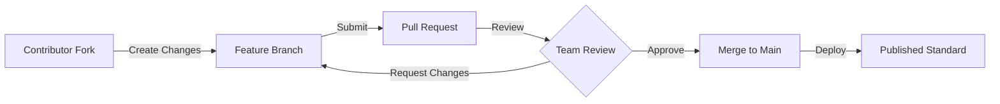
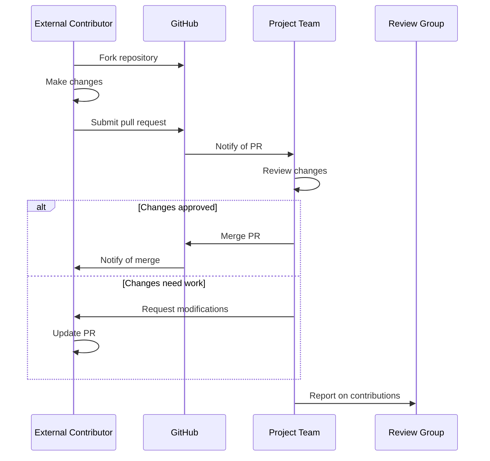
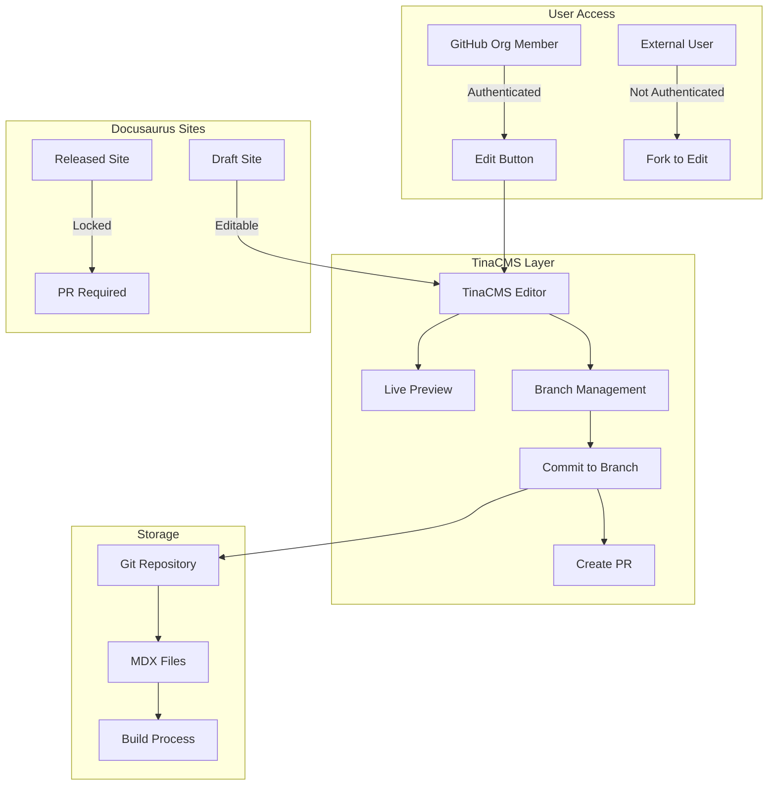
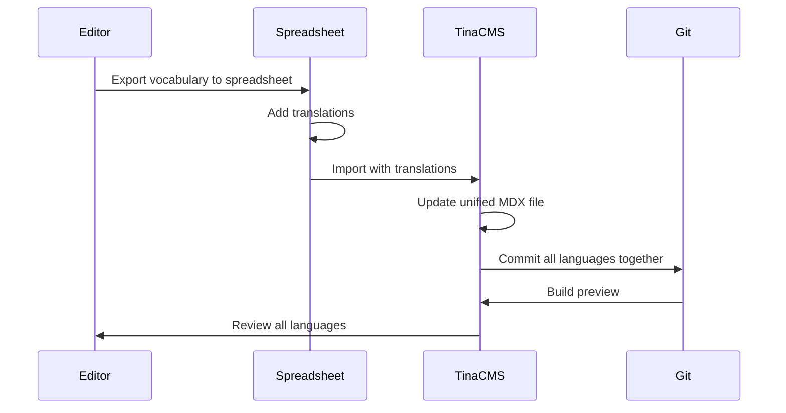
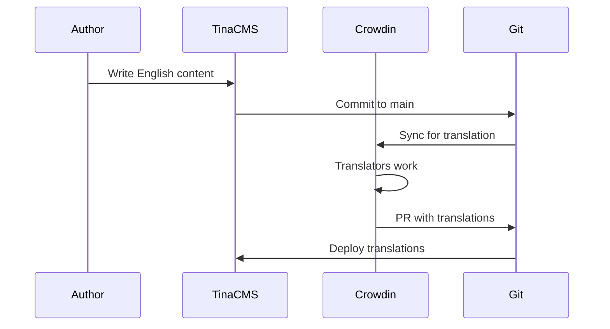

# Collaboration Architecture

**Version:** 1.0  
**Date:** January 2025  
**Status:** Proposed Implementation

## Overview

This document details the collaboration architecture that enables IFLA's globally distributed standards development work. Built on GitHub's platform capabilities, the system provides structured project management, transparent workflows, and inclusive participation models that align with IFLA's governance structure while enabling efficient global collaboration.

## GitHub Project-Based Collaboration Model

### Core Concept

The collaboration architecture centers on GitHub Projects as the primary organizing unit for all standards development work. This model, inspired by W3C working groups, provides focused, goal-oriented collaboration while maintaining clear governance boundaries and enabling external participation.

### Project Structure

```yaml
Review Group (Parent):
  └── Projects (Chartered Work):
      ├── Short-term (3-6 months):
      │   ├── Translation initiatives
      │   ├── Specific updates
      │   └── Cross-namespace harmonization
      └── Long-term (1-3 years):
          ├── Maintenance working groups
          ├── Major revisions
          └── New standard development
```

### Project Charter Components

Each Project includes:
- **Scope Definition**: Clear boundaries of work
- **Deliverables**: Specific outputs and milestones
- **Timeline**: Start date, milestones, expected completion
- **Team Composition**: Core members and allowed external contributors
- **Namespace Assignment**: Which namespaces the Project can modify
- **Success Criteria**: Measurable outcomes

## Organizational Alignment

### Review Group Structure

The four primary Review Groups manage distinct namespace domains:

```
1. International Cataloguing Principles (ICP)
   └── Namespaces: icp, muldicat

2. Bibliographic Conceptual Models (BCM)
   └── Namespaces: frbr, lrm, frad

3. International Standard Bibliographic Description (ISBD)
   └── Namespaces: isbd, isbdm

4. Permanent UNIMARC Committee (PUC)
   └── Namespaces: unimarc, mri
```

### Permission Model

```typescript
interface ProjectPermissions {
  reviewGroup: ReviewGroupId;           // Parent authority
  namespaces: NamespaceId[];           // Assigned work areas
  teamMembers: {
    core: GitHubUser[];                // Full access
    contributors: GitHubUser[];         // Limited access
    observers: GitHubUser[];           // Read-only access
  };
  expiresAt?: Date;                    // For time-limited projects
}
```

## GitHub Platform Integration

### 1. Projects and Boards

GitHub Projects provide kanban-style visual management:

```
┌─────────────────────────────────────────────────────────┐
│                  Project: LRM French Translation         │
├─────────────┬──────────────┬──────────────┬────────────┤
│   Backlog   │  In Progress │   Review     │    Done    │
├─────────────┼──────────────┼──────────────┼────────────┤
│ □ Terms A-C │ □ Terms M-O  │ □ Terms D-F  │ ✓ Overview │
│ □ Terms P-R │ □ Examples   │              │ ✓ Terms G-L│
│ □ Terms S-Z │              │              │            │
└─────────────┴──────────────┴──────────────┴────────────┘
```

**Features**:
- Automated card movement based on pull request status
- Milestone tracking for major deliverables
- Progress visualization and burndown charts
- Custom fields for vocabulary-specific metadata

### 2. Pull Request Workflows

Structured contribution process for all participants:



**Pull Request Template**:
```markdown
## Description
Brief description of changes

## Type of Change
- [ ] Bug fix (non-breaking change)
- [ ] New feature (non-breaking change)
- [ ] Breaking change (fix or feature that would cause existing functionality to not work as expected)
- [ ] Translation
- [ ] Documentation update

## Affected Namespaces
- [ ] frbr
- [ ] lrm
- [ ] isbd
- [ ] Other: ___

## Checklist
- [ ] I have performed a self-review
- [ ] I have added tests that prove my fix/feature works
- [ ] New and existing tests pass locally
- [ ] My changes generate no new warnings
- [ ] I have updated documentation accordingly
```

### 3. Issue Tracking System

Centralized feedback and task management:

**Issue Templates**:

1. **Bug Report**
   ```yaml
   name: Bug Report
   description: Report an error in a standard
   labels: ["bug", "needs-triage"]
   body:
     - type: dropdown
       id: namespace
       attributes:
         label: Affected Namespace
         options: [frbr, lrm, isbd, unimarc, other]
     - type: textarea
       id: description
       attributes:
         label: Bug Description
         description: Clear description of the error
     - type: input
       id: location
       attributes:
         label: Location
         description: Where in the standard (section, term ID, etc.)
   ```

2. **Enhancement Request**
   ```yaml
   name: Enhancement Request
   description: Suggest an improvement
   labels: ["enhancement", "needs-review"]
   body:
     - type: textarea
       id: proposal
       attributes:
         label: Enhancement Proposal
         description: What should be improved and why
     - type: textarea
       id: impact
       attributes:
         label: Expected Impact
         description: Who benefits and how
   ```

3. **Translation Error**
   ```yaml
   name: Translation Issue
   description: Report translation problems
   labels: ["translation", "needs-language-expert"]
   body:
     - type: dropdown
       id: language
       attributes:
         label: Language
         options: [French, Spanish, German, Italian, Other]
     - type: textarea
       id: issue
       attributes:
         label: Translation Issue
         description: Describe the problem
   ```

### 4. Discussion Forums

Contextual conversations for each Project:

```
Project Discussions
├── 📌 Announcements (locked to admins)
├── 💡 Ideas and Proposals
├── 🙏 Q&A
├── 🗣️ General Discussion
└── 📊 Meeting Notes and Decisions
```

## Collaboration Workflows

### 1. Translation Project Workflow

```yaml
Project: "LRM French Translation Initiative"
Duration: 6 months
Team: 
  - Lead: French-speaking Review Group member
  - Translators: 3-5 French librarians (may be external)
  - Reviewers: 2 domain experts

Workflow:
  1. Project Setup:
     - Create GitHub Project
     - Assign `lrm` namespace access
     - Create translation branch
  
  2. Work Organization:
     - Divide vocabulary into sections
     - Create issues for each section
     - Assign to translators
  
  3. Translation Process:
     - Translators work on assigned sections
     - Submit pull requests for review
     - Native speakers review for accuracy
     - Domain experts verify technical correctness
  
  4. Quality Assurance:
     - Automated consistency checking
     - Terminology alignment verification
     - Final review by Project lead
  
  5. Publication:
     - Merge to main branch
     - Tag release version
     - Deploy to production
```

### 2. Maintenance Working Group Workflow

```yaml
Project: "ISBD Maintenance WG 2024-2026"
Duration: 2 years (ongoing)
Team:
  - Standing committee of 5-7 members
  - Rotating external advisors

Workflow:
  1. Continuous Monitoring:
     - Track issues reported by community
     - Review implementation feedback
     - Monitor related standards for changes
  
  2. Quarterly Reviews:
     - Prioritize accumulated issues
     - Plan corrections and clarifications
     - Schedule minor updates
  
  3. Annual Assessment:
     - Evaluate need for major revision
     - Coordinate with other Review Groups
     - Plan next year's activities
```

### 3. Cross-Namespace Harmonization Workflow

```yaml
Project: "BCM Alignment 2024"
Duration: 9 months
Namespaces: frbr, lrm, frad
Team:
  - Representatives from each namespace
  - Harmonization coordinator
  - Technical advisors

Workflow:
  1. Analysis Phase:
     - Identify terminology conflicts
     - Map conceptual differences
     - Document current inconsistencies
  
  2. Harmonization Phase:
     - Propose unified terminology
     - Create mapping documents
     - Build consensus through discussions
  
  3. Implementation Phase:
     - Update each namespace
     - Maintain backward compatibility
     - Document changes and rationale
```

## External Contribution Model

### Participation Levels

1. **Public Contributors**
   - Can create issues
   - Can fork and submit pull requests
   - Cannot directly modify repositories

2. **Project Contributors**
   - Added to specific Projects
   - Can work on Project branches
   - Limited to Project namespaces

3. **Review Group Members**
   - Full access to Review Group namespaces
   - Can charter new Projects
   - Can manage Project teams

4. **Administrators**
   - Organization-wide permissions
   - Can create Review Groups
   - Emergency access to all namespaces

### Contribution Process



## Integration with Other Systems

### 1. CI/CD Pipeline Integration

Projects trigger automated workflows:
- Pull request validation
- Automated testing
- Preview deployments
- Production releases

### 2. Notification System

```typescript
interface NotificationRules {
  projectActivity: {
    newIssue: ['project-team', 'watchers'];
    pullRequest: ['project-team', 'reviewers'];
    milestone: ['project-team', 'review-group'];
  };
  escalation: {
    stalePR: { after: '14 days', notify: ['project-lead'] };
    blockedIssue: { after: '30 days', notify: ['review-group'] };
  };
}
```

### 3. Analytics and Reporting

Project metrics tracked:
- Contribution velocity
- Time to resolution
- Participation rates
- Quality metrics

## Security and Access Control

### GitHub Single Sign-On

```typescript
interface AuthenticationFlow {
  provider: 'github';
  requirements: {
    twoFactorAuth: required;
    emailVerified: required;
  };
  sessionManagement: {
    timeout: '8 hours';
    refreshable: true;
  };
}
```

### Project-Based Permissions

```yaml
Permission Matrix:
  Project Member:
    - Read: all project resources
    - Write: assigned namespaces only
    - Delete: own contributions only
  
  Project Lead:
    - Read: all project resources
    - Write: all project namespaces
    - Delete: project resources
    - Admin: project settings
  
  Review Group Admin:
    - All Project Lead permissions
    - Create: new projects
    - Assign: team members
    - Archive: completed projects
```

## Best Practices

### 1. Project Chartering
- Clear, measurable objectives
- Realistic timelines with buffers
- Defined success criteria
- Exit strategy for long-running projects

### 2. Team Formation
- Mix of domain experts and practitioners
- Include diverse geographic representation
- Plan for member rotation in long projects
- Document knowledge transfer processes

### 3. Communication
- Regular status updates on Project boards
- Decisions documented in Discussions
- Meeting notes in standardized format
- Asynchronous-first collaboration

### 4. Quality Assurance
- Peer review for all changes
- Automated validation where possible
- Regular milestone assessments
- Retrospectives for completed projects

## Future Enhancements

### Planned Improvements

1. **AI-Assisted Review**
   - Automated consistency checking
   - Translation quality assessment
   - Change impact analysis

2. **Enhanced Analytics**
   - Contribution dashboards
   - Project health metrics
   - Predictive completion dates

3. **Integration Expansions**
   - Slack/Teams notifications
   - Calendar integration
   - Time tracking capabilities

### Scaling Considerations

As IFLA's collaborative work expands:
- Project templates for common patterns
- Automated Project setup workflows
- Cross-Project dependency tracking
- Portfolio-level reporting

This collaboration architecture provides the foundation for IFLA's distributed standards development, enabling efficient global participation while maintaining quality and governance standards.

## CMS Integration Strategy
*Source: Previously documented in Doc 15 - TinaCMS Integration Design*

### Why CMS Integration is Critical

#### Current Pain Points
1. **Git Knowledge Barrier**: Non-technical editors struggle with Git workflows
2. **Markdown Complexity**: RDF metadata in frontmatter is error-prone
3. **Validation Delays**: Errors only caught after commit
4. **Preview Challenges**: No real-time preview of changes

#### Expected Benefits
1. **WYSIWYG Editing**: Familiar interface for content creators
2. **Real-time Validation**: Immediate feedback on errors
3. **Visual Preview**: See changes before committing
4. **Simplified Workflow**: Hide Git complexity from users

### Integration Options Analysis

#### Option 1: Full TinaCMS Integration (Cloud)
**Architecture**:
```yaml
Hosting: TinaCMS Cloud
Data: GraphQL layer over Git
Auth: Integrated with Clerk
Cost: $49-299/month depending on users
```

**Pros**:
- Managed infrastructure
- Built-in Git sync
- Media management
- Preview environments

**Cons**:
- Vendor lock-in
- Monthly costs scale with users
- Less control over customization
- Potential performance impact

#### Option 2: Self-Hosted TinaCMS (Recommended)
**Architecture**:
```yaml
Hosting: Our infrastructure
Data: Direct Git integration
Auth: Custom integration with Clerk
Cost: Infrastructure only
```

**Pros**:
- Full control
- No vendor lock-in
- Custom authentication
- Performance optimization

**Cons**:
- Maintenance burden
- Complex setup
- No managed features
- Security responsibility

#### Option 3: Hybrid Approach
**Architecture**:
```yaml
Phase 1: TinaCMS for prose content
Phase 2: Custom forms for RDF metadata
Fallback: Direct Git editing remains available
```

**Pros**:
- Incremental adoption
- Risk mitigation
- Learn from Phase 1
- Can pivot if needed

**Cons**:
- Two systems to maintain
- Potential confusion
- Integration complexity

### Risk Mitigation Strategies

#### Technical Risks
1. **Integration Failure**
   - **Risk**: TinaCMS can't handle our MDX structure
   - **Mitigation**: Build custom fields early
   - **Fallback**: Custom solution

2. **Performance Degradation**
   - **Risk**: Build times become unacceptable
   - **Mitigation**: Optimize during POC
   - **Fallback**: Selective integration

3. **Data Corruption**
   - **Risk**: Git sync issues corrupt data
   - **Mitigation**: Comprehensive backup strategy
   - **Fallback**: Git history recovery

#### Business Risks
1. **Vendor Lock-in**
   - **Risk**: Difficult to migrate away
   - **Mitigation**: Abstract integration layer
   - **Fallback**: Maintain Git editing

2. **Cost Escalation**
   - **Risk**: Pricing increases dramatically
   - **Mitigation**: Self-hosted option
   - **Fallback**: Custom solution

3. **User Rejection**
   - **Risk**: Editors prefer current workflow
   - **Mitigation**: Incremental adoption
   - **Fallback**: Optional usage

## TinaCMS Implementation Guide
*Source: Previously documented in Doc 16 - TinaCMS POC Guide*

### Proof of Concept Approach

#### POC Scope
**What We're Testing**:
1. **MDX Compatibility**: Can TinaCMS handle our complex frontmatter?
2. **Multilingual Support**: Can we edit multiple languages efficiently?
3. **Performance Impact**: What's the build time cost?
4. **User Experience**: Is it actually easier than current workflow?
5. **Customization**: Can we build the fields we need?

**Test Environment**: `standards/newtest`
- Primary Testing Site: Safe POC environment
- No Risk: Isolated from live production sites
- Full Features: Supports all platform capabilities
- Clean Slate: Can reset/rebuild as needed

#### Implementation Steps

**Step 1: Configure TinaCMS Schema**
```typescript
import { defineConfig, Schema } from "tinacms";

// Custom field for multilingual content
const multilingualTextField = {
  name: "multilingual",
  type: "object",
  fields: [
    { name: "en", type: "string", label: "English" },
    { name: "fr", type: "string", label: "French" },
    { name: "es", type: "string", label: "Spanish" },
    { name: "de", type: "string", label: "German" },
  ],
};

// Vocabulary schema matching our MDX structure
const vocabularySchema: Schema = {
  collections: [
    {
      name: "vocabulary",
      label: "Vocabulary Terms",
      path: "standards/newtest/docs/vocabularies",
      format: "mdx",
      fields: [
        {
          name: "uri",
          type: "string",
          label: "URI",
          required: true,
          ui: {
            validate: (value) => {
              if (!value?.startsWith("http://iflastandards.info/ns/")) {
                return "URI must start with http://iflastandards.info/ns/";
              }
            },
          },
        },
        {
          ...multilingualTextField,
          name: "label",
          label: "Label",
          required: true,
        },
        // Additional fields...
      ],
    },
  ],
};
```

**Step 2: Performance Testing**
```javascript
const { execSync } = require('child_process');
const fs = require('fs');

// Baseline build time (without TinaCMS)
console.log('Measuring baseline build time...');
const baselineStart = Date.now();
execSync('pnpm nx build newtest', { stdio: 'inherit' });
const baselineTime = Date.now() - baselineStart;

// Build with TinaCMS
console.log('Measuring TinaCMS build time...');
const tinaStart = Date.now();
execSync('pnpm nx build newtest', { stdio: 'inherit' });
const tinaTime = Date.now() - tinaStart;

// Results
const increase = ((tinaTime - baselineTime) / baselineTime) * 100;
console.log(`
Build Time Impact:
- Baseline: ${baselineTime}ms
- With TinaCMS: ${tinaTime}ms
- Increase: ${increase.toFixed(2)}%
- Acceptable: ${increase < 20 ? 'YES' : 'NO'}
`);
```

### Testing Checklist

**Technical Validation**:
- [ ] TinaCMS initializes without errors
- [ ] Schema correctly represents MDX structure
- [ ] Git integration works
- [ ] Can create new vocabulary terms
- [ ] Can edit existing terms
- [ ] Multilingual fields work correctly
- [ ] Validation rules enforce DCTAP
- [ ] Build time increase < 20%
- [ ] Bundle size increase < 100KB
- [ ] Editor responsiveness < 200ms
- [ ] Changes commit to Git correctly
- [ ] MDX files maintain correct format
- [ ] Preview functionality works
- [ ] No conflicts with Nx build

**User Experience Testing**:
- [ ] Create term faster than current method
- [ ] Edit without syntax errors
- [ ] Switch languages easily
- [ ] Preview changes accurately
- [ ] Validation messages are clear
- [ ] Recovery from errors is simple
- [ ] No data loss on errors

### Success Metrics

**Technical Metrics**:
- Build time increase: <20%
- Bundle size increase: <100KB
- API response time: <200ms
- Error rate: <5%

**User Metrics**:
- Task completion time: 50% reduction
- Error rate: 75% reduction
- Training time: <2 hours
- Satisfaction score: >8/10

**Business Metrics**:
- Editor productivity: 2x improvement
- Support tickets: 50% reduction
- Time to publish: 75% reduction
- Adoption rate: >80%

## TinaCMS Technical Architecture
*Source: Previously documented in Doc 17 - TinaCMS Integration Architecture*

### Core Architecture Overview



### Authentication & Authorization

#### GitHub Organization Integration
```typescript
// apps/admin/src/lib/tina-auth.ts
import { useSession } from 'next-auth/react';
import { Octokit } from '@octokit/rest';

export async function checkEditPermissions(user: User): Promise<EditPermissions> {
  const octokit = new Octokit({ auth: user.accessToken });
  
  try {
    // Check organization membership
    const { data: membership } = await octokit.orgs.checkMembershipForUser({
      org: 'iflastandards',
      username: user.username,
    });
    
    if (membership) {
      return {
        canEdit: true,
        canPreview: true,
        canCommit: true,
        editMode: 'tina',
      };
    }
  } catch (error) {
    // Not a member - offer fork workflow
    return {
      canEdit: true,
      canPreview: false,
      canCommit: false,
      editMode: 'fork',
    };
  }
}
```

#### Edit Button Implementation
```tsx
// packages/theme/src/components/EditButton.tsx
import React from 'react';
import { useAuth } from '@/hooks/useAuth';
import { useTina } from 'tinacms';

export function EditButton({ filePath, namespace, isReleased }) {
  const { user, isOrgMember } = useAuth();
  const { setEdit } = useTina();
  
  if (!user) {
    return <GitHubForkButton filePath={filePath} />;
  }
  
  if (isReleased && !user.isReviewGroupAdmin) {
    return (
      <Tooltip content="This version is locked. Create a PR to suggest changes.">
        <CreatePRButton filePath={filePath} />
      </Tooltip>
    );
  }
  
  if (isOrgMember) {
    return (
      <button onClick={() => setEdit(true)}>
        Edit this page
      </button>
    );
  }
  
  return <GitHubForkButton filePath={filePath} />;
}
```

### Real-time Preview Implementation

```typescript
// apps/admin/src/components/TinaPreview.tsx
import { useTina } from 'tinacms';
import { MDXRemote } from 'next-mdx-remote';
import { VocabularyTable, ConceptHierarchy } from '@ifla/theme/components';

const components = {
  VocabularyTable,
  ConceptHierarchy,
  // ... other components
};

export function TinaPreview({ query, variables }) {
  const { data } = useTina({ query, variables });
  
  // Transform frontmatter data for preview
  const frontmatter = transformRDFData(data.frontmatter);
  
  // Compile MDX with components
  const content = (
    <MDXRemote
      source={data.body}
      components={components}
      scope={{ ...frontmatter }}
    />
  );
  
  return (
    <div className="preview-container">
      <PreviewHeader data={frontmatter} />
      <PreviewContent>{content}</PreviewContent>
    </div>
  );
}
```

### Version Control & Branch Management

```typescript
// apps/admin/src/lib/tina-branch-manager.ts
export class TinaBranchManager {
  async createEditingBranch(user: User, file: string): Promise<string> {
    const timestamp = new Date().toISOString().split('T')[0];
    const branchName = `tina/${user.username}/${timestamp}-${slugify(file)}`;
    
    await this.git.createBranch({
      name: branchName,
      from: 'preview',
    });
    
    return branchName;
  }
  
  async commitChanges(branch: string, files: FileChange[]): Promise<void> {
    await this.git.commit({
      branch,
      message: `Edit: ${files.map(f => f.path).join(', ')}`,
      files,
      author: this.user,
    });
  }
  
  async createPullRequest(branch: string): Promise<PullRequest> {
    return await this.github.createPR({
      title: `Content update from TinaCMS`,
      head: branch,
      base: 'preview',
      body: this.generatePRBody(),
    });
  }
}
```

### Implementation Phases

**Phase 1: Core Integration (Weeks 1-2)**
1. Set up self-hosted TinaCMS
2. Implement GitHub auth integration
3. Create vocabulary schema
4. Basic preview functionality

**Phase 2: Advanced Features (Weeks 3-4)**
1. Component integration in preview
2. Branch management automation
3. Version locking implementation
4. Multilingual field components

**Phase 3: Translation Workflow (Weeks 5-6)**
1. Spreadsheet import integration
2. Translation scaffolding
3. Language switcher implementation
4. Crowdin exploration (if needed)

## Internationalization Architecture
*Source: Previously documented in Doc 18 - Multilingual Strategy Design*

### Hybrid Multilingual Approach

Based on content type and user needs, we implement a hybrid approach:

#### Content Type Matrix

| Content Type | Approach | Rationale |
|--------------|----------|----------|
| RDF Vocabulary Terms | Unified Pages | All translations of a concept belong together |
| Documentation Pages | Separate Directories | Prose structure varies by language |
| UI Components | JSON/TS files | Standard i18n approach |
| Navigation | Docusaurus i18n | Built-in support |

### Unified Vocabulary Implementation

#### File Structure
```yaml
# standards/isbd/docs/vocabularies/hasTitle.mdx
---
uri: http://iflastandards.info/ns/isbd/terms/hasTitle
type: Property
labels:
  en: "has title"
  fr: "a pour titre"
  es: "tiene título"
  de: "hat Titel"
definitions:
  en: "Relates a resource to a title designation"
  fr: "Met en relation une ressource avec une désignation"
  es: "Relaciona un recurso con una designación"
  de: "Setzt eine Ressource in Beziehung"
domain: http://iflastandards.info/ns/isbd/terms/Resource
range: http://www.w3.org/2000/01/rdf-schema#Literal
---

import { VocabularyDisplay } from '@ifla/theme/components';
import { LanguageContent } from '@ifla/theme/components';

<VocabularyDisplay term={frontmatter} />

<LanguageContent>
{{
  en: `
## Usage Guidelines

This property is used to relate a resource to its title...

### Examples
- Book: "has title" → "War and Peace"
- Article: "has title" → "Climate Change Impact"
  `,
  fr: `
## Directives d'utilisation

Cette propriété est utilisée pour relier une ressource...

### Exemples
- Livre: "a pour titre" → "Guerre et Paix"
- Article: "a pour titre" → "Impact du changement climatique"
  `
}}
</LanguageContent>
```

#### Language Switcher Component
```tsx
// packages/theme/src/components/VocabularyLanguageSwitcher.tsx
import { useLanguage } from '../hooks/useLanguage';
import { useAvailableLanguages } from '../hooks/useAvailableLanguages';

export function VocabularyLanguageSwitcher({ term }) {
  const [currentLang, setCurrentLang] = useLanguage();
  const availableLanguages = useAvailableLanguages(term);
  
  return (
    <div className="language-switcher">
      <select 
        value={currentLang} 
        onChange={(e) => setCurrentLang(e.target.value)}
        aria-label="Select language"
      >
        {availableLanguages.map(lang => (
          <option key={lang.code} value={lang.code}>
            {lang.name} {lang.isComplete ? '' : '(partial)'}
          </option>
        ))}
      </select>
    </div>
  );
}
```

### Translation Workflow Integration

#### Vocabulary Translation Flow


#### Documentation Translation Flow


### Migration Strategy

**Phase 1: Vocabulary Terms (Unified)**
1. Update MDX schema to support multilingual frontmatter
2. Migrate existing vocabulary to unified format
3. Implement language switcher component
4. Update TinaCMS fields

**Phase 2: Documentation (Separated)**
1. Set up Docusaurus i18n
2. Create translation directories
3. Configure routing
4. Integrate with translation service

**Phase 3: UI Elements**
1. Extract UI strings to translation files
2. Implement i18n context
3. Create language selector
4. Test all languages

### Recommendations

1. **Use Unified Pages for Vocabulary Terms**
   - All languages in one file
   - Language switcher UI
   - Consistent RDF data

2. **Use Separate Directories for Documentation**
   - Standard Docusaurus i18n
   - Better for long-form content
   - Translation tool compatible

3. **Implement Smart Routing**
   - `/vocabularies/hasTitle` → All languages
   - `/docs/guide` → Redirects based on browser language
   - `/fr/docs/guide` → French documentation

4. **Provide Migration Tools**
   - Script to convert between formats
   - Validation for completeness
   - Translation progress tracking

This hybrid approach leverages the strengths of both patterns while minimizing their weaknesses, providing the best experience for both content creators and end users.