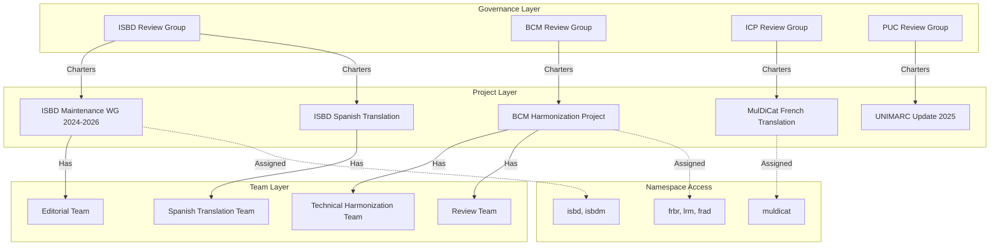
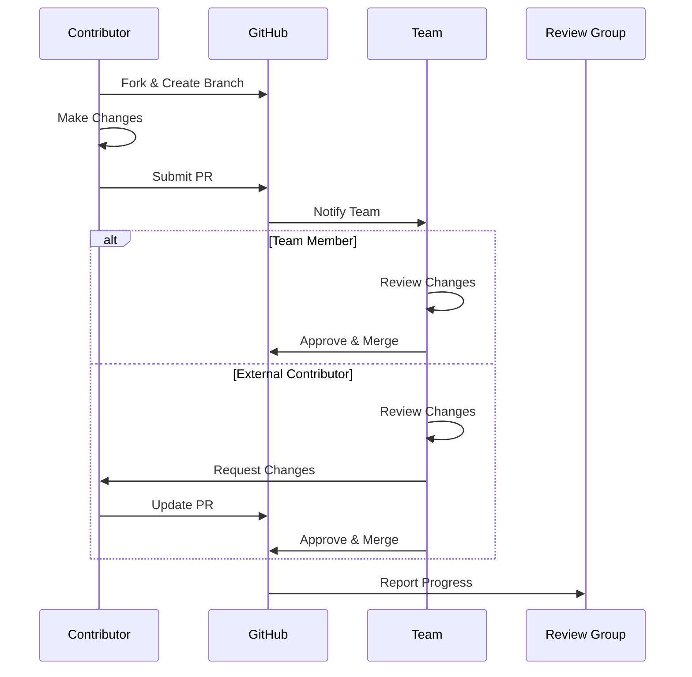
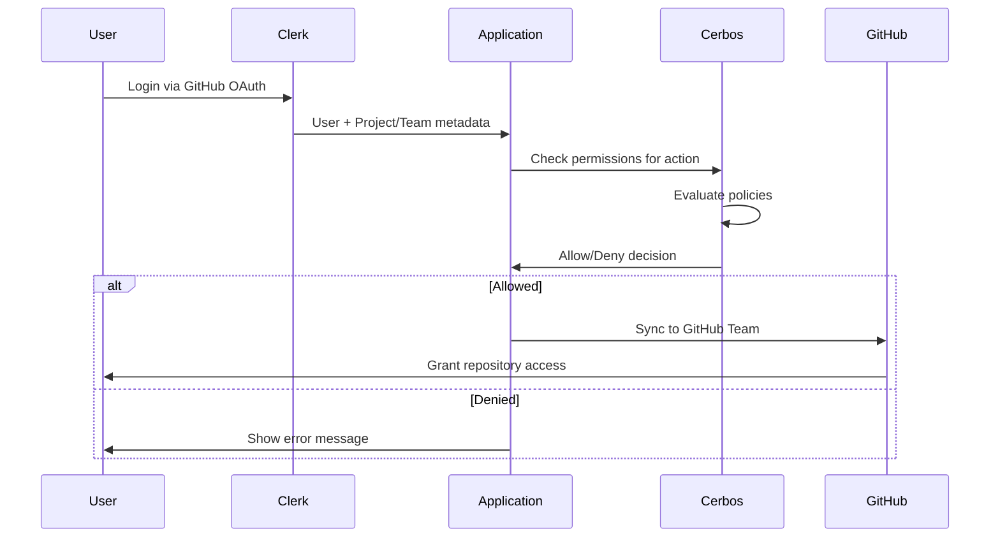

# Collaboration Architecture

**Version:** 2.0  
**Date:** January 2025  
**Status:** Current Implementation

## Overview

This document details the collaboration architecture that enables IFLA's globally distributed standards development work. Built on GitHub's platform capabilities and organized through a Projects-centric model, the system provides structured project management, transparent workflows, and inclusive participation models that align with IFLA's governance structure while enabling efficient global collaboration.

## GitHub Projects-Based Organizational Model

### Core Philosophy

The collaboration architecture implements a W3C-inspired working group model where Review Groups charter time-bounded Projects with specific deliverables. This approach enables:

- **Focused Collaboration**: Teams work on well-defined objectives
- **External Participation**: Contributors join without IFLA membership requirements
- **Clear Governance**: Review Groups maintain strategic oversight
- **Flexible Timelines**: Projects can run from months to years

### Organizational Hierarchy



## Core Components

### Review Groups

**Purpose**: Perpetual organizational entities providing governance and strategic direction

**Responsibilities**:
- Charter Projects aligned with strategic goals
- Assign namespace access to Projects
- Appoint Project leads and approve Teams
- Review and accept Project deliverables
- Maintain long-term standard coherence

**Current Review Groups**:
1. **ISBD Review Group**: International Standard Bibliographic Description
2. **BCM Review Group**: Bibliographic Conceptual Models
3. **ICP Review Group**: International Cataloguing Principles
4. **PUC Review Group**: Permanent UNIMARC Committee

### Projects

**Purpose**: Time-bounded initiatives with specific deliverables (similar to W3C working groups)

**Key Characteristics**:
- Chartered by Review Groups with defined scope
- Can run for extended periods (months to years)
- Have specific deliverables and milestones
- Tracked through GitHub Projects boards
- Receive namespace access for their work

**Project Types**:

#### Maintenance Projects
```yaml
Example: "ISBD Maintenance WG 2024-2026"
Duration: 2 years (renewable)
Team Size: 5-7 standing members
Deliverables:
  - Quarterly maintenance releases
  - Annual assessment reports
  - Issue resolution
  - Community support
```

#### Translation Projects
```yaml
Example: "MulDiCat French Translation Initiative"
Duration: 6 months
Team Size: 3-5 translators + reviewers
Deliverables:
  - Complete French translation
  - Quality review documentation
  - Publication-ready files
```

#### Harmonization Projects
```yaml
Example: "BCM Harmonization Project"
Duration: 18 months
Team Size: 8-10 cross-namespace experts
Deliverables:
  - Terminology mapping
  - Unified conceptual model
  - Migration guidelines
  - Implementation tools
```

### Teams

**Purpose**: Collaborative units executing Project work

**Team Roles**:
- **Editor**: Primary content creation and modification rights
- **Reviewer/Author**: Review and contribution rights
- **Translator**: Translation and localization rights

**Team Composition**:
- Core members with primary responsibilities
- External contributors for specialized expertise
- Advisors for domain knowledge
- Observers for transparency

### Namespace Assignment

**Mechanism**: Projects receive access to specific namespaces for their work

```typescript
interface ProjectNamespaceAssignment {
  project: ProjectId;
  namespaces: NamespaceId[];
  permissions: {
    read: true;
    write: boolean;
    publish: boolean;
    delete: boolean;
  };
  validFrom: Date;
  validUntil?: Date;
}
```

## GitHub Platform Integration

### 1. GitHub Projects as Work Coordination

Each IFLA Project maps to a GitHub Project board:

```
┌─────────────────────────────────────────────────────────┐
│         Project: ISBD Maintenance WG 2024-2026          │
├─────────────┬──────────────┬──────────────┬────────────┤
│   Backlog   │  In Progress │   Review     │    Done    │
├─────────────┼──────────────┼──────────────┼────────────┤
│ □ Issue #45 │ □ PR #234    │ □ PR #230    │ ✓ PR #225  │
│ □ Issue #46 │ □ Issue #44  │ □ PR #232    │ ✓ Issue #41│
│ □ RFC #12   │              │              │ ✓ PR #228  │
└─────────────┴──────────────┴──────────────┴────────────┘

Automation:
- Issues auto-added to Backlog
- PRs move through columns based on status
- Milestones track major deliverables
- Custom fields for vocabulary metadata
```

### 2. Pull Request Workflows

All changes follow structured PR workflows:



### 3. Issue Templates and Tracking

Project-specific issue templates:

```yaml
# .github/ISSUE_TEMPLATE/vocabulary-change.yml
name: Vocabulary Change Request
description: Propose a change to vocabulary terms
title: "[VOCAB]: "
labels: ["vocabulary", "needs-triage"]
projects: ["ISBD Maintenance WG 2024-2026"]
body:
  - type: dropdown
    id: namespace
    attributes:
      label: Namespace
      options:
        - isbd
        - isbdm
    validations:
      required: true
  - type: input
    id: term
    attributes:
      label: Affected Term(s)
      placeholder: "e.g., hasTitle"
  - type: textarea
    id: change
    attributes:
      label: Proposed Change
      description: Describe the change and rationale
```

### 4. Team Collaboration Features

**Discussion Forums**: Project-specific discussions
```
Project Discussions
├── 📌 Announcements
├── 💡 Proposals (RFCs)
├── 🙏 Q&A
├── 🗣️ General Discussion
├── 📊 Meeting Notes
└── 🌍 Translation Coordination
```

**Wiki**: Project documentation
```
Project Wiki
├── Charter
├── Team Members
├── Meeting Schedule
├── Decision Log
├── Style Guide
└── Resources
```

## Permission Model

### Hierarchical Permissions

```yaml
System Level:
  - system-admin: Full platform administration
  - ifla-admin: IFLA-wide administration

Review Group Level:
  - {rg}-admin: Can charter Projects, manage Teams
  - {rg}-member: Can participate in Review Group decisions

Project Level (via Team membership):
  - Editor: Create, modify, delete content
  - Reviewer: Review and approve changes
  - Translator: Translate content
  - Observer: View-only access

Namespace Level (via Project assignment):
  - Inherited from Project membership
  - Scoped to assigned namespaces only
```

### Authentication & Authorization Flow



## Collaboration Workflows

### 1. Project Charter and Setup

```yaml
Steps:
  1. Review Group Decision:
     - Identify need for Project
     - Define scope and deliverables
     - Set timeline and milestones
     
  2. Project Creation:
     - Create GitHub Project board
     - Set up automation rules
     - Configure access controls
     
  3. Team Formation:
     - Identify required skills
     - Recruit team members
     - Assign roles
     
  4. Namespace Assignment:
     - Grant Project access to namespaces
     - Configure permissions
     - Set up branch protection
     
  5. Kickoff:
     - Initial team meeting
     - Review charter
     - Plan first milestone
```

### 2. Development Workflow

```yaml
Daily Operations:
  1. Issue Creation:
     - Community reports issue
     - Team triages and assigns
     - Added to Project board
     
  2. Development:
     - Developer creates branch
     - Makes changes
     - Submits PR with tests
     
  3. Review Process:
     - Automated checks run
     - Team reviews changes
     - Feedback incorporated
     
  4. Merge and Deploy:
     - PR approved and merged
     - Automated deployment
     - Issue closed
```

### 3. External Contribution Workflow

```yaml
External Contributor Journey:
  1. Discovery:
     - Find Project via GitHub
     - Read contribution guide
     - Join Discussion forum
     
  2. First Contribution:
     - Fork repository
     - Make small change
     - Submit PR
     
  3. Review Process:
     - Team member reviews
     - Provides feedback
     - Guides to completion
     
  4. Recognition:
     - PR merged
     - Contributor acknowledged
     - Invited to continue
```

## Quality Assurance

### Code Review Requirements

All changes require:
- Automated test passage
- Team member review
- For major changes: 2+ reviewers
- For namespace changes: Project lead approval

### Automated Checks

```yaml
PR Checks:
  - Syntax validation
  - DCTAP compliance
  - Link checking
  - Build success
  - Test coverage
  
Merge Checks:
  - All conversations resolved
  - Approved by required reviewers
  - Up to date with base branch
  - All checks passing
```

## Integration with Platform Systems

### 1. CI/CD Pipeline

Projects trigger automated workflows:

```yaml
name: Project CI/CD
on:
  pull_request:
    types: [opened, synchronize]
    paths:
      - 'standards/*/vocabularies/**'
      
jobs:
  validate:
    runs-on: ubuntu-latest
    steps:
      - uses: actions/checkout@v4
      - name: Validate vocabulary
        run: pnpm validate:vocab
      
  preview:
    needs: validate
    runs-on: ubuntu-latest
    steps:
      - name: Deploy preview
        run: pnpm deploy:preview
      - name: Comment PR
        uses: actions/github-script@v7
        with:
          script: |
            github.rest.issues.createComment({
              issue_number: context.issue.number,
              body: `Preview deployed to: ${preview_url}`
            })
```

### 2. Notification System

```typescript
interface ProjectNotifications {
  channels: {
    github: boolean;      // GitHub notifications
    email: boolean;       // Email digests
    slack?: string;       // Optional Slack channel
  };
  
  events: {
    newIssue: ['team-all'];
    prOpened: ['team-reviewers'];
    prMerged: ['team-all', 'review-group'];
    milestoneComplete: ['team-all', 'review-group', 'ifla-admin'];
  };
  
  escalation: {
    stalePR: { days: 14, notify: ['project-lead'] };
    blockedIssue: { days: 30, notify: ['review-group-admin'] };
  };
}
```

### 3. Reporting and Analytics

Project metrics dashboard:

```typescript
interface ProjectMetrics {
  velocity: {
    issuesCreated: number;
    issuesClosed: number;
    prsOpened: number;
    prsMerged: number;
    averageTimeToMerge: Duration;
  };
  
  participation: {
    activeContributors: number;
    newContributors: number;
    externalContributors: number;
    reviewComments: number;
  };
  
  quality: {
    testCoverage: percentage;
    validationErrors: number;
    revisionRequests: number;
  };
  
  progress: {
    milestonesComplete: number;
    milestonesPending: number;
    deliverableStatus: Map<DeliverableId, Status>;
  };
}
```

## Best Practices

### For Review Groups

1. **Clear Charters**: Define specific, measurable objectives
2. **Realistic Timelines**: Include buffer for review cycles
3. **Diverse Teams**: Include various perspectives and expertise
4. **Regular Check-ins**: Monthly progress reviews

### For Project Teams

1. **Communication First**: Over-communicate in distributed teams
2. **Document Decisions**: Use Discussion threads for posterity
3. **Inclusive Reviews**: Welcome all feedback, guide new contributors
4. **Celebrate Milestones**: Acknowledge achievements publicly

### For Contributors

1. **Start Small**: First PR should be minor (typo, doc fix)
2. **Ask Questions**: Use Discussions for clarification
3. **Follow Conventions**: Read contribution guide thoroughly
4. **Be Patient**: Reviews may take time in volunteer projects

## Migration Strategy

### Phase 1: Foundation (Weeks 1-2)
- Set up GitHub organization structure
- Configure Clerk authentication
- Create initial Review Groups
- Document processes

### Phase 2: Pilot Projects (Weeks 3-4)
- Charter 2-3 pilot Projects
- Form pilot Teams
- Test workflows end-to-end
- Gather feedback

### Phase 3: Full Rollout (Weeks 5-8)
- Charter remaining Projects
- Migrate existing work
- Train all participants
- Monitor and adjust

### Phase 4: Optimization (Ongoing)
- Refine based on usage
- Automate common tasks
- Enhance reporting
- Scale successful patterns

## CMS Integration Strategy

### TinaCMS Integration

TinaCMS provides a visual editing layer for non-technical contributors:

**Key Features**:
- WYSIWYG editing for vocabulary terms
- Real-time preview of changes
- Git-based workflow preservation
- Role-based edit permissions

**Integration Points**:
- Edit button on vocabulary pages
- Branch creation for edits
- Visual diff in pull requests
- Automated PR creation

For detailed TinaCMS implementation, see the POC guide and technical architecture sections in document appendix.

## Future Enhancements

### Near-term (Q1-Q2 2025)
- Automated Project setup wizard
- Enhanced analytics dashboards
- Slack/Teams integration
- AI-assisted reviews

### Medium-term (Q3-Q4 2025)
- Cross-Project dependency tracking
- Resource allocation optimization
- Predictive completion dates
- Automated translation workflows

### Long-term (2026+)
- Federation with other standards bodies
- AI-powered harmonization suggestions
- Real-time collaborative editing
- Blockchain-based change attestation

## Success Metrics

### Efficiency Metrics
- Time from issue to resolution: <30 days
- PR review turnaround: <7 days
- External contributor onboarding: <2 hours
- Project setup time: <1 day

### Participation Metrics
- Active Projects: >10
- External contributors: >30%
- Geographic distribution: >20 countries
- New contributors/month: >5

### Quality Metrics
- First-time contributor success: >80%
- PR acceptance rate: >90%
- Test coverage maintained: >90%
- Documentation completeness: 100%

This collaboration architecture provides a robust foundation for IFLA's distributed standards development, enabling efficient global participation while maintaining quality and governance standards through the Projects/Teams/Review Groups model.