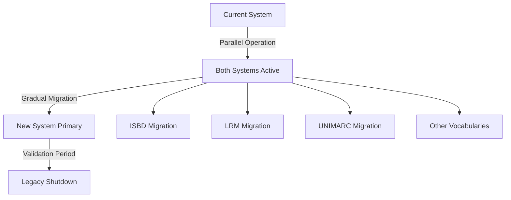

# Implementation Strategy

**Version:** 1.0  
**Date:** January 2025  
**Status:** Strategic Planning Document

## Overview

This document outlines the comprehensive implementation strategy for the IFLA Standards Development Platform transformation. It details the phased approach, change management processes, risk mitigation strategies, and success metrics that will guide the transition from current systems to the enhanced platform.

## Implementation Philosophy

### Core Principles

1. **Continuity First**: Maintain uninterrupted service during transition
2. **Incremental Progress**: Small, validated steps over big bang changes
3. **User-Centric**: Prioritize user experience and minimize disruption
4. **Risk-Aware**: Identify and mitigate risks proactively
5. **Evidence-Based**: Measure and validate each phase

### Success Criteria

```yaml
Technical Success:
  - Zero downtime during transition
  - All legacy URLs properly redirected
  - No data loss or corruption
  - Performance improvements measurable

Operational Success:
  - User adoption rate > 80% within 6 months
  - Support ticket reduction > 50%
  - Time-to-publish reduced by 50%
  - Error rates decreased by 75%

Strategic Success:
  - Increased global participation
  - Improved content quality metrics
  - Enhanced IFLA reputation
  - Sustainable maintenance model
```

## Phased Implementation Plan

### Phase 1: Foundation (Months 1-2)

**Objective**: Establish development environment and migrate ISBDM proof-of-concept

#### Technical Tasks
```yaml
Week 1-2: Environment Setup
  - Initialize Nx workspace
  - Configure monorepo structure
  - Set up CI/CD pipelines
  - Establish development workflows

Week 3-4: ISBDM Migration
  - Port existing ISBDM functionality
  - Validate all features work correctly
  - Set up automated testing
  - Document migration patterns

Week 5-6: Infrastructure Validation
  - Performance benchmarking
  - Security audit
  - Backup procedures
  - Monitoring setup

Week 7-8: Team Preparation
  - Development environment setup
  - Initial training sessions
  - Documentation creation
  - Feedback collection
```

#### Deliverables
- ✅ Working Nx monorepo
- ✅ ISBDM fully functional in new architecture
- ✅ CI/CD pipelines operational
- ✅ Team trained on basic workflows

### Phase 2: Content Lifecycle Implementation (Months 3-4)

**Objective**: Build production-ready content management workflows

#### Technical Implementation
```typescript
// Core API Endpoints
POST   /api/cycle/import       // Bootstrap from Google Sheets
POST   /api/tina/validateOnSave // Real-time validation
POST   /api/publish            // Streamlined publication

// Supporting Scripts
scripts/
  ├── bootstrap-cycle.ts       // Import and MDX generation
  ├── nightly-assembly.ts      // CI with versioning
  └── publish-vocabulary.ts    // Deploy to vocabulary server
```

#### Workflow Components
1. **Google Sheets Integration**
   - Service account authentication
   - Bidirectional sync capabilities
   - Rate limiting and quota management
   - Error handling and recovery

2. **TinaCMS Configuration**
   - Rich-text editing for prose
   - Form-based RDF editing
   - Real-time validation
   - Git integration

3. **Nightly Assembly Pipeline**
   - Nx affected detection
   - Draft vocabulary generation
   - AI-powered impact analysis
   - Semantic version recommendations

### Phase 3: Admin Portal Development (Months 5-6)

**Objective**: Create comprehensive administrative interface

#### Feature Implementation
```yaml
Vocabulary Management:
  - Import/Export workflows
  - Validation interfaces
  - Version control UI
  - Publication workflows

Project Management:
  - GitHub Project integration
  - Team management
  - Namespace assignments
  - Progress tracking

Quality Assurance:
  - Validation reports
  - Error tracking
  - Impact analysis
  - Pre-publication checks

User Management:
  - Role assignments
  - Permission management
  - Activity logging
  - Access control
```

#### Integration Points
- GitHub API for project management
- Supabase for job tracking
- Clerk for authentication
- Cerbos for authorization

### Phase 4: Migration and Rollout (Months 7-8)

**Objective**: Migrate remaining vocabularies and launch platform

#### Migration Strategy


#### Rollout Plan
1. **Soft Launch** (Month 7)
   - Beta users test new system
   - Parallel operation with legacy
   - Feedback collection
   - Issue resolution

2. **Progressive Migration** (Month 7-8)
   - Migrate one vocabulary at a time
   - Validate each migration
   - Update documentation
   - Train users incrementally

3. **Full Launch** (End of Month 8)
   - All vocabularies migrated
   - Legacy system in read-only
   - Public announcement
   - Support transition

## Change Management Strategy

### Stakeholder Engagement

```yaml
Review Group Administrators:
  - Executive briefings
  - Hands-on workshops
  - Regular check-ins
  - Feedback channels

Editorial Teams:
  - Training sessions
  - Video tutorials
  - Quick reference guides
  - Peer mentoring

Technical Staff:
  - Deep-dive training
  - Architecture documentation
  - Troubleshooting guides
  - Escalation procedures

External Contributors:
  - Public documentation
  - Getting started guides
  - Community forums
  - Office hours
```

### Communication Plan

#### Channels and Frequency
```
┌─────────────────────────────────────────────────────────┐
│ Stakeholder      │ Channel        │ Frequency          │
├──────────────────┼────────────────┼────────────────────┤
│ Review Groups    │ Email/Meetings │ Bi-weekly          │
│ Editorial Teams  │ Slack/Teams    │ Daily during migr. │
│ Technical Staff  │ GitHub/Slack   │ Continuous         │
│ Community        │ Blog/Forum     │ Monthly updates    │
└─────────────────────────────────────────────────────────┘
```

### Training Program

#### Curriculum Structure
```yaml
Level 1 - Basic Users:
  Duration: 2 hours
  Topics:
    - Platform overview
    - Basic navigation
    - Content editing
    - Submission process

Level 2 - Power Users:
  Duration: 4 hours
  Topics:
    - Advanced editing
    - Workflow management
    - Quality assurance
    - Troubleshooting

Level 3 - Administrators:
  Duration: 8 hours
  Topics:
    - System administration
    - User management
    - Project setup
    - Performance monitoring
```

#### Training Materials
- Video tutorials (5-10 min each)
- Interactive sandboxes
- Quick reference cards
- Best practices documentation

## Risk Management

### Risk Matrix

```yaml
High Probability / High Impact:
  - User resistance to change
    Mitigation: Extensive training, gradual rollout
  
  - Data migration errors
    Mitigation: Automated validation, rollback capability

High Probability / Low Impact:
  - Minor bugs during transition
    Mitigation: Rapid response team, hot fixes
  
  - Temporary performance issues
    Mitigation: Scaling preparation, monitoring

Low Probability / High Impact:
  - Major security vulnerability
    Mitigation: Security audits, penetration testing
  
  - Complete system failure
    Mitigation: Backup systems, disaster recovery

Low Probability / Low Impact:
  - Feature requests during migration
    Mitigation: Feature freeze, clear roadmap
```

### Contingency Plans

#### Rollback Procedures
```bash
# Full System Rollback
1. Freeze new system changes
2. Export any new data
3. Restore legacy system from backup
4. Redirect traffic to legacy
5. Communicate rollback to users
6. Analyze failure points

# Partial Rollback (per vocabulary)
1. Identify affected vocabulary
2. Restore vocabulary-specific data
3. Update routing for that vocabulary
4. Maintain others on new system
5. Fix issues in isolation
```

#### Parallel Operation Strategy
- Both systems remain operational
- Read traffic can use either system
- Write traffic gradually migrated
- Daily sync between systems
- Clear system-of-record designation

## Performance Metrics and Monitoring

### Key Performance Indicators (KPIs)

```typescript
interface ImplementationKPIs {
  technical: {
    systemUptime: number;          // Target: 99.9%
    pageLoadTime: number;          // Target: <2s
    errorRate: number;             // Target: <0.1%
    deploymentFrequency: number;   // Target: Daily
  };
  
  operational: {
    timeToPublish: number;         // Target: 50% reduction
    userAdoptionRate: number;      // Target: >80%
    supportTickets: number;        // Target: 50% reduction
    contentQualityScore: number;   // Target: >95%
  };
  
  strategic: {
    contributorGrowth: number;     // Target: 25% increase
    globalParticipation: number;   // Target: 40% non-English
    standardsPublished: number;    // Target: 20% increase
    communityEngagement: number;   // Target: 2x baseline
  };
}
```

### Monitoring Dashboard

```yaml
Real-time Metrics:
  - System health status
  - Active user count
  - Transaction throughput
  - Error rates

Daily Reports:
  - User activity summary
  - Content changes
  - Performance trends
  - Issue resolution

Weekly Analysis:
  - Adoption metrics
  - User feedback themes
  - Performance optimization
  - Capacity planning

Monthly Reviews:
  - Strategic KPI progress
  - ROI calculations
  - Stakeholder satisfaction
  - Roadmap adjustments
```

## Financial Planning

### Cost-Benefit Analysis

#### Implementation Costs
```yaml
One-time Costs:
  - Development team (8 months): $XXX,XXX
  - Infrastructure setup: $XX,XXX
  - Training development: $XX,XXX
  - Security audits: $XX,XXX
  Total: $XXX,XXX

Ongoing Costs (Annual):
  - Infrastructure hosting: $XX,XXX
  - Maintenance & support: $XX,XXX
  - Continuous improvement: $XX,XXX
  Total: $XX,XXX/year
```

#### Expected Benefits
```yaml
Efficiency Gains:
  - 50% reduction in content management time
  - 75% reduction in error correction time
  - 90% reduction in manual coordination
  Annual savings: $XXX,XXX

Quality Improvements:
  - Reduced errors and inconsistencies
  - Faster time to market
  - Improved stakeholder satisfaction
  Estimated value: $XXX,XXX

Strategic Value:
  - Enhanced IFLA reputation
  - Increased global participation
  - Future growth enablement
  Intangible but significant
```

### Return on Investment (ROI)

```
Year 1: -$XXX,XXX (investment)
Year 2: +$XX,XXX (break-even)
Year 3: +$XXX,XXX (positive ROI)
5-year ROI: 250%
```

## Success Factors

### Critical Success Factors

1. **Executive Sponsorship**
   - Visible leadership support
   - Resource commitment
   - Change advocacy

2. **User Engagement**
   - Early involvement
   - Continuous feedback
   - Champion network

3. **Technical Excellence**
   - Robust architecture
   - Comprehensive testing
   - Performance optimization

4. **Change Management**
   - Clear communication
   - Adequate training
   - Support systems

### Lessons from Similar Transformations

Based on analysis of similar platform transformations:

**What Works**:
- Incremental migration over big bang
- Strong user involvement throughout
- Parallel operation during transition
- Comprehensive training programs
- Clear success metrics

**What to Avoid**:
- Underestimating change resistance
- Insufficient testing before migration
- Weak rollback plans
- Poor communication
- Feature creep during implementation

## Post-Implementation

### Stabilization Period (Months 9-10)

- Monitor all systems closely
- Rapid response to issues
- Collect user feedback
- Fine-tune performance
- Document lessons learned

### Continuous Improvement (Ongoing)

- Regular feature updates
- Performance optimization
- User experience enhancement
- Security updates
- Capacity scaling

### Future Roadmap

```yaml
Year 2 Enhancements:
  - AI-powered content assistance
  - Advanced analytics dashboard
  - Mobile application
  - API marketplace

Year 3 Expansion:
  - Additional namespace support
  - Third-party integrations
  - Advanced collaboration tools
  - Machine learning features
```

## Conclusion

This implementation strategy provides a comprehensive roadmap for transforming IFLA's standards development platform. By following this phased approach with careful attention to change management, risk mitigation, and success metrics, IFLA can achieve the technical transformation while maintaining operational continuity and stakeholder satisfaction.

The key to success lies in maintaining focus on the core objectives while remaining flexible enough to adapt to discoveries and feedback during implementation. With proper execution of this strategy, IFLA will establish itself as a leader in modern standards development practices.