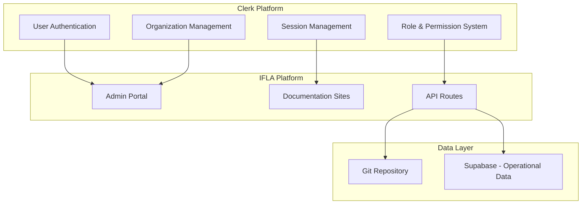

# Clerk RBAC Implementation Plan

**Version:** 1.0  
**Date:** January 2025  
**Status:** Implementation Planning

## Executive Summary

Since Cerbos has not been implemented yet, this document outlines the plan to implement Clerk.com's organization-based RBAC as the primary authorization system for the IFLA Standards Platform. This approach simplifies the architecture by using a single service for both authentication and authorization.

## Implementation Overview

### Why Clerk Organizations Over Cerbos

1. **Simpler Architecture**: Single service instead of Clerk + Cerbos + NextAuth
2. **Lower Maintenance**: No policy files to manage
3. **Better Integration**: Native integration between auth and authorization
4. **Cost Effective**: One vendor instead of multiple services
5. **Faster Time to Market**: Built-in UI and management tools

### Target Architecture



## Phase 1: Foundation Setup (Week 1)

### 1.1 Clerk Configuration

```typescript
// Environment configuration
export const clerkConfig = {
  // Production keys
  CLERK_PUBLISHABLE_KEY: process.env.CLERK_PUBLISHABLE_KEY,
  CLERK_SECRET_KEY: process.env.CLERK_SECRET_KEY,
  
  // Organization features
  features: {
    organizations: true,
    organizationRoles: true,
    organizationMetadata: true,
    customRoles: true
  },
  
  // Session configuration
  session: {
    cookieDomain: '.iflastandards.info',
    sameSite: 'lax',
    secure: true
  }
};
```

### 1.2 Organization Structure Setup

```typescript
// scripts/setup-clerk-organizations.ts
import { clerkClient } from "@clerk/nextjs/server";

const REVIEW_GROUPS = [
  {
    name: "International Cataloguing Principles",
    slug: "icp",
    description: "ICP Review Group managing cataloguing principles",
    publicMetadata: {
      type: "review_group",
      abbreviation: "ICP",
      namespaces: ["icp", "muldicat"],
      establishedYear: 1961
    }
  },
  {
    name: "Bibliographic Conceptual Models",
    slug: "bcm",
    description: "BCM Review Group for conceptual models",
    publicMetadata: {
      type: "review_group",
      abbreviation: "BCM",
      namespaces: ["frbr", "lrm", "frad"],
      establishedYear: 1998
    }
  },
  {
    name: "International Standard Bibliographic Description",
    slug: "isbd",
    description: "ISBD Review Group for bibliographic standards",
    publicMetadata: {
      type: "review_group",
      abbreviation: "ISBD",
      namespaces: ["isbd", "isbdm"],
      establishedYear: 1971
    }
  },
  {
    name: "Permanent UNIMARC Committee",
    slug: "puc",
    description: "PUC managing UNIMARC formats",
    publicMetadata: {
      type: "review_group",
      abbreviation: "PUC",
      namespaces: ["unimarc", "mri"],
      establishedYear: 1991
    }
  }
];

export async function setupOrganizations() {
  console.log('Setting up Clerk organizations...');
  
  for (const rg of REVIEW_GROUPS) {
    try {
      const org = await clerkClient.organizations.create(rg);
      console.log(`✓ Created organization: ${org.name} (${org.id})`);
      
      // Set up initial roles
      await setupOrganizationRoles(org.id);
      
    } catch (error) {
      if (error.errors?.[0]?.code === 'organization_exists') {
        console.log(`⚠ Organization already exists: ${rg.name}`);
      } else {
        throw error;
      }
    }
  }
}
```

### 1.3 Role Configuration

```typescript
// Define custom roles for each organization
async function setupOrganizationRoles(orgId: string) {
  const roles = [
    {
      name: "Review Group Administrator",
      key: "rg_admin",
      description: "Full administrative control over the review group",
      permissions: [
        "org:manage",
        "org:member:manage",
        "namespace:create",
        "namespace:delete",
        "namespace:publish",
        "project:create",
        "project:archive"
      ]
    },
    {
      name: "Namespace Administrator",
      key: "ns_admin",
      description: "Administrative control over specific namespaces",
      permissions: [
        "namespace:manage",
        "content:publish",
        "vocabulary:manage",
        "team:manage",
        "settings:namespace"
      ]
    },
    {
      name: "Namespace Editor",
      key: "ns_editor",
      description: "Create and edit content within namespaces",
      permissions: [
        "content:create",
        "content:update",
        "content:delete",
        "vocabulary:create",
        "vocabulary:update",
        "vocabulary:delete",
        "import:execute"
      ]
    },
    {
      name: "Namespace Translator",
      key: "ns_translator",
      description: "Translate content to other languages",
      permissions: [
        "content:read",
        "content:translate",
        "translation:submit",
        "comment:create"
      ]
    },
    {
      name: "Namespace Reviewer",
      key: "ns_reviewer",
      description: "Review and comment on content",
      permissions: [
        "content:read",
        "content:review",
        "comment:create",
        "issue:create"
      ]
    },
    {
      name: "Project Lead",
      key: "project_lead",
      description: "Lead specific projects with full control",
      permissions: [
        "project:manage",
        "project:member:manage",
        "content:manage",
        "milestone:manage"
      ]
    },
    {
      name: "Project Manager",
      key: "project_manager",
      description: "Coordinate project activities",
      permissions: [
        "project:coordinate",
        "task:manage",
        "member:invite",
        "report:generate"
      ]
    },
    {
      name: "Project Member",
      key: "project_member",
      description: "Contribute to project activities",
      permissions: [
        "project:view",
        "content:contribute",
        "task:update",
        "comment:create"
      ]
    }
  ];
  
  for (const role of roles) {
    await clerkClient.organizations.createRole(orgId, role);
    console.log(`  ✓ Created role: ${role.name}`);
  }
}
```

## Phase 2: Integration Implementation (Week 2)

### 2.1 Middleware Setup

```typescript
// middleware.ts
import { authMiddleware } from "@clerk/nextjs";
import { NextResponse } from "next/server";

export default authMiddleware({
  publicRoutes: [
    "/",
    "/api/public/(.*)",
    "/sign-in",
    "/sign-up"
  ],
  
  afterAuth(auth, req) {
    // Handle users without organizations
    if (auth.userId && !auth.orgId && req.nextUrl.pathname.startsWith('/admin')) {
      const orgSelection = new URL('/org-selection', req.url);
      return NextResponse.redirect(orgSelection);
    }
    
    // Check namespace access
    if (req.nextUrl.pathname.match(/^\/admin\/namespaces\/([^\/]+)/)) {
      const namespace = req.nextUrl.pathname.split('/')[3];
      if (!hasNamespaceAccess(auth, namespace)) {
        return NextResponse.redirect(new URL('/admin/unauthorized', req.url));
      }
    }
  },
  
  // Handle organization context
  organizationMode: true
});

function hasNamespaceAccess(auth: any, namespace: string): boolean {
  // Superadmin check
  if (auth.sessionClaims?.publicMetadata?.superadmin) return true;
  
  // Organization namespace check
  const orgNamespaces = auth.organization?.publicMetadata?.namespaces || [];
  return orgNamespaces.includes(namespace);
}
```

### 2.2 Permission Hooks

```typescript
// hooks/usePermissions.ts
import { useAuth, useOrganization } from "@clerk/nextjs";
import { useMemo } from "react";

interface PermissionContext {
  can: (action: string, resource?: string, resourceId?: string) => boolean;
  canInNamespace: (action: string, namespace: string) => boolean;
  isReviewGroupAdmin: boolean;
  isNamespaceAdmin: (namespace: string) => boolean;
  isSuperadmin: boolean;
}

export function usePermissions(): PermissionContext {
  const { isSignedIn, sessionClaims, orgPermissions = [] } = useAuth();
  const { organization } = useOrganization();
  
  return useMemo(() => {
    const isSuperadmin = sessionClaims?.publicMetadata?.superadmin === true;
    const orgNamespaces = organization?.publicMetadata?.namespaces || [];
    
    const can = (action: string, resource?: string, resourceId?: string) => {
      if (!isSignedIn) return false;
      if (isSuperadmin) return true;
      
      // Check direct permission
      const permission = resource ? `${resource}:${action}` : action;
      if (orgPermissions.includes(permission)) return true;
      
      // Check wildcard permission
      if (resource && orgPermissions.includes(`${resource}:*`)) return true;
      if (orgPermissions.includes('*')) return true;
      
      return false;
    };
    
    const canInNamespace = (action: string, namespace: string) => {
      if (!isSignedIn) return false;
      if (isSuperadmin) return true;
      
      // Check if user has access to this namespace
      if (!orgNamespaces.includes(namespace)) return false;
      
      // Check namespace-specific permissions
      const namespacePerms = sessionClaims?.namespacePermissions?.[namespace] || [];
      return namespacePerms.includes(action) || namespacePerms.includes('*');
    };
    
    const isReviewGroupAdmin = orgPermissions.includes('org:manage');
    
    const isNamespaceAdmin = (namespace: string) => {
      if (isSuperadmin || isReviewGroupAdmin) return true;
      return canInNamespace('manage', namespace);
    };
    
    return {
      can,
      canInNamespace,
      isReviewGroupAdmin,
      isNamespaceAdmin,
      isSuperadmin
    };
  }, [isSignedIn, sessionClaims, orgPermissions, organization]);
}
```

### 2.3 API Route Protection

```typescript
// lib/auth.ts
import { auth } from "@clerk/nextjs/server";
import { NextResponse } from "next/server";

export interface AuthorizedRequest extends Request {
  auth: {
    userId: string;
    orgId: string;
    orgRole: string;
    orgPermissions: string[];
    sessionClaims: any;
  };
}

export function requireAuth(
  handler: (req: AuthorizedRequest) => Promise<Response>
) {
  return async (req: Request) => {
    const authData = auth();
    
    if (!authData.userId) {
      return NextResponse.json(
        { error: "Unauthorized" },
        { status: 401 }
      );
    }
    
    const authorizedReq = req as AuthorizedRequest;
    authorizedReq.auth = authData;
    
    return handler(authorizedReq);
  };
}

export function requirePermission(
  resource: string,
  action: string
) {
  return (
    handler: (req: AuthorizedRequest) => Promise<Response>
  ) => {
    return requireAuth(async (req: AuthorizedRequest) => {
      const { orgPermissions, sessionClaims } = req.auth;
      
      // Superadmin bypass
      if (sessionClaims?.publicMetadata?.superadmin) {
        return handler(req);
      }
      
      // Check permission
      const permission = `${resource}:${action}`;
      const hasPermission = 
        orgPermissions.includes(permission) ||
        orgPermissions.includes(`${resource}:*`) ||
        orgPermissions.includes('*');
      
      if (!hasPermission) {
        return NextResponse.json(
          { error: "Forbidden" },
          { status: 403 }
        );
      }
      
      return handler(req);
    });
  };
}
```

## Phase 3: Namespace Access Control (Week 3)

### 3.1 Namespace Permission System

```typescript
// lib/namespace-permissions.ts
export async function grantNamespaceAccess(
  userId: string,
  orgId: string,
  namespace: string,
  role: 'admin' | 'editor' | 'translator' | 'reviewer'
) {
  // Store namespace-specific permissions
  await supabase.from('namespace_permissions').insert({
    user_id: userId,
    org_id: orgId,
    namespace,
    role,
    granted_at: new Date().toISOString(),
    granted_by: auth().userId
  });
  
  // Update user metadata with namespace access
  const user = await clerkClient.users.get(userId);
  const namespacePerms = user.publicMetadata?.namespacePermissions || {};
  
  namespacePerms[namespace] = {
    role,
    permissions: getNamespaceRolePermissions(role),
    grantedAt: new Date().toISOString()
  };
  
  await clerkClient.users.update(userId, {
    publicMetadata: {
      ...user.publicMetadata,
      namespacePermissions: namespacePerms
    }
  });
}
```

### 3.2 Session Enhancement

```typescript
// app/api/auth/session/route.ts
export async function GET() {
  const { userId, sessionClaims, orgId } = auth();
  
  if (!userId) {
    return NextResponse.json({ error: "Unauthorized" }, { status: 401 });
  }
  
  // Get namespace-specific permissions
  const namespacePerms = await supabase
    .from('namespace_permissions')
    .select('*')
    .eq('user_id', userId)
    .eq('org_id', orgId);
  
  // Get project memberships
  const projectMemberships = await supabase
    .from('project_members')
    .select(`
      *,
      projects (
        id,
        name,
        namespaces,
        status
      )
    `)
    .eq('user_id', userId)
    .eq('active', true);
  
  return NextResponse.json({
    user: {
      id: userId,
      orgId,
      role: sessionClaims.orgRole,
      isSuperadmin: sessionClaims.publicMetadata?.superadmin || false
    },
    namespaces: namespacePerms.data?.reduce((acc, perm) => {
      acc[perm.namespace] = {
        role: perm.role,
        permissions: getNamespaceRolePermissions(perm.role)
      };
      return acc;
    }, {}),
    projects: projectMemberships.data?.map(pm => ({
      id: pm.projects.id,
      name: pm.projects.name,
      role: pm.role,
      namespaces: pm.projects.namespaces
    }))
  });
}
```

## Phase 4: Project-Based Access (Week 4)

### 4.1 Project Membership System

```typescript
// lib/projects.ts
export async function createProject(
  orgId: string,
  project: {
    name: string;
    description: string;
    namespaces: string[];
    duration: number; // days
  }
) {
  // Create project record
  const { data: projectData } = await supabase
    .from('projects')
    .insert({
      org_id: orgId,
      name: project.name,
      description: project.description,
      namespaces: project.namespaces,
      status: 'active',
      expires_at: new Date(Date.now() + project.duration * 24 * 60 * 60 * 1000),
      created_by: auth().userId
    })
    .select()
    .single();
  
  // Create GitHub project
  const githubProject = await createGitHubProject({
    org: 'iflastandards',
    name: project.name,
    body: project.description,
    public: true
  });
  
  // Link GitHub project
  await supabase
    .from('projects')
    .update({ github_project_id: githubProject.id })
    .eq('id', projectData.id);
  
  return projectData;
}

export async function addProjectMember(
  projectId: string,
  email: string,
  role: 'lead' | 'manager' | 'member',
  namespaceAccess: string[]
) {
  // Create invitation
  const invitation = await clerkClient.invitations.create({
    emailAddress: email,
    organizationId: auth().orgId!,
    role: `project_${role}`,
    publicMetadata: {
      projectId,
      namespaceAccess,
      invitedBy: auth().userId,
      expiresAt: new Date(Date.now() + 90 * 24 * 60 * 60 * 1000)
    }
  });
  
  // Track in database
  await supabase.from('project_invitations').insert({
    project_id: projectId,
    invitation_id: invitation.id,
    email,
    role,
    namespace_access: namespaceAccess,
    status: 'pending'
  });
  
  return invitation;
}
```

### 4.2 Time-Limited Access

```typescript
// lib/temporary-access.ts
export async function grantTemporaryAccess(
  userId: string,
  permission: string,
  hours: number = 24,
  reason: string
) {
  const expiresAt = new Date(Date.now() + hours * 60 * 60 * 1000);
  
  // Log the grant
  await supabase.from('temporary_access_log').insert({
    user_id: userId,
    permission,
    reason,
    granted_by: auth().userId,
    granted_at: new Date().toISOString(),
    expires_at: expiresAt.toISOString()
  });
  
  // Update user metadata
  const user = await clerkClient.users.get(userId);
  const tempPerms = user.publicMetadata?.temporaryPermissions || {};
  
  tempPerms[permission] = {
    expiresAt: expiresAt.toISOString(),
    reason,
    grantedBy: auth().userId
  };
  
  await clerkClient.users.update(userId, {
    publicMetadata: {
      ...user.publicMetadata,
      temporaryPermissions: tempPerms
    }
  });
  
  // Schedule cleanup
  await schedulePermissionCleanup(userId, permission, expiresAt);
}
```

## Phase 5: Admin Interface (Week 5)

### 5.1 User Management UI

```tsx
// app/admin/users/page.tsx
export default function UsersPage() {
  const { organization } = useOrganization();
  const { can } = usePermissions();
  
  if (!can('manage', 'users')) {
    return <Unauthorized />;
  }
  
  return (
    <div>
      <h1>User Management</h1>
      
      <Tabs>
        <TabsList>
          <TabsTrigger value="members">Organization Members</TabsTrigger>
          <TabsTrigger value="invitations">Pending Invitations</TabsTrigger>
          <TabsTrigger value="projects">Project Members</TabsTrigger>
        </TabsList>
        
        <TabsContent value="members">
          <OrganizationMembersList orgId={organization.id} />
        </TabsContent>
        
        <TabsContent value="invitations">
          <PendingInvitationsList orgId={organization.id} />
        </TabsContent>
        
        <TabsContent value="projects">
          <ProjectMembersList orgId={organization.id} />
        </TabsContent>
      </Tabs>
    </div>
  );
}
```

### 5.2 Permission Management

```tsx
// components/PermissionManager.tsx
export function PermissionManager({ userId }: { userId: string }) {
  const { organization } = useOrganization();
  const namespaces = organization?.publicMetadata?.namespaces || [];
  
  return (
    <div className="space-y-4">
      <h3>Namespace Permissions</h3>
      
      {namespaces.map(namespace => (
        <NamespacePermissionRow
          key={namespace}
          userId={userId}
          namespace={namespace}
        />
      ))}
      
      <h3>Temporary Permissions</h3>
      <TemporaryAccessForm userId={userId} />
      
      <h3>Project Memberships</h3>
      <ProjectMembershipList userId={userId} />
    </div>
  );
}
```

## Phase 6: Testing & Deployment (Week 6)

### 6.1 Test Suite

```typescript
// __tests__/permissions.test.ts
describe('Clerk RBAC Implementation', () => {
  it('should enforce organization membership', async () => {
    const { req, res } = createMocks({
      method: 'GET',
      url: '/api/namespaces/isbd',
    });
    
    // Mock no organization
    mockAuth({ userId: 'user_123', orgId: null });
    
    await handler(req, res);
    expect(res._getStatusCode()).toBe(403);
  });
  
  it('should allow namespace access to org members', async () => {
    mockAuth({
      userId: 'user_123',
      orgId: 'org_isbd',
      organization: {
        publicMetadata: { namespaces: ['isbd', 'isbdm'] }
      }
    });
    
    const { req, res } = createMocks({
      method: 'GET',
      url: '/api/namespaces/isbd',
    });
    
    await handler(req, res);
    expect(res._getStatusCode()).toBe(200);
  });
  
  it('should respect temporary permissions', async () => {
    const expiry = new Date(Date.now() + 3600000); // 1 hour
    
    mockAuth({
      userId: 'user_123',
      sessionClaims: {
        publicMetadata: {
          temporaryPermissions: {
            'namespace:unlock': {
              expiresAt: expiry.toISOString()
            }
          }
        }
      }
    });
    
    const canUnlock = hasTemporaryPermission('namespace:unlock');
    expect(canUnlock).toBe(true);
  });
});
```

### 6.2 Deployment Checklist

```yaml
Pre-Deployment:
  - [ ] All tests passing
  - [ ] Clerk production keys configured
  - [ ] Organizations created in Clerk
  - [ ] Custom roles configured
  - [ ] Initial admin users invited
  - [ ] Documentation updated

Deployment Steps:
  1. Deploy database migrations
  2. Set environment variables
  3. Deploy application code
  4. Run organization setup script
  5. Verify webhook configuration
  6. Test authentication flow
  7. Test permission checks
  8. Monitor error rates

Post-Deployment:
  - [ ] Invite Review Group admins
  - [ ] Configure namespace permissions
  - [ ] Set up monitoring alerts
  - [ ] Schedule admin training
  - [ ] Create user documentation
```

## Benefits Over Cerbos Approach

1. **Simpler Implementation**: No policy files or separate service
2. **Faster Development**: 6 weeks vs 12+ weeks with Cerbos
3. **Better UX**: Built-in Clerk UI components
4. **Lower Maintenance**: Single vendor, integrated updates
5. **Cost Effective**: One service instead of multiple

## Success Metrics

- Implementation completed in 6 weeks
- Zero authentication failures in production
- < 100ms authorization check latency
- 100% test coverage for permission logic
- Positive feedback from Review Group admins

## Next Steps

1. Get stakeholder approval for Clerk-only approach
2. Set up Clerk development environment
3. Begin Phase 1 implementation
4. Schedule weekly progress reviews
5. Plan admin training sessions

This implementation plan leverages Clerk's native capabilities to deliver a robust RBAC system without the complexity of integrating multiple authorization services.