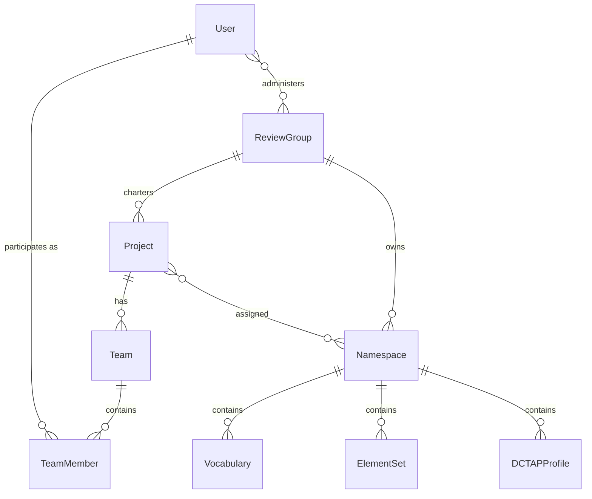
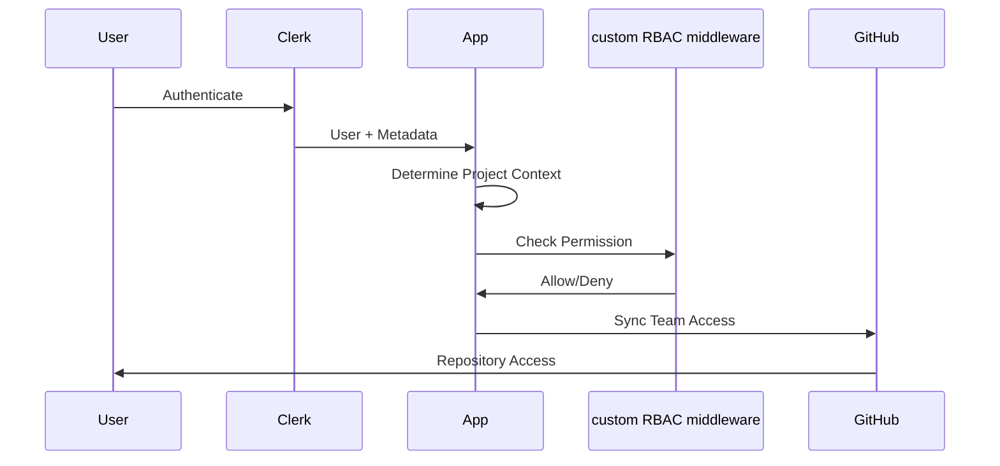
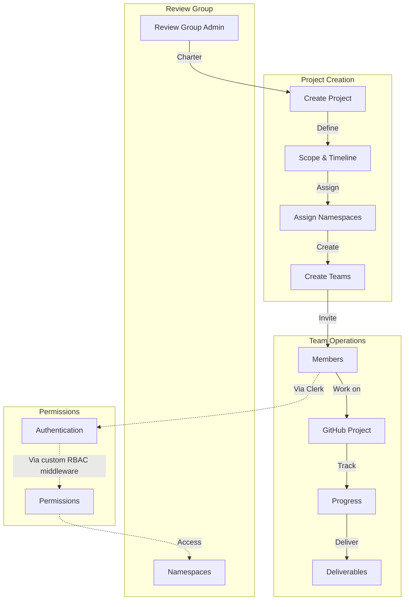

# Projects, Teams, and Review Groups Architecture

**Version:** 1.0  
**Date:** July 2025  
**Status:** Proposed Architecture

## Overview

This document defines the organizational architecture for the IFLA Standards Development Platform, implementing a GitHub Projects-centric model similar to W3C working groups. This architecture provides focused, goal-oriented collaboration while maintaining clear governance through Review Groups.

## Architecture Principles

### 1. **Project-Centric Organization**
- Work organized around GitHub Projects with specific deliverables
- Teams chartered for defined objectives and timelines
- Clear scope boundaries and success criteria
- Progress tracked through project boards

### 2. **Flexible Participation**
- External contributors welcomed without IFLA membership
- Role-based permissions within project context
- Time-bounded commitments for contributors
- Cross-project mobility for experts

### 3. **Namespace Governance**
- Review Groups maintain perpetual ownership
- Projects receive delegated access for work
- Clear separation of governance and execution
- Version control at namespace level

## Core Components

### Review Groups

**Purpose**: Perpetual organizational entities providing governance and strategic direction

**Key Characteristics**:
- Permanent bodies overseeing related standards
- Charter Projects to accomplish specific work
- Manage namespace ownership and access
- Provide continuity across project cycles

**Examples**:
- ISBD Review Group (International Standard Bibliographic Description)
- BCM Review Group (Bibliographic Conceptual Models)
- ICP Review Group (International Cataloguing Principles)
- PUC Review Group (Permanent UNIMARC Committee)

### Projects (GitHub Projects)

**Purpose**: Time-bounded initiatives with specific deliverables

**Key Characteristics**:
- Similar to W3C working groups in structure
- Can run for extended periods (months to years)
- Have defined scope, timeline, and deliverables
- Progress tracked through GitHub Projects boards
- Assigned teams and namespace access

**Project Types**:
- **Maintenance Projects**: Ongoing standard maintenance (e.g., "ISBD Maintenance WG 2024-2026")
- **Enhancement Projects**: Adding new features or capabilities
- **Translation Projects**: Localizing standards (e.g., "MulDiCat French Translation")
- **Harmonization Projects**: Aligning multiple standards
- **Migration Projects**: Technical upgrades or platform changes

### Teams

**Purpose**: Collaborative units executing project work

**Key Characteristics**:
- Created by Review Groups for specific Projects
- Composed of members with complementary skills
- Include external contributors as needed
- Defined roles and responsibilities
- Access permissions derived from Project

**Team Roles**:
- **Editor**: Primary content creation and editing rights
- **Reviewer/Author**: Review and contribution rights
- **Translator**: Translation and localization rights

### Namespaces

**Purpose**: Technical vocabulary collections requiring access control

**Key Characteristics**:
- Owned by Review Groups
- Assigned to Projects for work
- Version controlled independently
- Contain vocabularies, element sets, and profiles

## Data Architecture

### Entity Relationships



### Core Data Models

```typescript
interface ReviewGroup {
  id: string;
  slug: string;              // e.g., "isbd", "bcm"
  name: string;              // e.g., "ISBD Review Group"
  description: string;
  managedNamespaces: Namespace[];
  projects: Project[];
  admins: User[];
  metadata: {
    established: Date;
    charter: string;
    website?: string;
  };
}

interface Project {
  id: string;
  githubProjectId: string;
  name: string;
  description: string;
  reviewGroup: ReviewGroup;
  status: ProjectStatus;
  teams: Team[];
  assignedNamespaces: Namespace[];
  timeline: {
    startDate: Date;
    targetEndDate?: Date;
    milestones: Milestone[];
  };
  deliverables: Deliverable[];
}

interface Team {
  id: string;
  name: string;
  project: Project;
  members: TeamMember[];
  focus: TeamFocus;
  communicationChannels: {
    github?: string;
    slack?: string;
    email?: string;
  };
}

interface TeamMember {
  id: string;
  user: User;
  team: Team;
  role: TeamRole;
  expertise: string[];
  availability: {
    hoursPerWeek?: number;
    timezone?: string;
  };
  joinedAt: Date;
  leftAt?: Date;
}
```

## Permission Architecture

### Hierarchical Permission Model

```yaml
System Level:
  - system-admin: Full platform administration
  - ifla-admin: IFLA-wide administration

Review Group Level:
  - {rg}-admin: Review Group administration
  - {rg}-member: Review Group participation

Project Level (via Team membership):
  - project:{id}:view: View project resources
  - project:{id}:contribute: Contribute to project
  - project:{id}:admin: Administer project

Namespace Level (via Project assignment):
  - namespace:{ns}:read: Read namespace content
  - namespace:{ns}:edit: Edit namespace content
  - namespace:{ns}:review: Review changes
  - namespace:{ns}:translate: Translate content
  - namespace:{ns}:publish: Publish releases
```

### Permission Flow



## Integration Architecture

### Authentication & Authorization

**Clerk Integration**:
- User authentication and session management
- Project/Team membership storage
- External contributor onboarding
- Social login via GitHub OAuth
- Invitation system for team members

**custom RBAC middleware Integration**:
- Real-time permission evaluation
- Policy-as-code authorization rules
- Audit trail of all decisions
- Context-aware permissions
- Role inheritance logic

**GitHub Integration**:
- Projects mapped to GitHub Projects
- Teams synced to GitHub Teams
- Repository access control
- Issue and PR tracking
- Automated workflows

### Workflow Orchestration



## Operational Workflows

### Project Lifecycle

1. **Initiation**
   - Review Group identifies need
   - Charter drafted with scope and deliverables
   - Timeline and resources allocated
   - Project created in GitHub

2. **Team Formation**
   - Skills assessment for project needs
   - Team members recruited (internal/external)
   - Roles assigned based on expertise
   - Communication channels established

3. **Execution**
   - Work tracked in GitHub Projects
   - Regular milestone reviews
   - Continuous integration with platform
   - Community feedback incorporated

4. **Completion**
   - Deliverables reviewed and accepted
   - Documentation finalized
   - Project archived for reference
   - Team members recognized

### Example Workflows

#### Translation Project
```yaml
Project: "MulDiCat French Translation Initiative"
Review Group: ICP
Timeline: 6 months
Teams:
  - French Translation Team:
      - 2 Translators (French native speakers)
      - 1 Reviewer (Bilingual librarian)
      - 1 Editor (MulDiCat expert)
Deliverables:
  - Translated vocabulary (100%)
  - Review documentation
  - Publication-ready files
Workflow:
  1. Setup terminology management
  2. Batch translation assignments
  3. Peer review process
  4. Editorial review
  5. Community feedback
  6. Final publication
```

#### Harmonization Project
```yaml
Project: "BCM Harmonization Project"
Review Group: BCM
Timeline: 18 months
Teams:
  - Technical Team:
      - 3 Domain experts (FRBR, LRM, FRAD)
      - 2 Technical architects
      - 1 Project coordinator
  - Review Team:
      - 5 Community reviewers
      - 2 External validators
Deliverables:
  - Mapping documentation
  - Harmonized vocabularies
  - Migration guidelines
  - Implementation tools
```

## Technical Implementation

### Database Schema

```sql
-- Review Groups
CREATE TABLE review_groups (
    id UUID PRIMARY KEY,
    slug VARCHAR(50) UNIQUE NOT NULL,
    name VARCHAR(200) NOT NULL,
    description TEXT,
    metadata JSONB,
    created_at TIMESTAMP DEFAULT NOW(),
    updated_at TIMESTAMP DEFAULT NOW()
);

-- Projects
CREATE TABLE projects (
    id UUID PRIMARY KEY,
    github_project_id VARCHAR(100) UNIQUE,
    review_group_id UUID REFERENCES review_groups(id),
    name VARCHAR(200) NOT NULL,
    description TEXT,
    status VARCHAR(20) CHECK (status IN ('planning', 'active', 'completed', 'on-hold')),
    timeline JSONB,
    created_at TIMESTAMP DEFAULT NOW(),
    updated_at TIMESTAMP DEFAULT NOW()
);

-- Teams
CREATE TABLE teams (
    id UUID PRIMARY KEY,
    project_id UUID REFERENCES projects(id),
    name VARCHAR(200) NOT NULL,
    focus VARCHAR(50),
    metadata JSONB,
    created_at TIMESTAMP DEFAULT NOW()
);

-- Team Members
CREATE TABLE team_members (
    id UUID PRIMARY KEY,
    team_id UUID REFERENCES teams(id),
    user_id UUID REFERENCES users(id),
    role VARCHAR(20) CHECK (role IN ('editor', 'reviewer', 'translator')),
    joined_at TIMESTAMP DEFAULT NOW(),
    left_at TIMESTAMP,
    UNIQUE(team_id, user_id, joined_at)
);

-- Project-Namespace Assignments
CREATE TABLE project_namespace_assignments (
    project_id UUID REFERENCES projects(id),
    namespace_id UUID REFERENCES namespaces(id),
    assigned_at TIMESTAMP DEFAULT NOW(),
    PRIMARY KEY (project_id, namespace_id)
);
```

### API Endpoints

```typescript
// Review Group Management
GET    /api/review-groups
GET    /api/review-groups/:slug
POST   /api/review-groups/:slug/projects
GET    /api/review-groups/:slug/projects

// Project Management
GET    /api/projects
GET    /api/projects/:id
PUT    /api/projects/:id
POST   /api/projects/:id/teams
GET    /api/projects/:id/progress

// Team Management
GET    /api/teams/:id
POST   /api/teams/:id/members
DELETE /api/teams/:id/members/:userId
PUT    /api/teams/:id/members/:userId/role

// Permission Checks
POST   /api/permissions/check
GET    /api/users/:id/permissions
GET    /api/users/:id/projects
```

## Migration Strategy

### Phase 1: Foundation (Weeks 1-2)
- Set up Clerk user metadata structure
- Define custom RBAC middleware for new model
- Create database schema
- Build core API endpoints

### Phase 2: Review Groups (Weeks 3-4)
- Migrate existing governance structures
- Assign namespace ownership
- Configure administrator roles
- Document group charters

### Phase 3: Projects (Weeks 5-6)
- Map current work to Projects
- Create GitHub Projects boards
- Define initial deliverables
- Set up progress tracking

### Phase 4: Teams (Weeks 7-8)
- Form teams for active projects
- Migrate existing contributors
- Send invitations to team members
- Configure permission mappings

### Phase 5: Integration (Weeks 9-10)
- Sync with GitHub Teams
- Test permission flows
- Validate access controls
- Train administrators

### Phase 6: Rollout (Weeks 11-12)
- Gradual rollout by Review Group
- Monitor and adjust permissions
- Gather feedback
- Full platform migration

## Success Metrics

### Organizational Metrics
- Number of active Projects
- Average Project completion rate
- Time from charter to first deliverable
- External contributor participation rate

### Collaboration Metrics
- Team member engagement levels
- Cross-project knowledge sharing
- Community feedback integration
- Response time to issues

### Technical Metrics
- Permission check performance (<50ms)
- GitHub sync reliability (>99.9%)
- API response times (<200ms)
- Zero security incidents

## Risk Mitigation

### Organizational Risks
- **Risk**: Resistance to new structure
  - **Mitigation**: Phased rollout with pilot groups
- **Risk**: Complex permission management
  - **Mitigation**: Clear documentation and training
- **Risk**: External contributor barriers
  - **Mitigation**: Streamlined onboarding process

### Technical Risks
- **Risk**: GitHub API rate limits
  - **Mitigation**: Implement caching and queuing
- **Risk**: Permission check performance
  - **Mitigation**: Optimize custom RBAC middleware policies
- **Risk**: Data migration errors
  - **Mitigation**: Comprehensive testing and rollback plans

## Future Enhancements

### Near-term (3-6 months)
- Automated project status reporting
- Enhanced collaboration tools
- Mobile-friendly team interfaces
- Advanced analytics dashboards

### Long-term (6-12 months)
- AI-assisted project planning
- Predictive resource allocation
- Cross-organization collaboration
- Integrated learning management
