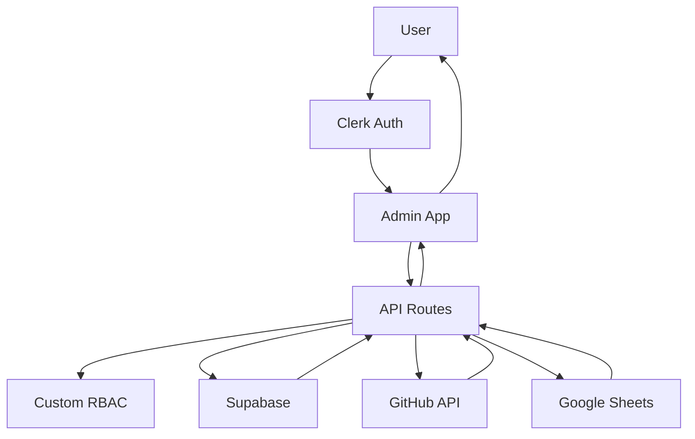
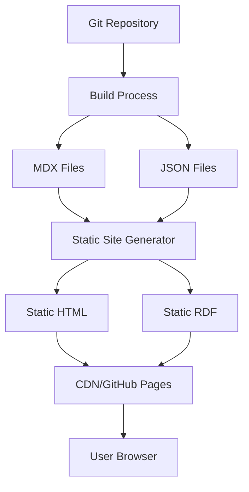

# Platform-Specific Architecture Guide

**Version:** 1.0  
**Date:** January 2025  
**Status:** Active Reference Document

## Overview

The IFLA Standards Platform consists of two distinct types of applications with different architectures, technologies, and patterns. This guide provides a comprehensive reference for understanding the differences between the Next.js Admin Portal and Docusaurus Documentation Sites.

## Quick Comparison Table

| Aspect | Admin Portal (Next.js) | Documentation Sites (Docusaurus) |
|--------|------------------------|----------------------------------|
| **Framework** | Next.js 15.2.5 (App Router) | Docusaurus 3.8+ |
| **Rendering** | SSR/CSR (dynamic) | SSG (static) |
| **Styling** | Material-UI Theme System | Infima + SASS/SCSS |
| **Authentication** | Clerk with custom RBAC | None (public) |
| **API** | Next.js API routes | No API (static files) |
| **Data Source** | Supabase + GitHub API | Git files at build time |
| **Components** | `apps/admin/src/components/` | `packages/theme/src/components/` |
| **Tests** | `apps/admin/src/test*/` | `packages/theme/src/tests/` |
| **Deployment** | Render (dynamic) | GitHub Pages (static) |

## Architecture Details

### Admin Portal (Next.js)

#### Purpose
- Vocabulary lifecycle management
- User and role administration
- Import/export workflows
- Translation management
- Version publishing

#### Technology Stack
```yaml
Framework: Next.js 15.2.5 with App Router
UI Library: React 19.1.0
Styling: 
  - Material-UI v7 (components and theme)
  - MUI System (sx prop, styled components)
  - Custom MUI theme configuration
  - NO Tailwind CSS (deprecated)
State Management: React Context + SWR
Authentication: Clerk
Authorization: Custom RBAC via publicMetadata
Database: Supabase (operational data)
API: Next.js API routes (app/api/)
```

#### Directory Structure
```
apps/admin/
├── src/
│   ├── app/                    # App Router structure
│   │   ├── api/                # API routes
│   │   ├── (authenticated)/    # Protected pages
│   │   ├── sign-in/           # Auth pages
│   │   └── layout.tsx         # Root layout
│   ├── components/            # UI components
│   │   ├── ui/               # Base components
│   │   ├── auth/             # Auth components
│   │   └── vocabulary/       # Domain components
│   ├── lib/                  # Utilities
│   │   ├── middleware/       # Auth middleware
│   │   ├── schemas/          # Zod schemas
│   │   └── services/         # Service layer
│   ├── theme/                # MUI theme config
│   ├── test/                 # Test utilities
│   └── tests/                # Integration tests
├── e2e/                      # E2E tests
└── public/                   # Static assets
```

#### Key Features
- **Nested Routing**: App Router with nested layouts and deep linking
- **Dashboard Architecture**: Modular dashboard system with nested routes
- **API Routes**: RESTful endpoints in `app/api/`
- **Authentication**: Clerk middleware on all routes
- **Authorization**: withAuth HOC for API protection
- **Real-time Data**: Dynamic fetching from Supabase with React Query
- **Feature-Based Hooks**: Dedicated hooks for each dashboard feature

### Documentation Sites (Docusaurus)

#### Purpose
- Public vocabulary documentation
- Standards browsing
- Multilingual content
- Static RDF serving
- Community engagement

#### Technology Stack
```yaml
Framework: Docusaurus 3.8+
UI Library: React 19.1.0
Styling:
  - Infima CSS framework
  - SASS/SCSS
  - CSS Modules
Content: MDX (Markdown + JSX)
i18n: Docusaurus i18n plugin
Build: Static site generation
Deployment: GitHub Pages
```

#### Directory Structure
```
standards/{site}/
├── src/
│   ├── components/           # React components
│   │   └── CompactButton/   # Custom components
│   ├── css/                 # Global styles
│   │   └── custom.css      # Infima overrides
│   ├── pages/              # Custom pages
│   │   ├── index.mdx      # Homepage
│   │   └── rdf.tsx        # RDF browser
│   └── theme/              # Theme components
│       └── MDXComponents.tsx
├── docs/                    # Documentation content
│   ├── elements/           # Element sets
│   └── vocabularies/       # Concept schemes  
├── vocabs/                 # All vocabulary-related assets
│   ├── rdf/               # Source RDF/CSV files (all formats)
│   │   ├── elements/      # Element definitions (ISBD terminology)
│   │   │   └── [all formats per element set]
│   │   ├── ves/           # Vocabulary Encoding Schemes
│   │   │   └── [vocabularies with all formats]
│   │   └── ses/           # Syntax Encoding Schemes
│   │       └── [syntax schemes with all formats]
│   ├── dctap/             # DCTAP validation profiles
│   ├── jsonld-context/    # JSON-LD context definitions
│   └── draft/             # Validation workspace (temporary)
├── static/                 # Static assets
│   └── data/              # Public data files (if needed)
├── docusaurus.config.ts   # Site configuration
└── sidebars.ts            # Navigation config
```

#### Key Features
- **Static Generation**: All pages pre-rendered at build time
- **No Authentication**: Public access only
- **MDX Content**: Markdown with React components
- **Versioning**: Built-in version management
- **i18n Support**: Multi-language capabilities
- **Search**: Algolia DocSearch integration

## Styling Systems

### Admin Portal Styling

#### Material-UI Theme
```typescript
// apps/admin/src/theme/mui-theme.ts
import { createTheme } from '@mui/material/styles';

export const theme = createTheme({
  palette: {
    primary: {
      main: '#0F766E',    // IFLA Teal
      light: '#14b8a6',
      dark: '#065f46',
    },
    secondary: {
      main: '#1e40af',    // Blue
    },
  },
  typography: {
    fontFamily: 'Inter, system-ui, sans-serif',
  },
  components: {
    MuiButton: {
      styleOverrides: {
        root: {
          textTransform: 'none',
          borderRadius: '0.375rem',
        },
      },
    },
  },
});
```

#### MUI Theme Configuration
```javascript
// apps/admin/src/theme/theme.ts
import { createTheme } from '@mui/material/styles';

export const theme = createTheme({
  palette: {
    primary: {
      main: '#0F766E',
      light: '#14b8a6',
      dark: '#065f46',
    },
    // Additional palette configuration
  },
  components: {
    // Component style overrides
  },
});
```

### Documentation Sites Styling

#### Infima Variables
```css
/* standards/*/src/css/custom.css */
:root {
  --ifm-color-primary: #0F766E;
  --ifm-color-primary-dark: #065f46;
  --ifm-color-primary-light: #14b8a6;
  --ifm-font-family-base: 'Inter', sans-serif;
  --ifm-navbar-height: 64px;
  --ifm-sidebar-width: 300px;
}

[data-theme='dark'] {
  --ifm-color-primary: #14b8a6;
  --ifm-background-color: #1a1a1a;
}
```

#### Component Modules
```scss
// packages/theme/src/components/ComponentName/styles.module.scss
.button {
  padding: 0.5rem 1rem;
  border-radius: var(--ifm-button-border-radius);
  background-color: var(--ifm-color-primary);
  color: white;
  transition: all 0.2s ease;
  
  &:hover {
    background-color: var(--ifm-color-primary-dark);
  }
}
```

## Data Flow Patterns

### Admin Portal Data Flow



**Characteristics**:
- Real-time API calls
- Authentication required
- Dynamic data fetching
- Server-side rendering
- Client-side state management

### Docusaurus Data Flow



**Characteristics**:
- Build-time data fetching
- No authentication
- Static file serving
- Client-side hydration
- No API calls

## Testing Strategies

### Admin Portal Testing

```bash
# Unit tests (components, utilities)
pnpm nx test admin

# Integration tests (API routes, services)
pnpm nx test:integration admin

# E2E tests (user workflows)
pnpm nx e2e admin

# Test locations
apps/admin/src/**/__tests__/  # Unit tests
apps/admin/src/tests/         # Integration tests
apps/admin/e2e/               # E2E tests
```

### Docusaurus Testing

```bash
# Unit tests (components)
pnpm nx test {site}

# Build tests
pnpm nx test:build {site}

# E2E tests (navigation, search)
pnpm nx e2e {site}

# Test locations
packages/theme/src/tests/components/  # Component unit tests
standards/{site}/tests/              # Site-specific integration tests
e2e/sites/{site}/                  # E2E tests
```

## API Patterns

### Admin Portal APIs

```typescript
// apps/admin/src/app/api/vocabularies/route.ts
import { NextRequest, NextResponse } from 'next/server';
import { auth } from '@clerk/nextjs/server';
import { withAuth } from '@/lib/middleware/withAuth';

export const GET = withAuth(async (req: NextRequest) => {
  const { userId } = auth();
  
  // Fetch from Supabase
  const vocabularies = await supabase
    .from('vocabularies')
    .select('*')
    .eq('user_id', userId);
    
  return NextResponse.json(vocabularies);
});

export const POST = withAuth(async (req: NextRequest) => {
  const body = await req.json();
  
  // Validate with Zod
  const validated = vocabularySchema.parse(body);
  
  // Create in Supabase
  const result = await supabase
    .from('vocabularies')
    .insert(validated);
    
  return NextResponse.json(result, { status: 201 });
});
```

### Docusaurus (No APIs)

Docusaurus sites have no API routes. All data is:
- Pre-rendered at build time
- Served as static files
- Accessed via direct file paths

```typescript
// Data access in Docusaurus components
import vocabularyData from '@site/static/data/vocabulary.json';

export default function VocabularyTable() {
  // Data is imported at build time
  return (
    <table>
      {vocabularyData.map(item => (
        <tr key={item.id}>
          <td>{item.term}</td>
          <td>{item.definition}</td>
        </tr>
      ))}
    </table>
  );
}
```

## Component Patterns

### Admin Portal Components (MUI)

```tsx
// apps/admin/src/components/vocabulary/VocabularyForm.tsx
import { 
  TextField, 
  Button, 
  FormControl, 
  InputLabel,
  Select,
  MenuItem 
} from '@mui/material';
import { useForm } from 'react-hook-form';
import { zodResolver } from '@hookform/resolvers/zod';

export function VocabularyForm({ onSubmit }) {
  const { register, handleSubmit, formState: { errors } } = useForm({
    resolver: zodResolver(vocabularySchema),
  });
  
  return (
    <form onSubmit={handleSubmit(onSubmit)}>
      <TextField
        {...register('term')}
        label="Term"
        error={!!errors.term}
        helperText={errors.term?.message}
        fullWidth
        margin="normal"
      />
      
      <FormControl fullWidth margin="normal">
        <InputLabel>Type</InputLabel>
        <Select {...register('type')}>
          <MenuItem value="class">Class</MenuItem>
          <MenuItem value="property">Property</MenuItem>
        </Select>
      </FormControl>
      
      <Button 
        type="submit" 
        variant="contained" 
        color="primary"
        sx={{ mt: 2 }}
      >
        Submit
      </Button>
    </form>
  );
}
```

### Docusaurus Components (Infima)

```tsx
// packages/theme/src/components/VocabularyCard/index.tsx
import React from 'react';
import styles from './VocabularyCard.module.css';

interface VocabularyCardProps {
  title: string;
  description: string;
  count: number;
  href: string;
}

export default function VocabularyCard({ 
  title, 
  description, 
  count, 
  href 
}: VocabularyCardProps) {
  return (
    <div className={styles.card}>
      <h3>{title}</h3>
      <p>{description}</p>
      <div className={styles.meta}>
        <span className={styles.count}>{count} terms</span>
        <a href={href} className="button button--primary button--sm">
          Browse →
        </a>
      </div>
    </div>
  );
}
```

```css
/* packages/theme/src/components/VocabularyCard/styles.module.scss */
.card {
  padding: 1.5rem;
  border: 1px solid var(--ifm-color-emphasis-300);
  border-radius: var(--ifm-card-border-radius);
  transition: all 0.2s ease;
}

.card:hover {
  box-shadow: var(--ifm-global-shadow-md);
  transform: translateY(-2px);
}

.meta {
  display: flex;
  justify-content: space-between;
  align-items: center;
  margin-top: 1rem;
}

.count {
  color: var(--ifm-color-emphasis-600);
  font-size: 0.875rem;
}
```

## Deployment Configurations

### Admin Portal Deployment

```yaml
# Render deployment
Service: Web Service
Environment: Node
Build Command: pnpm nx build admin
Start Command: pnpm nx start admin
Environment Variables:
  - NEXT_PUBLIC_CLERK_PUBLISHABLE_KEY
  - CLERK_SECRET_KEY
  - SUPABASE_URL
  - SUPABASE_ANON_KEY
  - GITHUB_TOKEN
```

### Docusaurus Deployment

```yaml
# GitHub Pages deployment
Build Command: pnpm nx build {site}
Output Directory: standards/{site}/build
Branch: gh-pages
Environment: Static
No environment variables needed (all data at build time)
```

## Migration Guide

### From Docusaurus to Admin

When moving functionality from a Docusaurus site to the admin portal:

1. **Convert MDX to React components**
2. **Replace Infima styles with MUI components**
3. **Add authentication checks**
4. **Create API routes for data fetching**
5. **Update imports from static to dynamic**

### From Admin to Docusaurus

When moving content from admin to documentation:

1. **Convert React components to MDX**
2. **Replace MUI with Infima classes**
3. **Remove authentication logic**
4. **Convert API calls to static imports**
5. **Pre-generate any dynamic content**

## Best Practices

### Admin Portal

1. **Always use MUI components** for consistency
2. **Implement proper error boundaries**
3. **Add loading states for all async operations**
4. **Use Zod for all data validation**
5. **Implement proper RBAC checks**
6. **Cache API responses with SWR**
7. **Use Next.js Image for optimization**

### Docusaurus Sites

1. **Keep components simple and static**
2. **Use CSS modules for component styles**
3. **Leverage Infima variables for theming**
4. **Optimize images at build time**
5. **Use MDX for content-heavy pages**
6. **Implement proper SEO metadata**
7. **Keep bundle size minimal**

## Common Pitfalls

### Admin Portal

- ❌ Using static imports for dynamic data
- ❌ Forgetting authentication on API routes
- ❌ Not handling loading/error states
- ❌ Using Tailwind CSS classes (use MUI theme system instead)
- ❌ Bypassing RBAC checks

### Docusaurus

- ❌ Trying to make API calls at runtime
- ❌ Using MUI components (not available)
- ❌ Implementing authentication (not supported)
- ❌ Dynamic routing (limited support)
- ❌ Server-side operations

## Conclusion

Understanding the architectural differences between the Next.js Admin Portal and Docusaurus Documentation Sites is crucial for effective development. Each platform is optimized for its specific use case:

- **Admin Portal**: Dynamic, authenticated, real-time data management
- **Docusaurus**: Static, public, performant content delivery

Always choose the appropriate platform based on the requirements:
- Need authentication? → Admin Portal
- Need API routes? → Admin Portal
- Need static content? → Docusaurus
- Need public access? → Docusaurus