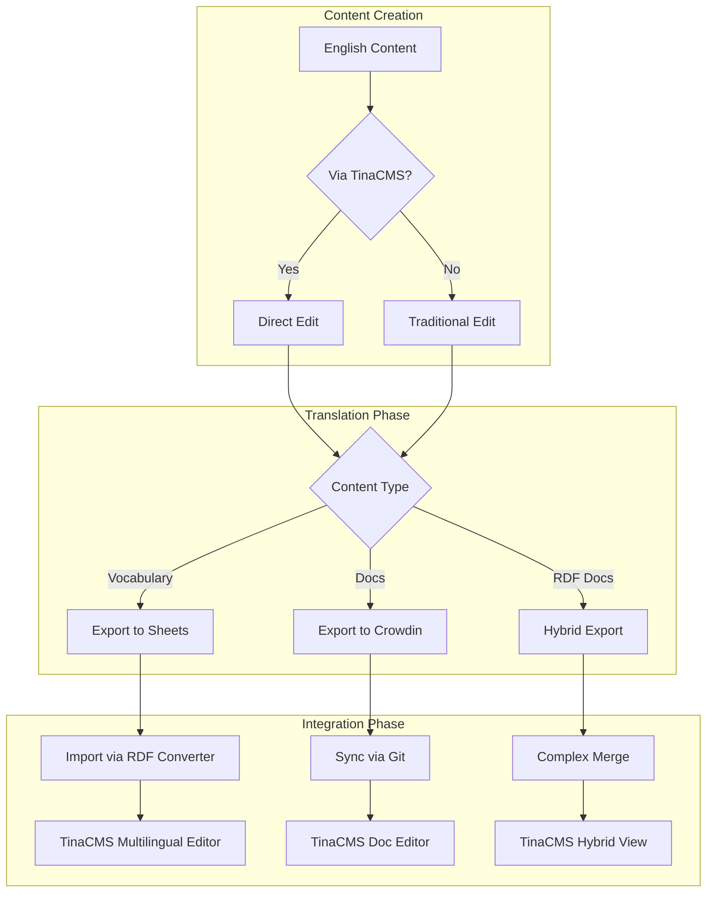
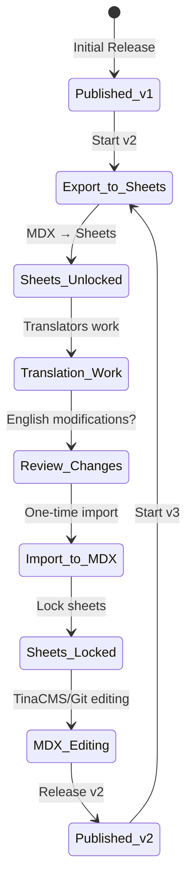
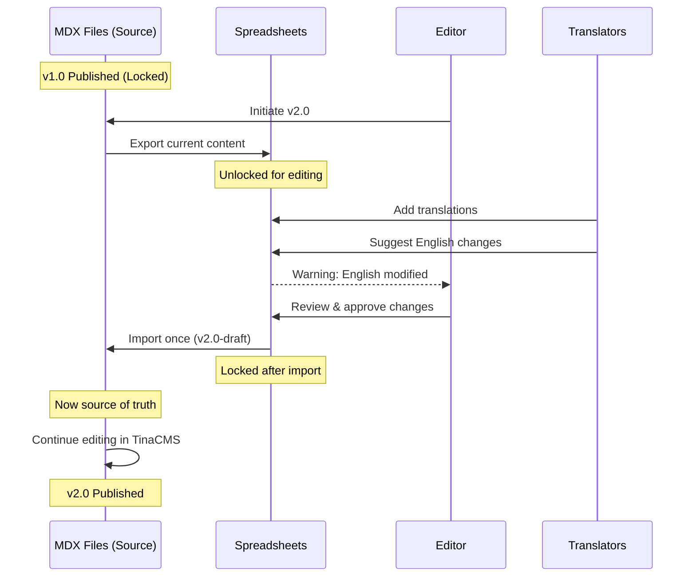

# Translation Workflow Integration Analysis

**Version:** 1.0  
**Date:** January 2025  
**Status:** Technical Analysis & Recommendation
**Focus:** Reconciling multiple translation workflows with TinaCMS

## Executive Summary

The IFLA Standards Platform faces a unique challenge: integrating three distinct translation workflows (spreadsheet-based vocabulary, Docusaurus/Crowdin documentation, and hybrid RDF documentation) with the new TinaCMS editing system. This document analyzes the complexity and proposes a unified approach.

## Current Translation Landscape

### 1. Vocabulary Translations (Spreadsheet-Native)

```yaml
Workflow:
  1. Source: English terms in Google Sheets
  2. Translation: Human translators work in sheets
  3. AI Assistance: Optional first-draft generation
  4. Import: RDF converter brings all languages together
  5. Storage: Single MDX file with all languages

Characteristics:
  - All languages in one place
  - No file synchronization needed
  - Version control through sheets
  - Batch operations friendly
```

### 2. Documentation Translations (Docusaurus-Native)

```yaml
Workflow:
  1. Source: English MDX files in /docs
  2. Export: Push to Crowdin
  3. Translation: Professional translators in Crowdin
  4. Import: Sync back to i18n directories
  5. Storage: Separate files per language

Characteristics:
  - Standard i18n pattern
  - File-per-language approach
  - Git-based version control
  - Continuous synchronization
```

### 3. RDF Documentation (Hybrid)

```yaml
Workflow:
  1. Source: English in spreadsheet (with vocabulary)
  2. Initial Translation: In spreadsheet
  3. Scaffold: Generate MDX structure
  4. Enhancement: Crowdin for prose refinement
  5. Storage: Mixed approach

Characteristics:
  - Starts unified, becomes separated
  - Two-phase translation
  - Complex synchronization
  - Potential for drift
```

## TinaCMS Integration Challenges

### The Multilingual Question

Based on our TinaCMS design, we're proposing:
- **Vocabulary**: Unified multilingual pages (all languages in one file)
- **Documentation**: Separated directories (standard i18n)

This aligns with the natural structure but creates workflow complexity.

### Integration Points



## Version-Based Translation Architecture

### Core Principle: Clear Source of Truth Transitions

The platform uses version boundaries to manage the complexity of multiple translation workflows. At any given time, there is ONE clear source of truth for each content type.

### Version Lifecycle



### Workflow Definitions

1. **Vocabulary Terms**:
   ```typescript
   interface VocabularyVersionFlow {
     v1_state: 'mdx-source-of-truth';
     v2_initiation: 'export-mdx-to-sheets';
     v2_translation: 'sheets-unlocked';
     v2_import: 'one-time-sheets-to-mdx';
     v2_editing: 'mdx-source-of-truth';
     english_changes: 'allowed-with-warning';
   }
   ```

2. **Pure Documentation**:
   ```typescript
   interface DocumentationFlow {
     source: 'always-mdx';
     translation: 'crowdin-continuous';
     editing: 'tinacms-or-git';
     versioning: 'git-tags-only';
   }
   ```

3. **RDF Documentation**:
   ```typescript
   interface RDFDocVersionFlow {
     follows: 'vocabulary-version-lifecycle';
     initial_translation: 'with-vocabulary-in-sheets';
     enhancement: 'crowdin-after-import';
     source_switch: 'sheets-to-mdx-at-import';
   }
   ```

### Phase 2: TinaCMS as Translation Hub

#### Vocabulary Editing Mode
```tsx
// Unified multilingual editing in TinaCMS
export function VocabularyEditor({ term }) {
  const [activeLanguage, setActiveLanguage] = useState('en');
  const [showComparison, setShowComparison] = useState(false);
  
  return (
    <TinaMultilingualEditor>
      <LanguageSelector 
        languages={term.availableLanguages}
        active={activeLanguage}
        onChange={setActiveLanguage}
      />
      
      {showComparison ? (
        <ComparisonView 
          languages={['en', activeLanguage]}
          fields={['label', 'definition', 'scopeNote']}
        />
      ) : (
        <SingleLanguageView 
          language={activeLanguage}
          fields={term.fields}
        />
      )}
      
      <TranslationProgress languages={term.languages} />
    </TinaMultilingualEditor>
  );
}
```

#### Documentation Editing Mode
```tsx
// Standard single-language editing with translation awareness
export function DocumentationEditor({ doc, language }) {
  const otherLanguages = useAvailableTranslations(doc);
  
  return (
    <TinaDocumentEditor>
      <TranslationStatus 
        current={language}
        available={otherLanguages}
        lastSync={doc.lastCrowdinSync}
      />
      
      <MDXEditor 
        content={doc.content}
        language={language}
        showTranslationHelpers={true}
      />
      
      {doc.hasSourceChanged && (
        <Alert>
          Source document has changed. 
          <Button onClick={syncWithCrowdin}>Sync with Crowdin</Button>
        </Alert>
      )}
    </TinaDocumentEditor>
  );
}
```

### Phase 3: Version-Based Synchronization

#### Synchronization Strategy: Version Boundaries

**Key Principle**: Spreadsheets and MDX are never simultaneously editable. The source of truth switches at version boundaries.



#### Implementation: Version-Aware Sync Engine

```typescript
class VersionBasedSyncEngine {
  // One-way export: MDX → Spreadsheets (at version start)
  async exportToSheetsForNewVersion(namespace: string, newVersion: string) {
    const currentMDX = await this.mdx.getAllContent(namespace);
    const exportData = this.transformMDXToSheets(currentMDX);
    
    await this.sheets.createVersionedExport({
      namespace,
      version: newVersion,
      content: exportData,
      status: 'unlocked',
      sourceVersion: currentMDX.version
    });
    
    return { exportId: exportData.id, fileCount: exportData.files.length };
  }
  
  // One-way import: Spreadsheets → MDX (once per version)
  async importFromSheets(namespace: string, version: string) {
    const sheetData = await this.sheets.getVersionedContent(namespace, version);
    
    if (sheetData.status === 'already-imported') {
      throw new Error('This version has already been imported');
    }
    
    // Check for English modifications in "locked" content
    const englishChanges = this.detectEnglishModifications(sheetData);
    
    if (englishChanges.length > 0) {
      const decision = await this.promptForEnglishChanges(englishChanges);
      
      if (decision.createPR) {
        await this.createEnglishChangesPR(englishChanges, version);
      }
      
      if (!decision.importChanges) {
        // Revert English changes, keep translations
        sheetData = this.revertEnglishChanges(sheetData);
      }
    }
    
    // Import and lock
    await this.mdx.importContent(sheetData, version);
    await this.sheets.lockVersion(namespace, version);
    
    return { 
      imported: true, 
      englishChangesHandled: englishChanges.length > 0 
    };
  }
  
  // Handle translator-suggested English changes
  async handleEnglishModifications(changes: EnglishChange[]) {
    const issues = [];
    
    for (const change of changes) {
      // Create GitHub issue
      const issue = await this.github.createIssue({
        title: `Translator suggestion: ${change.field} in ${change.term}`,
        body: this.formatTranslatorSuggestion(change),
        labels: ['translation-feedback', 'english-improvement'],
        assignees: [change.namespace + '-reviewers']
      });
      
      issues.push(issue);
      
      // Optionally create PR if approved
      if (change.preApproved) {
        await this.createSuggestionPR(change, issue.number);
      }
    }
    
    return issues;
  }
}
```

#### Translator English Modification Handler

```typescript
interface EnglishModificationDialog {
  title: "English Content Modified During Translation";
  message: "Translators have suggested changes to English content";
  
  changes: Array<{
    term: string;
    field: string;
    original: string;
    suggested: string;
    translator: string;
    reason: string;
  }>;
  
  options: {
    importAll: "Import all changes and create PR";
    importSelective: "Review each change";
    skipAll: "Keep original English, import only translations";
    defer: "Create issues for later review";
  };
}

// UI Component for handling modifications
export function EnglishModificationReview({ changes, onDecision }) {
  const [decisions, setDecisions] = useState({});
  
  return (
    <Dialog>
      <DialogTitle>Review English Modifications</DialogTitle>
      
      <DialogContent>
        {changes.map(change => (
          <ChangeCard key={change.id}>
            <Grid container spacing={2}>
              <Grid item xs={6}>
                <Typography variant="subtitle2">Original English</Typography>
                <Code>{change.original}</Code>
              </Grid>
              <Grid item xs={6}>
                <Typography variant="subtitle2">Translator Suggestion</Typography>
                <Code>{change.suggested}</Code>
                <Typography variant="caption">
                  By: {change.translator} - {change.reason}
                </Typography>
              </Grid>
            </Grid>
            
            <RadioGroup
              value={decisions[change.id]}
              onChange={(e) => setDecisions({
                ...decisions,
                [change.id]: e.target.value
              })}
            >
              <FormControlLabel value="accept" label="Accept change" />
              <FormControlLabel value="reject" label="Keep original" />
              <FormControlLabel value="issue" label="Create issue for review" />
            </RadioGroup>
          </ChangeCard>
        ))}
      </DialogContent>
      
      <DialogActions>
        <Button onClick={() => onDecision(decisions)}>
          Apply Decisions
        </Button>
      </DialogActions>
    </Dialog>
  );
}

## Implementation Roadmap

### Immediate (TinaCMS POC)
1. Test multilingual field components
2. Validate unified vs separated approach
3. Build basic sync indicators

### Short-term (Post-POC)
1. Implement vocabulary multilingual editor
2. Create Crowdin webhook integration
3. Build conflict detection system

### Medium-term
1. Full bidirectional sync
2. AI translation integration
3. Translation memory system

### Long-term
1. Unified translation dashboard
2. Advanced conflict resolution
3. Quality scoring system

## Simplified Architectural Decisions

### 1. Source of Truth Management
**Decision Made**: Version-based transitions
- During version development: Spreadsheets (unlocked)
- After import: MDX files via TinaCMS/Git
- Clear boundaries, no simultaneous editing

**Implementation**: Version state tracking in metadata

### 2. English Modification Handling
**Decision Framework**:
```typescript
enum EnglishChangeAction {
  ACCEPT_AND_IMPORT = "Import change + create tracking issue",
  REJECT_BUT_TRACK = "Keep original + create suggestion issue", 
  ACCEPT_AND_PR = "Import change + auto-create PR",
  DEFER_DECISION = "Flag for post-import review"
}
```

**Recommendation**: Flexible per-change decisions with audit trail

### 3. TinaCMS Role in Translations
**Clear Boundaries**:
- Vocabulary: Edit all languages post-import
- Documentation: Edit single language files
- No direct spreadsheet editing via TinaCMS
- Respects version lifecycle

**Implementation**: Read-only indicators during locked phases

### 4. AI Translation Integration
**Phased Approach**:
- Phase 1: AI in spreadsheets only (current)
- Phase 2: AI suggestions in TinaCMS (future)
- Phase 3: Automated quality scoring (future)

**Quality Control**: Human review required for all AI translations

## Risk Mitigation

### Reduced Complexity Through Version Boundaries

The version-based approach significantly reduces synchronization risks:

### Technical Risks (Mitigated)
1. **Data Loss**: Single source of truth at any time
2. **Sync Conflicts**: Eliminated by one-way, one-time imports
3. **Translation Drift**: Prevented by locking mechanism
4. **Performance**: No continuous sync overhead

### Remaining Considerations
1. **English Change Management**: Clear review UI and process
2. **Version State Tracking**: Robust metadata system
3. **Import Validation**: Comprehensive checks before lock
4. **User Training**: Clear documentation of version lifecycle

### Process Safeguards
1. **Pre-import Checklist**: Validate all translations complete
2. **Post-import Verification**: Automated testing of imported content  
3. **Rollback Capability**: Git history preserves all states
4. **Audit Trail**: All decisions logged and traceable

## Success Metrics

### Efficiency Metrics
- Translation time: -40% reduction
- Sync conflicts: <5% require manual intervention
- Error rate: -60% reduction

### Quality Metrics
- Translation consistency: >95% across workflows
- Review cycles: -50% reduction
- User satisfaction: >8/10

## Recommendations

### Immediate Actions
1. **Accept Current Complexity**: Don't try to unify everything immediately
2. **Focus on Integration**: Make tools work together, not replace each other
3. **Build Incrementally**: Start with read-only sync, add editing later

### Strategic Direction
1. **TinaCMS as Hub**: Position TinaCMS as the central editing interface
2. **Workflow Preservation**: Keep successful workflows, enhance with integration
3. **Progressive Enhancement**: Add AI, automation, and intelligence over time

### Technical Priorities
1. Build robust sync engine
2. Create clear conflict resolution
3. Implement comprehensive logging
4. Design for extensibility

## Conclusion

The version-based synchronization strategy elegantly solves what initially appeared to be a complex multi-system synchronization challenge. By establishing clear boundaries where source of truth transitions happen, we eliminate the need for complex bidirectional sync while preserving the strengths of each tool:

- **Spreadsheets**: Excel at collaborative translation work during version development
- **MDX/TinaCMS**: Provide excellent editing experience post-import
- **Version Boundaries**: Create clear, predictable transition points

The special handling of English modifications suggested by translators adds valuable quality improvement opportunities without compromising the clean separation of concerns.

### Key Success Factors

1. **Clear Communication**: Users must understand the version lifecycle
2. **Robust Tooling**: Import/export tools must be reliable and validated
3. **Flexible Review**: English change review process must be efficient
4. **TinaCMS Integration**: Must respect version boundaries and lock states

This approach transforms potential complexity into a structured, predictable workflow that serves both technical requirements and user needs.