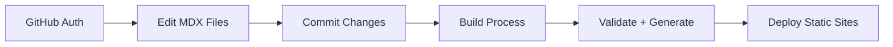

# OMR25 vs Current Implementation Comparison

**Version:** 1.0  
**Date:** January 2025  
**Purpose:** Compare March 2025 OMR25 specification with July 2025 implementation
**Time Span:** 4 months evolution

## Executive Summary

The IFLA Standards Platform has undergone significant evolution from the original OMR25 (Online Metadata Registry 2025) specification created in March to the current implementation in July. While the core vision remains intact, the technical approach has shifted dramatically from a Laravel/Filament monolithic application to a modern JAMstack architecture using Next.js and Docusaurus.

## Key Evolution Points

### 1. Architecture Transformation

#### OMR25 (March 2025)
```yaml
Architecture: Monolithic Laravel Application
- Framework: Laravel 11 with Filament Admin
- Database: MariaDB with UTF8MB4
- Frontend: Filament, Livewire, Tailwind
- Auth: GitHub OAuth via Socialite
- Hosting: DigitalOcean with Laravel Forge
- Pattern: Domain-driven design with components
```

#### Current Implementation (July 2025)
```yaml
Architecture: JAMstack with Microservices
- Documentation: Docusaurus 3.8 (static sites)
- Admin Portal: Next.js 15 with App Router
- Database: Supabase (temporary data only)
- Frontend: React 19, Tailwind, shadcn/ui
- Auth: Clerk with GitHub OAuth
- Hosting: GitHub Pages + Vercel Edge
- Pattern: Monorepo with shared packages
```

**Analysis**: The shift from monolithic to JAMstack represents a fundamental rethinking prioritizing:
- Static generation for performance
- Git as source of truth
- Edge computing over traditional servers
- Modern React ecosystem over PHP

### 2. Core Functionality Evolution

#### OMR25 Vision
1. **User Management**: Database-driven with roles/permissions
2. **RDF Generation**: Server-side processing with validation
3. **Spreadsheet Import**: Direct Excel/CSV/Google Sheets processing
4. **Git Integration**: Local clones managed by server
5. **DCTAP Profiles**: Database-stored validation rules
6. **Multi-tenant**: Project-based isolation

#### Current Implementation
1. **User Management**: GitHub teams + Clerk for auth
2. **RDF Generation**: Build-time static generation from MDX
3. **Spreadsheet Import**: Google Sheets API with service account
4. **Git Integration**: Direct GitHub API, no local clones
5. **DCTAP Profiles**: File-based validation in repo
6. **Multi-tenant**: Review Group-based with GitHub teams

**Analysis**: The implementation maintains core functionality but distributes it differently:
- Authentication delegated to specialized services
- RDF generation moved to build time for reliability
- Git operations via API instead of local management
- Configuration as code instead of database storage

### 3. Technology Stack Comparison

| Component | OMR25 | Current | Rationale for Change |
|-----------|-------|---------|---------------------|
| **Language** | PHP 8.4 | TypeScript/JavaScript | Modern ecosystem, better tooling |
| **Backend** | Laravel 11 | Next.js + Vercel Functions | Serverless, edge computing |
| **Database** | MariaDB | Git + Supabase (temp only) | Version control as primary storage |
| **Frontend** | Filament/Livewire | React 19 + Docusaurus | Component ecosystem, static generation |
| **Testing** | Pest | Vitest/Playwright | JavaScript ecosystem alignment |
| **Build** | Webpack/Mix | Nx monorepo | Better monorepo management |
| **CI/CD** | GitHub Actions | GitHub Actions + Nx Cloud | Distributed builds, caching |

### 4. User Interface Evolution

#### OMR25 Mockups (SVG-based designs)
- **Admin Panel**: Traditional CRUD interfaces
- **Project Wizard**: Step-by-step creation flow
- **Vocabulary Editor**: Form-based editing
- **Dashboard**: Activity feeds and statistics
- **Translation**: Integrated workflow management

#### Current Implementation
- **Documentation Sites**: Public-facing Docusaurus per namespace
- **Admin Portal**: Simplified dashboard at /admin
- **Vocabulary Editing**: MDX files with frontmatter
- **Dashboards**: Minimal, focused on essential tasks
- **Translation**: Hybrid spreadsheet/Crowdin approach

**Analysis**: The UI shifted from admin-heavy to content-first:
- Public documentation sites are the primary interface
- Admin functions reduced to essential operations
- Direct file editing replaced form-based interfaces
- Complexity pushed to build-time processes

### 5. Workflow Changes

#### OMR25 Workflow


#### Current Workflow


**Key Differences**:
- Workflow integrated into Git flow
- Validation at build time, not runtime
- No intermediate database storage
- Direct GitHub integration

### 6. Unexpected Additions

Features not in OMR25 but added during implementation:

1. **TinaCMS Integration**: WYSIWYG editing for non-technical users
2. **Nx Monorepo**: Sophisticated build orchestration
3. **Multiple Deployment Environments**: Preview + Production
4. **Edge API Functions**: Vercel for dynamic features
5. **Review Group Organization**: GitHub teams as tenants
6. **Version-based Translation**: Sophisticated sync strategy
7. **Vocabulary Content Negotiation Server**: For legacy redirects

### 7. Removed/Simplified Features

OMR25 features that were simplified or removed:

1. **Local Git Clones**: Replaced with GitHub API
2. **Database-driven Profiles**: Now file-based
3. **Complex Role System**: Simplified to GitHub teams
4. **Real-time Collaboration**: Async via Git
5. **Built-in User Management**: Delegated to Clerk
6. **Server-side RDF Processing**: Moved to build time

### 8. Timeline Comparison

#### OMR25 Plan (10-week estimate)
- Weeks 1-2: Foundation & Auth
- Weeks 3-4: DCTAP Profiles
- Weeks 5-6: Project Management
- Weeks 7-8: Namespace & Git
- Weeks 9-10: RDF Generation & Validation

#### Actual Implementation (4 months)
- Month 1: Architecture decisions, monorepo setup
- Month 2: Docusaurus sites, basic workflows
- Month 3: Admin portal, GitHub integration
- Month 4: Polish, documentation, gap analysis

**Analysis**: Similar timeline but different focus areas. More time spent on:
- Architecture and infrastructure setup
- Documentation and content migration
- Integration complexity (multiple services)
- Build pipeline optimization

## Success Factors

### What Worked Well

1. **Static Generation**: Excellent performance and reliability
2. **Git-First Approach**: Natural version control
3. **Monorepo Structure**: Code sharing and consistency
4. **Modern Stack**: Better developer experience
5. **Service Delegation**: Auth, hosting, etc. to specialists

### Challenges Encountered

1. **Complexity Distribution**: Logic spread across services
2. **Build Times**: Nx helps but still significant
3. **Learning Curve**: New stack for team
4. **Integration Points**: Multiple services to coordinate
5. **Migration Path**: From legacy systems

## Lessons Learned

### Technical Decisions

1. **JAMstack over Monolithic**: Right choice for documentation-heavy platform
2. **TypeScript over PHP**: Better for modern web development
3. **Static over Dynamic**: Simpler, faster, more reliable
4. **Services over Self-Hosted**: Reduces operational burden
5. **Git as Database**: Perfect for versioned content

### Process Insights

1. **Incremental Migration**: Critical for managing complexity
2. **User Feedback**: Led to TinaCMS consideration
3. **Documentation First**: Helped clarify requirements
4. **POC Approach**: Validated technical choices early
5. **Flexibility**: Ability to pivot from original plan

## Gap Analysis

### Still Needed (from OMR25 vision)

1. **Comprehensive Admin UI**: Current admin is minimal
2. **Batch Operations**: Limited spreadsheet import/export
3. **Advanced Workflows**: Simplified from original vision
4. **Real-time Collaboration**: Currently async only
5. **Full DCTAP Validation**: Partial implementation

### New Requirements (not in OMR25)

1. **Content Negotiation Server**: Legacy URL handling
2. **Translation Complexity**: Version-based sync
3. **TinaCMS Integration**: WYSIWYG editing
4. **Performance Optimization**: Build time concerns
5. **Multi-Environment**: Preview/production split

## Recommendations

### Immediate Priorities

1. **TinaCMS POC**: Validate WYSIWYG approach
2. **Vocabulary Server**: Critical for legacy support
3. **Admin Enhancement**: More batch operations
4. **Performance**: Optimize build times
5. **Documentation**: Complete user guides

### Future Considerations

1. **Real-time Features**: If needed, consider WebSockets
2. **Advanced Workflows**: Build on current foundation
3. **Analytics**: Usage tracking and insights
4. **API Development**: If external access needed
5. **Mobile Apps**: If mobile editing required

## Conclusion

The evolution from OMR25 to the current implementation represents a successful architectural pivot that maintains the core vision while adapting to discovered requirements and modern best practices. The shift to JAMstack, while different from the original plan, provides a more scalable, maintainable, and performant solution for IFLA's needs.

The 4-month development period has produced a working platform that serves the primary use cases, with clear paths for enhancement. The modular architecture allows for incremental improvements without major rewrites, positioning the platform well for long-term success.

### Key Takeaways

1. **Flexibility in Implementation**: The ability to pivot from the original architecture was crucial
2. **Core Vision Preserved**: Despite technical changes, the user goals remain met
3. **Modern Stack Benefits**: The JavaScript ecosystem provides better tools for this use case
4. **Service Integration**: Leveraging specialized services reduces complexity
5. **Continuous Evolution**: The platform is designed to grow with needs

This comparison demonstrates that while the implementation details changed significantly, the project successfully delivered on its core promise: modernizing IFLA's metadata documentation and RDF vocabulary management for the next generation of library standards.
