# Comprehensive Spreadsheet Export/Import System Guide

**Version**: 1.0  
**Date**: 2025-01-21  
**Status**: Complete Documentation  
**Purpose**: Consolidated guide for IFLA vocabulary management through spreadsheet workflows

## Table of Contents

1. [Overview](#overview)
2. [System Architecture](#system-architecture)
3. [Workflow Lifecycle](#workflow-lifecycle)
4. [Export Phase](#export-phase)
5. [Import Phase](#import-phase)
6. [DCTAP Extensions](#dctap-extensions)
7. [Translation Management](#translation-management)
8. [Technical Implementation](#technical-implementation)
9. [API References](#api-references)
10. [Database Schema](#database-schema)
11. [Current Status & Roadmap](#current-status--roadmap)
12. [Security & Permissions](#security--permissions)
13. [Troubleshooting Guide](#troubleshooting-guide)

## Overview

The IFLA vocabulary management system provides a comprehensive round-trip workflow for managing multilingual vocabularies through collaborative spreadsheet editing while maintaining RDF data integrity. The system bridges the gap between familiar spreadsheet tools and complex RDF/semantic web technologies.

### Core Innovation

```
Traditional RDF Management → Our Approach
┌─────────────────┐         ┌─────────────────────┐
│ RDF-centric     │         │ Spreadsheet-first   │
│ Complex tools   │   ───>  │ Familiar interface  │
│ Single-user     │         │ Collaborative       │
│ Technical staff │         │ Domain experts      │
└─────────────────┘         └─────────────────────┘
```

### Key Features

- **Round-trip Workflow**: MDX → Spreadsheet → Collaborative Editing → MDX
- **Multi-format Support**: Excel workbooks and Google Sheets
- **RDF Integrity**: Preserves semantic relationships while enabling editing
- **Version Control**: Git-based with 24-hour rollback window
- **Translation Support**: Three modes for different content types
- **DCTAP Compliance**: Extended Dublin Core profiles for validation

## System Architecture


## Workflow Lifecycle

### Complete Round-Trip Flow


### Lifecycle Phases

1. **Initial Migration** (One-time per namespace)
   - Convert existing RDF data to spreadsheets
   - Import to MDX format with RDF frontmatter
   - Establish MDX as source of truth

2. **Ongoing Management** (Continuous)
   - Export MDX to collaborative spreadsheets
   - Enable team editing in familiar tools
   - Import changes back with validation
   - Maintain version history

## Export Phase

### Export Configuration Flow


### Export Options

#### 1. Content Selection
- **Namespace**: Choose target namespace
- **Content Type**: 
  - Element Sets (properties, classes)
  - Value Vocabularies (controlled terms)
  - ⚠️ Never mix types in same sheet

#### 2. Language Configuration
- Select from existing languages
- Add new language columns
- Optional AI pre-translation for new languages
- Mandatory language enforcement

#### 3. DCTAP Customization
- Add new elements (cannot edit/delete existing)
- Reorder columns for usability
- Set mandatory fields with `*` prefix
- Configure language grouping preference

#### 4. Grouping Strategies
```yaml
profile:
  description: "Group by vocabulary type"
  output:
    - elements-workbook.xlsx
    - values-workbook.xlsx

directory:
  description: "Group by directory structure"
  output:
    - terms-workbook.xlsx
    - elements-workbook.xlsx

all:
  description: "Single workbook with all vocabularies"
  output:
    - namespace-complete.xlsx
```

### Export API Usage

```typescript
// Example export configuration
const exportConfig = {
  namespace: 'isbd',
  contentType: 'values',
  languages: ['en', 'fr', 'es'],
  newLanguages: [{
    code: 'de',
    preTranslate: true,
    aiModel: 'gpt-4'
  }],
  dctapModifications: {
    addColumns: ['skos:example'],
    columnOrder: ['uri', '*rdf:type', '*skos:prefLabel@en', 'skos:definition@en'],
    languageGrouping: 'byProperty'
  },
  format: 'google', // or 'excel' or 'both'
  groupBy: 'profile'
};

// Execute export
const result = await exportService.createExport(exportConfig);
// Returns: { sheetId, sheetUrl, invitationsSent, trackingId }
```

## Import Phase

### Import Validation Pipeline


### Import Strategies

#### 1. Dry Run (Default)
- Preview all changes without committing
- Generate comprehensive diff view
- Validate against all rules
- No permanent changes

#### 2. Branch Import
- Create branch: `import/[namespace]-[date]`
- Full preview in isolated environment
- Requires PR for production merge
- Safe for testing

#### 3. Direct Import
- Immediate commit to main branch
- Creates rollback manifest
- 24-hour revert window
- For trusted editors only

### Validation Rules

```typescript
interface ValidationRules {
  // Structure validation
  requiredColumns: ['uri', '*rdf:type', '*skos:prefLabel@{lang}'];
  
  // Field validation
  uriFormat: /^https?:\/\/[a-zA-Z0-9.-]+\/[a-zA-Z0-9\/_-]+$/;
  
  // Language validation
  mandatoryLanguages: {
    namespace: ['en'],          // Namespace default
    vocabulary: ['en', 'fr']    // Vocabulary override
  };
  
  // Constraint validation
  constraints: {
    'skos:prefLabel': { maxPerLanguage: 1 },
    'skos:altLabel': { allowCSV: true },
    'skos:broader': { allowCSV: true, validateURIs: true }
  };
  
  // Custom IFLA rules
  customRules: [
    'checkHierarchicalConsistency',
    'validateRegistryMetadata',
    'ensureUniqueIdentifiers'
  ];
}
```

## DCTAP Extensions

### IFLA-Specific Extensions to Dublin Core

#### 1. Mandatory Column Markers
```csv
uri,*rdf:type,*skos:prefLabel@en,skos:definition@en
```
- Asterisk (`*`) prefix indicates required fields
- Validation fails if mandatory fields are empty

#### 2. Language-Tagged Properties
```csv
skos:prefLabel@en,skos:prefLabel@fr,skos:prefLabel@es
skos:definition@en[0],skos:definition@en[1],skos:definition@fr[0]
```
- Format: `property@language` or `property@language[index]`
- Supports multiple values via indexing

#### 3. Repeatable Value Formats

**Array Format** (for complex literals):
```csv
skos:definition@en[0],skos:definition@en[1],skos:definition@en[2]
"First paragraph","Second paragraph","Third paragraph"
```

**CSV Format** (for URIs and simple values):
```csv
skos:broader[csv],skos:related[csv]
"uri1;uri2;uri3","relatedUri1;relatedUri2"
```

#### 4. Column Organization Preferences
```json
{
  "columnPreferences": {
    "order": ["uri", "*rdf:type", "labels", "definitions", "relationships"],
    "languageGrouping": "byProperty", // or "byLanguage"
    "customOrder": [0, 2, 1, 4, 3, 5] // DCTAP row indices
  }
}
```

### DCTAP Profile Management


## Translation Management

### Translation Mode Decision Tree

```mermaid
graph TD
    Content[Content to Translate] --> Analyze{Analyze Type}
    
    Analyze --> Pure[Pure Vocabulary]
    Analyze --> Docs[Documentation Heavy]
    Analyze --> Mixed[Mixed Content]
    
    Pure --> CheckPure{Structural Only?}
    CheckPure -->|Yes| SpreadsheetMode[Spreadsheet Mode]
    CheckPure -->|No| Mixed
    
    Docs --> CheckDocs{Complex Formatting?}
    CheckDocs -->|Yes| CrowdinMode[Crowdin Mode]
    CheckDocs -->|No| Mixed
    
    Mixed --> Ratio{Content Ratio}
    Ratio -->|Vocab > 70%| SuggestSheet[Suggest Spreadsheet]
    Ratio -->|Docs > 50%| SuggestCrowdin[Suggest Crowdin]
    Ratio -->|Balanced| HybridMode[Hybrid Mode]
    
    SpreadsheetMode --> Export[Export Process]
    CrowdinMode --> CrowdinAPI[Crowdin Integration]
    HybridMode --> Split[Split Content]
    
    Split --> VocabPart[Vocabulary → Spreadsheet]
    Split --> DocsPart[Docs → Crowdin]
    
    VocabPart --> Merge[Merge Results]
    DocsPart --> Merge
    
    Merge --> ConflictCheck{Conflicts?}
    ConflictCheck -->|Yes| Resolve[Resolution UI]
    ConflictCheck -->|No| Complete[Translation Complete]
    Resolve --> Complete
```



### Translation Strategies

#### 1. Spreadsheet Mode (Vocabulary-focused)
- **Use When**: Pure vocabulary terms, labels, definitions
- **Benefits**: Batch processing, maintains RDF structure
- **Features**: AI pre-translation, collaborative editing
- **Output**: Consistent terminology across languages

#### 2. Crowdin Mode (Documentation-focused)
- **Use When**: Rich text, complex formatting, instructional content
- **Benefits**: Professional translation workflow, TM/MT support
- **Features**: Context preview, translator comments
- **Output**: Publication-ready documentation

#### 3. Hybrid Mode (Mixed content)
- **Use When**: Vocabularies with extensive documentation
- **Benefits**: Best of both approaches
- **Process**: 
  1. Export vocabulary structure to spreadsheet
  2. Send documentation to Crowdin
  3. Merge translations with conflict resolution
- **Output**: Complete multilingual standard

### Conflict Resolution


## Technical Implementation

### Core Components

#### 1. Import/Export Wizard (`ImportWorkflow.tsx`)
```typescript
interface ImportWizardProps {
  namespace: string;
  onComplete: (result: ImportResult) => void;
}

const steps = [
  { id: 'select', label: 'Select Source', component: SelectSheet },
  { id: 'validate', label: 'Validate', component: ValidateData },
  { id: 'preview', label: 'Preview', component: PreviewChanges },
  { id: 'commit', label: 'Commit', component: CommitStrategy },
  { id: 'complete', label: 'Complete', component: ImportComplete }
];
```

#### 2. Spreadsheet API (`spreadsheet-api.ts`)
```typescript
class SpreadsheetAPI {
  // Discovery
  async discoverVocabularies(baseDir: string): Promise<Vocabulary[]>
  
  // Grouping
  groupVocabularies(vocabs: Vocabulary[], strategy: GroupStrategy): WorkbookGroup[]
  
  // Excel generation
  async createExcelWorkbooks(groups: WorkbookGroup[]): Promise<string[]>
  
  // Google Sheets creation
  async createGoogleWorkbooks(groups: WorkbookGroup[]): Promise<SheetInfo[]>
  
  // Data synchronization
  async syncWithSheet(sheetId: string): Promise<SyncResult>
}
```

#### 3. DCTAP Manager (`dctap-service.ts`)
```typescript
interface DCTAPService {
  // Profile management
  createProfile(config: DCTAPConfig): Promise<DCTAPProfile>
  updateProfile(id: string, changes: Partial<DCTAPConfig>): Promise<DCTAPProfile>
  
  // Validation
  validateData(data: any[], profile: DCTAPProfile): ValidationResult
  
  // Versioning
  createVersion(profileId: string, reason: string): Promise<DCTAPVersion>
  rollbackVersion(profileId: string, versionId: string): Promise<void>
  
  // Import/Export
  applyProfile(data: any[], profile: DCTAPProfile): any[]
  extractProfile(csvHeaders: string[]): DCTAPProfile
}
```

### API Routes

#### Export Endpoint
```typescript
// POST /api/actions/export-vocabulary
{
  namespace: string;
  contentType: 'elements' | 'values';
  languages: string[];
  format: 'excel' | 'google' | 'both';
  groupBy: 'profile' | 'directory' | 'all';
  dctapModifications?: {
    addColumns?: string[];
    columnOrder?: string[];
    languageGrouping?: 'byProperty' | 'byLanguage';
  };
}

// Response
{
  success: boolean;
  exports: [{
    format: string;
    url: string;
    sheetId?: string;
  }];
  trackingId: string;
}
```

#### Import Endpoint
```typescript
// POST /api/actions/scaffold-from-spreadsheet
{
  namespace: string;
  sheetId: string;
  dctapStrategy: 'default' | 'update' | 'variant';
  commitStrategy: 'dryRun' | 'branch' | 'direct';
}

// Response
{
  jobId: string;
  status: 'created';
  trackingUrl: string;
}

// GET /api/actions/scaffold-from-spreadsheet?jobId={id}
{
  jobId: string;
  status: 'validating' | 'previewing' | 'committing' | 'complete' | 'failed';
  progress: number;
  validation?: ValidationResult;
  preview?: ChangePreview;
  result?: ImportResult;
  error?: string;
}
```

### File Structure

```
apps/admin/
├── src/
│   ├── components/
│   │   ├── import/
│   │   │   ├── ImportWorkflow.tsx
│   │   │   ├── ImportJobStatus.tsx
│   │   │   ├── steps/
│   │   │   │   ├── SelectSheet.tsx
│   │   │   │   ├── ValidateData.tsx
│   │   │   │   ├── PreviewChanges.tsx
│   │   │   │   └── CommitStrategy.tsx
│   │   │   └── DCTAPManager.tsx
│   │   └── export/
│   │       ├── ExportWorkflow.tsx
│   │       ├── LanguageSelector.tsx
│   │       └── DCTAPCustomizer.tsx
│   ├── services/
│   │   ├── import-service.ts
│   │   ├── export-service.ts
│   │   ├── dctap-service.ts
│   │   └── spreadsheet-api.ts
│   └── app/api/actions/
│       ├── scaffold-from-spreadsheet/
│       └── export-vocabulary/

scripts/
├── spreadsheet-api.ts
├── populate-from-csv.ts
├── rdf-to-csv.ts
└── setup-supabase.ts
```

## API References

### Spreadsheet API

#### Constructor Options
```typescript
interface SpreadsheetAPIConfig {
  name: string;              // Project name
  baseDir: string;           // Root directory for CSV files
  outputDir: string;         // Output directory for Excel files
  groupBy: GroupStrategy;    // 'profile' | 'directory' | 'all'
  googleAuth?: {             // Optional Google Sheets config
    serviceAccountKey: string;
    folderId?: string;
  };
}
```

#### Core Methods

**discoverVocabularies()**
```typescript
async discoverVocabularies(): Promise<Vocabulary[]>
// Recursively scans baseDir for CSV files
// Analyzes headers to detect vocabulary type
// Returns array of vocabulary metadata
```

**createExcelWorkbooks()**
```typescript
async createExcelWorkbooks(groups: WorkbookGroup[]): Promise<string[]>
// Creates Excel files for each workbook group
// Adds index sheet with navigation
// Returns array of file paths
```

**createGoogleWorkbooks()**
```typescript
async createGoogleWorkbooks(groups: WorkbookGroup[]): Promise<SheetInfo[]>
// Creates Google Sheets workbooks
// Sets permissions and sharing
// Returns array of sheet IDs and URLs
```

### Import Service

**createImportJob()**
```typescript
async createImportJob(config: ImportConfig): Promise<ImportJob>
// Creates new import job in database
// Initializes job tracking
// Returns job with unique ID
```

**validateImport()**
```typescript
async validateImport(jobId: string, data: any[]): Promise<ValidationResult>
// Runs DCTAP validation
// Checks IFLA-specific rules
// Returns detailed validation report
```

**executeImport()**
```typescript
async executeImport(jobId: string, strategy: CommitStrategy): Promise<ImportResult>
// Generates MDX files
// Creates Git commit/branch
// Updates job status
// Returns import result with manifest
```

## Database Schema

### Core Tables

```sql
-- Active worksheet tracking
CREATE TABLE active_sheets (
  id UUID PRIMARY KEY DEFAULT gen_random_uuid(),
  namespace_id TEXT NOT NULL,
  sheet_id TEXT NOT NULL,
  sheet_url TEXT NOT NULL,
  sheet_name TEXT NOT NULL,
  created_by TEXT NOT NULL,
  created_at TIMESTAMPTZ DEFAULT NOW(),
  last_edited_at TIMESTAMPTZ,
  last_edited_by TEXT,
  status TEXT DEFAULT 'active', -- active, importing, imported, archived
  import_job_id UUID REFERENCES import_jobs(id),
  metadata JSONB DEFAULT '{}',
  UNIQUE(namespace_id, sheet_id)
);

-- Import job tracking
CREATE TABLE import_jobs (
  id UUID PRIMARY KEY DEFAULT gen_random_uuid(),
  namespace_id TEXT NOT NULL,
  sheet_id TEXT NOT NULL,
  created_by TEXT NOT NULL,
  created_at TIMESTAMPTZ DEFAULT NOW(),
  updated_at TIMESTAMPTZ DEFAULT NOW(),
  status TEXT NOT NULL, -- created, validating, previewing, committing, complete, failed
  progress INTEGER DEFAULT 0,
  validation_result JSONB,
  preview_data JSONB,
  commit_info JSONB,
  error_message TEXT,
  metadata JSONB DEFAULT '{}'
);

-- Import manifests for rollback
CREATE TABLE import_manifests (
  id UUID PRIMARY KEY DEFAULT gen_random_uuid(),
  import_job_id UUID REFERENCES import_jobs(id),
  namespace_id TEXT NOT NULL,
  sheet_id TEXT NOT NULL,
  dctap_version_id UUID REFERENCES dctap_versions(id),
  affected_elements JSONB NOT NULL,
  previous_values JSONB NOT NULL,
  new_values JSONB NOT NULL,
  commit_sha TEXT,
  branch_name TEXT,
  imported_by TEXT NOT NULL,
  imported_at TIMESTAMPTZ DEFAULT NOW(),
  revert_expires_at TIMESTAMPTZ NOT NULL,
  reverted_at TIMESTAMPTZ,
  reverted_by TEXT,
  INDEX idx_revert_expires (revert_expires_at),
  INDEX idx_namespace_imports (namespace_id, imported_at DESC)
);

-- DCTAP version tracking
CREATE TABLE dctap_versions (
  id UUID PRIMARY KEY DEFAULT gen_random_uuid(),
  namespace_id TEXT NOT NULL,
  vocabulary_id TEXT,
  version TEXT NOT NULL,
  profile JSONB NOT NULL,
  created_by TEXT NOT NULL,
  created_at TIMESTAMPTZ DEFAULT NOW(),
  is_default BOOLEAN DEFAULT FALSE,
  parent_version_id UUID REFERENCES dctap_versions(id),
  change_summary TEXT,
  INDEX idx_namespace_versions (namespace_id, created_at DESC),
  UNIQUE(namespace_id, vocabulary_id, version)
);

-- Export configurations
CREATE TABLE export_configs (
  id UUID PRIMARY KEY DEFAULT gen_random_uuid(),
  namespace_id TEXT NOT NULL,
  config_name TEXT NOT NULL,
  content_type TEXT NOT NULL, -- elements, values
  languages TEXT[] NOT NULL,
  dctap_modifications JSONB,
  format TEXT NOT NULL, -- excel, google, both
  group_by TEXT NOT NULL, -- profile, directory, all
  created_by TEXT NOT NULL,
  created_at TIMESTAMPTZ DEFAULT NOW(),
  last_used_at TIMESTAMPTZ,
  use_count INTEGER DEFAULT 0,
  UNIQUE(namespace_id, config_name)
);

-- Activity logs
CREATE TABLE activity_logs (
  id UUID PRIMARY KEY DEFAULT gen_random_uuid(),
  namespace_id TEXT NOT NULL,
  user_id TEXT NOT NULL,
  action TEXT NOT NULL,
  resource_type TEXT NOT NULL,
  resource_id TEXT,
  details JSONB,
  ip_address INET,
  user_agent TEXT,
  created_at TIMESTAMPTZ DEFAULT NOW(),
  INDEX idx_namespace_activity (namespace_id, created_at DESC),
  INDEX idx_user_activity (user_id, created_at DESC)
);

-- Translation conflicts
CREATE TABLE translation_conflicts (
  id UUID PRIMARY KEY DEFAULT gen_random_uuid(),
  import_job_id UUID REFERENCES import_jobs(id),
  element_uri TEXT NOT NULL,
  property TEXT NOT NULL,
  language TEXT NOT NULL,
  spreadsheet_value TEXT,
  crowdin_value TEXT,
  resolution TEXT, -- spreadsheet, crowdin, manual, deferred
  resolved_value TEXT,
  resolved_by TEXT,
  resolved_at TIMESTAMPTZ,
  created_at TIMESTAMPTZ DEFAULT NOW()
);
```

### Indexes and Performance

```sql
-- Performance indexes
CREATE INDEX idx_active_sheets_status ON active_sheets(status, namespace_id);
CREATE INDEX idx_import_jobs_status ON import_jobs(status, created_at DESC);
CREATE INDEX idx_manifests_expires ON import_manifests(revert_expires_at) 
  WHERE reverted_at IS NULL;

-- Full-text search
CREATE INDEX idx_activity_search ON activity_logs 
  USING gin(to_tsvector('english', details::text));

-- Cleanup job for expired rollbacks
CREATE OR REPLACE FUNCTION cleanup_expired_rollbacks()
RETURNS void AS $$
BEGIN
  UPDATE import_manifests
  SET metadata = jsonb_set(metadata, '{rollback_expired}', 'true')
  WHERE revert_expires_at < NOW()
    AND reverted_at IS NULL
    AND NOT (metadata->>'rollback_expired')::boolean;
END;
$$ LANGUAGE plpgsql;

-- Run cleanup daily
SELECT cron.schedule('cleanup-rollbacks', '0 2 * * *', 'SELECT cleanup_expired_rollbacks()');
```

## Current Status & Roadmap

### ✅ Completed Components

1. **Import UI Wizard Framework**
   - 5-step wizard with progress tracking
   - Real-time job status updates
   - Validation result display

2. **Spreadsheet API**
   - Excel workbook generation
   - Google Sheets integration
   - Multi-language support
   - Grouping strategies

3. **Database Schema**
   - Supabase tables designed
   - Activity logging implemented
   - Job tracking functional

4. **Basic Validation**
   - DCTAP structure validation
   - Required field checking
   - Language verification

### 🚧 In Progress

1. **Google OAuth Integration**
   - Clerk configuration for Google provider
   - Drive API permissions setup
   - Refresh token management

2. **DCTAP Versioning System**
   - Version comparison UI
   - Rollback functionality
   - Profile inheritance

3. **Translation Mode Selector**
   - Content analysis algorithm
   - Mode recommendation engine
   - Hybrid mode merge logic

### 📋 TODO

1. **Advanced Features**
   - AI pre-translation integration
   - Real-time collaboration indicators
   - Bulk import operations
   - Custom validation rules engine

2. **Performance Optimization**
   - Background job processing
   - Incremental validation
   - Caching strategies
   - CDN integration for sheets

3. **Enhanced UI/UX**
   - Drag-and-drop import
   - Visual diff viewer
   - Inline editing preview
   - Mobile-responsive design

### Implementation Timeline


## Security & Permissions

### Authentication Flow


### Permission Model

```yaml
roles:
  namespace-admin:
    - namespace:*:export
    - namespace:*:import
    - namespace:*:rollback
    - dctap:*:manage
    
  namespace-editor:
    - namespace:{ns}:export
    - namespace:{ns}:import
    - namespace:{ns}:preview
    - sheet:{ns}:edit
    
  namespace-viewer:
    - namespace:{ns}:read
    - sheet:{ns}:view
    - import:{ns}:status

policies:
  import-direct:
    requires: 
      - role: namespace-admin
      - or:
        - attribute: trusted_editor
        - approval: review_group
  
  rollback:
    requires:
      - role: namespace-admin
      - time_constraint: within_24_hours
```

### Security Measures

1. **Input Validation**
   - Sanitize all CSV uploads
   - Validate URIs format
   - Check file size limits (<10MB)
   - Scan for malicious patterns

2. **API Security**
   - Rate limiting (100 req/min)
   - CORS configuration
   - CSRF protection
   - API key rotation

3. **Data Protection**
   - Encrypt sensitive data at rest
   - TLS for all communications
   - Audit logs for all actions
   - GDPR compliance for EU users

## Troubleshooting Guide

### Common Issues

#### 1. Import Validation Failures

**Problem**: "Required field X is missing"
```
Error: Validation failed - Required field 'skos:prefLabel@en' is missing in rows 5, 12, 23
```

**Solution**:
1. Check spreadsheet for empty cells in mandatory columns (marked with *)
2. Ensure language tags are correctly formatted (@en, not @EN or @eng)
3. Verify column headers match DCTAP exactly

#### 2. Google Sheets Access Errors

**Problem**: "Unable to access Google Sheet"
```
Error: GoogleSheetsError: The caller does not have permission
```

**Solution**:
1. Ensure sheet is shared with service account
2. Check OAuth token hasn't expired
3. Verify sheet ID is correct
4. Try re-authenticating with Google

#### 3. DCTAP Version Conflicts

**Problem**: "DCTAP version mismatch"
```
Warning: Imported DCTAP differs from namespace default
- Added columns: skos:example
- Removed columns: rdfs:seeAlso
- Reordered: 5 columns
```

**Solution**:
1. Review changes carefully
2. Decide on strategy:
   - Update default (affects all future imports)
   - Create variant (only for this import)
   - Cancel and fix spreadsheet

#### 4. Translation Conflicts

**Problem**: "Conflicting translations detected"
```
Conflict: Element 'dataset' has different translations
- Spreadsheet: "conjunto de datos"
- Crowdin: "dataset"
- Last modified: Crowdin (2 days ago)
```

**Solution**:
1. Review both translations
2. Consider context and term consistency
3. Choose resolution:
   - Use spreadsheet version (newer)
   - Keep Crowdin version (professional)
   - Enter manual translation
   - Defer for review

### Performance Issues

#### Slow Import Processing
- **Check**: Large file size (>5MB)
- **Solution**: Split into smaller vocabularies
- **Alternative**: Use batch import mode

#### Timeout Errors
- **Check**: Network connectivity
- **Solution**: Retry with resume capability
- **Alternative**: Use direct file upload

### Debugging Tools

```bash
# Check import job status
curl -X GET /api/actions/scaffold-from-spreadsheet?jobId={id}

# View validation details
curl -X GET /api/debug/validation/{jobId}

# Test DCTAP profile
curl -X POST /api/debug/validate-dctap \
  -d @dctap-profile.json

# Check active sheets
curl -X GET /api/namespaces/{ns}/sheets
```

### Support Contacts

- **Technical Issues**: tech-support@ifla.org
- **Vocabulary Questions**: standards@ifla.org
- **Translation Support**: translations@ifla.org
- **Emergency**: +1-555-IFLA-HELP

## Appendix: Complete Workflow Examples

### Example 1: Initial ISBD Migration

```bash
# Step 1: Prepare RDF data
pnpm tsx scripts/rdf-to-csv.ts \
  --input=/data/isbd-rdf \
  --output=/data/isbd-csv \
  --profile=isbd-elements

# Step 2: Create spreadsheet
pnpm tsx scripts/spreadsheet-api.ts \
  google ISBD profile \
  --languages=en,fr,es \
  --share=isbd-review-group@ifla.org

# Step 3: Import to MDX
POST /api/actions/scaffold-from-spreadsheet
{
  "namespace": "isbd",
  "sheetId": "1ABC...XYZ",
  "commitStrategy": "branch"
}

# Step 4: Review and merge
# Create PR from import/isbd-2025-01-21 to main
```

### Example 2: Adding New Language

```typescript
// Export configuration
const config = {
  namespace: 'isbd',
  contentType: 'values',
  languages: ['en', 'fr', 'es', 'de'], // Adding German
  newLanguages: [{
    code: 'de',
    preTranslate: true,
    aiModel: 'gpt-4',
    glossary: 'isbd-terms-de'
  }],
  format: 'google'
};

// Execute export with pre-translation
const result = await exportService.createExport(config);

// After translation review, import back
const importConfig = {
  namespace: 'isbd',
  sheetId: result.sheetId,
  commitStrategy: 'direct' // Trusted translator
};
```

### Example 3: Handling Conflicts

```typescript
// Conflict detected during import
const conflict = {
  type: 'translation',
  element: 'http://iflastandards.info/ns/isbd/elements/P1004',
  property: 'skos:prefLabel',
  language: 'fr',
  spreadsheetValue: 'Ressource',
  crowdinValue: 'Ressource documentaire',
  lastModified: {
    spreadsheet: '2025-01-20T10:30:00Z',
    crowdin: '2025-01-18T14:22:00Z'
  }
};

// Resolution options
const resolution = await conflictResolver.resolve(conflict, {
  strategy: 'manual',
  value: 'Ressource', // Choose simpler term
  reason: 'Consistency with other vocabularies',
  notifyCrowdin: true
});
```

---

**End of Document**

This comprehensive guide consolidates all documentation about the IFLA spreadsheet export/import system. For the latest updates and additional resources, see the project repository.