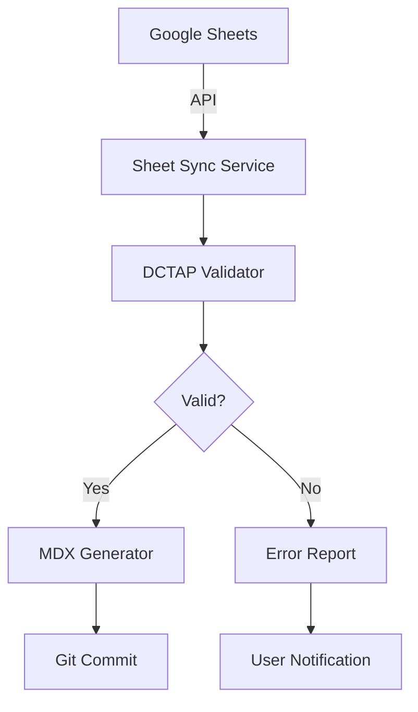

# Vocabulary Management Architecture

**Version:** 1.0  
**Date:** January 2025  
**Status:** Current Implementation

## Overview

This document provides the comprehensive architecture for the IFLA vocabulary management system within the admin portal. It reflects the actual implementation using Render.com for deployment, Next.js 15.4.4 with App Router, and Clerk authentication with custom RBAC.

## Technology Stack

### Core Technologies
- **Framework**: Next.js 15.4.4 with App Router
- **Runtime**: Node.js 20+
- **UI Library**: Material-UI (MUI) with custom IFLA theme
- **Styling**: Material-UI theme system (Emotion)
- **Type System**: TypeScript 5.8.3
- **Package Manager**: pnpm 10.12.4

### Services & Deployment
- **Hosting**: Render.com (NOT Vercel)
  - Preview: https://admin-iflastandards-preview.onrender.com
  - Production: https://admin.iflastandards.info
- **API**: Standard Next.js API routes (served from root)
- **Authentication**: Clerk with session management
- **Authorization**: Custom RBAC using Clerk publicMetadata (NOT Clerk Organizations)
- **Database**: Supabase (PostgreSQL) for operational data
- **Version Control**: Git/GitHub as source of truth

### Development Tools
- **Monorepo**: Nx 21.2.2
- **Build Optimization**: Nx Cloud
- **Testing**: Vitest + Playwright
- **CI/CD**: GitHub Actions

## Data Storage Strategy

The platform uses a distributed storage approach with clear separation of concerns:

```yaml
Git (Primary Source of Truth):
  - Vocabulary content (MDX files)
  - DCTAP profiles
  - Configuration
  - Policies
  - Version history

GitHub:
  - Issues and PRs for workflow
  - Project boards for planning
  - Releases and tags
  - Team management

Clerk:
  - User authentication
  - User profiles
  - Custom RBAC via publicMetadata
  - Session management

Supabase (Operational):
  - Import job tracking
  - Validation results
  - Activity logs
  - Temporary processing data
  - Cache for performance

Google Sheets (Temporary):
  - Bulk editing workspace
  - Translation workflows
  - Collaborative editing
  - Import/export staging
```

## Four-Phase Vocabulary Lifecycle

### Phase 1: Bootstrap (Cycle Kick-off)

**Purpose**: Initialize a new editorial cycle with bulk data management

**Workflow**:
1. Admin initiates new editorial cycle
2. System exports current vocabulary from Git to Google Sheets
3. Team performs bulk updates in spreadsheet environment
4. Import process validates against DCTAP profiles
5. System creates MDX files with embedded RDF front matter

**Key Components**:
```typescript
// Export to Google Sheets
export async function exportToSheets(namespace: string) {
  const vocabularies = await fetchFromGit(namespace);
  const sheet = await createGoogleSheet(namespace);
  await populateSheet(sheet, vocabularies);
  return sheet.url;
}

// Import from Google Sheets
export async function importFromSheets(sheetId: string) {
  const data = await fetchSheetData(sheetId);
  const validated = await validateAgainstDCTAP(data);
  const mdxFiles = generateMDXFiles(validated);
  await commitToGit(mdxFiles);
}
```

### Phase 2: Daily Editing

**Purpose**: Ongoing content management and refinement

**Workflow**:
1. Direct MDX editing via Git for technical users
2. Form-based editing in admin portal for content editors
3. Real-time DCTAP validation
4. Automatic RDF generation from MDX front matter

**Key Components**:
```typescript
// Form-based editor
interface VocabularyEditor {
  namespace: string;
  vocabulary: VocabularyItem;
  onSave: (item: VocabularyItem) => Promise<void>;
  validation: DCTAPValidator;
}

// MDX with RDF front matter
---
uri: http://iflastandards.info/ns/isbd/terms/contentForm
prefLabel:
  en: content form
  fr: forme du contenu
definition:
  en: A categorization reflecting the fundamental form...
broader: http://iflastandards.info/ns/isbd/terms/C2001
---
```

### Phase 3: Nightly Assembly

**Purpose**: Automated validation and preparation for publication

**Workflow**:
1. GitHub Actions triggered nightly
2. Full validation against DCTAP profiles
3. Semantic versioning analysis
4. Impact report generation
5. Notification of issues to editors

**GitHub Action Configuration**:
```yaml
name: Nightly Vocabulary Assembly
on:
  schedule:
    - cron: '0 2 * * *'  # 2 AM UTC daily
jobs:
  assemble:
    runs-on: ubuntu-latest
    steps:
      - uses: actions/checkout@v3
      - name: Validate Vocabularies
        run: pnpm nx run vocabulary:validate
      - name: Generate Impact Report
        run: pnpm nx run vocabulary:impact-report
      - name: Notify Team
        if: failure()
        uses: ./.github/actions/notify-team
```

### Phase 4: Publication

**Purpose**: Release validated vocabularies to production

**Workflow**:
1. Review impact reports in admin portal
2. Confirm version numbers (semantic versioning)
3. Approve and merge to main branch
4. Automatic deployment via GitHub Actions
5. Content negotiation serves both HTML and RDF

**Publication Process**:
```typescript
// Publication approval workflow
export async function publishVocabulary(
  namespace: string,
  version: string,
  approvedBy: string
) {
  // Create release branch
  const branch = await createReleaseBranch(namespace, version);
  
  // Generate release artifacts
  await generateRDFArtifacts(namespace);
  await updateVersionMetadata(namespace, version);
  
  // Create PR for review
  const pr = await createPullRequest(branch, {
    title: `Release ${namespace} v${version}`,
    reviewers: getReviewers(namespace),
    labels: ['release', namespace]
  });
  
  // Auto-merge when approved
  await enableAutoMerge(pr.id);
  
  return pr.url;
}
```

## Import/Export Workflows

### Spreadsheet Import Architecture



### Import Service Implementation

```typescript
// packages/sheet-sync/src/import-service.ts
export class VocabularyImportService {
  private validator: DCTAPValidator;
  private mdxGenerator: MDXGenerator;
  
  async importFromSheet(sheetId: string, namespace: string) {
    // Fetch data from Google Sheets
    const rawData = await this.fetchSheetData(sheetId);
    
    // Transform to internal format
    const vocabularies = this.transformToVocabularies(rawData);
    
    // Validate against DCTAP
    const validation = await this.validator.validate(
      vocabularies,
      namespace
    );
    
    if (!validation.isValid) {
      throw new ValidationError(validation.errors);
    }
    
    // Generate MDX files
    const mdxFiles = await this.mdxGenerator.generate(
      vocabularies,
      namespace
    );
    
    // Commit to Git
    await this.commitToGit(mdxFiles, {
      message: `Import vocabularies for ${namespace}`,
      branch: `import/${namespace}/${Date.now()}`
    });
    
    return {
      imported: vocabularies.length,
      files: mdxFiles.length,
      namespace
    };
  }
}
```

### Export Service Implementation

```typescript
// packages/sheet-sync/src/export-service.ts
export class VocabularyExportService {
  async exportToSheet(namespace: string, format: 'dctap' | 'simple') {
    // Fetch vocabularies from Git
    const vocabularies = await this.fetchFromGit(namespace);
    
    // Create Google Sheet
    const sheet = await this.createSheet({
      title: `${namespace} Vocabularies - ${new Date().toISOString()}`,
      template: format
    });
    
    // Transform based on format
    const data = format === 'dctap' 
      ? this.transformToDCTAP(vocabularies)
      : this.transformToSimple(vocabularies);
    
    // Populate sheet
    await this.populateSheet(sheet.id, data);
    
    // Set permissions
    await this.setSheetPermissions(sheet.id, {
      editors: await this.getNamespaceEditors(namespace),
      viewers: 'anyone'
    });
    
    return {
      sheetId: sheet.id,
      url: sheet.url,
      format,
      vocabularyCount: vocabularies.length
    };
  }
}
```

## DCTAP Validation

### Profile Structure

```yaml
# standards/isbd/dctap/element-profile.yaml
profile:
  title: ISBD Element Profile
  description: Validation profile for ISBD vocabulary elements
  
shapes:
  - shapeID: element
    shapeLabel: ISBD Element
    
    properties:
      - propertyID: uri
        propertyLabel: URI
        mandatory: true
        repeatable: false
        valueConstraint: IRI
        pattern: "^http://iflastandards.info/ns/isbd/"
        
      - propertyID: prefLabel
        propertyLabel: Preferred Label
        mandatory: true
        repeatable: true
        valueConstraint: langString
        
      - propertyID: definition
        propertyLabel: Definition
        mandatory: true
        repeatable: true
        valueConstraint: langString
        
      - propertyID: broader
        propertyLabel: Broader Term
        mandatory: false
        repeatable: true
        valueConstraint: IRI
```

### Validation Implementation

```typescript
// packages/dctap-validator/src/validator.ts
export class DCTAPValidator {
  async validate(
    data: VocabularyItem[],
    profilePath: string
  ): Promise<ValidationResult> {
    const profile = await this.loadProfile(profilePath);
    const errors: ValidationError[] = [];
    
    for (const item of data) {
      const shape = this.findShape(profile, item.type);
      
      if (!shape) {
        errors.push({
          item: item.uri,
          error: `No shape found for type ${item.type}`
        });
        continue;
      }
      
      // Validate each property
      for (const property of shape.properties) {
        const value = item[property.propertyID];
        
        // Check mandatory
        if (property.mandatory && !value) {
          errors.push({
            item: item.uri,
            property: property.propertyID,
            error: 'Required property missing'
          });
        }
        
        // Check pattern
        if (property.pattern && value) {
          const regex = new RegExp(property.pattern);
          if (!regex.test(value)) {
            errors.push({
              item: item.uri,
              property: property.propertyID,
              error: `Value does not match pattern ${property.pattern}`
            });
          }
        }
      }
    }
    
    return {
      isValid: errors.length === 0,
      errors,
      validated: data.length
    };
  }
}
```

## RDF Generation

### MDX to RDF Transformation

```typescript
// packages/rdf-generator/src/generator.ts
export class RDFGenerator {
  async generateFromMDX(mdxPath: string): Promise<string> {
    const content = await fs.readFile(mdxPath, 'utf-8');
    const { data: frontMatter } = matter(content);
    
    // Create RDF graph
    const store = new N3.Store();
    const { namedNode, literal, quad } = N3.DataFactory;
    
    const subject = namedNode(frontMatter.uri);
    
    // Add type
    store.addQuad(
      subject,
      namedNode('http://www.w3.org/1999/02/22-rdf-syntax-ns#type'),
      namedNode(frontMatter.type || 'http://www.w3.org/2004/02/skos/core#Concept')
    );
    
    // Add labels
    for (const [lang, label] of Object.entries(frontMatter.prefLabel || {})) {
      store.addQuad(
        subject,
        namedNode('http://www.w3.org/2004/02/skos/core#prefLabel'),
        literal(label, lang)
      );
    }
    
    // Add definitions
    for (const [lang, def] of Object.entries(frontMatter.definition || {})) {
      store.addQuad(
        subject,
        namedNode('http://www.w3.org/2004/02/skos/core#definition'),
        literal(def, lang)
      );
    }
    
    // Serialize to Turtle
    const writer = new N3.Writer({ prefixes: this.getPrefixes() });
    store.getQuads(null, null, null, null).forEach(quad => {
      writer.addQuad(quad);
    });
    
    return new Promise((resolve, reject) => {
      writer.end((error, result) => {
        if (error) reject(error);
        else resolve(result);
      });
    });
  }
}
```

## API Endpoints

### Vocabulary Management APIs

```typescript
// apps/admin/src/app/api/vocabularies/route.ts
export async function GET(request: NextRequest) {
  const { searchParams } = new URL(request.url);
  const namespace = searchParams.get('namespace');
  
  const vocabularies = namespace
    ? await fetchVocabulariesByNamespace(namespace)
    : await fetchAllVocabularies();
    
  return NextResponse.json({
    data: vocabularies,
    meta: {
      total: vocabularies.length,
      namespace
    }
  });
}

// apps/admin/src/app/api/vocabularies/import/route.ts
export const POST = withAuth(async (request: NextRequest) => {
  const { sheetId, namespace } = await request.json();
  
  const importService = new VocabularyImportService();
  const result = await importService.importFromSheet(sheetId, namespace);
  
  return NextResponse.json(result);
}, {
  resource: 'vocabulary',
  action: 'create'
});

// apps/admin/src/app/api/vocabularies/export/route.ts
export const POST = withAuth(async (request: NextRequest) => {
  const { namespace, format } = await request.json();
  
  const exportService = new VocabularyExportService();
  const result = await exportService.exportToSheet(namespace, format);
  
  return NextResponse.json(result);
}, {
  resource: 'vocabulary',
  action: 'read'
});
```

## Performance Optimization

### Caching Strategy

```typescript
// Vocabulary cache with 5-minute TTL
const vocabularyCache = new Map<string, {
  data: VocabularyItem[];
  timestamp: number;
}>();

const CACHE_TTL = 5 * 60 * 1000; // 5 minutes

export async function getCachedVocabularies(namespace: string) {
  const cached = vocabularyCache.get(namespace);
  
  if (cached && Date.now() - cached.timestamp < CACHE_TTL) {
    return cached.data;
  }
  
  const fresh = await fetchVocabulariesFromGit(namespace);
  vocabularyCache.set(namespace, {
    data: fresh,
    timestamp: Date.now()
  });
  
  return fresh;
}
```

### Batch Processing

```typescript
// Process vocabularies in batches for large imports
export async function batchProcessVocabularies(
  items: VocabularyItem[],
  batchSize = 100
) {
  const results = [];
  
  for (let i = 0; i < items.length; i += batchSize) {
    const batch = items.slice(i, i + batchSize);
    const processed = await Promise.all(
      batch.map(item => processVocabularyItem(item))
    );
    results.push(...processed);
    
    // Prevent memory buildup
    if (global.gc) global.gc();
  }
  
  return results;
}
```

## Monitoring and Analytics

### Activity Tracking

```typescript
// Track vocabulary operations
export async function trackVocabularyOperation(
  operation: 'create' | 'update' | 'delete' | 'import' | 'export',
  namespace: string,
  userId: string,
  details?: any
) {
  await supabase.from('vocabulary_activity').insert({
    operation,
    namespace,
    user_id: userId,
    details,
    timestamp: new Date().toISOString()
  });
}
```

### Health Checks

```typescript
// apps/admin/src/app/api/health/vocabularies/route.ts
export async function GET() {
  const checks = {
    git: await checkGitConnection(),
    supabase: await checkSupabaseConnection(),
    googleSheets: await checkGoogleSheetsAPI(),
    dctapValidator: await checkDCTAPValidator()
  };
  
  const healthy = Object.values(checks).every(c => c.status === 'ok');
  
  return NextResponse.json({
    status: healthy ? 'healthy' : 'degraded',
    checks,
    timestamp: new Date().toISOString()
  });
}
```

## Future Enhancements

1. **TinaCMS Integration**: Visual editing for non-technical users
2. **Real-time Collaboration**: WebSocket-based collaborative editing
3. **AI-Assisted Translation**: Integration with translation APIs
4. **Version Diffing**: Visual comparison of vocabulary versions
5. **Automated Testing**: Property-based testing for vocabularies
6. **GraphQL API**: Alternative API for complex queries
7. **Webhook Notifications**: Real-time updates for external systems

## Related Documentation

- **System Architecture**: [Doc 1 - System Architecture Overview](./01-system-architecture-overview.md)
- **Data Architecture**: [Doc 2 - Data Architecture](./02-data-architecture.md)
- **API Architecture**: [Doc 5 - API Architecture](./05-api-architecture.md)
- **RBAC Implementation**: [Doc 14 - RBAC Implementation](./14-rbac-implementation.md)
- **Import/Export**: [Doc 33 - Spreadsheet Import/Export Implementation](./33-spreadsheet-import-export-implementation-checklist.md)

This architecture provides a robust, scalable foundation for vocabulary management that balances technical sophistication with user accessibility.