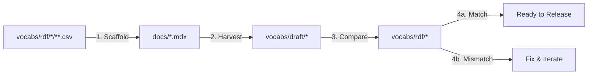

# Vocabulary Directory Structure and Versioning Guide

**Version:** 1.0  
**Date:** December 2025  
**Status:** Current Implementation Strategy

## Overview

This document defines the directory structure and versioning strategy for vocabulary files in the IFLA Standards Platform. It establishes CSV as a first-class format alongside other RDF serializations, adopts ISBD terminology (VES/SES/elements), and defines the round-trip validation workflow.

## Core Principles

1. **CSV as First-Class Format**: CSV files are treated as an equal serialization format alongside TTL, RDF/XML, and JSON-LD
2. **Single Source of Truth**: The `rdf/` directory contains all authoritative data in all formats
3. **Format Parity**: All formats represent the same semantic data and version together
4. **Independent Versioning**: Each standard versions independently via Git tags
5. **Round-Trip Validation**: Changes must validate through the CSV → Docs → RDF cycle

## Directory Structure

### Production Structure
```
standards/{standard}/
├── vocabs/                        # All vocabulary-related assets
│   ├── rdf/                      # Source of truth - all formats together
│   │   ├── elements/             # Element definitions (ISBD terminology)
│   │   │   ├── isbd-elements.ttl
│   │   │   ├── isbd-elements.rdf
│   │   │   ├── isbd-elements.jsonld
│   │   │   ├── isbd-elements.csv
│   │   │   ├── isbd-unc-elements.ttl
│   │   │   ├── isbd-unc-elements.csv
│   │   │   └── ...
│   │   ├── ves/                  # Vocabulary Encoding Schemes
│   │   │   ├── contentform/
│   │   │   │   ├── contentform.ttl
│   │   │   │   ├── contentform.rdf
│   │   │   │   ├── contentform.jsonld
│   │   │   │   └── contentform.csv
│   │   │   ├── mediatype/
│   │   │   │   └── [all formats]
│   │   │   └── contentqualification/
│   │   │       ├── motion/
│   │   │       │   └── [all formats]
│   │   │       └── dimensionality/
│   │   │           └── [all formats]
│   │   └── ses/                  # Syntax Encoding Schemes
│   │       ├── punctuation/
│   │       │   ├── punctuation.ttl
│   │       │   ├── punctuation.csv
│   │       │   └── ...
│   │       └── ...
│   ├── dctap/                    # DCTAP validation profiles
│   │   ├── elements.yaml
│   │   ├── ves.yaml
│   │   └── ses.yaml
│   ├── jsonld-context/           # JSON-LD context definitions
│   │   ├── elements.jsonld
│   │   ├── ves.jsonld
│   │   └── ses.jsonld
│   └── draft/                    # Temporary validation workspace
│       ├── elements/
│       ├── ves/
│       ├── ses/
│       └── validation-report.md
├── draft_rdf/                    # Temporary validation workspace
│   ├── elements.ttl              # Generated from docs for comparison
│   ├── elements.rdf
│   ├── elements.jsonld
│   ├── vocabularies/             # Harvested RDF to validate round-trip
│   │   └── ...
│   └── validation-report.md      # Comparison results
├── docs/                         # Docusaurus documentation (scaffolded from CSV)
│   ├── elements/
│   └── vocabularies/
└── scripts/
    ├── csv-to-docs.ts           # Scaffold docs from rdf/*.csv
    ├── docs-to-rdf.ts           # Harvest RDF to draft_rdf/
    └── validate-rdf.ts          # Compare rdf/ vs draft_rdf/
```

### Key Directory Purposes

- **`vocabs/`**: All vocabulary-related assets
  - **`vocabs/rdf/`**: Production-ready data files in all formats
    - **`elements/`**: Element definitions (using ISBD terminology)
    - **`ves/`**: Vocabulary Encoding Schemes
    - **`ses/`**: Syntax Encoding Schemes
  - **`vocabs/dctap/`**: DCTAP validation profiles
  - **`vocabs/jsonld-context/`**: JSON-LD context definitions
  - **`vocabs/draft/`**: Temporary validation workspace
- **`docs/`**: Human-readable documentation scaffolded from CSV files

## Workflow Architecture

### Round-Trip Validation Process



1. **CSV to Documentation**: Scripts read CSV files from `vocabs/rdf/` and generate MDX documentation
2. **Documentation to Draft RDF**: Harvest RDF from MDX frontmatter to `vocabs/draft/`
3. **Validation**: Compare generated files against source files
4. **Resolution**: If validation passes, proceed to release; if not, fix discrepancies

### Data Flow Example

```bash
# 1. Edit CSV files
edit standards/isbd/vocabs/rdf/ves/contentform/contentform.csv

# 2. Scaffold documentation
pnpm nx run isbd:scaffold-docs

# 3. Generate draft RDF from docs
pnpm nx run isbd:harvest-rdf

# 4. Validate round-trip
pnpm nx run isbd:validate-rdf

# 5. If valid, commit changes
git add standards/isbd/
git commit -m "feat(isbd): update content form vocabulary"
```

## Content Negotiation and Distribution

### Content Negotiation Benefits

The content-first organization enables clean URL routing:

```nginx
# Clean paths map directly to content
GET /vocabs/ves/contentform
Accept: text/turtle              → contentform.ttl
Accept: application/ld+json      → contentform.jsonld
Accept: text/csv                 → contentform.csv
Accept: application/rdf+xml      → contentform.rdf
```

### Format-Specific Distribution

While files are organized by content, format-specific packages can be generated:

```bash
# Generate format-specific downloads
./scripts/generate-format-packages.sh isbd v1.2.0

# Creates:
# dist/isbd-ttl-v1.2.0.zip     # All Turtle files
# dist/isbd-csv-v1.2.0.zip     # All CSV files  
# dist/isbd-jsonld-v1.2.0.zip  # All JSON-LD files
# dist/isbd-complete-v1.2.0.zip # Everything
```

## Versioning Strategy

### Git Tag-Based Versioning

Each standard is versioned independently using Git tags:

```bash
# Tag format: {standard}-v{major}.{minor}.{patch}
git tag isbd-v1.2.0      # ISBD release 1.2.0
git tag isbdm-v1.1.0     # ISBDM release 1.1.0
git tag lrm-v2.0.0       # LRM release 2.0.0
git tag frbr-v1.0.3      # FRBR release 1.0.3
```

### Version Management Commands

```bash
# List all versions for a standard
git tag -l "isbd-v*"

# Get latest version
git describe --tags --match="isbd-v*" --abbrev=0

# Compare versions
git diff isbd-v1.1.0 isbd-v1.2.0 -- standards/isbd/rdf/

# Checkout specific version
git checkout isbd-v1.1.0 -- standards/isbd/rdf/
```

### Release Process

```bash
# 1. Ensure working directory is clean
git status

# 2. Run validation suite
pnpm nx run isbd:validate-rdf
pnpm nx run isbd:test

# 3. Create annotated tag with release notes
git tag -a isbd-v1.2.0 -m "ISBD Release 1.2.0

- Added content qualification vocabularies
- Updated element definitions
- Fixed namespace declarations
- Added French translations"

# 4. Push tag to origin
git push origin isbd-v1.2.0

# 5. Export to external repository (optional)
./scripts/publish-standard.sh isbd 1.2.0
```

## CSV File Structure

### Standard CSV Format
```csv
uri,prefLabel@en,prefLabel@fr,definition@en,definition@fr,broader,scopeNote@en
http://iflastandards.info/ns/isbd/terms/T1001,Text,Texte,"Content expressed through written words","Contenu exprimé par des mots écrits",http://iflastandards.info/ns/isbd/terms/C2001,"Includes printed and digital text"
```

### Column Naming Conventions
- Language-tagged properties: `{property}@{lang}` (e.g., `prefLabel@en`)
- URIs: Full URIs or prefixed forms
- Hierarchical relations: `broader`, `narrower`, `related`
- Administrative: `status`, `created`, `modified`

## Benefits of This Architecture

1. **Clean Releases**: Copy entire `rdf/` directory without exclusions
2. **Format Equality**: CSV treated as equal to other RDF formats
3. **Clear Validation**: Explicit `draft_rdf/` for validation workflows
4. **Simple CI/CD**: No complex filtering or exclusion logic
5. **Version Independence**: Each standard releases on its own schedule
6. **Audit Trail**: Git tags provide complete version history
7. **Rollback Capability**: Easy reversion to any tagged version

## Migration Path

For existing projects (like ISBDM) with files in other locations:

```bash
# 1. Create new vocabs structure
mkdir -p standards/isbdm/vocabs/{rdf,dctap,jsonld-context,draft}
mkdir -p standards/isbdm/vocabs/rdf/{elements,ves,ses}

# 2. Move RDF/CSV files organized by content type
# Elements
mv standards/isbdm/static/vocabs/*/ns/isbd/elements.* standards/isbdm/vocabs/rdf/elements/
mv standards/isbdm/static/vocabs/*/ns/isbd/unc/elements.* standards/isbdm/vocabs/rdf/elements/

# VES (Vocabulary Encoding Schemes)
for vocab in contentform mediatype; do
  mkdir -p standards/isbdm/vocabs/rdf/ves/$vocab/
  mv standards/isbdm/static/vocabs/*/ns/isbd/terms/$vocab.* standards/isbdm/vocabs/rdf/ves/$vocab/
done

# Content qualification vocabularies
for vocab in motion dimensionality sensoryspecification type; do
  mkdir -p standards/isbdm/vocabs/rdf/ves/contentqualification/$vocab/
  mv standards/isbdm/static/vocabs/*/ns/isbd/terms/contentqualification/$vocab.* \
     standards/isbdm/vocabs/rdf/ves/contentqualification/$vocab/
done

# 3. Move DCTAP profiles
mv standards/isbdm/static/data/dctap/* standards/isbdm/vocabs/dctap/

# 4. Move JSON-LD contexts
mv standards/isbdm/static/data/contexts/* standards/isbdm/vocabs/jsonld-context/

# 5. Update script references
edit scripts/csv-to-docs.ts  # Update paths to vocabs/rdf/**/*.csv
edit scripts/validate-dctap.ts  # Update paths to vocabs/dctap/*.yaml

# 6. Validate the migration
pnpm nx run isbdm:validate-rdf

# 7. Commit the restructure
git add standards/isbdm/
git commit -m "refactor(isbdm): migrate to vocabs/ structure with VES/SES/elements organization"
```

### Why This Organization?

- **ISBD Terminology**: Uses VES/SES/elements as requested by ISBD group
- **Content-First**: All formats of each vocabulary stay together for easy management
- **Content Negotiation**: Direct path mapping enables clean URL routing
- **Format Downloads**: Can generate format-specific packages via scripts
- **Clear Separation**: Data (`rdf/`), validation (`dctap/`), and configuration (`jsonld-context/`) are logically separated

## Best Practices

1. **Always validate round-trip** before tagging a release
2. **Keep draft_rdf/ in .gitignore** - it's temporary workspace only
3. **Version all formats together** - Never release partial format updates
4. **Use semantic versioning** for clear change communication
5. **Document breaking changes** in tag messages
6. **Test external publication** in preview environment first

## Tooling Requirements

### Required Scripts
- `csv-to-docs.ts`: Generate MDX from CSV
- `docs-to-rdf.ts`: Extract RDF from MDX frontmatter
- `validate-rdf.ts`: Compare source vs generated RDF
- `publish-standard.sh`: Export to external repository

### Nx Targets
```json
{
  "targets": {
    "scaffold-docs": {
      "executor": "@nx/workspace:run-commands",
      "options": {
        "command": "tsx scripts/csv-to-docs.ts --standard={projectName}"
      }
    },
    "harvest-rdf": {
      "executor": "@nx/workspace:run-commands",
      "options": {
        "command": "tsx scripts/docs-to-rdf.ts --standard={projectName}"
      }
    },
    "validate-rdf": {
      "executor": "@nx/workspace:run-commands",
      "options": {
        "command": "tsx scripts/validate-rdf.ts --standard={projectName}"
      }
    }
  }
}
```

## Conclusion

This architecture provides a robust, maintainable approach to managing RDF and CSV files with clear versioning, validation, and release processes. By treating CSV as a first-class format and using Git tags for versioning, we achieve both flexibility and simplicity in our standards management workflow.