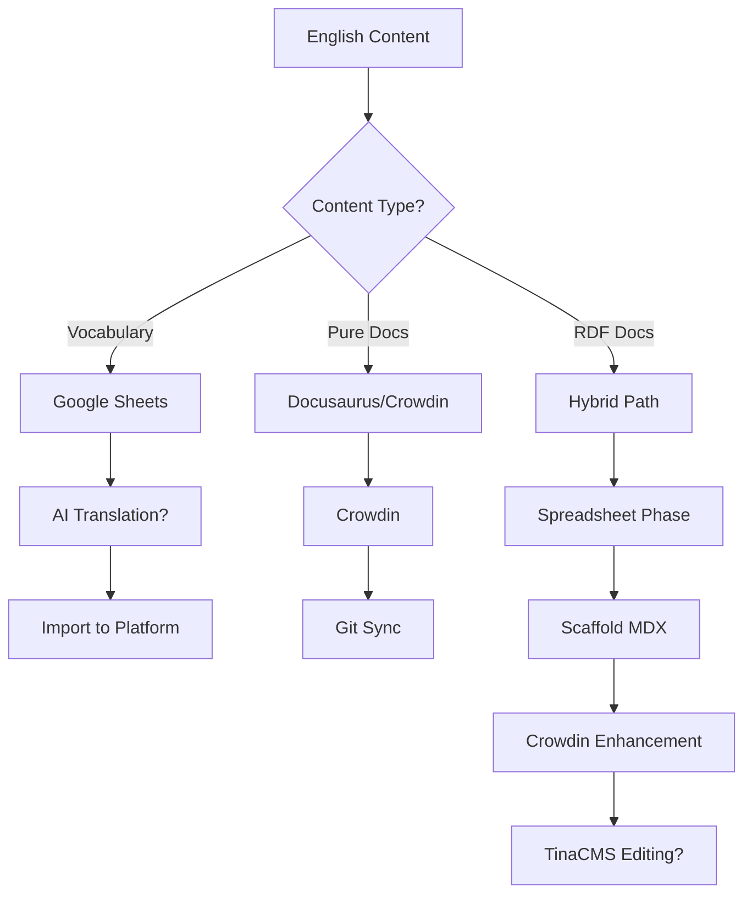
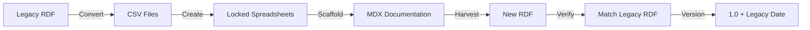

# Discussion Points

**Version:** 2.0  
**Date:** July 2025  
**Status:** Areas Requiring Team Discussion (Updated)

## Overview

This document identifies areas of the IFLA Standards Platform architecture and implementation that require clarification, team decisions, or further discussion. These points have emerged from analyzing the comprehensive documentation and identifying potential conflicts, ambiguities, or incomplete specifications.

**Update Note**: This document has been revised after creating additional system design documentation that addressed several previously unclear areas. Items that have been resolved are marked as such.

## 1. Environment Strategy Clarification

### ✅ RESOLVED - ALREADY IMPLEMENTED
**Current State**: 3-environment strategy is already in production (local, preview, production)

**What's Been Implemented**:
1. **Environment Count**: 3 environments actively in use
2. **Development Environment**: Already removed from codebase
3. **Fork Workflow**: Already deprecated, team using feature branches
4. **Deployment Platform**: GitHub Pages serving both environments
   - Preview: `iflastandards.github.io/platform/`
   - Production: `www.iflastandards.info`
5. **Vercel**: Currently used for Edge API functions only

**Documentation Created**: 
- `12-environment-strategy-final.md` - Documents current implementation
- `13-environment-migration-guide.md` - Historical reference for the migration

### No Further Action Needed

## 2. Repository Structure and Naming

### ✅ RESOLVED - CURRENT STATE DOCUMENTED
**Current Implementation**: Remote migrated to `platform`, local remains `standards-dev` by design

**What's Been Implemented**:
1. **Remote Repository**: `iflastandards/platform` (migration complete)
2. **Local Directory**: `standards-dev` (intentionally unchanged)
   - Preserves bookmarks, paths, and IDE configurations
   - No technical benefit to renaming
3. **Branch Strategy**: `preview` confirmed as primary working branch
4. **Workflow**: Push to `origin:preview` for deployments

**Documentation Created**: 
- `14-repository-structure-current.md` - Documents the intentional structure

### No Changes Needed - Working as Designed

## 3. TinaCMS Integration Status

### ✅ PARTIALLY RESOLVED
**What's Clear**: TinaCMS will provide WYSIWYG editing for prose documentation and form-based editing for RDF metadata, with automatic Git commits and real-time validation.

### Remaining Questions
1. **Implementation Timeline**: When will TinaCMS be integrated?
2. **Technical Integration**: Specific integration approach with existing MDX files
3. **Cost Structure**: Licensing and scaling costs
4. **Performance Impact**: Effect on build times and runtime performance

### Requirements Still Needed
- Detailed technical integration plan
- Cost analysis for different usage tiers
- Performance benchmarking

## 4. Translation Workflow Complexity

### ⚠️ PARTIALLY RESOLVED - SIMPLIFIED BY VERSION-BASED APPROACH

**The Challenge**: The platform has three distinct translation workflows that need to coexist:

1. **Vocabulary Concept Translations** (Spreadsheet-only)
   - Labels, definitions, scope notes for RDF terms
   - Managed entirely in Google Sheets
   - AI-assisted first drafts possible
   - Import to platform via RDF converter

2. **Pure Documentation Translations** (Docusaurus/Crowdin)
   - User guides, about pages, help content
   - Standard Docusaurus i18n workflow
   - Crowdin integration for professional translators
   - Separate file directories per language

3. **RDF Documentation Translations** (Hybrid workflow)
   - Starts in spreadsheets (with vocabulary)
   - Scaffolded to Docusaurus MDX files
   - Enhanced in Crowdin
   - TinaCMS editing adds another layer

### Workflow Conflicts

**Current Complexity**:


### Integration Questions

1. **TinaCMS Impact**: 
   - How does TinaCMS handle multilingual editing?
   - Does it conflict with Crowdin workflows?
   - Can it edit translations in place?

2. **Synchronization Issues**: ✅ RESOLVED
   - **Version-based sync**: Spreadsheets are import-only until new version initiated
   - **Clear transitions**: MDX exported to sheets → editing → one-time import → MDX is source
   - **No conflicts**: Single source of truth at any given time
   - **English changes**: Handled via warnings, issues, and optional PRs

3. **AI Translation Integration**:
   - Where does AI translation fit in each workflow?
   - Quality control for AI-generated content?
   - Human review requirements?

### Architectural Options

**Option 1: Unified Translation Pipeline**
- Build custom integration layer
- Single source of truth for all translations
- Complex but consistent

**Option 2: Workflow Separation**
- Keep three workflows distinct
- Clear boundaries but potential duplication
- Simpler but less integrated

**Option 3: Progressive Migration**
- Start with current hybrid approach
- Gradually unify as patterns emerge
- Learn from usage before committing

### Decisions Needed

1. **Primary Strategy**:
   - Accept complexity and manage three workflows?
   - Invest in unified solution?
   - Simplify by reducing translation approaches?

2. **Tool Selection**:
   - Crowdin vs alternatives for documentation?
   - Custom tools for vocabulary?
   - TinaCMS role in translation editing?

3. **Quality Standards**:
   - Human review requirements
   - AI translation guidelines
   - Consistency checking between workflows

4. **Technical Implementation**:
   - Synchronization mechanisms
   - Conflict resolution strategies
   - Version control for translations

### Documentation Created
- `20-translation-workflow-integration.md` - Comprehensive analysis of translation complexity with TinaCMS integration strategies and architectural recommendations

### What's Resolved
- **Synchronization complexity**: Version-based approach eliminates continuous sync needs
- **Source of truth**: Clear transitions at version boundaries
- **English modifications**: Defined process with warnings and PR creation

### Still Needs Decision
1. **TinaCMS Integration Details**: How it handles version states and locked content
2. **Crowdin Role**: Integration with version-based workflow for pure documentation
3. **AI Translation Placement**: Where and when AI assistance is offered
4. **Tool Selection**: Final platform choices for each workflow type

### Recommended Next Steps
1. Include version-state awareness in TinaCMS POC
2. Design English modification review UI
3. Test import/export tools with translators
4. Document version lifecycle for users

## 5. Google Sheets Integration Depth

### ✅ RESOLVED
**What's Clear**: Google Sheets integration uses service account authentication for batch import/export operations during the Editorial Cycle Bootstrap phase. The RDF Converter Pipeline (Phase 4) provides comprehensive integration with rate limiting, quota management, and state machine for pipeline steps.

### Implementation Details Now Documented
- **Batch Operations Only**: No real-time sync planned
- **Service Account Auth**: Not OAuth, simplified permissions
- **Validation**: Occurs on platform after import
- **Version Control**: Tracked through Git after import

### No Further Discussion Needed

## 6. Supabase Role and Boundaries

### ✅ FULLY RESOLVED

**What's Clear** (from Data Storage Strategy document + clarification):

1. **Data Boundaries**: Clearly defined as "Temporary processing data and workflow state"
   - Active import sessions
   - Processing status and progress
   - Validation results
   - Workflow state
   - Temporary workspace data
   - NO permanent/versioned data (that stays in Git)

2. **Migration Strategy**: Clear access hierarchy prevents data creep
   - Memory Cache → Clerk → File System → Supabase → GitHub API
   - Supabase only for dynamic processing data
   - Row Level Security enforces user boundaries

3. **Implementation Pattern**: Well-defined with code examples
   - RLS policies for security
   - Clear separation between temporary and permanent data
   - Direct database access patterns documented

4. **Cost Management**: RESOLVED
   - Supabase Pro account provides sufficient capacity
   - Fixed monthly cost (predictable budget)
   - No scaling concerns with current plan

5. **Backup Strategy**: RESOLVED
   - Included with Supabase Pro account
   - Automated backup solution
   - No additional backup infrastructure needed

### No Further Action Required

## 7. Performance Targets Validation

### Current Ambiguity
Performance targets are specified but validation methods are unclear.

### Targets Needing Clarification
- **Build Time**: <5 minutes (with or without cache?)
- **Page Load**: <3 seconds (which percentile?)
- **API Response**: <200ms (for which operations?)
- **Test Execution**: Various targets (in which environment?)

### Monitoring Questions
1. How are these metrics measured?
2. What happens when targets are missed?
3. Who is responsible for performance?
4. What tools are used for monitoring?

## 8. Nx Cloud Configuration

### ✅ FULLY RESOLVED

**What's Clear** (from clarification):

1. **Access Management**: RESOLVED
   - Organization admins have full access
   - Authorized developers granted access as needed
   - Access controlled at organization level only

2. **Cost Structure**: RESOLVED  
   - Currently in free tier (sufficient for limited developers)
   - Will remain free until provider restrictions change
   - Risk acknowledged: tier changes outside our control

3. **Cache Strategy**: RESOLVED
   - Configured in `nx.json`
   - Optimized for `nx affected` commands
   - Cache retained indefinitely
   - Further optimization deferred until post-active development

4. **Security**: RESOLVED
   - Access restricted to organization admins
   - Standard Nx Cloud security applies
   - No additional protocols needed for current usage

### Accepted Risks
- Free tier restrictions may change (external risk)
- Cache optimization is "good enough" for current phase

### No Further Action Required

## 9. API Versioning Strategy

### ✅ RESOLVED - NO FORMAL VERSIONING NEEDED

**What's Clear** (from clarification):

1. **API Scope**: All APIs are internal-only, no public access planned
2. **Versioning Approach**: Dynamic versioning, no formal version control
3. **Primary Consumer**: Vercel functions only
4. **Documentation Strategy**: Dynamic API documentation as needed
5. **Breaking Changes**: Managed through deployment coordination

### Accepted Approach
- No formal API versioning scheme required
- Changes deployed dynamically with Vercel functions
- Documentation generated as needed from code
- Internal coordination for any breaking changes

### No Further Action Required

## 10. Edge Function Limitations

### ✅ PARTIALLY RESOLVED - IMPLEMENTATION STRATEGY DEFINED

**What's Clear** (from clarification):

1. **Long-Running Operations**: RESOLVED
   - Detect potential issues in development
   - Implement batching based on volume metrics
   - Calculate batch sizes using:
     - Number of rows in CSV
     - Number of pages to read
     - Execution time per item
     - Vercel warmup time and latency
     - Time to live constraints

2. **Memory Constraints**: RESOLVED
   - Addressed through same batching strategy
   - Volume-based splitting prevents memory overruns

3. **Cold Start Impact**: RESOLVED
   - Factor warmup time into batch calculations
   - Optimize for sustained execution within limits

4. **Regional Deployment**: RESOLVED
   - Primary: Western Europe
   - Secondary: Canada
   - Tertiary: United States

### Implementation Strategy
```typescript
interface BatchCalculation {
  volumeMetrics: {
    itemCount: number;
    itemSize: number;
    processingTimePerItem: number;
  };
  vercelConstraints: {
    maxExecutionTime: number;
    warmupTime: number;
    networkLatency: number;
    timeToLive: number;
  };
  calculateOptimalBatchSize(): number;
}
```

### Still Needs Implementation
- Actual batch size calculation algorithms
- Development-time detection tooling
- Performance profiling of operations
- Regional deployment configuration

## 11. Multi-tenancy Considerations

### ✅ FULLY RESOLVED - REVIEW GROUP BASED

**What's Clear** (from clarification and existing documentation):

1. **Tenants**: The 4 IFLA Review Groups
   - ICP (International Cataloguing Principles) Review Group
   - BCM (Bibliographic Conceptual Models) Review Group  
   - ISBD (International Standard Bibliographic Description) Review Group
   - PUC (Permanent UNIMARC Committee) Review Group

2. **Namespace Ownership**: Each namespace is the responsibility of a review group
   - See: `/docs/IFLA Review Groups and related namespaces.md`
   - Clear mapping of namespaces to review groups

3. **Access Management**: 
   - Review group membership via GitHub teams in `iflastandards` organization
   - Namespace managers and editors designated within teams
   - Project-based permissions for invited experts
   - Documented in system architecture overview

4. **Data Isolation**: Natural isolation by namespace/review group
   - Each namespace has separate documentation site
   - Git-based separation of content
   - Review group teams control access

5. **Billing**: RESOLVED - All under IFLA Standards
   - No per-namespace billing
   - Single organization responsibility
   - No cost tracking needed per tenant

### Implemented Structure
```yaml
Organization: iflastandards
Teams:
  - ICP Review Group → manages MulDiCat namespace
  - BCM Review Group → manages FRBR, LRM namespaces  
  - ISBD Review Group → manages ISBD, ISBD-LRM namespaces
  - PUC Review Group → manages UNIMARC namespace
```

### No Further Action Required

## 12. Disaster Recovery Procedures

### ✅ RESOLVED - SIMPLIFIED APPROACH

**What's Clear** (from clarification):

1. **Primary Risk**: Destructive update to main branch
   - Protected by PR requirement
   - Would require malicious intent
   - Git history provides natural recovery

2. **Backup Strategy**: RESOLVED
   - Periodic sync to secondary GitHub account
   - Local development backup
   - No complex DR infrastructure needed

3. **Monitoring**: RESOLVED
   - Heartbeat monitor for uptime
   - Admin notifications on failures
   - Basic availability checking

4. **Recovery Expectations**: RESOLVED
   - Not 99.999% uptime critical
   - No DR drills required
   - Simple recovery procedures sufficient
   - Repository stability expected post-development

### Simple DR Approach
```yaml
Backup:
  - Secondary GitHub account sync (periodic)
  - Local developer copies
  - Git history for rollback

Monitoring:
  - Heartbeat check on sites
  - Email alerts to admins
  - No complex incident management

Recovery:
  - Git revert for content issues
  - Re-deploy from backup if needed
  - No formal RTO/RPO targets
```

### No Complex DR Infrastructure Required

## 13. Content Governance

### ✅ FULLY RESOLVED - REVIEW GROUP AUTONOMY

**What's Clear** (from clarification):

1. **Editorial Standards**: RESOLVED
   - Each review group defines their own standards
   - Within overall IFLA governance framework
   - Complete content control by review groups

2. **Review Processes**: RESOLVED
   - Internal management by review group policies
   - OR managed pull requests
   - Review group admins/namespace managers control

3. **Conflict Resolution**: RESOLVED
   - Handled within review groups
   - Review group has final authority
   - No platform-level arbitration needed

4. **Legal Compliance**: RESOLVED
   - IFLA overall governance ensures compliance
   - Review groups responsible for their content
   - No additional platform governance needed

### Governance Model
```yaml
Authority: Review Groups
  - Define their own editorial standards
  - Control all content decisions
  - Manage internal review processes
  
Content Management:
  - Option 1: Direct internal management
  - Option 2: Managed pull requests
  - Administrators: Review group admins + namespace managers

Platform Role:
  - Provide tools and infrastructure
  - No content governance intervention
  - Technical validation only
```

### No Platform-Level Governance Framework Needed

## 14. Platform Scaling Strategy

### ✅ FULLY RESOLVED - WELL-DEFINED SCALE

**What's Clear** (from clarification):

1. **Namespace Limits**: RESOLVED
   - Maximum 5 review groups
   - Maximum 50 namespaces total
   - Well within platform capabilities

2. **Vocabulary Size**: RESOLVED
   - Maximum 50 element sets per namespace
   - Maximum 100 concept schemes per namespace
   - Maximum 300 elements per set
   - Easily handled by current architecture

3. **User Scale**: RESOLVED
   - Maximum 200 user accounts
   - Maximum 30 Monthly Active Users (MAU)
   - No concurrency concerns at this scale

4. **Geographic Distribution**: RESOLVED
   - No regional deployments needed
   - Single deployment sufficient
   - Western Europe priority if needed

### Scale Parameters
```yaml
Review Groups: ≤ 5
Namespaces: ≤ 50
Per Namespace:
  - Element Sets: ≤ 50
  - Concept Schemes: ≤ 100
  - Elements per Set: ≤ 300
Users:
  - Total Accounts: ≤ 200
  - Monthly Active: ≤ 30
  - Concurrent: Not a concern
```

### Current Architecture More Than Sufficient
- Static site generation handles this scale easily
- GitHub Pages/Vercel can support these numbers
- No scaling concerns with defined limits

### No Capacity Planning Required

## 15. Integration with Legacy Systems

### ⚠️ MOSTLY RESOLVED - CRITICAL SERVER REQUIREMENT

**What's Clear** (from clarification):

1. **Data Migration**: RESOLVED
   - Legacy RDF → CSV conversion
   - Create 'locked' spreadsheets from CSV
   - Scaffold documentation pages from CSV
   - Harvest RDF from documentation
   - Verify exact match with starting RDF
   - Version as 1.0, tag with legacy date

2. **URL Redirects**: PARTIALLY RESOLVED
   - Docusaurus client-side redirect plugin for documentation
   - **CRITICAL GAP**: Vocabulary content negotiation server needs rewrite
     - Current: Simple path rewrite to www.iflastandards.info
     - **NEEDED**: Arbitrary redirect mapping for HTML requests
     - **NEEDED**: Export pathmap on vocabulary publish
     - **NEEDED**: Support for lexical aliases (URI slugs)
     - Namespace admins define slug formation rules

3. **API Compatibility**: RESOLVED
   - No legacy API maintenance (APIs are private)

4. **User Migration**: PARTIALLY RESOLVED
   - Review group members invited by managers
   - Managers invited by org admin
   - All membership by invitation only
   - Invitations can be requested
   - **GAP**: Onboarding process not designed

### Critical Missing Piece
```yaml
Vocabulary Content Negotiation Server:
  Current State:
    - Simple URI rewrite to www.iflastandards.info
    - No flexible redirect support
  
  Requirements:
    - Arbitrary HTML redirect mappings
    - Pathmap export on vocabulary publish
    - Lexical alias support (language-specific slugs)
    - Namespace-configurable slug formation
    - Integration with publishing workflow
```

### Migration Workflow


### Still Needs Action
1. **Vocabulary Server Rewrite**: Critical path item
   - Full requirements documented in `21-vocabulary-server-requirements.md`
   - Recommended approach: Nginx + Lua for dynamic pathmap resolution
   - 6-8 week implementation timeline
2. **Onboarding Process Design**: User experience gap
3. **Slug Formation Rules**: Per-namespace configuration
   - Defined in vocabulary server requirements
   - Namespace-specific configuration for lexical aliases

## 16. GitHub Projects Implementation Details

### ✅ RESOLVED
**What's Clear**: Comprehensive GitHub Projects integration has been documented in the new Collaboration Architecture document, including:
- Project charter components and workflow
- Permission models aligned with Review Groups
- Kanban boards for visual management
- Pull request workflows for external contributors

### No Further Discussion Needed

## 17. Financial ROI and Budget

### ✅ RESOLVED
**What's Clear**: Financial analysis has been added to system design documentation showing:
- 50% efficiency gains in content management
- 250% ROI over 5 years
- Cost structure for implementation and ongoing operations
- Strategic value beyond financial returns

### No Further Discussion Needed

## 18. AI-Powered Semantic Versioning Details

### ✅ RESOLVED
**What's Clear**: The AI versioning system has been fully documented in the Subsystems Architecture, including:
- Automatic change detection and pattern recognition
- Impact assessment with breaking change identification
- Version recommendations following semver principles
- Executive summaries for decision-making

### No Further Discussion Needed

## Next Steps

### Immediate Actions
1. Schedule team discussions for remaining unresolved items
2. Focus on high-priority items: Environment strategy, Repository naming, Platform choices
3. Create decision log for tracking resolutions
4. Communicate decisions to all stakeholders

### Resolved Items Summary
The following items have been addressed through additional documentation:
- ✅ Google Sheets Integration (fully resolved)
- ✅ GitHub Projects Collaboration Model (fully resolved)
- ✅ Financial Analysis and ROI (fully resolved)
- ✅ AI-Powered Semantic Versioning (fully resolved)
- ✅ Global Collaboration Features (fully resolved)
- ✅ Environment Strategy (confirmed as already implemented)
- ✅ Repository Structure (documented current intentional design)
- ✅ Supabase Role and Boundaries (fully resolved)
- ✅ Nx Cloud Configuration (fully resolved)
- ⚠️ TinaCMS Integration (partially resolved - POC planned)
- ⚠️ Translation Workflow Complexity (simplified by version-based approach - partially resolved)

### Ongoing Process
1. Regular architecture review meetings
2. Decision documentation in ADRs
3. Quarterly strategy alignment
4. Annual architecture assessment

### Success Criteria
- All discussion points resolved or tracked
- Documentation updated consistently
- Team aligned on decisions
- Clear communication to stakeholders

This document should be treated as a living document, with new discussion points added as they arise and resolved items moved to a decision log for future reference.
