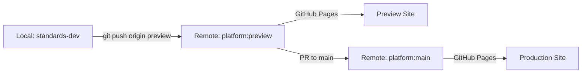

# Repository Structure - Current Implementation

**Version:** 1.0  
**Date:** January 2025  
**Status:** Documenting Existing Structure

## Executive Summary

This document clarifies the repository structure and naming conventions currently in use. While the remote repository has been migrated to `iflastandards/platform`, local directories retain the `standards-dev` name for practical reasons.

## Current Repository Structure

### Remote Repository
```
GitHub Organization: iflastandards
Repository Name: platform
Default Branch: main (protected)
Working Branch: preview
URL: https://github.com/iflastandards/platform
```

### Local Development
```
Local Directory: ~/Code/IFLA/standards-dev
Remote Name: origin
Remote URL: git@github.com:iflastandards/platform.git
```

## Git Configuration

### Remote Setup
```bash
# Current configuration (already implemented)
git remote -v
# origin  git@github.com:iflastandards/platform.git (fetch)
# origin  git@github.com:iflastandards/platform.git (push)
```

### Branch Mapping
```bash
# Local branches track remote branches
main → origin/main (protected, pull only)
preview → origin/preview (primary working branch)
feature/* → local development branches
```

## Workflow Reality

### Daily Development Flow


### Key Points
1. **Local directory name**: Kept as `standards-dev` for backward compatibility
2. **Remote repository**: Successfully migrated to `iflastandards/platform`
3. **Primary workflow**: Push to `origin:preview` for deployment
4. **Production updates**: Only via PR from preview to main

## Rationale for Current Structure

### Why Keep Local Directory as `standards-dev`

1. **Bookmarks & Paths**: Extensive local bookmarks and saved paths
   ```
   - IDE configurations
   - Terminal shortcuts
   - Script paths
   - Documentation links
   ```

2. **No Technical Benefit**: Renaming provides no functional improvement

3. **Risk vs Reward**: High disruption risk, zero technical reward

4. **Git Decoupling**: Git doesn't require directory name to match repository name

### Migration Already Complete

What was successfully migrated:
- ✅ Remote repository from `standards-dev` to `platform`
- ✅ Git remotes updated to point to new repository
- ✅ CI/CD pipelines updated
- ✅ Documentation references (mostly) updated
- ✅ Team workflows adjusted

What intentionally wasn't changed:
- ❌ Local directory names (by design)
- ❌ Personal development environment paths

## Common Commands

### Standard Workflow
```bash
# Feature development
git checkout -b feature/new-feature
# ... make changes ...
git add .
git commit -m "feat: add new feature"

# Deploy to preview
git push origin feature/new-feature:preview

# Or push feature branch and create PR
git push origin feature/new-feature
```

### Never Do This
```bash
# DON'T push directly to main
git push origin main  # ❌ BLOCKED

# DON'T try to rename local directory
mv standards-dev platform  # ❌ UNNECESSARY
```

## Documentation Standards

### When Referencing the Repository

#### In Documentation
```markdown
<!-- Correct: Use the GitHub repository name -->
Repository: `iflastandards/platform`
GitHub: https://github.com/iflastandards/platform

<!-- Also Correct: When referring to local development -->
Local development in your `standards-dev` directory
```

#### In Code Comments
```typescript
// When referencing remote
// See: https://github.com/iflastandards/platform/issues/123

// When referencing local paths
// Assumes standard local setup in standards-dev directory
```

### In Git Commands
```bash
# Always use remote name, not directory name
git push origin preview    # ✅ Correct
git remote add origin git@github.com:iflastandards/platform.git
```

## Addressing Confusion

### For New Developers

Include in onboarding:
```markdown
## Repository Setup

1. Clone the repository:
   ```bash
   git clone git@github.com:iflastandards/platform.git standards-dev
   cd standards-dev
   ```

2. Note: Local directory is named `standards-dev` for historical reasons
3. Remote repository is `iflastandards/platform`
4. This is intentional and correct
```

### For Documentation

When updating docs:
- Remote references: Always use `iflastandards/platform`
- Local development: Can reference `standards-dev` directory
- URLs: Always use https://github.com/iflastandards/platform

## Summary

The current repository structure represents a pragmatic solution:
- **Remote**: Properly named as `platform` for clarity
- **Local**: Retained as `standards-dev` for continuity
- **Workflow**: Optimized for developer efficiency

This is not a problem to be solved, but a deliberate decision that balances ideal naming with practical considerations.

## No Action Required

This structure is working well and requires no changes. This document serves to:
1. Clarify the intentional naming difference
2. Prevent unnecessary "cleanup" attempts
3. Guide consistent documentation practices