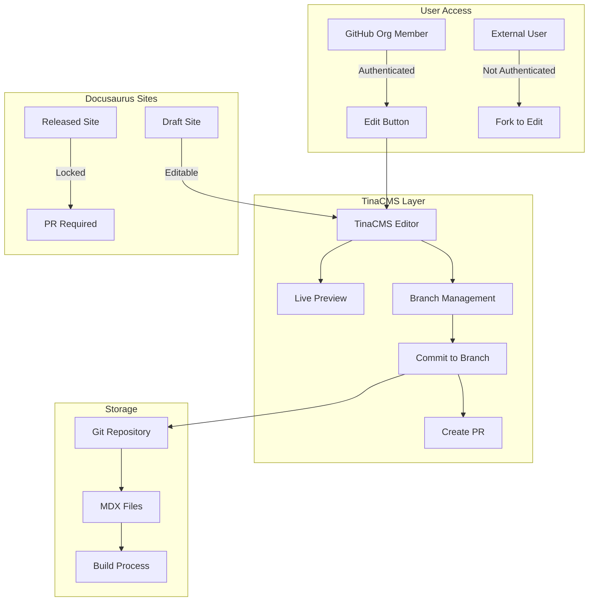
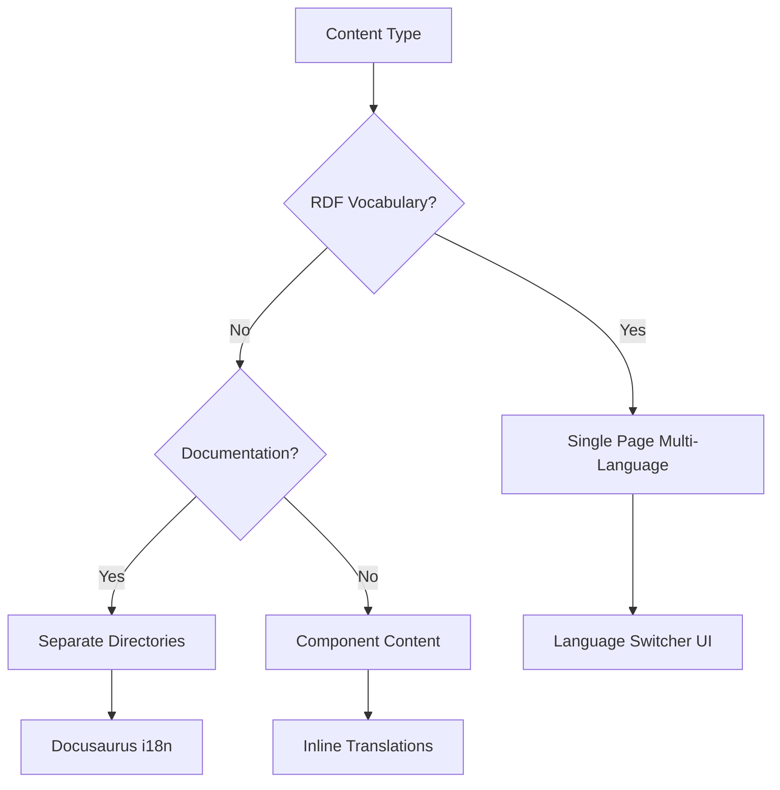
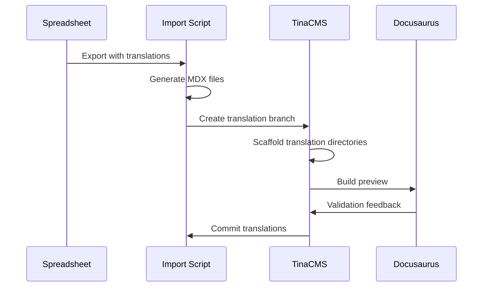

# TinaCMS Integration Architecture

**Version:** 1.0  
**Date:** July 2025  
**Status:** Technical Design Document
**Focus:** Self-hosted TinaCMS with GitHub integration

## Executive Summary

This design implements TinaCMS as a self-hosted editing layer that provides WYSIWYG editing for RDF frontmatter and MDX content, with real-time preview capabilities. The integration respects Docusaurus versioning/locking mechanisms and provides seamless authentication through GitHub organization membership.

## Core Architecture

### Integration Overview



## Authentication & Authorization

### GitHub Organization Integration

```typescript
// apps/admin/src/lib/tina-auth.ts
import { useSession } from 'next-auth/react';
import { Octokit } from '@octokit/rest';

export async function checkEditPermissions(user: User): Promise<EditPermissions> {
  const octokit = new Octokit({ auth: user.accessToken });
  
  try {
    // Check organization membership
    const { data: membership } = await octokit.orgs.checkMembershipForUser({
      org: 'iflastandards',
      username: user.username,
    });
    
    if (membership) {
      return {
        canEdit: true,
        canPreview: true,
        canCommit: true,
        editMode: 'tina',
      };
    }
  } catch (error) {
    // Not a member - offer fork workflow
    return {
      canEdit: true,
      canPreview: false,
      canCommit: false,
      editMode: 'fork',
    };
  }
}
```

### Edit Button Implementation

```tsx
// packages/theme/src/components/EditButton.tsx
import React from 'react';
import { useAuth } from '@/hooks/useAuth';
import { useTina } from 'tinacms';

export function EditButton({ filePath, namespace, isReleased }) {
  const { user, isOrgMember } = useAuth();
  const { setEdit } = useTina();
  
  if (!user) {
    return <GitHubForkButton filePath={filePath} />;
  }
  
  if (isReleased && !user.isReviewGroupAdmin) {
    return (
      <Tooltip content="This version is locked. Create a PR to suggest changes.">
        <CreatePRButton filePath={filePath} />
      </Tooltip>
    );
  }
  
  if (isOrgMember) {
    return (
      <button onClick={() => setEdit(true)}>
        Edit this page
      </button>
    );
  }
  
  return <GitHubForkButton filePath={filePath} />;
}
```

## TinaCMS Configuration

### Schema Design for RDF + MDX

```typescript
// tina/config.ts
import { defineConfig } from 'tinacms';
import { vocabularyCollection } from './collections/vocabulary';
import { documentationCollection } from './collections/documentation';

export default defineConfig({
  branch: process.env.TINA_BRANCH || process.env.VERCEL_GIT_COMMIT_REF || 'main',
  clientId: null, // Self-hosted, no cloud
  token: null,    // Self-hosted, no cloud
  
  build: {
    outputFolder: "admin",
    publicFolder: "apps/admin/public",
  },
  
  schema: {
    collections: [
      vocabularyCollection,
      documentationCollection,
    ],
  },
  
  // Custom auth provider
  auth: {
    provider: 'custom',
    getUser: async (token) => {
      return verifyGitHubOrgMembership(token);
    },
  },
});
```

### Vocabulary Collection Schema

```typescript
// tina/collections/vocabulary.ts
export const vocabularyCollection = {
  name: 'vocabulary',
  label: 'Vocabulary Terms',
  path: 'standards/*/docs/vocabularies',
  format: 'mdx',
  
  fields: [
    // RDF Metadata in Frontmatter
    {
      name: 'uri',
      type: 'string',
      label: 'URI',
      required: true,
      ui: {
        validate: validateURI,
      },
    },
    {
      name: 'labels',
      type: 'object',
      label: 'Labels (Multilingual)',
      fields: [
        { name: 'en', type: 'string', label: 'English' },
        { name: 'fr', type: 'string', label: 'Français' },
        { name: 'es', type: 'string', label: 'Español' },
        { name: 'de', type: 'string', label: 'Deutsch' },
      ],
      ui: {
        component: 'multilingual-field',
      },
    },
    {
      name: 'definitions',
      type: 'object',
      label: 'Definitions (Multilingual)',
      fields: [
        { name: 'en', type: 'string', label: 'English', ui: { component: 'textarea' } },
        { name: 'fr', type: 'string', label: 'Français', ui: { component: 'textarea' } },
        { name: 'es', type: 'string', label: 'Español', ui: { component: 'textarea' } },
        { name: 'de', type: 'string', label: 'Deutsch', ui: { component: 'textarea' } },
      ],
    },
    {
      name: 'broader',
      type: 'object',
      label: 'Broader Terms',
      list: true,
      ui: {
        component: 'relationship-picker',
      },
    },
    {
      name: 'narrower',
      type: 'object',
      label: 'Narrower Terms',
      list: true,
      ui: {
        component: 'relationship-picker',
      },
    },
    {
      name: 'related',
      type: 'object',
      label: 'Related Terms',
      list: true,
      ui: {
        component: 'relationship-picker',
      },
    },
    // MDX Body Content
    {
      name: 'body',
      type: 'rich-text',
      label: 'Documentation',
      isBody: true,
      templates: [
        // Component templates
        {
          name: 'VocabularyTable',
          label: 'Vocabulary Table',
          fields: [
            { name: 'namespace', type: 'string' },
            { name: 'showDefinitions', type: 'boolean' },
          ],
        },
        {
          name: 'ConceptHierarchy',
          label: 'Concept Hierarchy',
          fields: [
            { name: 'rootConcept', type: 'string' },
            { name: 'maxDepth', type: 'number' },
          ],
        },
      ],
    },
  ],
};
```

## Real-time Preview Implementation

### Preview Architecture

```typescript
// apps/admin/src/components/TinaPreview.tsx
import { useTina } from 'tinacms';
import { MDXRemote } from 'next-mdx-remote';
import { VocabularyTable, ConceptHierarchy } from '@ifla/theme/components';

const components = {
  VocabularyTable,
  ConceptHierarchy,
  // ... other components
};

export function TinaPreview({ query, variables }) {
  const { data } = useTina({ query, variables });
  
  // Transform frontmatter data for preview
  const frontmatter = transformRDFData(data.frontmatter);
  
  // Compile MDX with components
  const content = (
    <MDXRemote
      source={data.body}
      components={components}
      scope={{ ...frontmatter }}
    />
  );
  
  return (
    <div className="preview-container">
      <PreviewHeader data={frontmatter} />
      <PreviewContent>{content}</PreviewContent>
    </div>
  );
}
```

### Live Preview with Component Rendering

```typescript
// tina/live-preview.ts
export const livePreviewConfig = {
  // Enable instant preview updates
  useLiveUpdates: true,
  
  // Custom preview URL generator
  previewUrl: ({ collection, filename, namespace }) => {
    if (collection === 'vocabulary') {
      return `/preview/vocabularies/${namespace}/${filename}`;
    }
    return `/preview/${collection}/${filename}`;
  },
  
  // Component injection for preview
  injectComponents: true,
  componentMap: {
    VocabularyTable: () => import('@ifla/theme/components/VocabularyTable'),
    ConceptHierarchy: () => import('@ifla/theme/components/ConceptHierarchy'),
  },
};
```

## Version Control & Branch Management

### TinaCMS Branch Strategy

```typescript
// apps/admin/src/lib/tina-branch-manager.ts
export class TinaBranchManager {
  async createEditingBranch(user: User, file: string): Promise<string> {
    const timestamp = new Date().toISOString().split('T')[0];
    const branchName = `tina/${user.username}/${timestamp}-${slugify(file)}`;
    
    await this.git.createBranch({
      name: branchName,
      from: 'preview',
    });
    
    return branchName;
  }
  
  async commitChanges(branch: string, files: FileChange[]): Promise<void> {
    await this.git.commit({
      branch,
      message: `Edit: ${files.map(f => f.path).join(', ')}`,
      files,
      author: this.user,
    });
  }
  
  async createPullRequest(branch: string): Promise<PullRequest> {
    return await this.github.createPR({
      title: `Content update from TinaCMS`,
      head: branch,
      base: 'preview',
      body: this.generatePRBody(),
    });
  }
}
```

## Docusaurus Release Integration

### Version Locking Mechanism

```typescript
// packages/theme/src/utils/version-lock.ts
export interface VersionLockStatus {
  isLocked: boolean;
  reason?: 'released' | 'frozen' | 'archived';
  allowedActions: ('view' | 'propose-change' | 'direct-edit')[];
}

export async function checkVersionLock(
  namespace: string,
  version: string,
  language: string
): Promise<VersionLockStatus> {
  const releaseInfo = await getReleaseInfo(namespace, version, language);
  
  if (releaseInfo.status === 'released') {
    return {
      isLocked: true,
      reason: 'released',
      allowedActions: ['view', 'propose-change'],
    };
  }
  
  if (version === 'draft') {
    return {
      isLocked: false,
      allowedActions: ['view', 'propose-change', 'direct-edit'],
    };
  }
  
  return {
    isLocked: true,
    reason: 'frozen',
    allowedActions: ['view'],
  };
}
```

### Draft Site Management

```typescript
// apps/admin/src/pages/api/draft-management.ts
export async function openDraftForEditing(
  namespace: string,
  reviewGroupAdmin: User
): Promise<DraftSite> {
  // Verify admin permissions
  if (!isReviewGroupAdmin(reviewGroupAdmin, namespace)) {
    throw new Error('Unauthorized');
  }
  
  // Create or activate draft branch
  const draftBranch = `draft/${namespace}`;
  await ensureBranchExists(draftBranch);
  
  // Configure TinaCMS for draft editing
  return {
    branch: draftBranch,
    editableCollections: ['vocabulary', 'documentation'],
    tinaConfig: {
      enabled: true,
      allowDirectCommit: true,
      requirePR: false,
    },
  };
}
```

## Multilingual Architecture

### Language Strategy Decision Tree



### Unified Multilingual Page Approach

```typescript
// tina/fields/unified-multilingual.ts
export const unifiedMultilingualField = {
  name: 'content',
  type: 'object',
  label: 'Content (All Languages)',
  ui: {
    component: 'grouped-tabs',
    layout: 'vertical',
  },
  fields: languages.map(lang => ({
    name: lang.code,
    label: lang.name,
    type: 'group',
    fields: [
      { name: 'label', type: 'string' },
      { name: 'definition', type: 'text' },
      { name: 'scopeNote', type: 'text' },
      { name: 'examples', type: 'text', list: true },
    ],
  })),
};
```

### Language Switcher Component

```tsx
// packages/theme/src/components/LanguageSwitcher.tsx
export function LanguageSwitcher({ availableLanguages, currentLanguage }) {
  const [activeLanguage, setActiveLanguage] = useLanguage();
  
  return (
    <div className="language-switcher">
      {availableLanguages.map(lang => (
        <button
          key={lang}
          onClick={() => setActiveLanguage(lang)}
          className={activeLanguage === lang ? 'active' : ''}
          aria-label={`Switch to ${lang}`}
        >
          {lang.toUpperCase()}
        </button>
      ))}
    </div>
  );
}
```

## Translation Workflow Integration

### Spreadsheet to MDX Translation Flow



### Translation Scaffolding

```typescript
// scripts/scaffold-translations.ts
export async function scaffoldTranslation(
  namespace: string,
  sourceLanguage: string,
  targetLanguage: string
): Promise<void> {
  const sourceFiles = await glob(`standards/${namespace}/docs/**/*.mdx`);
  
  for (const sourceFile of sourceFiles) {
    const targetPath = sourceFile.replace(
      `/docs/`,
      `/i18n/${targetLanguage}/docusaurus-plugin-content-docs/current/`
    );
    
    if (!await exists(targetPath)) {
      const content = await readFile(sourceFile);
      const scaffolded = createTranslationScaffold(content, targetLanguage);
      await writeFile(targetPath, scaffolded);
    }
  }
  
  // Update TinaCMS config for new language
  await updateTinaLanguageConfig(namespace, targetLanguage);
}
```

## Implementation Phases

### Phase 1: Core Integration (Weeks 1-2)
1. Set up self-hosted TinaCMS
2. Implement GitHub auth integration
3. Create vocabulary schema
4. Basic preview functionality

### Phase 2: Advanced Features (Weeks 3-4)
1. Component integration in preview
2. Branch management automation
3. Version locking implementation
4. Multilingual field components

### Phase 3: Translation Workflow (Weeks 5-6)
1. Spreadsheet import integration
2. Translation scaffolding
3. Language switcher implementation
4. Crowdin exploration (if needed)

## Risk Mitigation

### Performance Considerations
- Lazy load TinaCMS only when editing
- Cache preview builds
- Optimize component rendering
- Use static preview for non-editors

### Security Measures
- GitHub org membership verification
- Branch protection rules
- Audit trail for all edits
- No direct main branch commits

## Success Metrics

### Technical Metrics
- Preview render time: <2s
- Edit load time: <3s
- Commit success rate: >95%
- Build impact: <10%

### User Metrics
- Edit completion rate: >80%
- Error reduction: >60%
- Time to publish: -50%
- User satisfaction: >8/10

## Conclusion

This architecture provides a robust TinaCMS integration that:
1. Leverages GitHub org membership for seamless authentication
2. Provides real-time preview with full component support
3. Respects Docusaurus versioning and release cycles
4. Supports complex multilingual workflows
5. Maintains flexibility for future translation service integration

The self-hosted approach gives us full control while the modular design allows for incremental implementation and future adjustments based on user feedback.
