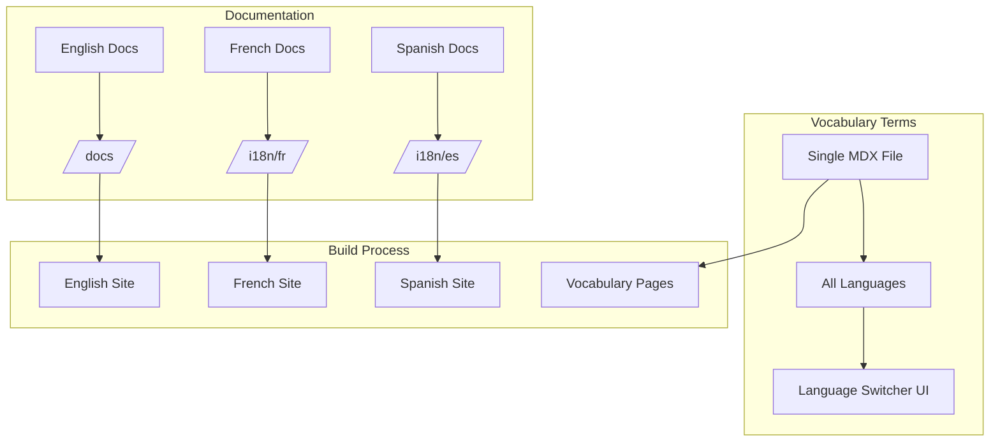
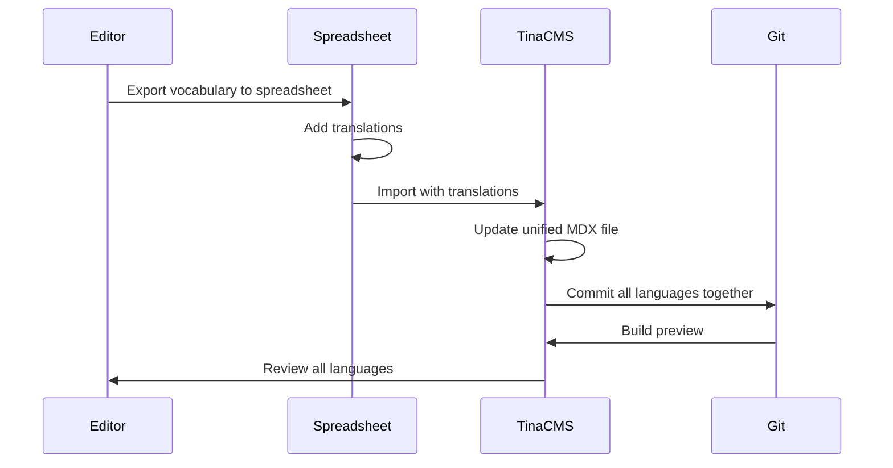
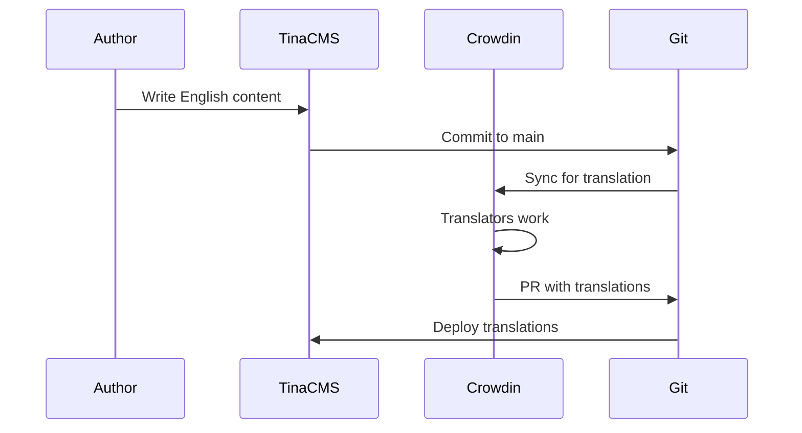

# Multilingual Strategy Design

**Version:** 1.0  
**Date:** July 2025  
**Status:** Architecture Decision Document
**Focus:** Unified vs Separated Language Approach

## Executive Summary

This document analyzes two approaches for multilingual content: unified pages with language switching vs separate directories per language. Based on content type and user needs, we recommend a hybrid approach: unified pages for vocabulary terms (RDF data) and separate directories for documentation content.

## Problem Statement

The platform needs to support multilingual content for:
1. **RDF Vocabulary Terms**: Labels, definitions, scope notes in multiple languages
2. **Documentation**: Explanatory text, guides, examples
3. **UI Elements**: Navigation, buttons, messages

Current challenges:
- RDF literals naturally exist in multiple languages within one concept
- Documentation may have different lengths/structures per language
- Translation workflows differ between structured data and prose
- User expectations vary (language switcher vs separate sites)

## Approach Analysis

### Option 1: Unified Pages with Language Switching

```typescript
// Single MDX file with all languages
---
uri: http://iflastandards.info/ns/isbd/terms/1001
labels:
  en: "has title proper"
  fr: "a pour titre propre"
  es: "tiene título propiamente dicho"
  de: "hat Haupttitel"
definitions:
  en: "Relates a resource to a nomen..."
  fr: "Met en relation une ressource..."
  es: "Relaciona un recurso con un nomen..."
  de: "Setzt eine Ressource in Beziehung..."
---

<LanguageContent lang="en">
## Usage Notes
This property is used when...
</LanguageContent>

<LanguageContent lang="fr">
## Notes d'usage
Cette propriété est utilisée quand...
</LanguageContent>
```

**Pros**:
- ✅ Natural for RDF data (all languages in one concept)
- ✅ Easier cross-language comparison
- ✅ Single source of truth
- ✅ Simplified URL structure
- ✅ Better for SEO (hreflang tags)

**Cons**:
- ❌ Large file sizes with many languages
- ❌ Complex editing UI
- ❌ Harder to manage prose translations
- ❌ Translation tools may not support well

### Option 2: Separate Directories (Docusaurus i18n)

```
standards/isbd/
├── docs/
│   └── vocabularies/
│       └── 1001.mdx (English)
└── i18n/
    ├── fr/
    │   └── docusaurus-plugin-content-docs/
    │       └── current/
    │           └── vocabularies/
    │               └── 1001.mdx (French)
    └── es/
        └── docusaurus-plugin-content-docs/
            └── current/
                └── vocabularies/
                    └── 1001.mdx (Spanish)
```

**Pros**:
- ✅ Standard Docusaurus pattern
- ✅ Clean separation of languages
- ✅ Works well with translation tools
- ✅ Smaller file sizes
- ✅ Independent translation workflows

**Cons**:
- ❌ Duplication of RDF data across files
- ❌ Synchronization challenges
- ❌ Complex URL routing
- ❌ Harder to maintain consistency

## Recommended Hybrid Approach

### Content Type Matrix

| Content Type | Approach | Rationale |
|--------------|----------|-----------|
| RDF Vocabulary Terms | Unified Pages | All translations of a concept belong together |
| Documentation Pages | Separate Directories | Prose structure varies by language |
| UI Components | JSON/TS files | Standard i18n approach |
| Navigation | Docusaurus i18n | Built-in support |

### Implementation Architecture



## Detailed Design

### Vocabulary Term Structure

```typescript
// Unified vocabulary term with all languages
export interface VocabularyTermMDX {
  frontmatter: {
    uri: string;
    type: 'Property' | 'Class';
    labels: Record<LanguageCode, string>;
    definitions: Record<LanguageCode, string>;
    scopeNotes?: Record<LanguageCode, string>;
    examples?: Record<LanguageCode, string[]>;
    broader?: string[];
    narrower?: string[];
    related?: string[];
  };
  content: {
    // Additional multilingual documentation
    [lang: LanguageCode]: MDXContent;
  };
}
```

### Language Switcher Component

```tsx
// packages/theme/src/components/VocabularyLanguageSwitcher.tsx
import { useLanguage } from '../hooks/useLanguage';
import { useAvailableLanguages } from '../hooks/useAvailableLanguages';

export function VocabularyLanguageSwitcher({ term }) {
  const [currentLang, setCurrentLang] = useLanguage();
  const availableLanguages = useAvailableLanguages(term);
  
  return (
    <div className="language-switcher">
      <select 
        value={currentLang} 
        onChange={(e) => setCurrentLang(e.target.value)}
        aria-label="Select language"
      >
        {availableLanguages.map(lang => (
          <option key={lang.code} value={lang.code}>
            {lang.name} {lang.isComplete ? '' : '(partial)'}
          </option>
        ))}
      </select>
    </div>
  );
}
```

### TinaCMS Multilingual Fields

```typescript
// tina/components/MultilingualField.tsx
export const MultilingualField = ({ field, languages }) => {
  const [activeTab, setActiveTab] = useState(languages[0].code);
  
  return (
    <div className="multilingual-field">
      <TabList>
        {languages.map(lang => (
          <Tab 
            key={lang.code}
            active={activeTab === lang.code}
            onClick={() => setActiveTab(lang.code)}
          >
            {lang.name}
            {field.value?.[lang.code] && <CheckIcon />}
          </Tab>
        ))}
      </TabList>
      
      <TabPanels>
        {languages.map(lang => (
          <TabPanel key={lang.code} active={activeTab === lang.code}>
            <TextField
              name={`${field.name}.${lang.code}`}
              label={`${field.label} (${lang.name})`}
              value={field.value?.[lang.code] || ''}
            />
          </TabPanel>
        ))}
      </TabPanels>
    </div>
  );
};
```

## Translation Workflow

### Vocabulary Translation Flow



### Documentation Translation Flow



## Implementation Details

### File Structure for Unified Vocabulary

```yaml
# standards/isbd/docs/vocabularies/hasTitle.mdx
---
uri: http://iflastandards.info/ns/isbd/terms/hasTitle
type: Property
labels:
  en: "has title"
  fr: "a pour titre"
  es: "tiene título"
  de: "hat Titel"
definitions:
  en: "Relates a resource to a title designation"
  fr: "Met en relation une ressource avec une désignation"
  es: "Relaciona un recurso con una designación"
  de: "Setzt eine Ressource in Beziehung"
domain: http://iflastandards.info/ns/isbd/terms/Resource
range: http://www.w3.org/2000/01/rdf-schema#Literal
---

import { VocabularyDisplay } from '@ifla/theme/components';
import { LanguageContent } from '@ifla/theme/components';

<VocabularyDisplay term={frontmatter} />

<LanguageContent>
{{
  en: `
## Usage Guidelines

This property is used to relate a resource to its title...

### Examples
- Book: "has title" → "War and Peace"
- Article: "has title" → "Climate Change Impact"
  `,
  fr: `
## Directives d'utilisation

Cette propriété est utilisée pour relier une ressource...

### Exemples
- Livre: "a pour titre" → "Guerre et Paix"
- Article: "a pour titre" → "Impact du changement climatique"
  `,
  es: `
## Pautas de uso

Esta propiedad se utiliza para relacionar un recurso...

### Ejemplos
- Libro: "tiene título" → "Guerra y Paz"
- Artículo: "tiene título" → "Impacto del cambio climático"
  `
}}
</LanguageContent>
```

### Build-time Language Extraction

```typescript
// scripts/build-multilingual.ts
export async function extractLanguageVersions(mdxFile: string) {
  const { frontmatter, content } = await parseMDX(mdxFile);
  const languages = Object.keys(frontmatter.labels);
  
  for (const lang of languages) {
    // Extract language-specific data
    const langData = {
      uri: frontmatter.uri,
      label: frontmatter.labels[lang],
      definition: frontmatter.definitions[lang],
      // ... other fields
    };
    
    // Generate language-specific JSON for search
    await writeJSON(`search-index/${lang}/${frontmatter.uri}.json`, langData);
    
    // Generate hreflang tags
    await generateHreflangTags(frontmatter.uri, languages);
  }
}
```

## Migration Strategy

### Phase 1: Vocabulary Terms (Unified)
1. Update MDX schema to support multilingual frontmatter
2. Migrate existing vocabulary to unified format
3. Implement language switcher component
4. Update TinaCMS fields

### Phase 2: Documentation (Separated)
1. Set up Docusaurus i18n
2. Create translation directories
3. Configure routing
4. Integrate with translation service

### Phase 3: UI Elements
1. Extract UI strings to translation files
2. Implement i18n context
3. Create language selector
4. Test all languages

## Decision Matrix

| Factor | Unified Pages | Separate Directories | Winner |
|--------|---------------|---------------------|---------|
| RDF Data Management | Excellent | Poor | Unified |
| Documentation Flexibility | Poor | Excellent | Separate |
| Translation Tools | Fair | Excellent | Separate |
| Maintenance | Good | Fair | Unified |
| Performance | Fair | Good | Separate |
| User Experience | Excellent | Good | Unified |

## Recommendations

1. **Use Unified Pages for Vocabulary Terms**
   - All languages in one file
   - Language switcher UI
   - Consistent RDF data

2. **Use Separate Directories for Documentation**
   - Standard Docusaurus i18n
   - Better for long-form content
   - Translation tool compatible

3. **Implement Smart Routing**
   - `/vocabularies/hasTitle` → All languages
   - `/docs/guide` → Redirects based on browser language
   - `/fr/docs/guide` → French documentation

4. **Provide Migration Tools**
   - Script to convert between formats
   - Validation for completeness
   - Translation progress tracking

This hybrid approach leverages the strengths of both patterns while minimizing their weaknesses, providing the best experience for both content creators and end users.
