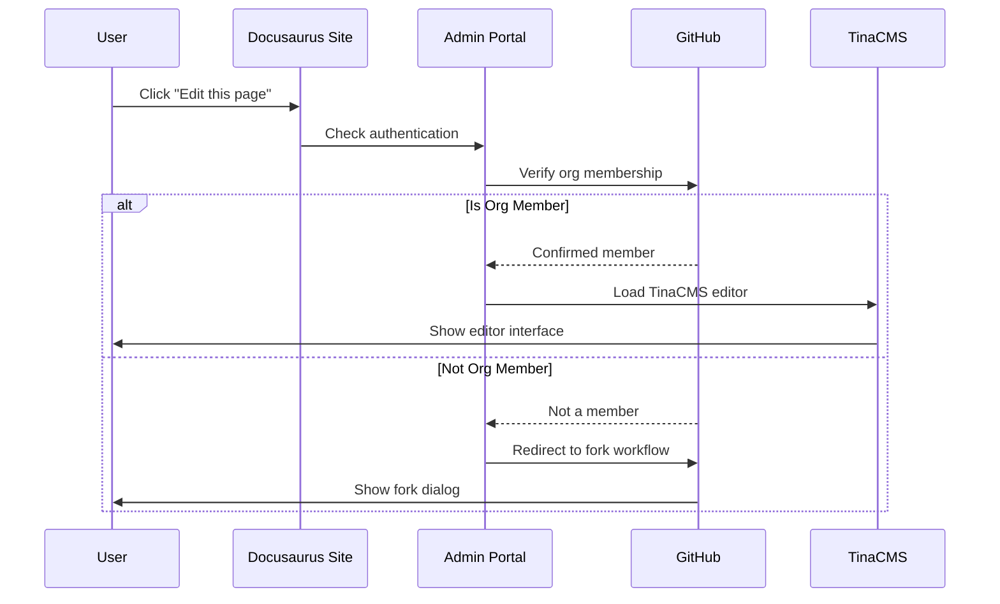
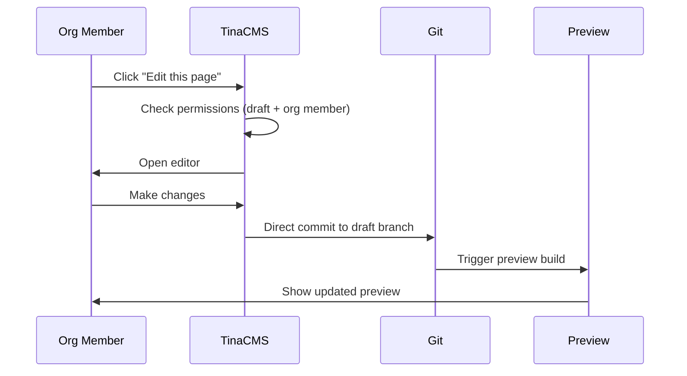
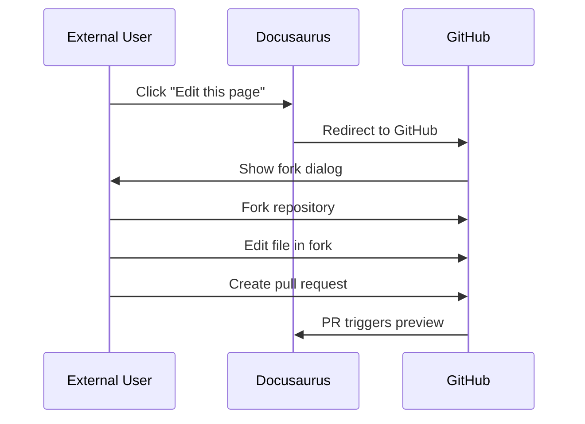
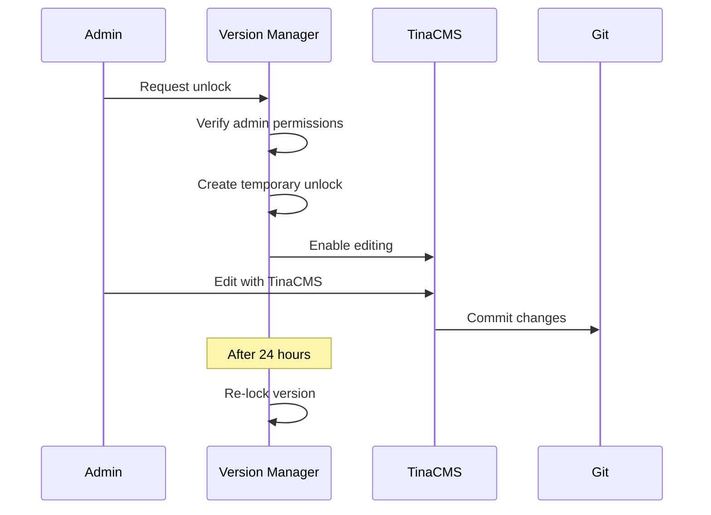

# Edit Permissions and Workflow Design

**Version:** 1.0  
**Date:** July 2025  
**Status:** Workflow Architecture Document
**Focus:** TinaCMS editing permissions and GitHub integration

## Overview

This document defines the edit permission model and workflow for TinaCMS integration, including how different user types interact with the system, version locking, and the relationship between draft and released content.

## User Types and Permissions

### Permission Matrix

| User Type | GitHub Org Member | Can Use TinaCMS | Can Direct Edit | Can Create PR | Can Fork |
|-----------|-------------------|-----------------|-----------------|---------------|----------|
| Anonymous | No | No | No | No | Yes |
| GitHub User | No | No | No | Yes | Yes |
| Org Member | Yes | Yes | Draft only | Yes | Yes |
| Namespace Editor | Yes | Yes | Draft only | Yes | Yes |
| Review Group Admin | Yes | Yes | Draft + Unlock | Yes | Yes |
| Superadmin | Yes | Yes | All | Yes | Yes |

### Authentication Flow



## Edit Button Behavior

### Implementation

```tsx
// packages/theme/src/components/EditThisPage.tsx
import { useAuth } from '@/hooks/useAuth';
import { usePageContext } from '@/hooks/usePageContext';
import { checkEditPermissions } from '@/utils/permissions';

export function EditThisPage() {
  const { user, isLoading } = useAuth();
  const { filePath, namespace, version, isReleased } = usePageContext();
  
  if (isLoading) {
    return <LoadingSpinner />;
  }
  
  const permissions = checkEditPermissions(user, namespace, version, isReleased);
  
  if (permissions.canUseTina) {
    return (
      <TinaEditButton
        filePath={filePath}
        mode={permissions.editMode}
        message={permissions.message}
      />
    );
  }
  
  return (
    <GitHubEditButton
      filePath={filePath}
      mode={permissions.requiresFork ? 'fork' : 'pr'}
    />
  );
}
```

### Permission Check Logic

```typescript
// packages/theme/src/utils/permissions.ts
export function checkEditPermissions(
  user: User | null,
  namespace: string,
  version: string,
  isReleased: boolean
): EditPermissions {
  // Anonymous users
  if (!user) {
    return {
      canUseTina: false,
      requiresFork: true,
      editMode: 'fork',
      message: 'Sign in with GitHub to edit',
    };
  }
  
  // Check org membership
  if (!user.isOrgMember) {
    return {
      canUseTina: false,
      requiresFork: true,
      editMode: 'fork',
      message: 'Fork to propose changes',
    };
  }
  
  // Released version logic
  if (isReleased) {
    if (user.role === 'superadmin' || isReviewGroupAdmin(user, namespace)) {
      return {
        canUseTina: true,
        requiresFork: false,
        editMode: 'unlock-required',
        message: 'This version is locked. Unlock to edit or create PR.',
      };
    }
    
    return {
      canUseTina: false,
      requiresFork: false,
      editMode: 'pr-only',
      message: 'Released version - PR required',
    };
  }
  
  // Draft version - full TinaCMS access
  return {
    canUseTina: true,
    requiresFork: false,
    editMode: 'direct',
    message: 'Edit with TinaCMS',
  };
}
```

## Version Locking System

### Release State Management

```typescript
// packages/shared-config/src/release-state.ts
export interface ReleaseState {
  namespace: string;
  version: string;
  language: string;
  status: 'draft' | 'released' | 'archived';
  releasedAt?: Date;
  lockedBy?: string;
  unlockExpiry?: Date;
}

export class ReleaseManager {
  async getReleaseState(
    namespace: string,
    version: string,
    language: string
  ): Promise<ReleaseState> {
    // Check git tags for release markers
    const tag = `${namespace}-${version}-${language}`;
    const isReleased = await this.git.tagExists(tag);
    
    if (isReleased) {
      const unlockStatus = await this.checkUnlockStatus(namespace, version, language);
      
      return {
        namespace,
        version,
        language,
        status: unlockStatus.isUnlocked ? 'draft' : 'released',
        releasedAt: await this.git.getTagDate(tag),
        lockedBy: unlockStatus.unlockedBy,
        unlockExpiry: unlockStatus.expiry,
      };
    }
    
    return {
      namespace,
      version,
      language,
      status: 'draft',
    };
  }
  
  async unlockForEditing(
    namespace: string,
    version: string,
    language: string,
    admin: User,
    duration: number = 24 // hours
  ): Promise<void> {
    if (!isReviewGroupAdmin(admin, namespace)) {
      throw new Error('Unauthorized: Only Review Group Admins can unlock');
    }
    
    const expiry = new Date();
    expiry.setHours(expiry.getHours() + duration);
    
    await this.db.unlocks.create({
      namespace,
      version,
      language,
      unlockedBy: admin.id,
      expiry,
      reason: 'Manual unlock for editing',
    });
    
    // Notify team
    await this.notifications.send({
      type: 'version-unlocked',
      namespace,
      version,
      language,
      admin,
      expiry,
    });
  }
}
```

### UI for Version Management

```tsx
// apps/admin/src/components/VersionLockManager.tsx
export function VersionLockManager({ namespace, version, language }) {
  const { user } = useAuth();
  const { releaseState, refetch } = useReleaseState(namespace, version, language);
  const [unlocking, setUnlocking] = useState(false);
  
  if (!isReviewGroupAdmin(user, namespace)) {
    return null;
  }
  
  if (releaseState.status === 'draft') {
    return (
      <Alert status="info">
        <AlertIcon />
        This version is in draft mode and can be edited directly.
      </Alert>
    );
  }
  
  const handleUnlock = async () => {
    setUnlocking(true);
    try {
      await unlockVersion(namespace, version, language);
      await refetch();
      toast.success('Version unlocked for 24 hours');
    } catch (error) {
      toast.error('Failed to unlock version');
    } finally {
      setUnlocking(false);
    }
  };
  
  return (
    <Box borderWidth="1px" borderRadius="lg" p={4}>
      <Heading size="sm">Version Lock Status</Heading>
      
      <Stack spacing={3} mt={3}>
        <Text>
          Status: <Badge colorScheme="red">Released/Locked</Badge>
        </Text>
        
        {releaseState.unlockedBy && (
          <Alert status="warning">
            Temporarily unlocked by {releaseState.unlockedBy} until{' '}
            {formatDate(releaseState.unlockExpiry)}
          </Alert>
        )}
        
        <Button
          onClick={handleUnlock}
          isLoading={unlocking}
          colorScheme="orange"
          size="sm"
        >
          Unlock for Editing (24h)
        </Button>
        
        <Text fontSize="sm" color="gray.500">
          Unlocking allows direct TinaCMS editing of this released version.
          Changes will still require review before publication.
        </Text>
      </Stack>
    </Box>
  );
}
```

## TinaCMS Workflow Integration

### Branch Management

```typescript
// apps/admin/src/lib/tina-git-workflow.ts
export class TinaGitWorkflow {
  constructor(
    private git: GitClient,
    private github: GitHubClient,
    private user: User
  ) {}
  
  async startEditing(file: string, options: EditOptions): Promise<EditSession> {
    const { namespace, version, isReleased } = options;
    
    // Determine branch strategy
    let branch: string;
    if (isReleased && !options.isUnlocked) {
      // Released version - create feature branch
      branch = await this.createFeatureBranch(file);
    } else {
      // Draft or unlocked - use draft branch
      branch = `draft/${namespace}`;
      await this.ensureBranchExists(branch);
    }
    
    return {
      branch,
      file,
      commitMode: isReleased ? 'pr-required' : 'direct-commit',
      sessionId: generateSessionId(),
    };
  }
  
  async commitChanges(
    session: EditSession,
    changes: FileChange[]
  ): Promise<CommitResult> {
    const message = this.generateCommitMessage(changes);
    
    if (session.commitMode === 'direct-commit') {
      // Direct commit to draft branch
      await this.git.commit({
        branch: session.branch,
        message,
        files: changes,
        author: this.user,
      });
      
      return { type: 'direct', branch: session.branch };
    } else {
      // Commit to feature branch and create PR
      await this.git.commit({
        branch: session.branch,
        message,
        files: changes,
        author: this.user,
      });
      
      const pr = await this.github.createPullRequest({
        title: `Update: ${changes[0].path}`,
        head: session.branch,
        base: 'preview',
        body: this.generatePRBody(changes),
      });
      
      return { type: 'pr', pr };
    }
  }
  
  private generateCommitMessage(changes: FileChange[]): string {
    const files = changes.map(c => path.basename(c.path));
    const action = changes[0].type === 'create' ? 'Add' : 'Update';
    
    if (files.length === 1) {
      return `${action}: ${files[0]}`;
    } else {
      return `${action}: ${files.length} files in ${path.dirname(changes[0].path)}`;
    }
  }
}
```

### TinaCMS Form Configuration

```typescript
// tina/forms/vocabulary-form.ts
export const vocabularyForm = {
  onSubmit: async (values, cms) => {
    const { activeDocument, isReleased } = cms.state;
    
    // Check if we need to create a PR
    if (isReleased && !activeDocument.isUnlocked) {
      const shouldProceed = await cms.alerts.confirm({
        title: 'Released Version',
        message: 'This will create a pull request for review. Continue?',
      });
      
      if (!shouldProceed) return;
    }
    
    // Save through workflow
    const workflow = new TinaGitWorkflow(cms.git, cms.github, cms.user);
    const result = await workflow.commitChanges(
      cms.state.editSession,
      [{ path: activeDocument.path, content: values }]
    );
    
    if (result.type === 'pr') {
      cms.alerts.success({
        title: 'Pull Request Created',
        message: `Your changes are pending review: #${result.pr.number}`,
        actions: [
          { label: 'View PR', href: result.pr.url },
        ],
      });
    } else {
      cms.alerts.success('Changes saved successfully');
    }
  },
};
```

## Draft Site Management

### Opening Draft for Editing

```typescript
// apps/admin/src/pages/api/draft-management/open.ts
export default async function handler(req: NextApiRequest, res: NextApiResponse) {
  const { namespace } = req.body;
  const user = await getUser(req);
  
  if (!isReviewGroupAdmin(user, namespace)) {
    return res.status(403).json({ error: 'Unauthorized' });
  }
  
  try {
    // Ensure draft branch exists
    const draftBranch = `draft/${namespace}`;
    await ensureDraftBranch(draftBranch);
    
    // Configure draft site
    const draftConfig = {
      branch: draftBranch,
      url: `https://draft-${namespace}.iflastandards.info`,
      tinaEnabled: true,
      editableBy: 'org-members',
      autoMergeToPreview: true,
    };
    
    // Update Docusaurus config for draft mode
    await updateDocusaurusConfig(namespace, {
      isDraft: true,
      noIndex: true, // Don't index draft sites
      baseUrl: `/draft/${namespace}/`,
    });
    
    // Start draft preview
    await startDraftPreview(namespace, draftConfig);
    
    res.json({
      success: true,
      draftUrl: draftConfig.url,
      instructions: 'Draft site is now open for editing via TinaCMS',
    });
  } catch (error) {
    res.status(500).json({ error: error.message });
  }
}
```

## Complete Workflow Examples

### Example 1: Org Member Editing Draft



### Example 2: External User Contribution



### Example 3: Review Group Admin Unlocking



## Security Considerations

1. **Authentication**: All edit operations require GitHub authentication
2. **Authorization**: Org membership verified via GitHub API
3. **Audit Trail**: All edits tracked in Git history
4. **Version Protection**: Released versions protected by default
5. **Temporary Unlocks**: Time-limited with audit logging
6. **PR Reviews**: Changes to released content require review

## Success Metrics

- **Edit Permission Accuracy**: 100% correct permission decisions
- **Workflow Completion Rate**: >90% successful edits
- **Time to Edit**: <5 seconds to load editor
- **PR Creation Success**: >95% successful PR creation
- **Security Incidents**: 0 unauthorized edits

This design provides a flexible yet secure editing system that accommodates different user types while maintaining version integrity and providing smooth workflows for all participants.
