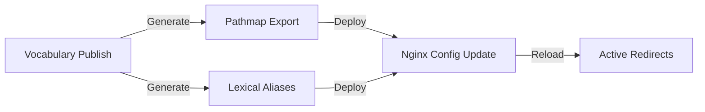

# Vocabulary Content Negotiation Server Requirements

**Version:** 1.0  
**Date:** July 2025  
**Status:** Requirements Analysis  
**Priority:** HIGH - Critical Path for Legacy Integration

## Executive Summary

The vocabulary content negotiation server is a critical component that handles HTTP content negotiation for RDF resources. The current implementation uses simple path rewriting, but the new platform requires more sophisticated redirect mapping to support arbitrary documentation URLs and lexical aliases.

## Current Implementation

### Existing Server (ifla_server_link)
The current server provides:
- **Content Negotiation**: Maps Accept headers to RDF formats
- **Simple Redirects**: HTML requests redirect to www.iflastandards.info with same path
- **Format Support**: RDF/XML, Turtle, N3, N-Triples, JSON-LD, RDF/JSON
- **Analytics**: Detailed logging of format requests and usage patterns

### Current Limitations
1. **Fixed Path Mapping**: Can only rewrite to same path on www domain
2. **No Lexical Aliases**: No support for human-readable URI slugs
3. **No Dynamic Mapping**: Cannot handle arbitrary redirect targets
4. **No Version Awareness**: Doesn't understand versioned documentation

## New Requirements

### 1. Arbitrary Redirect Mapping

**Need**: Map vocabulary URIs to any documentation URL pattern
```yaml
Example Mappings:
  - URI: http://iflastandards.info/ns/isbd/terms/1001
    HTML: https://www.iflastandards.info/isbd/docs/vocabularies/contentTypes/Text
  - URI: http://iflastandards.info/ns/unimarc/terms/U200$a
    HTML: https://www.iflastandards.info/unimarc/v2.0/elements/200-a
```

**Implementation Requirements**:
- Pathmap export on vocabulary publish
- Dynamic loading of redirect mappings
- Version-aware routing
- Fallback strategies for unmapped URIs

### 2. Lexical Alias Support

**Need**: Human-readable URI alternatives using term labels
```yaml
Examples:
  - Canonical: http://iflastandards.info/ns/isbd/terms/1001
  - English Alias: http://iflastandards.info/ns/isbd/terms/Text
  - French Alias: http://iflastandards.info/ns/isbd/terms/Texte
  - Spanish Alias: http://iflastandards.info/ns/isbd/terms/Texto
```

**Implementation Requirements**:
- Namespace-configurable slug formation rules
- Language-specific aliases
- Collision handling
- Case sensitivity options
- Character normalization (é → e, etc.)

### 3. Integration with Publishing Workflow

**Need**: Automatic pathmap generation during vocabulary publish

**Workflow Integration**:


**Export Format** (proposed):
```json
{
  "namespace": "isbd",
  "version": "2.0",
  "base_url": "https://www.iflastandards.info/isbd",
  "mappings": [
    {
      "uri": "http://iflastandards.info/ns/isbd/terms/1001",
      "path": "/docs/vocabularies/contentTypes/Text",
      "aliases": {
        "en": "Text",
        "fr": "Texte",
        "es": "Texto"
      }
    }
  ],
  "slug_rules": {
    "case": "lowercase",
    "separator": "-",
    "normalize_unicode": true,
    "max_length": 50
  }
}
```

### 4. Version-Aware Routing

**Need**: Route to appropriate version of documentation

**Requirements**:
- Default to latest stable version
- Support version-specific URIs
- Handle version transitions gracefully
- Maintain legacy version redirects

### 5. Performance Considerations

**Requirements**:
- Efficient pathmap loading (10K+ mappings)
- Caching strategy for redirects
- Minimal latency impact (<10ms)
- Hot reload without downtime

## Technical Architecture

### Option 1: Enhanced Nginx Configuration
```nginx
# Load pathmap dynamically
map_hash_bucket_size 128;
map_hash_max_size 4096;
map $request_uri $redirect_target {
    include /etc/nginx/pathmaps/*.map;
}
```

**Pros**:
- Native Nginx performance
- No additional services
- Simple deployment

**Cons**:
- Limited dynamic capabilities
- Complex configuration management
- Reload required for updates

### Option 2: Nginx + Lua Module
```lua
-- Dynamic pathmap resolution
local pathmap = require("pathmap")
local target = pathmap.resolve(ngx.var.request_uri)
if target then
    return ngx.redirect(target, 302)
end
```

**Pros**:
- Dynamic resolution
- Hot reload capability
- Flexible logic

**Cons**:
- Requires OpenResty/Lua module
- More complex setup
- Additional maintenance

### Option 3: Dedicated Redirect Service
```typescript
// Express.js redirect service
app.get('/ns/*', async (req, res) => {
  const mapping = await pathmap.resolve(req.url);
  if (mapping) {
    res.redirect(302, mapping.target);
  } else {
    res.redirect(302, `https://www.iflastandards.info${req.url}`);
  }
});
```

**Pros**:
- Full programmatic control
- Easy integration with platform
- Dynamic updates without reload

**Cons**:
- Additional service to maintain
- Potential performance overhead
- More complex infrastructure

## Implementation Plan

### Phase 1: Pathmap Export (Week 1-2)
1. Design pathmap schema
2. Implement export in vocabulary publish
3. Create pathmap validator
4. Test with sample namespaces

### Phase 2: Server Enhancement (Week 3-4)
1. Choose technical approach
2. Implement redirect logic
3. Add lexical alias support
4. Performance testing

### Phase 3: Integration (Week 5)
1. Connect to publishing workflow
2. Implement hot reload mechanism
3. Migration from current server
4. Production deployment

### Phase 4: Monitoring (Week 6)
1. Analytics integration
2. Performance monitoring
3. Error tracking
4. Usage reports

## Migration Strategy

### Transition Plan
1. **Parallel Running**: New server alongside current
2. **Gradual Migration**: Namespace by namespace
3. **Fallback Logic**: Current behavior for unmapped URIs
4. **Verification**: Test all legacy URLs
5. **Cutover**: DNS switch when ready

### Backward Compatibility
- All existing URLs must continue to work
- Default behavior matches current for unmapped URIs
- Analytics continuity maintained
- No breaking changes for API consumers

## Success Criteria

### Functional Requirements
- [ ] All vocabulary URIs resolve correctly
- [ ] Lexical aliases work in all configured languages
- [ ] Version-specific routing functions properly
- [ ] Legacy URLs maintain compatibility
- [ ] Pathmap updates deploy without downtime

### Performance Requirements
- [ ] Redirect latency < 10ms (95th percentile)
- [ ] Support 10K+ mappings per namespace
- [ ] Handle 1000+ requests/second
- [ ] Zero downtime deployments
- [ ] Memory usage < 500MB

### Operational Requirements
- [ ] Automated pathmap generation
- [ ] Monitoring and alerting
- [ ] Analytics integration
- [ ] Error tracking and reporting
- [ ] Documentation and runbooks

## Risks and Mitigation

### Technical Risks
1. **Performance Impact**
   - Risk: Slow redirects affect user experience
   - Mitigation: Caching, performance testing, CDN integration

2. **Configuration Complexity**
   - Risk: Difficult to manage large pathmaps
   - Mitigation: Automation, validation, versioning

3. **Migration Issues**
   - Risk: Broken links during transition
   - Mitigation: Parallel running, extensive testing

### Operational Risks
1. **Maintenance Burden**
   - Risk: Additional service to maintain
   - Mitigation: Simple architecture, good monitoring

2. **Integration Failures**
   - Risk: Publishing workflow issues
   - Mitigation: Fallback mechanisms, manual overrides

## Recommendation

**Recommended Approach**: Option 2 (Nginx + Lua Module)

**Rationale**:
- Balances performance with flexibility
- Allows dynamic updates without full reload
- Proven technology (OpenResty)
- Moderate complexity increase
- Good community support

**Alternative**: If Lua complexity is concerning, start with Option 1 (Enhanced Nginx) and migrate to Option 2 if needed.

## Next Steps

1. **Approve approach** (this week)
2. **Design pathmap schema** (next week)
3. **POC implementation** (2 weeks)
4. **Integration planning** (concurrent)
5. **Production timeline** (6-8 weeks total)

This enhancement is critical for proper legacy system integration and must be prioritized alongside the main platform development.
