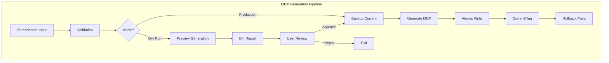

# MDX Generation Safety Design: Dry-Run and Rollback

**Version:** 1.0  
**Date:** July 2025  
**Status:** Design Specification  
**Priority:** HIGH - Critical for data integrity

## Executive Summary

This design specifies a comprehensive safety system for MDX generation that includes dry-run capabilities for previewing changes and rollback mechanisms for recovering from errors. The system ensures that vocabulary updates can be tested before application and reversed if problems are discovered.

## Core Requirements

### Safety Principles
1. **No Destructive Updates**: Never overwrite without backup
2. **Preview Before Apply**: Always show what will change
3. **Atomic Operations**: All or nothing updates
4. **Audit Trail**: Track all generation events
5. **Easy Recovery**: Simple rollback procedures

## System Architecture

### Overview


## Dry-Run Implementation

### 1. Preview Generation System

```typescript
interface DryRunConfig {
  namespace: string;
  version: string;
  source: SpreadsheetSource;
  outputFormat: 'diff' | 'side-by-side' | 'summary';
  includeMetrics: boolean;
}

class MDXDryRunGenerator {
  async generatePreview(config: DryRunConfig): Promise<DryRunResult> {
    // 1. Generate to temporary directory
    const tempDir = await this.createTempWorkspace();
    
    // 2. Run full generation pipeline
    const generated = await this.generator.generate({
      ...config,
      outputDir: tempDir,
      skipValidation: false
    });
    
    // 3. Compare with current state
    const comparison = await this.compareDirectories(
      this.getCurrentMDXPath(config.namespace),
      tempDir
    );
    
    // 4. Generate report
    return {
      summary: this.generateSummary(comparison),
      changes: comparison.changes,
      metrics: config.includeMetrics ? this.calculateMetrics(comparison) : null,
      preview: this.generatePreviewFormat(comparison, config.outputFormat)
    };
  }
}
```

### 2. Diff Generation

```typescript
interface DiffReport {
  summary: {
    filesAdded: number;
    filesModified: number;
    filesDeleted: number;
    totalChanges: number;
  };
  changes: FileChange[];
  warnings: ValidationWarning[];
  breakingChanges: BreakingChange[];
}

interface FileChange {
  path: string;
  type: 'added' | 'modified' | 'deleted';
  diff?: string; // Unified diff format
  oldContent?: string;
  newContent?: string;
  impactedElements: string[];
}

class MDXDiffGenerator {
  generateDiff(current: MDXFile[], proposed: MDXFile[]): DiffReport {
    const changes: FileChange[] = [];
    
    // Detect all changes
    for (const file of proposed) {
      const existing = current.find(f => f.path === file.path);
      if (!existing) {
        changes.push({
          type: 'added',
          path: file.path,
          newContent: file.content,
          impactedElements: this.extractElements(file)
        });
      } else if (existing.content !== file.content) {
        changes.push({
          type: 'modified',
          path: file.path,
          diff: this.unifiedDiff(existing.content, file.content),
          oldContent: existing.content,
          newContent: file.content,
          impactedElements: this.extractElements(file)
        });
      }
    }
    
    // Detect deletions
    for (const file of current) {
      if (!proposed.find(f => f.path === file.path)) {
        changes.push({
          type: 'deleted',
          path: file.path,
          oldContent: file.content,
          impactedElements: this.extractElements(file)
        });
      }
    }
    
    return {
      summary: this.calculateSummary(changes),
      changes,
      warnings: this.detectWarnings(changes),
      breakingChanges: this.detectBreakingChanges(changes)
    };
  }
}
```

### 3. Preview UI Integration

```tsx
// Admin portal preview component
export function MDXGenerationPreview({ dryRunResult }: { dryRunResult: DryRunResult }) {
  const [viewMode, setViewMode] = useState<'summary' | 'details' | 'diff'>('summary');
  
  return (
    <div className="mdx-preview">
      <PreviewHeader 
        summary={dryRunResult.summary}
        onModeChange={setViewMode}
      />
      
      {viewMode === 'summary' && (
        <SummaryView 
          metrics={dryRunResult.metrics}
          warnings={dryRunResult.warnings}
          breakingChanges={dryRunResult.breakingChanges}
        />
      )}
      
      {viewMode === 'details' && (
        <DetailedChangeList 
          changes={dryRunResult.changes}
          onFileSelect={(file) => setSelectedFile(file)}
        />
      )}
      
      {viewMode === 'diff' && (
        <DiffViewer 
          changes={dryRunResult.changes}
          format="unified"
        />
      )}
      
      <PreviewActions 
        onApprove={() => applyChanges(dryRunResult)}
        onReject={() => cancelGeneration()}
        onModify={() => returnToEdit()}
      />
    </div>
  );
}
```

## Rollback Implementation

### 1. Backup Strategy

```typescript
interface BackupStrategy {
  type: 'git' | 'filesystem' | 'hybrid';
  retention: {
    count: number;
    duration: Duration;
  };
  compression: boolean;
}

class MDXBackupManager {
  private strategy: BackupStrategy = {
    type: 'hybrid', // Git tags + filesystem snapshots
    retention: {
      count: 10,
      duration: { days: 30 }
    },
    compression: true
  };
  
  async createBackup(namespace: string): Promise<BackupHandle> {
    const timestamp = new Date().toISOString();
    const backupId = `mdx-backup-${namespace}-${timestamp}`;
    
    // 1. Git tag for version control
    if (this.strategy.type === 'git' || this.strategy.type === 'hybrid') {
      await this.gitBackup(namespace, backupId);
    }
    
    // 2. Filesystem snapshot for quick recovery
    if (this.strategy.type === 'filesystem' || this.strategy.type === 'hybrid') {
      await this.filesystemBackup(namespace, backupId);
    }
    
    // 3. Create restore point metadata
    const restorePoint: RestorePoint = {
      id: backupId,
      namespace,
      timestamp,
      files: await this.inventoryFiles(namespace),
      metadata: await this.captureMetadata(namespace)
    };
    
    await this.saveRestorePoint(restorePoint);
    
    return {
      backupId,
      restorePoint
    };
  }
}
```

### 2. Rollback Mechanism

```typescript
interface RollbackOptions {
  targetBackup: string;
  mode: 'full' | 'selective';
  preserveNew?: boolean; // Keep files added after backup
  dryRun?: boolean;
}

class MDXRollbackManager {
  async rollback(options: RollbackOptions): Promise<RollbackResult> {
    // 1. Validate target backup exists
    const restorePoint = await this.loadRestorePoint(options.targetBackup);
    if (!restorePoint) {
      throw new Error(`Backup ${options.targetBackup} not found`);
    }
    
    // 2. Create current state backup (for forward recovery)
    const currentBackup = await this.backupManager.createBackup(
      restorePoint.namespace
    );
    
    // 3. Perform rollback
    try {
      if (options.dryRun) {
        return await this.previewRollback(restorePoint, options);
      }
      
      if (options.mode === 'full') {
        await this.fullRollback(restorePoint);
      } else {
        await this.selectiveRollback(restorePoint, options);
      }
      
      // 4. Verify rollback success
      await this.verifyRollback(restorePoint);
      
      // 5. Update Git
      await this.commitRollback(restorePoint, currentBackup);
      
      return {
        success: true,
        rolledBackTo: restorePoint.id,
        previousState: currentBackup.backupId,
        changes: await this.summarizeChanges(currentBackup, restorePoint)
      };
      
    } catch (error) {
      // Emergency recovery using current backup
      await this.emergencyRecover(currentBackup);
      throw error;
    }
  }
  
  private async fullRollback(restorePoint: RestorePoint) {
    const targetDir = this.getMDXDirectory(restorePoint.namespace);
    
    // Clear current state
    await this.clearDirectory(targetDir);
    
    // Restore from backup
    if (await this.hasGitBackup(restorePoint.id)) {
      await this.restoreFromGit(restorePoint.id, targetDir);
    } else {
      await this.restoreFromFilesystem(restorePoint.id, targetDir);
    }
  }
}
```

### 3. Atomic Operations

```typescript
class AtomicMDXWriter {
  async writeAtomic(files: MDXFile[], namespace: string): Promise<void> {
    const targetDir = this.getMDXDirectory(namespace);
    const tempDir = await this.createTempDirectory();
    const lockFile = path.join(targetDir, '.mdx-lock');
    
    // Acquire exclusive lock
    const lock = await this.acquireLock(lockFile);
    
    try {
      // 1. Write all files to temp directory
      for (const file of files) {
        const tempPath = path.join(tempDir, file.relativePath);
        await fs.ensureDir(path.dirname(tempPath));
        await fs.writeFile(tempPath, file.content, 'utf-8');
      }
      
      // 2. Validate temp directory
      await this.validateDirectory(tempDir);
      
      // 3. Create backup of current state
      const backupDir = targetDir + '.backup-' + Date.now();
      await fs.move(targetDir, backupDir);
      
      try {
        // 4. Move temp to target atomically
        await fs.move(tempDir, targetDir);
        
        // 5. Verify successful write
        await this.validateDirectory(targetDir);
        
        // 6. Clean up backup
        await fs.remove(backupDir);
        
      } catch (error) {
        // Restore from backup on failure
        await fs.remove(targetDir).catch(() => {});
        await fs.move(backupDir, targetDir);
        throw error;
      }
      
    } finally {
      // Release lock
      await this.releaseLock(lock);
    }
  }
}
```

## Integration Points

### 1. CLI Commands

```bash
# Dry run from spreadsheet
nx mdx:generate isbd --source=spreadsheet.xlsx --dry-run

# Dry run with diff output
nx mdx:generate isbd --source=spreadsheet.xlsx --dry-run --format=diff

# Apply after review
nx mdx:generate isbd --source=spreadsheet.xlsx --apply

# List available backups
nx mdx:backups isbd --list

# Rollback to specific backup
nx mdx:rollback isbd --to=mdx-backup-isbd-2025-01-20T10:30:00Z

# Preview rollback
nx mdx:rollback isbd --to=latest --dry-run
```

### 2. Admin UI Integration

```tsx
// Vocabulary management page
export function VocabularyManagement() {
  const [mode, setMode] = useState<'normal' | 'dry-run'>('normal');
  const [dryRunResult, setDryRunResult] = useState<DryRunResult | null>(null);
  
  const handleGenerate = async () => {
    if (mode === 'dry-run') {
      const result = await generateDryRun(currentSpreadsheet);
      setDryRunResult(result);
      setShowPreview(true);
    } else {
      await generateWithBackup(currentSpreadsheet);
    }
  };
  
  return (
    <div>
      <GenerationControls 
        mode={mode}
        onModeChange={setMode}
        onGenerate={handleGenerate}
      />
      
      {dryRunResult && (
        <MDXGenerationPreview 
          result={dryRunResult}
          onApprove={() => applyDryRun(dryRunResult)}
          onReject={() => setDryRunResult(null)}
        />
      )}
      
      <BackupHistory 
        namespace={currentNamespace}
        onRollback={(backupId) => initiateRollback(backupId)}
      />
    </div>
  );
}
```

### 3. Git Integration

```typescript
class GitMDXIntegration {
  async tagGeneration(namespace: string, metadata: GenerationMetadata): Promise<void> {
    const tag = `mdx-gen-${namespace}-${metadata.version}-${Date.now()}`;
    
    // Create annotated tag with metadata
    await git.tag({
      ref: tag,
      message: JSON.stringify({
        ...metadata,
        timestamp: new Date().toISOString(),
        source: metadata.source,
        user: metadata.user,
        changes: metadata.changesSummary
      })
    });
    
    // Push tag to remote
    await git.push('origin', tag);
  }
  
  async createRollbackCommit(
    restorePoint: RestorePoint, 
    reason: string
  ): Promise<void> {
    await git.add('.');
    await git.commit({
      message: `rollback(${restorePoint.namespace}): Restore to ${restorePoint.id}
      
Reason: ${reason}
Rolled back from: ${await git.revparse('HEAD')}
Restore point: ${restorePoint.id}
Timestamp: ${restorePoint.timestamp}

This is an automated rollback commit.`,
      author: {
        name: 'MDX Rollback System',
        email: 'system@iflastandards.info'
      }
    });
  }
}
```

## Safety Features

### 1. Validation Gates

```typescript
interface ValidationGate {
  name: string;
  critical: boolean;
  validate: (changes: FileChange[]) => Promise<ValidationResult>;
}

const GENERATION_GATES: ValidationGate[] = [
  {
    name: 'Schema Validation',
    critical: true,
    validate: async (changes) => validateAgainstDCTAP(changes)
  },
  {
    name: 'Breaking Change Detection',
    critical: true,
    validate: async (changes) => detectBreakingChanges(changes)
  },
  {
    name: 'URI Consistency',
    critical: true,
    validate: async (changes) => checkURIConsistency(changes)
  },
  {
    name: 'Translation Completeness',
    critical: false,
    validate: async (changes) => checkTranslations(changes)
  }
];
```

### 2. Audit Logging

```typescript
interface GenerationAuditLog {
  id: string;
  timestamp: Date;
  namespace: string;
  operation: 'generate' | 'rollback' | 'dry-run';
  user: string;
  source: {
    type: 'spreadsheet' | 'manual' | 'api';
    reference: string;
  };
  result: {
    success: boolean;
    changes?: ChangeSummary;
    errors?: string[];
    backupId?: string;
  };
  metadata: Record<string, any>;
}

class AuditLogger {
  async logGeneration(log: GenerationAuditLog): Promise<void> {
    // Store in Supabase for temporary access
    await this.supabase.from('generation_audit_logs').insert(log);
    
    // Also append to Git-tracked audit file
    const auditFile = `audits/${log.namespace}/generation-log.jsonl`;
    await fs.appendFile(
      auditFile, 
      JSON.stringify(log) + '\n'
    );
  }
}
```

### 3. Recovery Procedures

```yaml
Recovery Playbook:
  
  Scenario 1 - Failed Generation:
    1. Check audit logs for error details
    2. Verify backup was created before failure
    3. Run diagnostic validation on source data
    4. Fix issues and retry with dry-run
    5. Apply if dry-run succeeds
  
  Scenario 2 - Bad Generation Applied:
    1. Identify last known good backup
    2. Run rollback dry-run to preview
    3. Execute rollback with audit reason
    4. Verify site builds successfully
    5. Notify stakeholders of rollback
  
  Scenario 3 - Corruption During Write:
    1. Check for .backup directories
    2. Restore from most recent backup
    3. Verify file integrity
    4. Re-run generation if needed
    5. Investigate root cause
  
  Emergency Contacts:
    - Technical Lead: [contact]
    - Review Group Admin: [contact]
    - Platform Team: [contact]
```

## Implementation Timeline

### Phase 1: Dry-Run (Week 1)
- Basic preview generation
- Diff calculation
- Summary reporting
- CLI integration

### Phase 2: Backup System (Week 2)
- Git tagging strategy
- Filesystem snapshots
- Backup management
- Retention policies

### Phase 3: Rollback (Week 3)
- Rollback mechanism
- Atomic operations
- Recovery procedures
- Audit logging

### Phase 4: UI Integration (Week 4)
- Admin preview interface
- Backup management UI
- Rollback workflows
- Testing & documentation

## Success Criteria

1. **Zero Data Loss**: No vocabulary data lost during any operation
2. **Preview Accuracy**: Dry-run exactly matches actual generation
3. **Rollback Speed**: Full rollback completes in <30 seconds
4. **Audit Completeness**: 100% of operations logged with full context
5. **User Confidence**: Clear feedback at every step

## Conclusion

This design provides comprehensive safety mechanisms for MDX generation, ensuring that vocabulary updates can be previewed, backed up, and rolled back as needed. The combination of dry-run capabilities and robust rollback procedures protects against data loss while maintaining operational efficiency.
