# Integration Design vs PRD Alignment Analysis

**Version:** 1.0  
**Date:** January 2025  
**Status:** Analysis Document  
**Focus:** How detailed integration designs align with and enhance PRD specifications

## Executive Summary

This analysis compares the detailed integration design documents (15-21) against the Product Requirements Document (PRD) sections 5.4 (Documentation Management), 5.5 (Translation Workflow), 11.3 (Crowdin Integration), and 11.4 (Content Delivery). The integration designs significantly enhance and expand upon the PRD's high-level requirements with concrete technical solutions and implementation strategies.

## 1. Documentation Management (PRD Section 5.4)

### PRD Requirements
- Template System: Customizable page templates
- Version Control: Git-based tracking
- Preview System: Branch-based previews
- Search Integration: Full-text search capabilities

### Integration Design Enhancements

#### TinaCMS Integration (Docs 15, 17)
The integration designs go far beyond the PRD's basic requirements:

**Enhanced Features**:
1. **WYSIWYG Editing**: Real-time visual editing for non-technical users (not specified in PRD)
2. **Complex MDX Support**: Handles both RDF frontmatter and prose content
3. **Component Integration**: Live preview with actual React components
4. **GitHub Organization Auth**: Seamless authentication using existing GitHub membership

**Technical Improvements**:
```typescript
// Advanced preview architecture not in PRD
export function TinaPreview({ query, variables }) {
  const { data } = useTina({ query, variables });
  const frontmatter = transformRDFData(data.frontmatter);
  const content = (
    <MDXRemote
      source={data.body}
      components={components}
      scope={{ ...frontmatter }}
    />
  );
}
```

**Risk Mitigation**: Comprehensive POC plan with evaluation criteria and fallback options

#### Multilingual Strategy (Doc 18)
**Hybrid Approach**: Unified pages for vocabulary, separated directories for documentation
- This sophisticated strategy wasn't detailed in the PRD
- Addresses the unique needs of RDF data vs prose content

## 2. Translation Workflow (PRD Section 5.5)

### PRD Requirements
- Crowdin Integration: Professional translation platform
- Version Locking: Translations tied to specific versions
- Progress Tracking: Real-time translation status
- Quality Assurance: Review and approval workflows

### Integration Design Enhancements

#### Translation Workflow Integration (Doc 20)
The design presents a revolutionary **version-based synchronization** approach not contemplated in the PRD:

**Key Innovation - Version Boundaries**:

```mermaid
stateDiagram-v2
    Published_v1 --> Export_to_Sheets: Start v2
    Export_to_Sheets --> Sheets_Unlocked: MDX → Sheets
    Sheets_Unlocked --> Translation_Work: Translators work
    Translation_Work --> Import_to_MDX: One-time import
    Import_to_MDX --> Sheets_Locked: Lock sheets
    Sheets_Locked --> MDX_Editing: TinaCMS/Git editing
```


**Advanced Features**:
1. **Three Translation Workflows**: Spreadsheet-based, Docusaurus/Crowdin, and hybrid
2. **English Modification Handling**: Sophisticated review process for translator suggestions
3. **Single Source of Truth**: Clear transitions eliminate sync conflicts
4. **Translator Feedback System**: GitHub issues for English improvements

**Implementation Beyond PRD**:
```typescript
class VersionBasedSyncEngine {
  async handleEnglishModifications(changes: EnglishChange[]) {
    // Create GitHub issues for translator suggestions
    // Optionally create PR if pre-approved
    // Track all decisions with audit trail
  }
}
```

## 3. Crowdin Integration (PRD Section 11.3)

### PRD Requirements
- Automated content synchronization
- Translation memory management
- Progress tracking
- Quality assurance tools
- Version branching

### Integration Design Enhancements

The integration designs reveal Crowdin as just one part of a larger ecosystem:

**Multi-Tool Integration**:
1. **Spreadsheets**: Primary for vocabulary translations
2. **Crowdin**: Primary for documentation translations
3. **TinaCMS**: Unified editing interface post-import
4. **GitHub**: Version control and review workflows

**Workflow Sophistication**:
- Documentation follows standard Crowdin flow
- Vocabulary uses spreadsheet-first approach with optional Crowdin enhancement
- Clear delineation of when each tool is the source of truth

## 4. Content Delivery (PRD Section 11.4)

### PRD Requirements
- Vocabulary Server: Dedicated server for URI resolution
- Content negotiation implementation
- Caching layer for performance
- CORS headers for web access
- Analytics for usage tracking

### Integration Design Enhancements

#### Vocabulary Server Requirements (Doc 21)
Massive expansion of the PRD's basic requirements:

**Advanced Features**:
1. **Arbitrary Redirect Mapping**: 
   ```yaml
   URI: http://iflastandards.info/ns/isbd/terms/1001
   HTML: https://www.iflastandards.info/isbd/docs/vocabularies/contentTypes/Text
   ```

2. **Lexical Alias Support**:
   ```yaml
   Canonical: http://iflastandards.info/ns/isbd/terms/1001
   English: http://iflastandards.info/ns/isbd/terms/Text
   French: http://iflastandards.info/ns/isbd/terms/Texte
   ```

3. **Version-Aware Routing**: Smart routing to appropriate documentation versions

4. **Pathmap Export Integration**: Automatic generation during publish workflow

**Technical Architecture Options**:
- Enhanced Nginx configuration
- Nginx + Lua module (recommended)
- Dedicated redirect service

**Performance Requirements** (beyond PRD):
- Redirect latency < 10ms (95th percentile)
- Support 10K+ mappings per namespace
- Handle 1000+ requests/second
- Zero downtime deployments

## 5. Cross-Cutting Enhancements

### Authentication & Authorization
The integration designs add sophisticated permission models not detailed in PRD:

**GitHub Organization Integration**:
```typescript
export async function checkEditPermissions(user: User): Promise<EditPermissions> {
  // Check organization membership
  // Determine edit mode (tina vs fork)
  // Handle version locking
}
```

### Version Management
Far more sophisticated than PRD's "version locking":

**Multi-State Version Control**:
- Released versions: Fully locked
- Draft versions: Editable by review group admins
- Preview versions: Branch-based editing
- Translation versions: Special handling during import/export cycles

### Performance & Scalability
Integration designs include specific metrics not in PRD:
- Preview render time: <2s
- Edit load time: <3s
- Build time increase: <20%
- Memory usage: <500MB for redirect server

## 6. Risk Management

The integration designs add comprehensive risk analysis missing from PRD:

### Technical Risks Addressed
1. **TinaCMS Integration Failure**: Multiple fallback options including custom solution
2. **Performance Degradation**: Specific metrics and optimization strategies
3. **Data Corruption**: Backup and recovery procedures
4. **Translation Conflicts**: Version-based approach eliminates sync issues

### Business Risks Addressed
1. **Vendor Lock-in**: Self-hosted options and abstraction layers
2. **Cost Escalation**: Phased approach with evaluation gates
3. **User Rejection**: POC with real user testing

## 7. Implementation Strategy

The integration designs provide detailed implementation plans beyond PRD:

### Phased Approach
1. **TinaCMS POC**: 2-week technical validation + 1-week user validation
2. **Translation Workflow**: Version-based implementation over 6 weeks
3. **Vocabulary Server**: 6-week implementation with parallel running
4. **Multilingual Strategy**: 3-phase migration plan

### Success Metrics
Specific, measurable criteria not in PRD:
- Editor productivity: 2x improvement
- Task completion time: 50% reduction
- Error rate: 75% reduction
- User satisfaction: >8/10

## 8. Key Innovations Beyond PRD

### 1. Version-Based Translation Synchronization
- Eliminates complex bidirectional sync
- Clear source of truth transitions
- Reduced technical complexity

### 2. Hybrid Multilingual Approach
- Unified pages for RDF vocabulary
- Separated directories for documentation
- Best of both worlds

### 3. Sophisticated Edit Permissions
- GitHub org-based authentication
- Version-aware locking
- Graceful fallbacks for external contributors

### 4. Advanced Content Negotiation
- Lexical aliases in multiple languages
- Arbitrary URL mapping
- Performance-optimized architecture

## Recommendations

1. **Adopt Version-Based Sync**: This elegant solution should be the primary translation strategy
2. **Implement TinaCMS Carefully**: Use the POC approach to validate feasibility
3. **Prioritize Vocabulary Server**: Critical for legacy system compatibility
4. **Document User Workflows**: The complexity requires clear user documentation

## Conclusion

The integration design documents significantly enhance and expand upon the PRD's requirements. They transform high-level requirements into concrete, implementable solutions with:

- Specific technical architectures
- Detailed risk mitigation strategies
- Measurable success criteria
- Phased implementation plans
- Innovative solutions to complex problems

The version-based translation synchronization approach is particularly noteworthy as it elegantly solves what could have been an extremely complex multi-system synchronization challenge. The designs show deep understanding of the domain and provide practical, achievable paths to implementation.