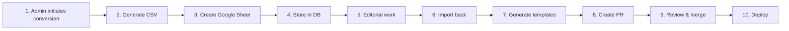

# RDF to CSV to MDX Pipeline Implementation Plan

## Overview

This document outlines the comprehensive plan for implementing the RDF to CSV to MDX pipeline for the IFLA Standards Development Platform. The pipeline will convert RDF vocabularies and element sets to CSV format using DCTAP profiles, enable collaborative editing via Google Sheets, and generate MDX documentation pages for Docusaurus sites.

## Complete Pipeline Flow



### Detailed Pipeline Steps

1. **Admin initiates conversion**: Select RDF folder + DCTAP profile
2. **Generate CSV**: RDF → CSV with DCTAP rules
3. **Create Google Sheet**: Upload CSV, get sheet ID
4. **Store in DB**: Save sheet ID, conversion job details
5. **Editorial work**: Teams edit in Google Sheets
6. **Import back**: Sheet → CSV with validation
7. **Generate templates**: CSV → MDX files
8. **Create PR**: New branch with MDX files
9. **Review & merge**: Standard Git workflow
10. **Deploy**: Docusaurus builds and publishes

## Directory Structure

```
tools/typescript/rdf-converters/
├── src/
│   ├── rdf-to-csv.ts
│   ├── rdf-folder-to-csv.ts
│   ├── csv-to-mdx.ts
│   ├── pipeline.ts
│   ├── lib/
│   │   ├── rdf-parser.ts
│   │   ├── csv-generator.ts
│   │   ├── dctap-loader.ts
│   │   ├── dctap-extensions.ts
│   │   ├── mdx-generator.ts
│   │   ├── google-sheets.ts
│   │   └── types.ts
│   └── index.ts
├── templates/
│   ├── vocabulary-template.mdx
│   ├── element-template.mdx
│   └── template-config.json
├── config/
│   └── template-config.json
├── tests/
│   ├── rdf-to-csv.test.ts
│   ├── rdf-folder-to-csv.test.ts
│   ├── csv-to-mdx.test.ts
│   ├── pipeline.test.ts
│   ├── lib/
│   │   ├── rdf-parser.test.ts
│   │   ├── csv-generator.test.ts
│   │   ├── dctap-loader.test.ts
│   │   ├── dctap-extensions.test.ts
│   │   ├── mdx-generator.test.ts
│   │   └── google-sheets.test.ts
│   └── fixtures/
│       ├── elements/
│       ├── terms/
│       ├── formats/
│       ├── dctap-extensions/
│       ├── batch/
│       ├── mdx-templates/
│       ├── pipeline/
│       └── error-cases/
├── package.json
├── tsconfig.json
├── vitest.config.ts
└── README.md
```

## Implementation Phases

### Phase 1: Core Migration & Basic Tests
- Move existing scripts to new location
- Extract core logic into reusable modules
- Create basic test structure
- Implement simple RDF → CSV tests

### Phase 2: DCTAP Extensions
- Implement all DCTAP extension features:
  - Mandatory column markers (`*`)
  - Language-tagged properties
  - Repeatable value formats (array and CSV)
  - Registry properties
- Comprehensive test coverage
- Error handling

### Phase 3: Template Generation
- CSV → MDX converter
- Template configuration system
- MDX generation tests
- Handlebars templating

### Phase 4: Pipeline Integration
- Google Sheets integration
- Database operations
- Complete pipeline tests
- Admin UI integration points

### Phase 5: Documentation & Polish
- Update all documentation
- Performance optimization
- Error handling improvements
- User guides

## Task List

### Phase 1: Core Migration & Basic Tests

- [ ] Create directory structure at `/tools/typescript/rdf-converters/`
- [ ] Move `scripts/rdf-to-csv.ts` to `src/rdf-to-csv.ts`
- [ ] Move `scripts/rdf-folder-to-csv.ts` to `src/rdf-folder-to-csv.ts`
- [ ] Extract RDF parsing logic into `lib/rdf-parser.ts`
- [ ] Extract CSV generation logic into `lib/csv-generator.ts`
- [ ] Extract DCTAP loading logic into `lib/dctap-loader.ts`
- [ ] Create TypeScript interfaces in `lib/types.ts`
- [ ] Create `package.json` with dependencies
- [ ] Configure `tsconfig.json` for the package
- [ ] Set up `vitest.config.ts` for testing
- [ ] Create basic test structure
- [ ] Write tests for `rdf-parser.ts`
- [ ] Write tests for `csv-generator.ts`
- [ ] Write tests for `dctap-loader.ts`
- [ ] Create test fixtures for basic element sets
- [ ] Create test fixtures for basic vocabulary terms
- [ ] Create test fixtures for different RDF formats (TTL, JSON-LD, RDF/XML, N-Triples)
- [ ] Update import paths in moved scripts
- [ ] Ensure existing functionality still works
- [ ] Update root `package.json` scripts to reference new location

### Phase 2: DCTAP Extensions

- [ ] Create `lib/dctap-extensions.ts` module
- [ ] Implement mandatory field validation (`*` prefix)
- [ ] Implement language-tagged property support
- [ ] Implement `skos:prefLabel` one-per-language constraint
- [ ] Implement array format for repeatable values (`[0]`, `[1]`)
- [ ] Implement CSV format for repeatable values (`[csv]`)
- [ ] Implement Postel's Law for import (accept both formats)
- [ ] Implement registry property support
- [ ] Create comprehensive test fixtures for mandatory fields
- [ ] Create test fixtures for language tags
- [ ] Create test fixtures for repeatable array format
- [ ] Create test fixtures for repeatable CSV format
- [ ] Create test fixtures for mixed formats
- [ ] Create test fixtures for registry properties
- [ ] Write tests for all DCTAP extension features
- [ ] Create error case fixtures and tests
- [ ] Update main converters to use DCTAP extensions
- [ ] Add validation error reporting

### Phase 3: Template Generation

- [ ] Create `src/csv-to-mdx.ts` converter
- [ ] Create `lib/mdx-generator.ts` module
- [ ] Set up Handlebars for templating
- [ ] Create `templates/vocabulary-template.mdx`
- [ ] Create `templates/element-template.mdx`
- [ ] Create `config/template-config.json`
- [ ] Implement template variable extraction from CSV
- [ ] Implement namespace mapping logic
- [ ] Implement multilingual content handling
- [ ] Implement conditional sections (scopeNote, relationships)
- [ ] Create test fixtures for basic vocabulary templates
- [ ] Create test fixtures for element templates
- [ ] Create test fixtures for multilingual templates
- [ ] Create test fixtures for templates with relationships
- [ ] Write comprehensive tests for template generation
- [ ] Test file naming patterns
- [ ] Test output directory structure
- [ ] Add template validation

### Phase 4: Pipeline Integration

- [ ] Create `src/pipeline.ts` orchestrator
- [ ] Create `lib/google-sheets.ts` module
- [ ] Implement Google Sheets API authentication
- [ ] Implement CSV to Google Sheets upload
- [ ] Implement Google Sheets to CSV download
- [ ] Add database schema updates to documentation
- [ ] Create database integration stubs
- [ ] Implement conversion job tracking
- [ ] Implement sheet ID storage
- [ ] Implement MDX file tracking
- [ ] Create end-to-end pipeline tests
- [ ] Test simple vocabulary pipeline
- [ ] Test complex elements pipeline
- [ ] Test error handling in pipeline
- [ ] Add progress reporting
- [ ] Add rollback capabilities

### Phase 5: Documentation & Polish

- [ ] Update `developer_notes/data-storage-architecture.md` with new schemas
- [ ] Create comprehensive README.md for the package
- [ ] Document all DCTAP extensions with examples
- [ ] Create user guide for the pipeline
- [ ] Document template customization
- [ ] Add JSDoc comments to all functions
- [ ] Create API documentation
- [ ] Optimize performance for large RDF files
- [ ] Add caching where appropriate
- [ ] Improve error messages and logging
- [ ] Create troubleshooting guide
- [ ] Add configuration validation
- [ ] Create migration guide from old scripts

## Database Schema Updates

### DCTAP Profiles and Conversions

```sql
-- DCTAP profile definitions
dctap_profiles (
  id uuid PRIMARY KEY,
  namespace_id uuid REFERENCES namespaces,
  name text,
  version text,
  profile_data jsonb,  -- DCTAP column definitions
  mandatory_languages text[],  -- ['en'] or ['en', 'fr']
  created_at timestamp,
  created_by text,  -- Clerk user ID
  UNIQUE(namespace_id, name, version)
)

-- RDF to CSV conversion jobs
rdf_conversions (
  id uuid PRIMARY KEY,
  namespace_id uuid REFERENCES namespaces,
  dctap_profile_id uuid REFERENCES dctap_profiles,
  source_path text,  -- RDF file path in Git
  output_csv_path text,
  google_sheet_id text,  -- Generated sheet ID
  status text,  -- 'pending', 'processing', 'completed', 'failed'
  validation_results jsonb,
  created_at timestamp,
  completed_at timestamp
)

-- Template generation configurations
template_configs (
  id uuid PRIMARY KEY,
  namespace_id uuid REFERENCES namespaces,
  resource_type text, -- 'vocabulary', 'element'
  template_path text,
  output_pattern text,
  config jsonb,
  created_at timestamp
)

-- Generated MDX tracking
generated_mdx_files (
  id uuid PRIMARY KEY,
  namespace_id uuid REFERENCES namespaces,
  csv_row_uri text,
  file_path text,
  git_commit_sha text,
  generated_at timestamp,
  generated_from uuid REFERENCES rdf_conversions
)
```

## Template Configuration

```json
{
  "templateConfig": {
    "vocabulary": {
      "outputPath": "docs/vocabularies/{namespace}/{id}.mdx",
      "templateFile": "vocabulary-template.mdx",
      "components": ["VocabularyTable", "MultilingualText", "ConceptRelationships"],
      "frontmatterFields": ["uri", "prefLabel", "definition", "scopeNote", "altLabel", "broader", "narrower"],
      "fileNamePattern": "{id}.mdx"
    },
    "element": {
      "outputPath": "docs/elements/{namespace}/{id}.mdx",
      "templateFile": "element-template.mdx",
      "components": ["ElementDetails", "ClassHierarchy", "PropertyDetails"],
      "frontmatterFields": ["uri", "label", "definition", "subClassOf", "domain", "range"],
      "fileNamePattern": "{id}.mdx"
    }
  },
  "namespaceMapping": {
    "http://iflastandards.info/ns/isbd/elements/": "isbd",
    "http://iflastandards.info/ns/isbd/terms/": "isbd",
    "http://iflastandards.info/ns/lrm/elements/": "lrm",
    "http://iflastandards.info/ns/frbr/": "frbr"
  }
}
```

## Success Criteria

- All existing RDF to CSV functionality preserved
- Full DCTAP extensions specification implemented
- Comprehensive test coverage (>90%)
- Template generation produces valid MDX
- Pipeline can handle large vocabularies efficiently
- Clear documentation for all components
- Database integration points defined
- Error handling and validation throughout